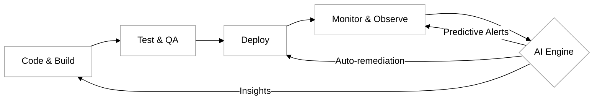

# AI in DevOps

The integration of Artificial Intelligence (AI) into the DevOps lifecycle—often referred to as AIOps—represents one of the most significant shifts in the industry since the transition from waterfall to agile. While DevOps focuses on breaking down silos and accelerating delivery through automation, AI provides the analytical power to manage the staggering complexity of modern, cloud-native environments. As systems grow more distributed and ephemeral, human operators can no longer keep pace with the sheer volume of telemetry data. AI steps in not to replace the engineer, but to act as a force multiplier for Quality Assurance (QA) and Site Reliability Engineering (SRE) teams.

### The Impact of AI on DevOps and SRE

In a traditional DevOps environment, automation is rules-based. You write a script to trigger an action when a specific threshold is met. However, AI introduces "probabilistic" automation. Instead of waiting for a CPU to hit 90% to trigger an alert, an AI model can analyze historical patterns and predict that a 70% load on a Tuesday morning is an anomaly that will lead to a crash in twenty minutes.

For Site Reliability Engineers, AI changes the nature of "toil." By automating the correlation of logs, metrics, and traces, AI reduces the time spent on root cause analysis. This allows SREs to focus on architectural improvements rather than firefighting. In the realm of Quality Assurance, AI-driven testing tools can now identify which parts of an application are most likely to fail based on recent code changes, allowing for "smart" test execution that saves time and compute resources.

### Possibilities and Use Cases

The application of AI in the DevOps pipeline is vast, spanning from the initial commit to the final production monitoring phase.

*   **Intelligent Test Automation:** AI can analyze the user interface of an application and automatically update test scripts when the UI changes, a process known as "self-healing" tests. This drastically reduces the maintenance burden on QA engineers.
*   **Anomaly Detection and Noise Reduction:** One of the greatest challenges in operations is "alert fatigue." AI models can filter out the background noise of thousands of daily events to highlight the three or four signals that actually indicate a brewing crisis.
*   **Predictive Resource Scaling:** Rather than reacting to traffic spikes, AI can forecast demand based on historical trends, seasonal events, or even external data, scaling infrastructure up or down proactively to optimize costs and performance.
*   **Automated Root Cause Analysis (RCA):** When a system fails, AI can ingest logs from dozens of microservices simultaneously to pinpoint the exact change or component that initiated the failure, often in a fraction of the time a human would require.

### The AIOps Feedback Loop

The following diagram illustrates how AI integrates into the standard DevOps feedback loop to create a continuous cycle of improvement and observation.

### Best Practices for Implementation

Transitioning to an AI-enhanced DevOps culture requires more than just buying a new tool. It requires a strategic approach to data and process.

*   **Prioritize Data Quality:** AI is only as good as the data it consumes. Ensure your logging and monitoring data is structured, consistent, and centralized. "Garbage in, garbage out" is a literal truth in AIOps.
*   **Human-in-the-Loop (HITL):** Never allow an AI to make critical production changes without oversight in the beginning. Use AI to provide recommendations that a human operator approves. As confidence in the model grows, you can move toward full autonomy.
*   **Start with Specific Use Cases:** Avoid the temptation to "AI-ify" everything at once. Start with a high-friction area, such as log clustering or alert de-duplication, where the value is immediate and measurable.
*   **Focus on Explainability:** Choose AI tools that provide "Explainable AI" (XAI). If a model recommends a rollback, the engineer needs to know *why* it made that recommendation to trust and learn from the system.

### Common Challenges and Pitfalls

While the possibilities are exciting, there are several hurdles that organizations must clear to succeed.

| Challenge | Description | Potential Solution |
| :--- | :--- | :--- |
| **Model Drift** | AI models can become less accurate over time as the underlying software architecture evolves. | Implement continuous retraining schedules for models and monitor model performance metrics. |
| **Data Silos** | AI needs a holistic view, but data is often trapped in separate tools (e.g., security data vs. performance data). | Adopt "OpenTelemetry" standards to unify data collection across all layers of the stack. |
| **The "Black Box" Problem** | Engineers may distrust AI if they cannot see the logic behind its decisions. | Prioritize tools that offer transparent reasoning and clear visualization of data correlations. |
| **Over-reliance** | Teams might stop developing their own troubleshooting skills, leading to a crisis if the AI fails. | Maintain regular "Game Day" exercises where teams practice manual troubleshooting without AI assistance. |

### Practical Example: Log Analysis

Consider a scenario where a microservices-based e-commerce platform experiences a sudden drop in checkout completions. In a traditional setup, an engineer would search through Splunk or ELK logs for "Error 500" or "Exception." 

With AI, the system automatically notices that while the error rate is normal, the *latency* between the "Add to Cart" and "Checkout" services has increased by 15% specifically for users on mobile devices. The AI correlates this with a deployment that happened 10 minutes ago in the "Payment Gateway" service. It flags the specific commit to the engineer before a single human customer reports a problem.

### Thoughtful Engagement

As you conclude this section on AI in DevOps, reflect on your current or past projects. Consider the following questions:
1.  Which part of your current workflow feels the most repetitive or "noisy"? Could an AI model realistically handle that specific task?
2.  If an AI suggested a major architectural change to your infrastructure, what specific data would you need to see before you felt comfortable approving that change?
3.  How does the introduction of AI change the "Quality Assurance" mindset? Does it move the responsibility of quality more toward the tool or the developer?

### External Resources

For further exploration of these concepts, consider the following industry standards and guides:
*   [Google SRE Book](https://sre.google/sre-book/table-of-contents/): While it predates the current AI boom, its principles of automation and error budgets are the foundation for AIOps.
*   [The AIOps Exchange](https://www.aiops-exchange.com/): A community resource for learning about the evolution of AI in IT operations.
*   [State of DevOps Report (DORA)](https://cloud.google.com/devops/state-of-devops): Periodic reports that often touch upon the impact of advanced automation and AI on team performance.

### Summary

AI is not a replacement for the DevOps philosophy; it is its logical conclusion. By leveraging machine learning for predictive analysis, anomaly detection, and automated remediation, organizations can move closer to the goal of truly "self-healing" systems. However, success depends on high-quality data, a culture of transparency, and a commitment to keeping human expertise at the center of the automated loop. As you move forward into your career in QA and DevOps, viewing AI as a collaborative partner rather than a threat will be key to managing the systems of tomorrow.