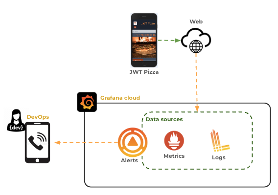
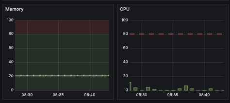
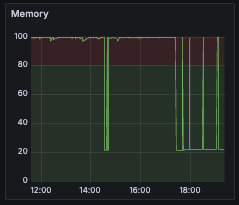
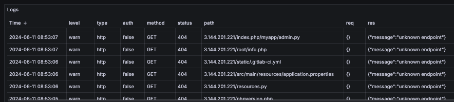

# Alerting

🔑 **Key points**

- Metric-based alerts significantly decrease response times.
- Alerts are defined by triggering thresholds and designated responding parties.

---

A critical piece of any observability architecture is the automatic notification of problems that require human intervention. Without automated alerts, issues may persist for hours, days, or even months before resolution. Counterintuitively, as the volume of observability data increases, the likelihood of missing a problem during manual dashboard reviews also rises.



An effective alerting system consists of the following components:

1. Critical metrics identification
2. Alert rule definition
3. Notification infrastructure
4. On-call staff
5. Escalation procedures

## Defining alerts

Before enabling actionable alerts, you must identify the metrics that signify a system problem. Some metrics are obvious, such as exhausted memory or storage space. Others require careful review of code, architecture, and the historical values of existing metrics.

Maintain a prioritized list of metrics that have a direct impact on the system, and review their historical values to see if they correlate with significant incidents. When an incident occurs, analyze the metrics to identify the key indicators that would have led to a prompter resolution.

### Common critical alerts

- **Security**: Increased authentication failures, abnormal traffic from an individual user, access from concurrent geolocations, common vulnerability probes, and traffic spikes during off-hours.
- **Resource exhaustion**: CPU, storage, memory, or bandwidth capacity nearing critical limits.
- **Request latency**: Slow response times for customer requests.
- **Excessive load**: Usage increases that exceed the elastic scaling properties of the system.

### Defining thresholds

For each critical metric, you must define the threshold at which the system requires attention. For example, you should never allow CPU utilization to reach 100%. Instead, the system should automatically alert and adjust compute capacity when utilization consistently reaches the 80% range.



When monitoring metrics like request latency, consider outliers carefully. While an average request latency of 50ms may seem successful, inspecting the 99.9th percentile might reveal that some requests take 30,000ms. This means 1 in 1,000 requests is prohibitively slow. If rendering a single web page requires dozens of endpoint requests, 10% of your customers could experience an extremely poor load time.

## Alert rules

Once you have identified critical metrics, you can define alerting rules. While rules can be triggered by various conditions, they are most commonly based on metrics or logs. A standard rule includes the following fields:

| Field | Description | Example |
| :--- | :--- | :--- |
| **Name** | A clear, unique, and descriptive name | Available storage |
| **Metric** | The specific metric(s) the rule examines | Server disk space |
| **Trigger** | The threshold and duration that trigger the alert | Less than 10% for 5 minutes |
| **Level** | The severity of the alert: Critical, Warning, or Informational | Warning |

### Metric-based alerts

Metric-based alerts are triggered by specific values or states. Within this category, alerts are usually triggered by state conditions or numerical thresholds. State conditions include events like a container crashing or the instance count falling below a required minimum. Metric thresholds involve values such as available memory dropping below 5% for more than five minutes.



### Log-based alerts

Log-based alerts are triggered by the contents of system logs. For example, if logs contain the word "error" more than 10 times in a single minute, an alert is triggered.

The following example shows an attacker attempting to probe a "Pizza Service" for known security vulnerabilities. They have bypassed the service's DNS name and are accessing the public IP address directly. In this scenario, you might trigger an informational alert if probe traffic exceeds a certain threshold or if that source IP address is later used in a legitimate request.



## Handling alerts

When an alert is triggered, the system must initiate the appropriate response. The [Google SRE Handbook](https://sre.google/sre-book/practical-alerting/) provides a basic structure for categorizing and handling alerts:

- **Critical alerts**: Sent to the on-call team—staff scheduled for immediate response. This team has the access and authorization required to resolve or escalate the incident.
- **Sub-critical alerts**: Recorded in a ticketing system for team members to address during normal working hours.
- **Informational alerts**: Retained for later review. These are commonly analyzed as an aggregated digest during monthly operational meetings.

Once an alert is triggered and the appropriate party is notified, the system typically requires an acknowledgment. If no acknowledgment is received, the system escalates the alert to additional parties until a response is recorded. Once the incident is resolved, the responder closes the alert to prevent further escalation.


```masteryls
{"id":"9ba09a6f-2224-447f-b866-2e6d348b0156","title":"Cluster CPU Alerting Strategy","type":"multiple-choice"}
When determining the appropriate CPU threshold for an alert on a cluster of servers, which approach best ensures high availability while minimizing "alert fatigue"?

- [ ] Trigger a critical alert immediately whenever any single node in the cluster exceeds 90% CPU utilization for more than 30 seconds.
- [ ] Set a static threshold at 50% average cluster utilization to ensure administrators have ample time to provision new hardware.
- [x] Set a threshold based on the cluster's "N+1" redundancy, alerting when utilization reaches a point where the remaining nodes could not handle the traffic if one node failed.
- [ ] Configure alerts to trigger only when the CPU utilization reaches 100% and the system begins to experience packet loss or request queuing.
```


## A bit of fun


> _Source: [XKCD](https://xkcd.com/1802/)_