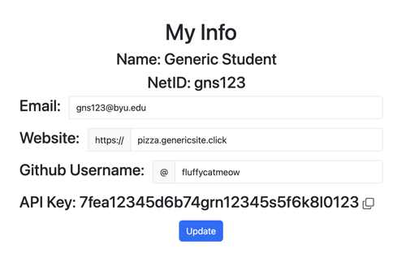

# AutoGrader

For most of the deliverables for this course, the grading is handled by an automated grading application.

## Getting started

1.  Go to the [AutoGrader website](https://cs329.cs.byu.edu).
1.  Sign in with your byu credentials.
1.  Click on the `Profile` tab.
1.  Ensure the fields are filled correctly.
    1. Provide your hostname with a subdomain of `pizza` for the website. If you decide later to name your JWT pizza application differently, update the AutoGrader.
    1. Provide your github username.
1.  Note that it displays an API key. This will be used later for making calls to the JWT Headquarters Pizza Factory.
    
