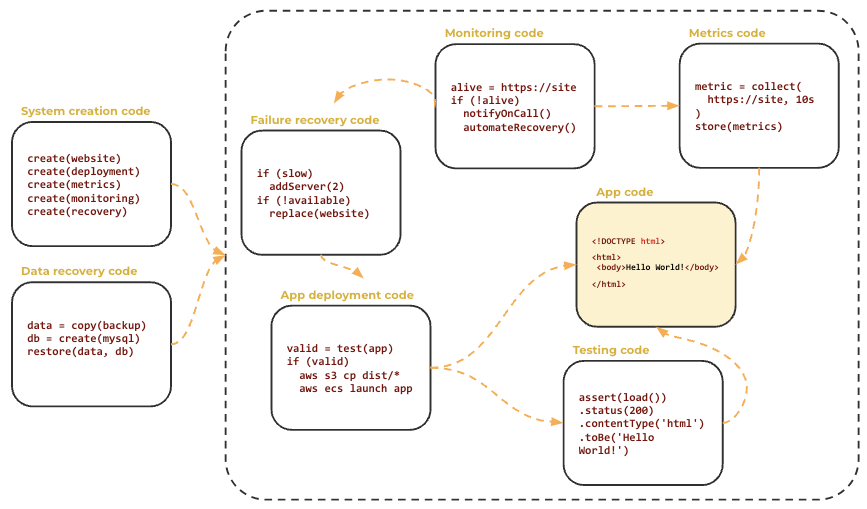
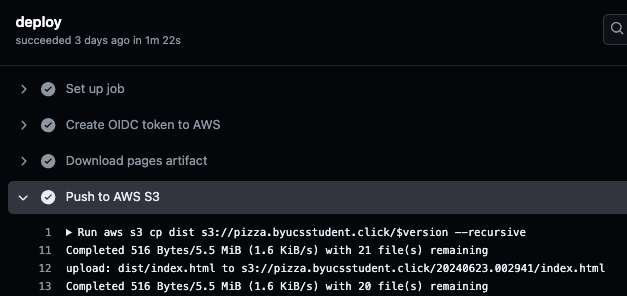
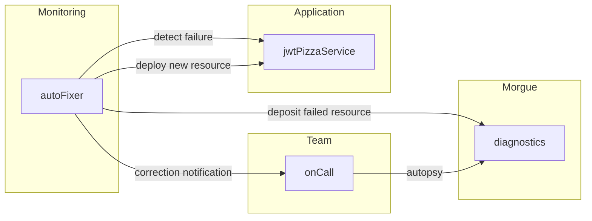
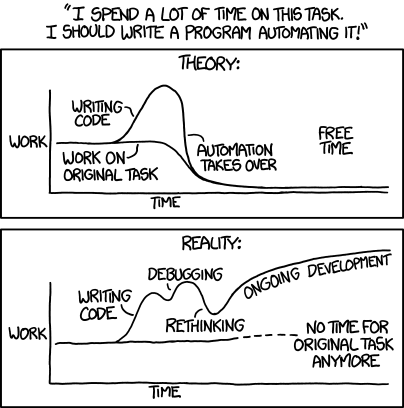

# Automation

🔑 **Key points**

- Automation is the core tenet of DevOps.
- Automation enables speed, safety, and reproducibility.
- Learn to prioritize what you will automate.

---

Automation is _the_ core tenet of DevOps. The idea that you can write code that automates the testing, analysis, deployment, and management of an application is what differentiates DevOps from the historical role of System Operations. As a DevOps engineer, you should always be looking for ways to remove human toil from a process and replace it with automation. The realization that operational tasks are best implemented using code that requires the skill sets of a software developer is what drove the creation of the DevOps role.

## Reducing toil


Every system begins with the manual processes that explore what needs to happen in order to make advancements. However, as the system matures, the concept of automating repetitive tasks naturally drives progress.

Gone are the days when corporate stocks were traded by physically visiting a stockbroker, having them wander onto a trading floor, finding a broker who is interested in a similar transaction, exchanging written certificates or currency, hand writing the transaction in a physical book, and then delivering the certificate to the sponsoring parties. Now, an automated process that produces both the desired outcome and the appropriate audit trail is done in milliseconds.

Similarly, no one uses parchment and a quill to write a novel. Word processing software augments the creative process and makes it easy to not only create the document, but track revisions, collaborate with others, and produce the resulting document as a PDF, printed copy, or online representation.

It seems obvious to us that stock trading and document creation tasks should be automated as much as possible in order to remove the toil for parts of the task that are not central to the task itself. However, the benefits are often only fully realized once the toil is removed and the automation has occurred. Basic automation often clears the path for deeper and more meaningful automation. When word processors were first created the vision of what automation would eventually do for that task was completely unrealized. However, as layers of automation were added, we were able to take ourselves all the way from typewriters, to decentralized collaborative Google Docs, to AI writing the novel for us.

## Automation benefits

The benefits of automation include **speed**, **safety**, and **reproducibility**.

#### 🏃‍♀️ Speed

Automation is fast. When a system is down, the last thing you want to be doing is trying to remember what all the steps are to resolve a problem and manually typing them in.

#### 🚸 Safety

Automation removes the possibility of human error. Some of the most expensive system failures have been caused because a step was skipped, or a parameter was misplaced.

#### 📑 Reproducibility

Automation creates documentation and a historical trail. When humans alter a system, they open up a command console and start typing away, changing configurations, running tools, starting new services, and installing and updating software. There are no records of what was done and for what reason. If something goes wrong, it requires a forensic experiment to look into the minds of the team in an attempt to guess what was going on. Additionally, team members change, or worse, quit, and the collective knowledge goes with them. With automation, the code is the documentation. It clearly describes how a process works and leaves a clear trail to unwind when a failure happens. Likewise, you can easily fix a failure by simply changing the parameters.

## Viewing DevOps as a coding task

The whole point of computers and software is to generalize tasks into repeatable instructions in order to quickly and reproducibly complete a task. We should not constrain our vision of what automation can do. If we are willing to reduce the toil of computing the digits of Pi or a Fibonacci sequence, then why not automate the deployment of where the software is used? Why not automate the recording of failures and the collection of performance metrics? These likewise are coding tasks, and the benefits of automating them are just as real as any other coding problem.

When we are narrow-minded in what we consider to be **coding tasks**, we significantly decrease the effectiveness of our hard-earned skills. Basically anything that we do more than once, or anything that is complex enough that we need to document how it was done even once, should be turned into a coding task.

Just remember this. It is all code. Code that monitors a human typing a novel on a keyboard is just as interesting as code that monitors the code for the word processing application. It is actually very fulfilling to replace any manual task with an automated one.

## What to automate?

The short answer to the question of what to automate, is you want to automate everything. You want to automate the review of the code, the testing of the code, the analysis of the code, the deployment, the gathering of metrics, the monitoring of the metrics, the reporting of failures, and the recovery of failures.



Note that in the above image the application code is only a small part of the actual code necessary to securely and reliably deliver a product to a customer.

### Automating failure recovery

When specifically considering automation in regard to DevOps, we want to automate the application testing, deployment, management, and resilience, but we also want to automate the creation and deployment of our automation infrastructure. This insight isn't apparent until we experience a failure in the automation infrastructure. Consider a website where the DevOps team has done an amazing job creating an automated deployment pipeline that takes a change to the application, assures its quality, measures its performance characteristics, builds a reproducible deployment package, and copies it to elastic computing resources where a variable number of customers can benefit from the change. That sounds like an amazing use of automation. However, it missed one key piece. What if the automation pipeline fails?

For example, what if the servers running the automation pipeline go offline? This is actually a fairly common problem and occurs for an obvious reason. The application software and the automation software are usually executed in the same physical location. If a flood wipes out the data center then your automation process is also gone and rebuilding the automation pipeline at a different data center is going to take manual toil. That is assuming that you even can reproduce the steps to rebuild the pipeline. Most likely rebuilding the automation pipeline, that cannot be rebuilt using automation, will feel like starting again from scratch.

Instead, you want code that is safely stored independently of the location where the automation system executes, just like you don't only store the source code for your application with the application itself. That way if you need to rebuild the automation pipeline, you simply run the code that builds it.

## Tools of automation

Any programming language can be used to create automation. However, you should consider the following questions when investing in your automation tools:

- What is the competency level of my DevOps team? Do they know how to code? Is it better to buy automation tools than to build your own?
- Can I leverage existing skill sets? If the team only knows one language, should I write all the tools in that language?
- Am I using the right tools for the right job, or am I using tools for purposes it wasn't created for?
- Are my tools battle-tested and well-supported, or am I using them simply because they seem cool?

There are some tools that should be in the toolkit of every DevOps engineer. These include shell scripting, Git, SQL, Curl, Docker, an orchestration tool such as Terraform or CloudFormation, and a CI pipeline scripting tool like GitHub Actions or CircleCI.

💡 You might consider picking one of these tools and doing a deep dive for your curiosity report. See if you can up your game by becoming proficient in their abilities.

As part of this course you will do a lot of automation. That means you are going to be exposed to a lot of different syntax, tools, and languages. Instead of being overwhelmed by the number of technologies involved, look at it as an opportunity to learn and differentiate yourself from others. The better you get at these tools, the more valuable you are in building the Kingdom of God.

## How to choose what to automate next

As a DevOps engineer, you can never really automate everything and so it is important that you know how to decide what to automate next. In order to make an informed decision you need data. Keep track of how often and how long you are spending on manual tasks. Give an **impact** score to each task. This can be something as simple as a score from 1 to 10, where 10 keeps the system from failure or actually puts the application in the hands of the customer and 1 generates reports that no one ever reads. Your basic equation should look something like this:

```
impact = (monthly frequency * duration) * value
```

The next part of the puzzle is to give the task a **complexity** score that is based on how difficult the task is to automate. If you can automate it with a single line of shell script then give it a complexity score of 1. If it requires entirely new service providers or the development of a whole new code base then give it a score of 8. If it is also difficult to deploy and initiate, then give it a score of 10.

```
priority = impact/complexity
```

You can give a composite priority score, as shown above, that combines both impact and complexity and use that to decide what to work on next, but sometimes it is beneficial to the moral of the team to mix your sprint's tasks, including both high impact and high complexity tasks with some tasks that have low complexity independent of the impact. That way your team feels like it is moving forward. Sometimes automating a low impact task that is just annoying because of how often it is done is a good one to include on your _most wanted_ list. In fact, the idea of a _most wanted_ list is a great way to gameify your work. Print up some posters for those difficult automation tasks. Supply a bounty of movie tickets, lunches, or plain old cash. The important thing is to have fun while you make some serious contributions to the company.

## Examples of automation

The following represents several examples of automation at different levels. Don't worry about the details represented by each example. The point is that anything can be automated. In each case a different language is used: JavaScript, YAML, Go, and JSON. Each removes toil from the application and makes it more reliable and recoverable.

#### Automating testing

Testing is often very automatable. There is no greater removal of toil from an application then removing the manual testing of code during development and for regression. The larger the code base becomes, the more onerous the load of manual testing becomes. Here is an example of calling a _login_ service endpoint and asserting that it returns a valid authentication token.

```js
test('login', async () => {
  const loginRes = await request(app).put('/api/auth').send(testUser);
  expect(loginRes.status).toBe(200);
  expect(loginRes.body.token).toMatch(/^[a-zA-Z0-9\-_]*\.[a-zA-Z0-9\-_]*\.[a-zA-Z0-9\-_]*$/);

  const { password, ...user } = { ...testUser, roles: [{ role: 'diner' }] };
  expect(loginRes.body.user).toMatchObject(user);
});
```

The trick with testing is to do automation that actually does real testing. It is too common in the industry to write a test that only makes sure the compiler works and that you can call functions without regard to the inputs, outputs, algorithms, boundaries, and dependencies of the code being tested. If you are not careful with how you construct your testing automation, you can quickly create maintenance overhead that actually increases human toil as developers have to wait a long time for a test to complete, or spend significant time chasing down false positives, or updating tests whenever a simple change to the application is made.

The most valuable testing automation is code that simulates real users in both nominal paths and failure paths. That is why end to end, or synthetic testing, and chaos testing are so valuable.

#### Automating deployment

Deployment automation does remove significant toil, but its real value is with reproducibility and the creation of an audit trail. Here is an example of a deployment to AWS S3 of the latest frontend application code using GitHub Actions.

```yml
deploy-s3:
  runs-on: ubuntu-latest
  steps:
    - name: Create OIDC token to AWS
      uses: aws-actions/configure-aws-credentials@v4
      with:
        audience: sts.amazonaws.com
        aws-region: us-east-1
        role-to-assume: arn:aws:iam::${{ secrets.AWS_ACCOUNT }}:role/${{ secrets.CI_IAM_ROLE }}
    - name: Push to AWS S3
      run: |
        mkdir dist
        printf "<h1>CloudFront deployment with GitHub Actions</h1>" > dist/index.html
        aws s3 cp dist s3://${{ secrets.APP_BUCKET }} --recursive
        aws cloudfront create-invalidation --distribution-id ${{ secrets.DISTRIBUTION_ID }} --paths "/*"
```

When the script runs it will record a complete audit of what happened including the parameters, dates, timings, and results.




#### Automating recovery

When things go wrong, you really want to respond quickly, and that is where automation excels. Being able to push a single button, or even have the automation correct the problem without manual interference is idea. The following diagram demonstrates a simple monitoring tool that is able to detect a problem, deploy a new resource, move the failed resource to the morgue where an autopsy can be performed, and let the team know that the situation was handled.



#### Automating the infrastructure

It is critical that you also code the ability to set up your application from scratch. This includes things like spinning up a database server and restoring its content from a snapshot, to rebuilding a CDN for global frontend code deployment.

Here is an example AWS CloudFormation script that will create an elastic load balancer with a predefined security configuration.

```json
{
  "LoadBalancer": {
    "Type": "AWS::ElasticLoadBalancingV2::LoadBalancer",
    "Properties": {
      "Type": "application",
      "Name": "jwt-pizza-service",
      "SecurityGroups": {
        "Ref": "SecurityGroupIDs"
      },
      "Subnets": {
        "Ref": "SubnetIDs"
      }
    }
  }
}
```

With this script you don't have to log into the AWS Browser Console, navigate to the EC2 service and step through multiple dialogs to deploy the load balancer you can just run the CloudFormation script right form your command console, or even better as part of a larger system deployment script.

```
aws cloudformation create-stack --stack-name load-balancer --template-body file://create-load-balancer.json
```

## A bit of fun



> _source: [XKCD](https://xkcd.com/1319/)_
