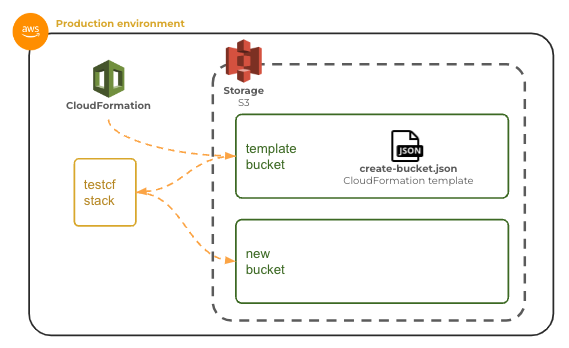

# AWS CloudFormation

🔑 **Key points**

- CloudFormation enables IaC.
- Deploy an S3 bucket using CloudFormation.

---

📖 **Deeper dive reading**: [CloudFormation getting started](https://docs.aws.amazon.com/AWSCloudFormation/latest/UserGuide/gettingstarted.templatebasics.html)

---

## CloudFormation

CloudFormation is AWS's primary IaC and automation tool. With CloudFormation you can create a parameterized JSON file, called a **CloudFormation Template**, that describes each AWS resource that you want to create. You then use the template to create a CloudFormation stack. A stack represents the instantiation of all the resources defined by the template. You can also delete all the resources represented by the stack with a single button press.

- **Resource**: An AWS object such as a S3 Bucket or EC2 instance.
- **Template**: A JSON script that defines resources to deploy.
- **Stack**: The deployed resources.

With CloudFormation, you can easily experiment with alternative architectures, reproduce existing architectures, and execute disaster recovery drills.

## Creating your first CloudFormation stack

The following is a basic CloudFormation template that creates an S3 bucket with a parameterized unique name and then outputs the Amazon Resource Name (ARN) for the resulting bucket.

```json
{
  "AWSTemplateFormatVersion": "2010-09-09",
  "Parameters": {
    "MyBucketName": {
      "Description": "Unique name for the bucket",
      "Type": "String"
    }
  },
  "Resources": {
    "S3Bucket": {
      "Type": "AWS::S3::Bucket",
      "Properties": {
        "BucketName": {
          "Ref": "MyBucketName"
        }
      },
      "DeletionPolicy": "Delete"
    }
  },
  "Outputs": {
    "MyBucketsArn": {
      "Value": {
        "Fn::GetAtt": ["S3Bucket", "Arn"]
      },
      "Description": "The arn for the newly created bucket."
    }
  }
}
```

### Obtaining template parameters

The `Parameters` section defines the input parameters necessary to create the stack. When the stack is created, the user will be prompted for the required parameters. You can define as many parameters as you would like. You then use them later in the script with a `Ref` field. You can see the unique bucket name referenced in the _Resources_ section later in the script.

```json
"Parameters": {
  "MyBucketName": {
    "Description": "Unique name for the bucket",
    "Type": "String"
  }
}
```

### Definition resources to create

The `Resources` section may contain one or more resources to create. In this case we are creating an S3 bucket. We start by specifying a template ID for the resource with the value of `S3Bucket`. The ID is only meaningful in the context of the template so that it can be referenced for creation, deletion, and use by other resources contained in the template. The type of the resource is defined by the [Type](https://docs.aws.amazon.com/AWSCloudFormation/latest/UserGuide/aws-template-resource-type-ref.html) value of [AWS::S3::Bucket](https://docs.aws.amazon.com/AWSCloudFormation/latest/UserGuide/aws-resource-s3-bucket.html). If you review the documentation for this type, you will see that it has several properties that you can set, such as the BucketName, BucketEncryption, AccessControl, and LifecycleConfiguration. Basically, you can create any AWS object, and you are in complete control of how the object is defined.

For this example, we defined the _BucketName_ to be the value of the template parameter **MyBucketName**.

We also supply a general template _DeletionPolicy_ option to delete this object if the resulting CloudFormation stack is deleted.

```json
"Resources": {
  "S3Bucket": {
    "Type": "AWS::S3::Bucket",
    "Properties": {
      "BucketName": {
        "Ref": "MyBucketName"
      }
    },
    "DeletionPolicy": "Delete"
  }
}
```

### Template outputs

The last part of the script is the `Outputs`. These are displayed to the person who created the stack using this template. We can define these to be whatever we want. In this case we output the resulting Amazon Resource Name (ARN) for the newly created bucket.

```json
"Outputs": {
  "MyBucketsArn": {
    "Value": {
      "Fn::GetAtt": ["S3Bucket", "Arn"]
    },
    "Description": "The arn for the newly created bucket."
  }
}
```

## Creating a stack with the template

Let's take the template defined above and use it to build a stack that creates a single S3 bucket.



### Creating a template bucket

Before we can execute a template we need to put the template file in a location where CloudFormation can access it. You have three options.

1. Specify a file on disk and let CloudFormation automatically create an S3 bucket to put the template.
1. Create your own S3 bucket to host all of your templates.
1. Give CloudFormation access to your Git repository that contains your templates.

Let's choose the option to create our own S3 bucket so that we can keep everything in one place that we specify. To make this happen, we just need to create a bucket to hold all our templates and copy the templates into it.

1. Open the AWS browser console and navigate to the S3 service.
1. Create a new bucket names something unique such as `YOURNAMEHERE-cloudformation-templates`.
1. Save the above example to a file named `create-bucket.json` in your development environment and then upload it to the S3 bucket you just created.
1. Copy the URL for the file you just uploaded so that you can use it when you create your CloudFormation stack.

### Creating the stack

Now you are ready to use the template to create a CloudFormation stack.

1. Open the AWS browser console and navigate to the CloudFormation service.
1. Press `Stacks` from the left side navigation panel.
1. Press `Create stack` and select the option **With new resources**.
1. Select `Amazon S3 URL` and supply the Amazon S3 URL you copied earlier.
1. Press `Next`.
1. Give the stack the name `testcf`.
1. Provide the input parameter for **MyBucketName** as something unique like `YOURNAMEHERE-byu329test`.
1. Press `Next`.
1. Leave the stack configuration with all the defaults and press `Next`.
1. Review the setup and press `Submit`.
1. Watch the events for the newly created stack as it deploys all the resources defined in the template. When it is done you will have a nice new bucket.
1. Switch over to the S3 service console and admire your bucket.


### Deleting the stack

One of the great things about creating a CloudFormation stack is that it is easy to tear down everything that you create. We can delete our S3 bucket, and all other resources defined by the stack template, by simply pressing the `Delete` button for the stack. After a few seconds it will all be gone.
