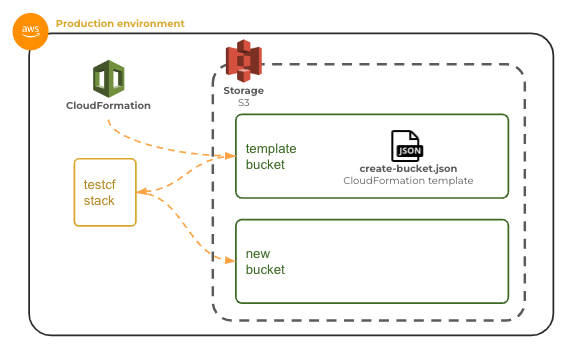

# AWS CloudFormation

🔑 **Key points**

- CloudFormation enables Infrastructure as Code (IaC).
- Templates use JSON or YAML to define AWS resources.
- Stacks allow you to manage a collection of resources as a single unit.

---

📖 **Deeper dive reading**: [CloudFormation getting started](https://docs.aws.amazon.com/AWSCloudFormation/latest/UserGuide/gettingstarted.templatebasics.html)

---

## CloudFormation

CloudFormation is AWS's primary IaC and automation tool. With CloudFormation, you create a declaration file called a **CloudFormation Template** (in JSON or YAML format) that describes every AWS resource you want to create. You then use that template to create a **CloudFormation stack**. A stack represents the instantiation of all the resources defined by the template. You can also delete all the resources represented by the stack with a single action.

- **Template**: A JSON or YAML script that defines the resources to be deployed.
- **Resource**: An AWS object defined in the template, such as an S3 bucket or an EC2 instance.
- **Stack**: The collection of actual AWS resources deployed and managed as a single unit.

With CloudFormation, you can easily experiment with alternative architectures, reproduce existing environments, and execute disaster recovery drills with high consistency.

## Creating your first CloudFormation stack

The following is a basic CloudFormation template in JSON format. It creates an S3 bucket with a parameterized unique name and then outputs the Amazon Resource Name (ARN) for the resulting bucket.

```json
{
  "AWSTemplateFormatVersion": "2010-09-09",
  "Parameters": {
    "MyBucketName": {
      "Description": "Unique name for the bucket",
      "Type": "String"
    }
  },
  "Resources": {
    "S3Bucket": {
      "Type": "AWS::S3::Bucket",
      "Properties": {
        "BucketName": {
          "Ref": "MyBucketName"
        }
      },
      "DeletionPolicy": "Delete"
    }
  },
  "Outputs": {
    "MyBucketArn": {
      "Value": {
        "Fn::GetAtt": ["S3Bucket", "Arn"]
      },
      "Description": "The ARN for the newly created bucket."
    }
  }
}
```

### Obtaining template parameters

The `Parameters` section defines the input values necessary to create the stack. When the stack is created, the user is prompted to provide these values. You can define as many parameters as needed and reference them later in the script using the `Ref` function. In this example, the unique bucket name is referenced in the `Resources` section.

```json
"Parameters": {
  "MyBucketName": {
    "Description": "Unique name for the bucket",
    "Type": "String"
  }
}
```

### Defining resources to create

The `Resources` section contains the AWS objects you want to provision. In this case, we are creating an S3 bucket. We start by specifying a **Logical ID** for the resource: `S3Bucket`. This ID is used within the template to reference the resource for creation, deletion, or use by other objects.

The resource type is defined by the `Type` value: [AWS::S3::Bucket](https://docs.aws.amazon.com/AWSCloudFormation/latest/UserGuide/aws-resource-s3-bucket.html). If you review the [Resource Type Reference](https://docs.aws.amazon.com/AWSCloudFormation/latest/UserGuide/aws-template-resource-type-ref.html), you will see various properties you can set, such as `BucketEncryption`, `AccessControl`, and `LifecycleConfiguration`. 

For this example, we set the `BucketName` property to the value of the `MyBucketName` parameter. We also supply a `DeletionPolicy` of `Delete` to ensure the bucket is removed if the stack is deleted.

```json
"Resources": {
  "S3Bucket": {
    "Type": "AWS::S3::Bucket",
    "Properties": {
      "BucketName": {
        "Ref": "MyBucketName"
      }
    },
    "DeletionPolicy": "Delete"
  }
}
```

### Template outputs

The final section is `Outputs`. These values are displayed in the AWS Management Console after the stack is created. In this case, we output the Amazon Resource Name (ARN) of the new bucket using the `Fn::GetAtt` intrinsic function.

```json
"Outputs": {
  "MyBucketArn": {
    "Value": {
      "Fn::GetAtt": ["S3Bucket", "Arn"]
    },
    "Description": "The ARN for the newly created bucket."
  }
}
```

## Creating a stack with the template

Follow these steps to use the template to build a stack that creates an S3 bucket.



### Creating a template bucket

Before CloudFormation can execute a template, the file must be accessible to the service. You generally have three options:

1. Upload a file from your local disk (CloudFormation will automatically create a temporary S3 bucket for you).
2. Manually upload the template to your own S3 bucket.
3. Connect CloudFormation to a Git repository containing your templates.

For this exercise, we will manually create an S3 bucket to host our templates.

1. Open the AWS Management Console and navigate to the **S3** service.
2. Create a new bucket with a unique name, such as `<your-name>-cloudformation-templates`.
3. Save the JSON code provided above into a file named `create-bucket.json` on your computer.
4. Upload `create-bucket.json` to the S3 bucket you just created.
5. Select the file in the S3 console and copy its **S3 URL** (e.g., `https://...s3.amazonaws.com/create-bucket.json`).

### Creating the stack

Now you are ready to use the template to create a CloudFormation stack.

1. Open the AWS Management Console and navigate to the **CloudFormation** service.
2. Select **Stacks** from the left navigation panel.
3. Click **Create stack** and select **With new resources (standard)**.
4. Under **Specify template**, select **Amazon S3 URL** and paste the URL you copied earlier.
5. Click **Next**.
6. Enter a **Stack name**, such as `test-cf-stack`.
7. Under **Parameters**, provide a unique name for **MyBucketName** (e.g., `<your-name>-cf-test-bucket`).
8. Click **Next**.
9. Leave the **Configure stack options** at their default settings and click **Next**.
10. Review your settings and click **Submit**.
11. Monitor the **Events** tab. When the status changes to `CREATE_COMPLETE`, your resources are ready.
12. Navigate to the S3 service console to verify that your new bucket has been created.


### Deleting the stack

One of the primary benefits of CloudFormation is the ease of cleanup. You can delete the S3 bucket and all other resources defined in the template by simply selecting the stack and clicking the **Delete** button. Within moments, CloudFormation will tear down the infrastructure it created.

## ☑ Exercise


```masteryls
{"id":"20aabf6e-0ed8-4fca-a1c0-3c03eb2c376f", "title":"AWS Cloud Formation", "type":"file-submission"  }
Upload a screenshot of the successful execution of your Cloud Formation stack.
```
