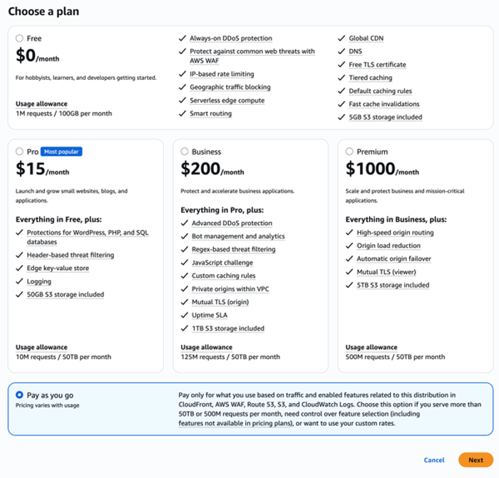
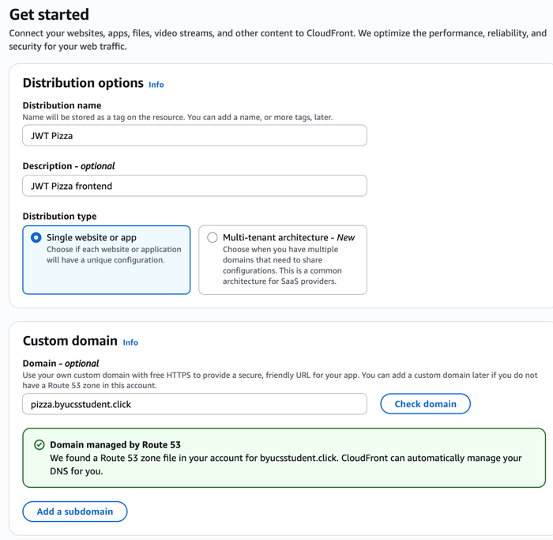
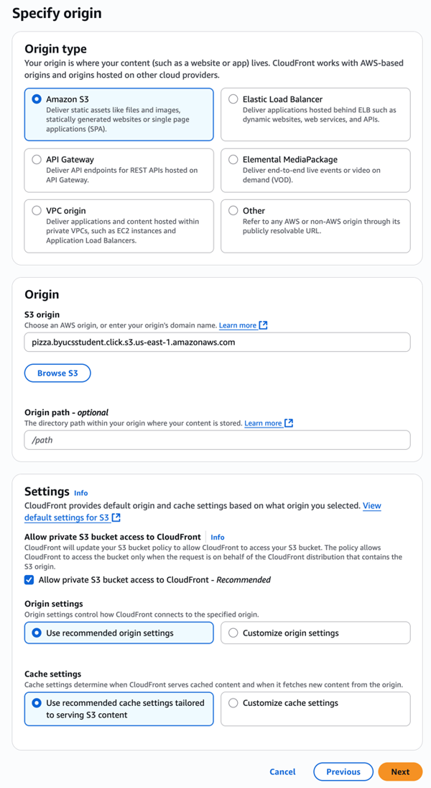
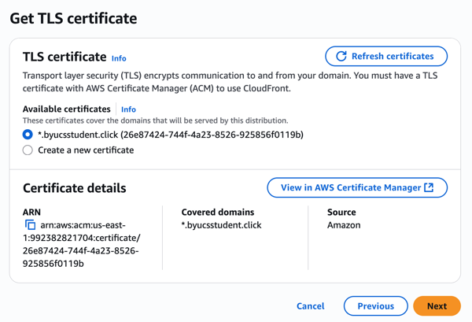
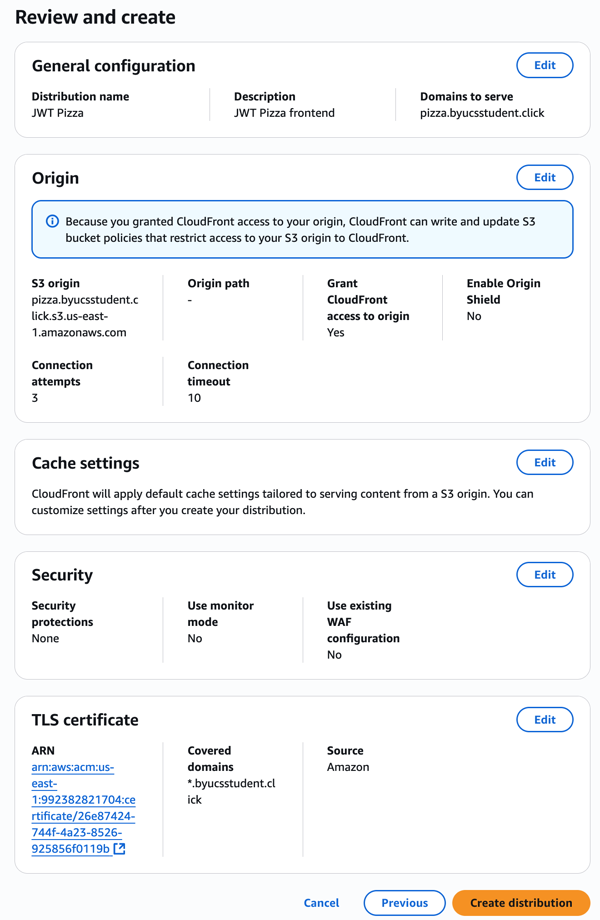
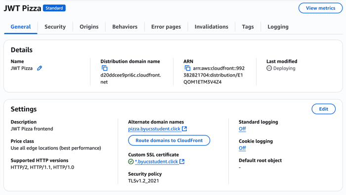
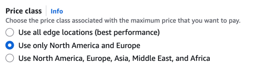
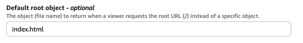

# AWS CloudFront

🔑 **Key points**

- CloudFront is a content delivery network (CDN).
- You can associate an S3 bucket as the origin of a CloudFront distribution.
- You can associate a Route 53 DNS record and hostname with your CloudFront distribution.

---

Previously we deployed the JWT Pizza static frontend content over the content delivery network (CDN) that GitHub Pages provides. However, GitHub Pages has some significant limitations that disqualify it for large scale production usage. These [limitations](https://docs.github.com/en/pages/getting-started-with-github-pages/about-github-pages#limits-on-use-of-github-pages) include the following:

- Published GitHub Pages sites may be no larger than 1 GB.
- GitHub Pages deployments will time out if they take longer than 10 minutes.
- GitHub Pages sites have a soft bandwidth limit of 100 GB per month.
- GitHub Pages sites have a soft limit of 10 builds per hour.

For these reasons we want to move to a CDN that provides the services and scale necessary for a production system. There are many great CDN services available. These include Akamai, Cloudflare, Fastly, and AWS CloudFront. We are going to use CloudFront because of the additional cloud services that they provide and also because of their generous free tier that will make it basically free for our usage.

In order to fully utilize CloudFront as a CDN we need to configure several AWS services. These include the following:

- **CloudFront** - CDN to globally distribute the frontend content.
- **S3** - File service storing the static frontend content.
- **Certificate Manager** - Web certificate generation used to represent the frontend content over HTTPS.
- **Route 53** - DNS service to route traffic to the CDN.


## S3 static content bucket

The first step we need to take is to create an S3 bucket to host the static files associated with the JWT Pizza frontend. Follow these steps to set up your S3 bucket.

1. Open the AWS browser console and navigate to the S3 service.
1. Click on the `Create bucket` button.
1. Select the `General configuration` option and name it the name of your JWT Pizza website. For the purposes of this instruction we will use the hostname `pizza.csbyustudent.click`. If you are following along with this instruction than you should use a unique bucket name such as your DNS hostname with a pizza prefix (e.g. pizza.yourhostname).
1. Leave all the other settings with their default, including _Block all public access_. Press the `Create bucket` button.
1. Create a file named `index.html` in VS Code and insert a basic _Hello World_ page.
   ```html
   <h1>Hello World!</h1>
   ```
1. Click on the newly created bucket to open it up.
1. Drag the `index.html` file into the bucket and press the `Upload` button.
   > 

For this tutorial, the _Hello World_ page will serve as a representation of all the frontend static content.

## Create a custom TLS certificate

You want your static content to be securely hosted. AWS offers a free service for managing TLS certificates when they are used for AWS services such as CloudFront.

1. Open the AWS browser console and navigate to the AWS Certificate Manager service.

   ⚠️ **Note** that you must be in the **North America Virginia** region when creating this certificate in order for it to work with CloudFront.

1. Click on `Request a certificate`.
1. Select `Request a public certificate` and press `Next`.
1. Enter a wildcard subdomain for your fully qualified domain name and use `DNS validation`. Your domain name should look like:

   ```txt
   *.yourdomainnamehere
   ```

   For example:

   > 

   Press `Request` and give a bit of time to generate.

1. When it displays with the status of `Pending validation` press on the `Create records in Route 53` to automatically add the required DNS validation record if this domain is hosted in Route 53, or choose the option to export the `CSV` file to obtain the entries that you need to add your DNS registry for the domain.

Make sure the certificate is validated before you try and set up CloudFront.

## CloudFront CDN hosting

With the bucket in place you can now create your CloudFront distribution that will serve as the CDN for your S3 bucket content. Take the following steps.

1. Open the AWS browser console and navigate to the CloudFront service.
1. Press the `Create distribution` button.
1. Select the **Pay as you go** plan. The other plans restrict the available options and only give you full functionality for a few weeks. Your usage of CloudFront should not be enough for any noticeable cost.

   

1. Provide the distribution name (**JWT Pizza**), a description, and the domain name for you service. You can use the check domain option if you are hosting your domain on Route 53. Press **Next** to continue.

   

1. Specify that you want to use Amazon S3 as the origin for the CDN content.
1. Provide your S3 bucket as the S3 origin by clicking on the **Browse S3** button and choosing your pizza S3 bucket.
1. Leave the other settings with the default. Press **Next** to continue.

   

1. Select **Do not enable security protections**. This is an additional paid service that you don't need at this time. Press **Next** to continue.
1. If you successfully created your certificate in the **Create a custom TLS certificate** section, then it should show up here based on the domain name that you previously provided. Press **Next** to continue.

   

1. Review your configuration and press **Create distribution** if it looks correct.

   

This will initiate the creation of the distribution, but you need to make a couple changes before it will work correctly. On the distribution overview page, locate the **Settings** section and click on the **Edit** button.



1. Change the **Price class** to be **Use only North America and Europe**. This will decrease your AWS bill.

   

1. Add a **Default root object** and set it to `index.html`. This will make it so the index.html file is loaded when you hit the distribution without specifying a path.

   

### View the hosted content

You should now be able to access the S3 files through CloudFront. Navigate back to the CloudFront console and view the distribution you just created. It will take a little while for it to deploy around the globe, but when the `deploying` state goes away, you should be able to access the placeholder index.html file using the `Distribution domain name` name found on the `General` tab of the distribution. This should be a URL with the `cloudfront.net` root domain. For example:

```sh
https://yourdistirubtionid.cloudfront.net
```

This should show your `Hello World` test page.


## Route 53

The last step for configuring the CDN, is to create a DNS record so that you can access the CDN using your domain name rather than the generated one for the distribution. This instruction assumes you are using Route 53 to host your domain name. If you are using a different DNS service, such as namecheap, then consult the documentation for that service.

1. Open the AWS browser console and navigate to the Route 53 service.
1. Select the hosted zone for your hostname.
1. Create a new record.
1. Give the name `pizza` for the subdomain.
1. Set the record type to an `A` record.
1. Move the slider to mark it as an `Alias`. This tells Route 53 that it can do some internal routing between its services rather than doing normal DNS routing.
1. Route traffic to `Alias to CloudFront Distribution`.
1. Select the destination dropdown. If you set the `Alternate domain name` to be this domain name when you set up CloudFront, the CloudFront distribution name should appear. If not then go back and check that setting for your distribution.
1. Press the `Create records` button.


Alternatively, you can create a CNAME record from your domain to the CloudFront distribution. If you are using an alternate domain name provider you will need to do this.

After a short while the DNS record should propagate, and you should be able to see the record pointing to CloudFront instead of GitHub with a console command like `dig` or `nslookup`. At that point your browser should also show the `Hello World` page.

## Final result

Once the DNS record has updated you should be able to use the subdomain you created to display the static content hosted by the CDN.


