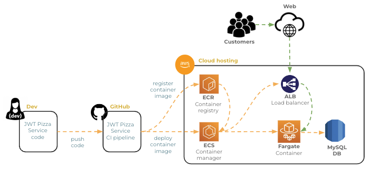
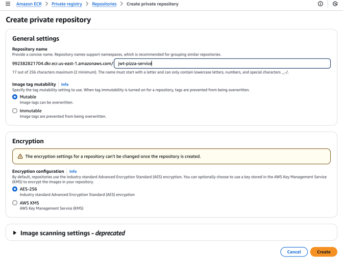
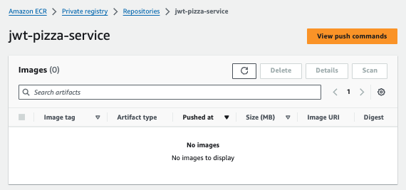
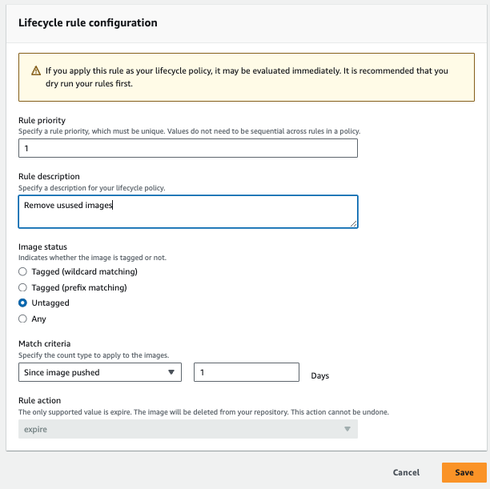

# AWS Elastic Container Registry (ECR)

🔑 **Key points**

- Deploy the JWT Pizza Service container image to ECR.

---

AWS Elastic Container Register (ECR) is an [Open Container Initiative](https://opencontainers.org/) compliant container registry. You can store up to 500 MB of container images in a private repository without charge. Using ECR is a convenient and secure way to upload your **jwt-pizza-service** container images and then deploy them using AWS Elastic Container Services (ECS). Here is the long term architecture that we are working towards:



Using ECR is similar to what you did with Docker Hub in a previous instruction topic. The steps are to create a repository and then push an image to that repository.

> [!IMPORTANT]
>
> Make sure you are using the `us-east-1` AWS region for all your work in this course.

## Creating an ECR repository

In order to use ECR, you must first create a ECS repository that will hold the **jwt-pizza-service** container images. Complete the following steps.

1. Open the AWS browser console and navigate to the ECR service.
1. Press `Create repository` and verify that it is making a private repository.

   

1. Give the repository the name `jwt-pizza-service`.
1. Press `Create`.

This results in a newly created repository where you can store you `jwt-pizza-service` Docker images.



## JWT-Pizza-Service image registration CI

With your ECR repository created, you are ready to automate the building and uploading of a Docker container image for the JWT Pizza service. Your CI pipeline will trigger the image creation whenever a change is made to the `jwt-pizza-service` codebase. The majority of this work involves giving your CI workflow the rights to push a Docker image into ECR. This includes setting up a trust policy between AWS and GitHub, as well as defining what AWS services GitHub can execute.

### Modify the IAM trust policy

In order for the `jwt-pizza-service` CI workflow to make requests over the OIDC authorized connection, you must alter the [previously configured](../awsS3Deployment/awsS3Deployment.md#create-the-iam-role) `github-ci` IAM role so that the `jwt-pizza-service` GitHub repository is also part of the trust relationship.

1. Open the AWS IAM service console.
1. Choose `Roles`.
1. Select the `github-ci` role that you created when you set up `jwt-pizza` to deploy to S3.
1. Select the `Trust relationships` tab.
1. Press `Edit trust policy`.
1. Replace the `token.actions.githubusercontent.com:sub` value with the following. This allows both of your source repositories to make an OIDC connection.
   ```json
   "token.actions.githubusercontent.com:sub": [
   "repo:YOURGITHUBACCOUNTHERE/jwt-pizza:ref:refs/heads/main",
   "repo:YOURGITHUBACCOUNTHERE/jwt-pizza-service:ref:refs/heads/main"
   ],
   ```
1. Press the `Update policy` button.

### Enhance the IAM rights

Next you need to enhance the `github-ci` role rights so that they can push to ECR and initiate the deployment to ECS.

1. Open the AWS IAM service console.
1. Choose `Roles`.
1. Select the `github-ci` role that you created when you set up `jwt-pizza` to deploy to S3.
1. Select the `Permissions` tab.
1. Click on the `jwt-pizza-ci-deployment` policy.
1. Select `JSON` and press `Edit`.
1. Add the following statements in order to allow the use of ECR and ECS. Make sure you replace `YOURACCOUNTIDHERE` with your actual AWS account ID.

   ```json
   {
      "Sid": "AuthenticateWithECR",
      "Effect": "Allow",
      "Action": "ecr:GetAuthorizationToken",
      "Resource": "*"
   },
   {
      "Sid": "PushToECR",
      "Effect": "Allow",
      "Action": [
            "ecr:BatchGetImage",
            "ecr:BatchCheckLayerAvailability",
            "ecr:PutImage",
            "ecr:InitiateLayerUpload",
            "ecr:UploadLayerPart",
            "ecr:CompleteLayerUpload"
      ],
      "Resource": "arn:aws:ecr:us-east-1:YOURACCOUNTIDHERE:repository/jwt-pizza-service"
   },
   {
      "Sid": "DeployContainer",
      "Effect": "Allow",
      "Action": [
            "ecs:UpdateService"
      ],
      "Resource": "arn:aws:ecs:us-east-1:YOURACCOUNTIDHERE:service/jwt-pizza-service/jwt-pizza-service"
   },
   {
      "Sid": "PassRolesInTaskDefinition",
      "Effect": "Allow",
      "Action": [
            "iam:PassRole"
      ],
      "Resource": [
            "arn:aws:iam::YOURACCOUNTIDHERE:role/jwt-pizza-ecs"
      ]
   }
   ```

1. Press `Next`.
1. Press `Save`.

### Modify the CI workflow script for image upload

Before you can modify the CI workflow for the JWT Pizza Service you need to add the following secrets to your fork of the `jwt-pizza-service` repository.

| Secret      | Description                                         | Example   |
| ----------- | --------------------------------------------------- | --------- |
| AWS_ACCOUNT | Your AWS account number                             | 343243424 |
| CI_IAM_ROLE | The IAM role with rights to deploy your application | github-ci |

Previously the workflow stopped after the tests were done and the coverage badge was updated. Now you want to modify the **build** job of the workflow so that it creates the distribution files you will use to create and deploy a JWT Pizza Service Docker container.

1. Create a distribution folder that will become our Docker container. This copies all the source code files and the newly created Dockerfile. We also replace the temporary database credentials that were used during testing with the ones needed by the production environment.
   ```yml
   - name: Create dist
     run: |
       mkdir dist
       cp Dockerfile dist
       cp -r src/* dist
       cp *.json dist
       sed -i "s/root/${{ secrets.DB_USERNAME }}/g" dist/config.js
       sed -i "s/tempdbpassword/${{ secrets.DB_PASSWORD }}/g" dist/config.js
       sed -i "s/127.0.0.1/${{ secrets.DB_HOSTNAME }}/g" dist/config.js
   ```
1. Create a CI pipeline artifact from the resulting distribution build.

   ```yml
   - name: Update distribution artifact
     uses: actions/upload-artifact@v4
     with:
       name: package
       path: dist/
   ```

Next, add a **deploy** job that creates the container and pushes it to ECR.

1. Create a new GitHub Actions Job underneath the `build` job and name it `deploy`. Give it permissions to access the CI pipeline token so that it can authenticate with OIDC. Add the version ID created in the build step to the job environment.

   ```yml
   deploy:
     runs-on: ubuntu-latest
     permissions:
       id-token: write
     needs: build
     env:
       version: ${{needs.build.outputs.version}}
   ```

1. As the first step, download the distribution artifact created by the last job.

   ```yml
   steps:
     - name: Download distribution artifact
       uses: actions/download-artifact@v4
       with:
         name: package
   ```

1. Authenticate to AWS using OIDC. This is the same authentication step that we took with the frontend deployment. Using OIDC makes it so we don't have to store any credentials to our AWS account.

   ```yml
   - name: Create OIDC token to AWS
     uses: aws-actions/configure-aws-credentials@v4
     with:
       audience: sts.amazonaws.com
       aws-region: us-east-1
       role-to-assume: arn:aws:iam::${{ secrets.AWS_ACCOUNT }}:role/${{ secrets.CI_IAM_ROLE }}
   ```

1. Login to AWS ECR. We need to provide credentials to Docker so that it can push container images into the register. This [action](https://github.com/aws-actions/amazon-ecr-login) gets a temporary password from ECR using the OIDC credential we previously obtained.

   ```yml
   - name: Login to Amazon ECR
      id: login-ecr
      uses: aws-actions/amazon-ecr-login@v2
   ```

1. Set up the Docker build and emulation. We need to build an ARM64 platform package. In order to do that in Linux we need to emulate an ARM based environment.

   ```yml
   - name: Set up machine emulation
      uses: docker/setup-qemu-action@v3

   - name: Set up Docker build
      uses: docker/setup-buildx-action@v3
   ```

1. Build and push the docker container. We use the `--push` parameter to automatically push the container image to ECR once it finishes building. We also define an output variable that will contain the name of the image that was pushed, so we can reference it later.
   ```yml
   - name: Build and push container image
     id: build-image
     env:
       ECR_REGISTRY: ${{ steps.login-ecr.outputs.registry }}
       ECR_REPOSITORY: 'jwt-pizza-service'
     run: |
       docker build --platform=linux/arm64 -t $ECR_REGISTRY/$ECR_REPOSITORY --push .
       echo "image=$ECR_REGISTRY/$ECR_REPOSITORY:latest" >>  $GITHUB_OUTPUT
   ```

### Test the image push

You should now be able to commit and push the workflow script to GitHub. This will trigger a container image to build and push to ECR. Once it is done you should see your image show up on the ECR images dashboard.


## Set up a lifecycle rule

When you push a container image to ECR it will untag the previous image and leave it in the repository. In order to clean these up and avoid going over the 500 MB free tier, you can create a `Lifecycle policy rule` that removes anything without a tag after 1 day. You can also set up a rule that only keeps the last N images.



## ☑ Exercise

Deploy a container image of your JWT Pizza Service to ECR. This includes the following steps:

1. Create the ECR repository.
1. Modify the `github-ci` IAM roles and `jwt-pizza-ci-deployment` policy so that your CI pipeline can upload the ECR.
1. Modify the CI pipeline so that it builds the container and pushes it to ECR.
1. Execute the pipeline and observe the newly created image in ECR.
