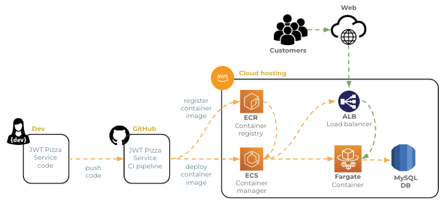
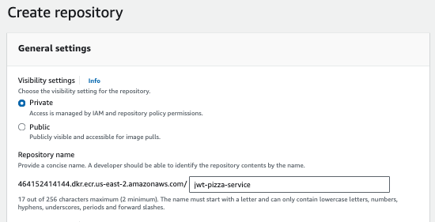
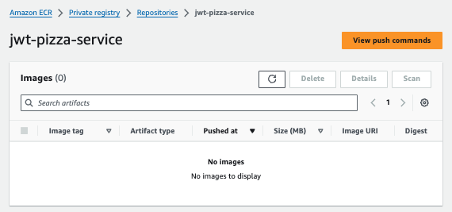
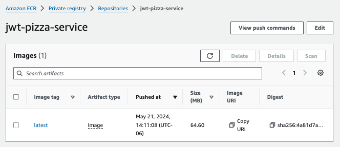
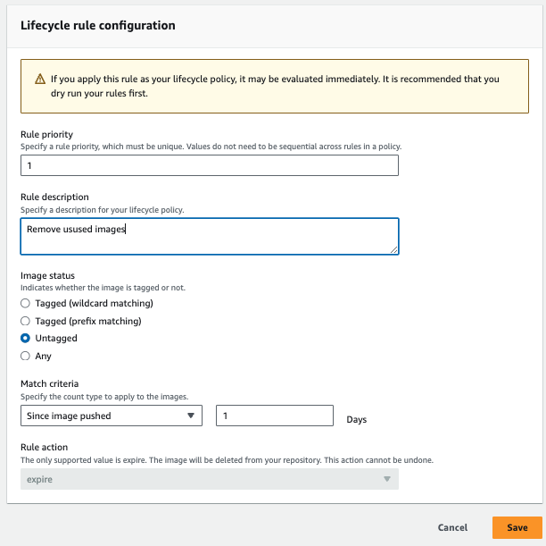

# AWS Elastic Container Registry (ECR)

🔑 **Key points**

- Deploy the JWT Pizza Service container image to ECR.

---

AWS Elastic Container Registry (ECR) is an [Open Container Initiative (OCI)](https://opencontainers.org/)-compliant container registry. You can store up to 500 MB of container images in a private repository without charge under the AWS Free Tier. Using ECR is a convenient and secure way to upload your **jwt-pizza-service** container images and then deploy them using AWS Elastic Container Service (ECS). Here is the long-term architecture that we are working towards:



Using ECR is similar to what you did with Docker Hub in a previous instruction topic. The steps are to create a repository and then push an image to that repository.

> [!IMPORTANT]
>
> Make sure you are using the `us-east-1` AWS region for all your work in this course.

## Creating an ECR repository

In order to use ECS, you must first create an ECR repository that will hold the **jwt-pizza-service** container images. Complete the following steps:

1. Open the AWS Management Console and navigate to the **Amazon ECR** service.
1. Click **Create repository** and verify that **Private** is selected for the visibility settings.

   

1. Give the repository the name `jwt-pizza-service`.
1. Click **Create**.

This results in a newly created repository where you can store your `jwt-pizza-service` Docker images.



## JWT Pizza Service image registration CI

With your ECR repository created, you are ready to automate the building and uploading of a Docker container image for the JWT Pizza Service. Your CI pipeline will trigger the image creation whenever a change is pushed to the `jwt-pizza-service` codebase. The majority of this work involves giving your CI workflow the rights to push a Docker image into ECR. This includes setting up a trust policy between AWS and GitHub, as well as defining which AWS services GitHub can interact with.

### Modify the IAM trust policy

In order for the `jwt-pizza-service` CI workflow to make requests over the OIDC-authorized connection, you must alter the [previously configured](../awsS3Deployment/awsS3Deployment.md#create-the-iam-role) `github-ci` IAM role so that the `jwt-pizza-service` GitHub repository is also part of the trust relationship.

1. Open the AWS IAM service console.
1. Choose **Roles**.
1. Select the `github-ci` role that you created when you set up `jwt-pizza` to deploy to S3.
1. Select the **Trust relationships** tab.
1. Click **Edit trust policy**.
1. Replace the `token.actions.githubusercontent.com:sub` value with the following array. This allows both of your source repositories to make an OIDC connection. Replace `YOURGITHUBACCOUNTHERE` with your actual GitHub username.
   ```json
   "token.actions.githubusercontent.com:sub": [
     "repo:YOURGITHUBACCOUNTHERE/jwt-pizza:ref:refs/heads/main",
     "repo:YOURGITHUBACCOUNTHERE/jwt-pizza-service:ref:refs/heads/main"
   ],
   ```
1. Click the **Update policy** button.

### Enhance the IAM rights

Next, you need to enhance the `github-ci` role permissions so that it can push to ECR and initiate the deployment to ECS.

1. Open the AWS IAM service console.
1. Choose **Roles**.
1. Select the `github-ci` role.
1. Select the **Permissions** tab.
1. Click on the `jwt-pizza-ci-deployment` policy.
1. Select the **JSON** tab and click **Edit**.
1. Add the following statements to the `Statement` array to allow the use of ECR and ECS. Make sure you replace `YOURACCOUNTIDHERE` with your actual AWS account ID.

   ```json
   {
      "Sid": "AuthenticateWithECR",
      "Effect": "Allow",
      "Action": "ecr:GetAuthorizationToken",
      "Resource": "*"
   },
   {
      "Sid": "PushToECR",
      "Effect": "Allow",
      "Action": [
            "ecr:BatchGetImage",
            "ecr:BatchCheckLayerAvailability",
            "ecr:PutImage",
            "ecr:InitiateLayerUpload",
            "ecr:UploadLayerPart",
            "ecr:CompleteLayerUpload"
      ],
      "Resource": "arn:aws:ecr:us-east-1:YOURACCOUNTIDHERE:repository/jwt-pizza-service"
   },
   {
      "Sid": "DeployContainer",
      "Effect": "Allow",
      "Action": [
            "ecs:UpdateService"
      ],
      "Resource": "arn:aws:ecs:us-east-1:YOURACCOUNTIDHERE:service/jwt-pizza-service/jwt-pizza-service"
   },
   {
      "Sid": "PassRolesInTaskDefinition",
      "Effect": "Allow",
      "Action": [
            "iam:PassRole"
      ],
      "Resource": [
            "arn:aws:iam::YOURACCOUNTIDHERE:role/jwt-pizza-ecs"
      ]
   }
   ```

1. Click **Next**.
1. Click **Save**.

### Modify the CI workflow script for image upload

Before you can modify the CI workflow for the JWT Pizza Service, you need to add the following secrets to your fork of the `jwt-pizza-service` repository in GitHub (**Settings** > **Secrets and variables** > **Actions**).

| Secret      | Description                                         | Example   |
| ----------- | --------------------------------------------------- | --------- |
| AWS_ACCOUNT | Your AWS account number                             | 123456789 |
| CI_IAM_ROLE | The IAM role with rights to deploy your application | github-ci |

Previously, the workflow stopped after the tests were finished and the coverage badge was updated. Now you will modify the **build** job of the workflow to create the distribution files used to build the Docker container.

1. Create a distribution folder that will become the Docker context. This copies all source code files and the Dockerfile. It also uses `sed` to replace the temporary database credentials used during testing with the environment secrets needed for production.
   ```yml
   - name: Create dist
     run: |
       mkdir dist
       cp Dockerfile dist
       cp -r src/* dist
       cp *.json dist
       sed -i "s/root/${{ secrets.DB_USERNAME }}/g" dist/config.js
       sed -i "s/tempdbpassword/${{ secrets.DB_PASSWORD }}/g" dist/config.js
       sed -i "s/127.0.0.1/${{ secrets.DB_HOSTNAME }}/g" dist/config.js
   ```
1. Create a CI pipeline artifact from the resulting distribution build.

   ```yml
   - name: Update distribution artifact
     uses: actions/upload-artifact@v4
     with:
       name: package
       path: dist/
   ```

Next, add a **deploy** job that builds the container and pushes it to ECR.

1. Create a new GitHub Actions job underneath the `build` job and name it `deploy`. Give it permissions to access the CI pipeline token so that it can authenticate with OIDC. Add the version ID created in the build step to the job environment.

   ```yml
   deploy:
     runs-on: ubuntu-latest
     permissions:
       id-token: write
     needs: build
     env:
       version: ${{needs.build.outputs.version}}
   ```

1. As the first step, download the distribution artifact created by the previous job.

   ```yml
   steps:
     - name: Download distribution artifact
       uses: actions/download-artifact@v4
       with:
         name: package
   ```

1. Authenticate to AWS using OIDC. This is the same authentication step used with the frontend deployment. OIDC allows us to authenticate without storing long-lived AWS credentials in GitHub.

   ```yml
   - name: Create OIDC token to AWS
     uses: aws-actions/configure-aws-credentials@v4
     with:
       audience: sts.amazonaws.com
       aws-region: us-east-1
       role-to-assume: arn:aws:iam::${{ secrets.AWS_ACCOUNT }}:role/${{ secrets.CI_IAM_ROLE }}
   ```

1. Log in to Amazon ECR. We need to provide credentials to Docker so that it can push container images into the registry. This [action](https://github.com/aws-actions/amazon-ecr-login) retrieves a temporary password from ECR using the OIDC credentials obtained in the previous step.

   ```yml
   - name: Login to Amazon ECR
     id: login-ecr
     uses: aws-actions/amazon-ecr-login@v2
   ```

1. Set up Docker build and emulation. We need to build an ARM64 platform package to run on AWS Graviton processors. In order to do that on standard Linux runners, we need to emulate an ARM-based environment.

   ```yml
   - name: Set up machine emulation
     uses: docker/setup-qemu-action@v3

   - name: Set up Docker build
     uses: docker/setup-buildx-action@v3
   ```

1. Build and push the Docker container. We use the `--push` parameter to automatically push the container image to ECR once it finishes building. We also define an output variable that contains the name of the image that was pushed for future reference.
   ```yml
   - name: Build and push container image
     id: build-image
     env:
       ECR_REGISTRY: ${{ steps.login-ecr.outputs.registry }}
       ECR_REPOSITORY: 'jwt-pizza-service'
     run: |
       docker build --platform=linux/arm64 -t $ECR_REGISTRY/$ECR_REPOSITORY --push .
       echo "image=$ECR_REGISTRY/$ECR_REPOSITORY:latest" >>  $GITHUB_OUTPUT
   ```

### Test the image push

You should now be able to commit and push the modified workflow script to GitHub. This will trigger the container image build and push it to ECR. Once the workflow completes, navigate to the ECR repository in the AWS console to see your image in the dashboard.



## Set up a lifecycle rule

When you push a container image to ECR with a tag that already exists (like `latest`), ECR untags the previous image and leaves it in the repository as an "untagged" image. To clean these up and avoid exceeding the 500 MB free tier, you can create a **Lifecycle policy** that removes images without a tag after 1 day. You can also set up a rule that only keeps the last `N` images.



## ☑ Exercise

Deploy a container image of your JWT Pizza Service to ECR. This includes the following steps:

1. Create the ECR repository.
1. Modify the `github-ci` IAM role and `jwt-pizza-ci-deployment` policy so that your CI pipeline can upload to ECR.
1. Modify the CI pipeline workflow to build the container and push it to ECR.
1. Execute the pipeline and verify the newly created image in the ECR console.

```masteryls
{"id":"5d8c6ed6-ec21-4ade-b51d-bcb37983a4c0", "title":"ECR upload", "type":"file-submission", "gradingCriteria":"AWS ECR showing an uploaded docker image"  }
Submit a screenshot of your AWS ECR dashboard displaying your uploaded docker image.
```
