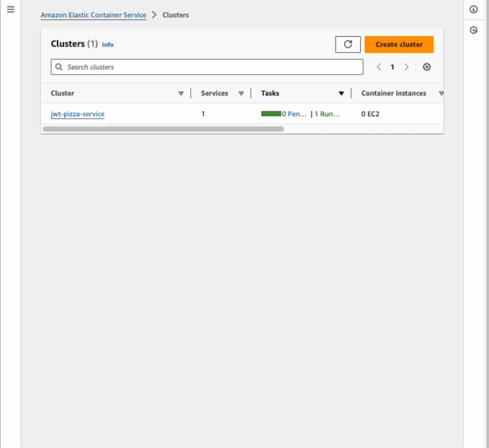

# ECS

https://aws.amazon.com/blogs/compute/building-blocks-of-amazon-ecs/

The Elastic Container Service (ECS) provides the functionality necessary to deploy your container image. After you have uploaded your image to [ECR](../awsEcr/awsEcr.md) you can create an ECS cluster and service to either load your container with the AWS Elastic Kubernetes Service (EKS) or AWS Fargate.

The EKS deploys container to EC2 instances your you provision. This requires you to launch, scale, and manage your own EC2 instance. Alternatively, you can use AWS Fargate to automatically manage the host of your containers. For our work in the course we will use AWS Fargate.

The basic pieces that ECS provides are as follows.


- **Task definitions**: A description of the containers and parameters used to instantiate a task. Think AMI vs Instance. You need this so you can scale up your tasks.
- **Task**: A task is a grouping of 1 to N containers. For a blog you might have a web server, application server and memory cache container.
- **Scheduler**: Controlled by EC2 to handle the launching, scaling, and deleting of tasks.
- **Service**: Defines the things that need to run and the desired performance characteristics that the scheduler should use to do its job.
- **Cluster**: A collection of EC2 instances or Fargate tasks. Clusters can span AZs. Has the ability to scale and delete.
- **Agent**: When using EC2 there is a Go program that controls the communication of the instance and the cluster.

Spot pricing is very interesting. That drops the price to $0.012.

## Create ECS task role

1. Open the AWS browser console and navigate to the Identity Management (IAM) service.
1. Press `Roles` from the left side navigation panel.
1. Press `Create role`
1. Under `Use case` select `Elastic Container Service` and then select `Elastic Container Service Task`

   

1. Press `Next`
1. Select the `AmazonECSTaskExecutionRolePolicy`. Press `Next`.
1. Provide the `Role name` of `jwt-pizza-ecs`.
1. Press `Create role`

## Create ECS task

1. Open the AWS browser console and navigate to the Elastic Container Service (ECS) service.
1. Press `Task definitions` from the left side navigation panel.
1. Press `Create new task definition`.
1. Provide the name _jwt-pizza-service_ for the `Task definition family`
1. Under `Infrastructure requirements`
   1. Leave the `Launch type` as AWS Fargate.
   1. Select _Linux/ARM64_ as the `Operating System`.
   1. Select _.5 vCPU_ for CPU and _1 GB_ for Memory.
   1. Leave `Task role` blank.
   1. Select jwt-pizza-ecs for `Task execution role`.
1. Under `Container - 1`.
   1. Provide the name `jwt-pizza-service`.
   1. Set the Image URI to the URI that was generated when you uploaded the container image to ECR. This should be something like:
   ```sh
   1234567890.dkr.ecr.us-east-1.amazonaws.com/jwt-pizza-service:latest
   ```
   1. Assign the `Container port` to 80 for the HTTP App protocol.
1. Press `Create`.

## Create ECS cluster

1. Open the AWS browser console and navigate to the Elastic Container Service (ECS) service.
1. Press `Clusters` from the left side navigation panel.
1. Press `Create cluster`.
1. Provide `jwt-pizza-service` as the Cluster name.
1. Under `Infrastructure` choose `AWS Fargate`.
1. Press `Create`.

## Launch the ECS service

1. Open the AWS browser console and navigate to the Elastic Container Service (ECS) service.
1. Press `Clusters` from the left side navigation panel.
1. Press the cluster you just created (`jwt-pizza-service`).
1. Under the `Services` tab press `Create`.
   
1. Under `Environment` select `Launch type` since we don't want to consider a capacity strategy at this point.
1. Under `Deployment configuration`
   1. Select `Service` since we want the JWT Pizza Service to continually run, as opposed to a short running task.
   1. Select `jwt-pizza-service` from the `Family` dropdown.
   1. Provide `jwt-pizza-service` as the `Service name`.
1. Under `Networking`
   1. Remove the selection for the `default` security group.
   1. Select the `jwt-pizza-service` security group that you created previously. This allows the container to accept incoming HTTP requests.
   1. Select the option to auto assign a `Public IP` address.
1. Press `Create`.

Once you have launched the container it should only take a couple of seconds for it to be available for use. Navigate to the service and select the `Tasks` tab. Then select the currently running task and use the networking bindings to see the IP address that is being used. Navigate your browser to that location and you should see the `jwt-pizza-service`.



## Launch the ECS service ALB version

In addition to the above, do the following to deploy with an Application Load Balancer.

1. Under `Networking`
   1. **Unselect** the option to auto assign a `Public IP` address.
1. Under `Load balancing`
   1. Select `Application Load Balancer`
   1. Select the `Container` or incoming traffic to be `jwt-pizza-service 80:80`
   1. Create a new load balancer
      1. Provide `jwt-pizza-service` as the Load balancer name.
      1. Create a new listener on port 443 using HTTPS.
      1. Select the wildcard certificate for your hostname that you created previously.
   1. Create a new target group.
      1. Provide the name `jwt-pizza-service`.
      1. Set the Protocol to HTTP.
      1. Set the Health check path to `/api/docs`.
