# Elastic Container Service (ECS)

🔑 **Key points**

- Understanding ECS and its core components.
- Manually deploying containers using AWS Fargate.
- Exposing containers through an Application Load Balancer (ALB).
- Configuring DNS records to point to an ECS service.
- Deploying the JWT Pizza Service to ECS.

---

📖 **Deeper dive reading**: [What is Amazon ECS?](https://docs.aws.amazon.com/AmazonECS/latest/developerguide/Welcome.html)

---


Amazon Elastic Container Service (ECS) provides the orchestration necessary to deploy and manage Docker containers. Once you have uploaded your container image to [Amazon ECR](../awsEcr/awsEcr.md), you can create an ECS cluster and service to run your container on either EC2 instances or AWS Fargate.

If you configure ECS to deploy to **EC2 instances**, you are responsible for launching, scaling, and managing the underlying virtual machines. Alternatively, if you use **AWS Fargate**, AWS manages the infrastructure for you, automatically handling the provisioning and scaling of the resources required by your containers. For this course, we will use AWS Fargate to simplify infrastructure management.

The core components of ECS are:

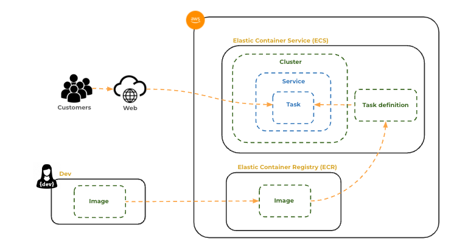

- **Task Definition**: A blueprint that defines the container image to execute, the required memory and vCPU, environment variables, and health check parameters. You can define multiple containers within a single task definition if they are highly coupled (e.g., a main application and a "sidecar" logging container).
- **Task**: The instantiation of a task definition. A running task is the ECS equivalent of a running Docker container, including additional metadata regarding its health and network status.
- **Scheduler**: The logic responsible for placing tasks on the cluster, ensuring the desired number of tasks are running, and rescheduling tasks if they fail.
- **Service**: A configuration that maintains a specified number of simultaneous instances of a task definition in an ECS cluster. If a task fails or stops, the service scheduler launches another instance.
- **Cluster**: A logical grouping of tasks or services. Clusters can span multiple Availability Zones (AZs) to ensure the application is resilient to localized infrastructure failures.

> [!IMPORTANT]
>
> Ensure you are using the `us-east-1` (N. Virginia) AWS region for all work in this course.

## Required roles and permissions

Before running Docker containers in ECS, you must define the permissions the service and the containers will have. Two specific IAM roles control these permissions:

1. **Task Execution Role**: Grants the ECS agent permission to make AWS API calls on your behalf. This includes pulling images from ECR and sending container logs to CloudWatch.
2. **Task Role**: Defines the permissions for the application inside the container. This includes rights to access resources like S3 buckets or DynamoDB tables.

We will not define a **Task Role** immediately, but you may need one later if your application needs to connect to other AWS services (like RDS or S3) without using hardcoded credentials.

### Create an ECS task execution role

To allow ECS to start tasks and pull images, you must create a **Task Execution Role**.

1. Sign in to the AWS Management Console and navigate to the **IAM** (Identity and Access Management) service.
2. Select **Roles** from the left navigation panel.
3. Click **Create role**.
4. Select **AWS service** as the **Trusted entity type**.
5. Under the **Use case** dropdown, select **Elastic Container Service**, then select the **Elastic Container Service Task** radio button.

   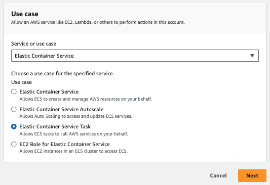

6. Click **Next**.
7. Search for and select the policy named `AmazonECSTaskExecutionRolePolicy`. This policy provides the necessary permissions to run ECS tasks. Click **Next**.
8. Set the **Role name** to `jwt-pizza-ecs`.

   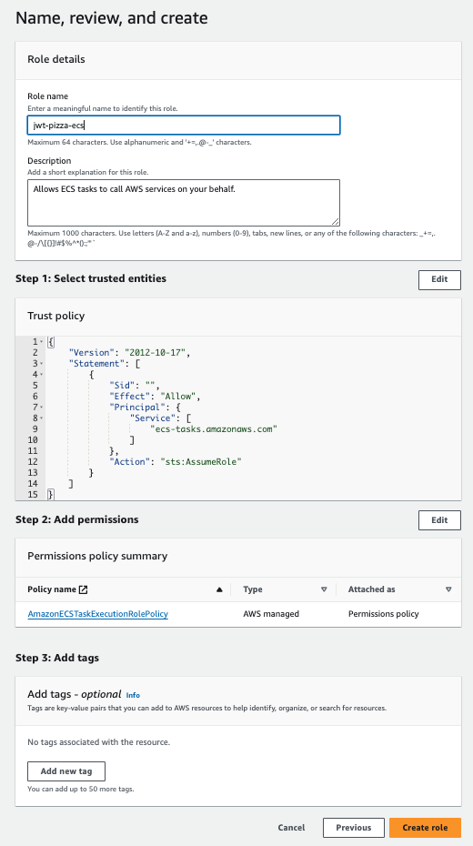

9. Click **Create role**.

## Create an ECS task definition

Next, define the task that will run the JWT Pizza backend.

1. Navigate to the **Elastic Container Service (ECS)** service in the AWS Console.
2. Select **Task definitions** from the left navigation panel.
3. Click **Create new task definition** and choose **Create new task definition** from the dropdown.
4. Set the **Task definition family** name to `jwt-pizza-service`.
5. Under **Infrastructure requirements**:
   1. Ensure the **Launch type** is set to **AWS Fargate**.
   2. Set the **Operating system/Architecture** to **Linux/ARM64**.
   3. Select **.5 vCPU** for CPU and **1 GB** for Memory. (Low settings help minimize AWS costs).
   4. Leave **Task role** blank for now.
   5. Set the **Task execution role** to the `jwt-pizza-ecs` role you created earlier.
6. Under **Container - 1**:
   1. Set the **Name** to `jwt-pizza-service`.
   2. Set the **Image URI** to the URI generated when you pushed your image to ECR. It should look like this:
      ```text
      1234567890.dkr.ecr.us-east-1.amazonaws.com/jwt-pizza-service:latest
      ```
      *Ensure you include the `:latest` tag.*
   3. Set the **Container port** to `80` with the protocol set to **HTTP**.
7. Click **Create**.

## Create an ECS cluster

A cluster is the logical group where your service will live.

1. In the ECS console, select **Clusters** from the left navigation panel.
2. Click **Create cluster**.
3. Set the **Cluster name** to `jwt-pizza-service`.
4. Under **Infrastructure**, ensure **AWS Fargate (serverless)** is selected.
5. Click **Create**.

Wait for the cluster status to change from **Provisioning** to **Active**.

## Create an ECS service

The service manages the deployment and scaling of your tasks. When you create the service, ECS will immediately attempt to launch the tasks.

1. In the ECS console, select **Clusters** and click on the `jwt-pizza-service` cluster.
2. Under the **Services** tab, click **Create**.

   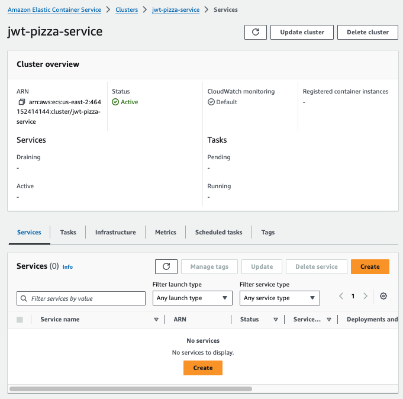

3. Under **Deployment configuration**:
   1. Select **Service** as the application type.
   2. Select `jwt-pizza-service` from the **Family** dropdown (under Task definition).
   3. Set the **Service name** to `jwt-pizza-service`.
   4. Set **Desired tasks** to `1`.
4. Under **Networking**:
   1. Select your **VPC**.
   2. Ensure at least two **Subnets** are selected (standard for high availability).
   3. Under **Security group**, click **Select existing security group** and choose the `jwt-pizza-service` security group you created previously. Ensure it allows port 80 and/or 443.
   4. Ensure **Public IP** is turned **ON**.
5. Under **Load balancing**:
   1. Select **Application Load Balancer**.
   2. For the **Load balancer name**, enter `jwt-pizza-service`.
   3. Set the **Container to load balance** to `jwt-pizza-service 80:80`.
   4. **Listener**: Create a new listener on port `443` using protocol **HTTPS**.
   5. **Certificate**: Select the wildcard certificate you created in previous steps (ACM).
   6. **Target group**: Create a new target group named `jwt-pizza-service`.
      - **Protocol**: HTTP
      - **Health check path**: `/api/docs` (The ALB uses this to verify the container is responsive).

      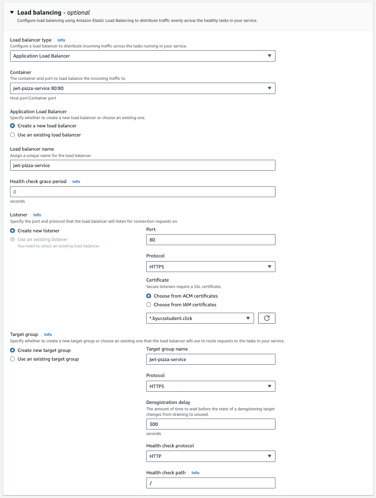

6. Click **Create**.

Deployment will take several minutes. You can monitor progress in the **Service** events tab or via the **CloudFormation** console.

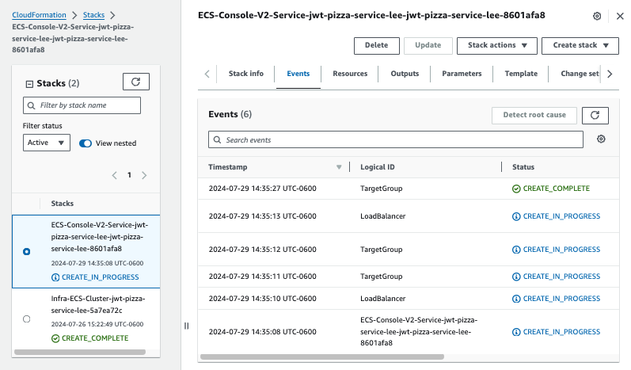

### Monitoring container deployment

To check if your container is running:
1. Navigate to your ECS Cluster -> `jwt-pizza-service` service.
2. Click the **Tasks** tab.
3. The **Last status** should eventually show **Running**.

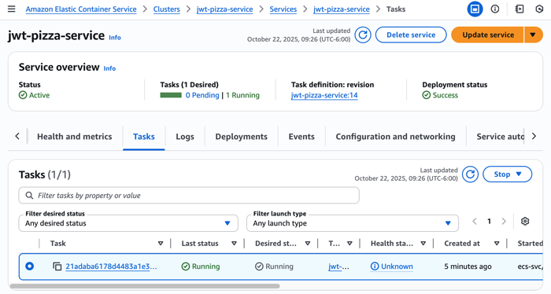

If the task fails to start, click on the **Task ID** to view details. Check the **Logs** tab to see the application's console output, which is invaluable for debugging startup errors.

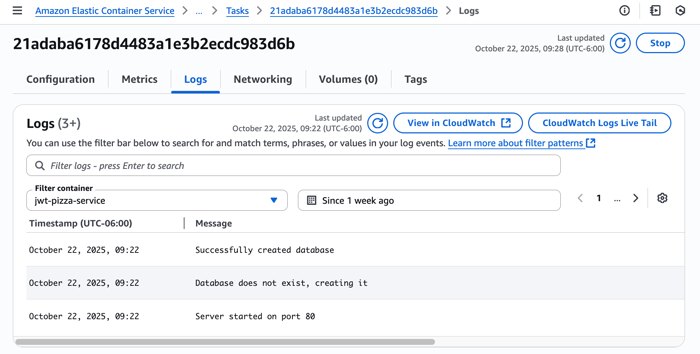

### Testing the load balancer

Once the service and load balancer are active, you can access the service via the ALB's DNS name.

1. Navigate to the **EC2** console.
2. Select **Load Balancers** from the left menu.
3. Select the `jwt-pizza-service` load balancer.
4. Copy the **DNS name**.

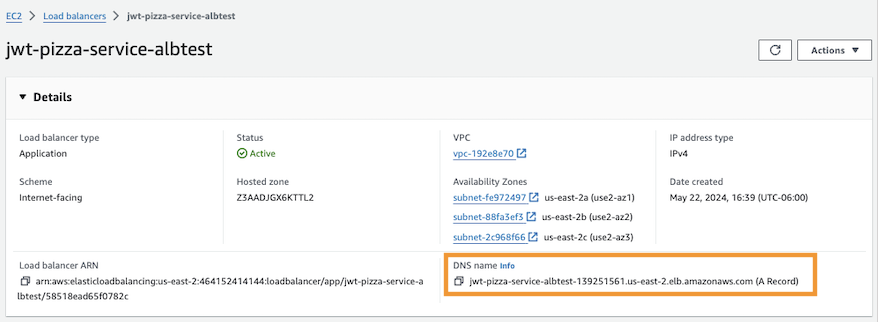

Since we are using a self-signed or specific domain certificate, you may need to use the `-k` (insecure) flag with `curl` if the DNS name doesn't match the certificate exactly yet:

```sh
curl -k https://LOADBALANCER_DNSNAME_HERE

{"message":"welcome to JWT Pizza","version":"20240525.191742"}
```

## Route 53

The final step is to map your custom domain to the load balancer so users can access the service via a friendly URL.

1. Navigate to the **Route 53** service in the AWS Console.
2. Select **Hosted zones** and click on your domain name.
3. Click **Create record**.
4. **Record name**: Enter `pizza-service` (creating the subdomain `pizza-service.yourdomain.com`).
5. **Record type**: Select **CNAME**.
6. **Value**: Paste the **DNS name** of your Application Load Balancer.
7. Click **Create records**.

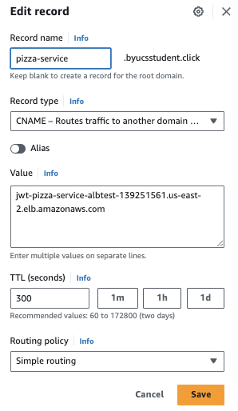

> [!NOTE]
>
> The subdomain must be exactly `pizza-service` for your project deliverables to be validated correctly.

### Testing the DNS record

Use the `dig` command to check if the DNS record has propagated:

```sh
dig pizza-service.yourdomainnamehere.com +noall +answer
```

Once propagated, you should see the CNAME pointing to the AWS load balancer. You can then navigate to `https://pizza-service.yourdomainnamehere.com` in your browser.

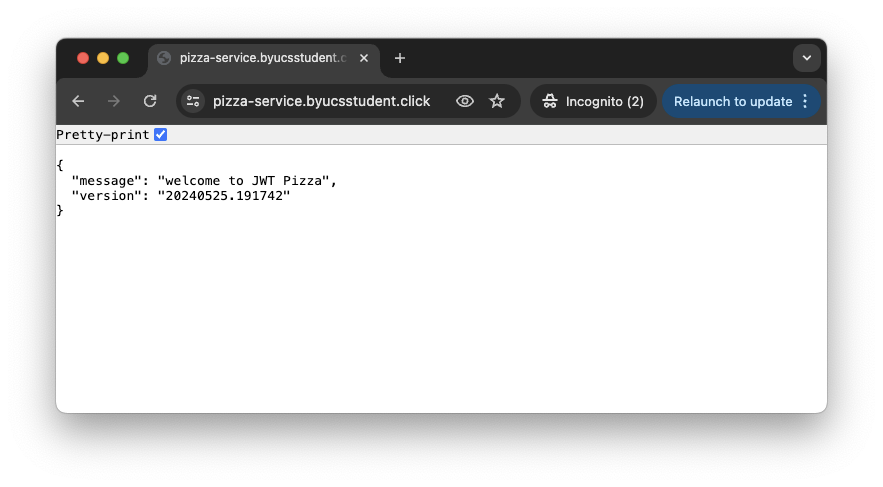

## ☑ Exercise

Deploy the JWT Pizza Service container by completing the following:

1. **Create IAM Roles**: Set up the ECS Task Execution role.
2. **Define the Task**: Create a task definition using your ECR image URI.
3. **Provision the Cluster**: Create a Fargate cluster.
4. **Deploy the Service**: Create an ECS service integrated with an Application Load Balancer and HTTPS.
5. **Configure DNS**: Create a CNAME record in Route 53 pointing to your ALB.


```masteryls
{"id":"024757e7-e85c-4f79-97ac-bfd8c4772df8", "title":"AWS ECS", "type":"url-submission", "syncGrade":false, "autoGrade":false, "validateUrl":true, "gradingCriteria":"- The response is a JSON object with a message field that says 'welcome to JWT Pizza'" }
Submit the URL to your JWT Pizza service.

_Example: https://pizza-service.yourhostname.click_
```
