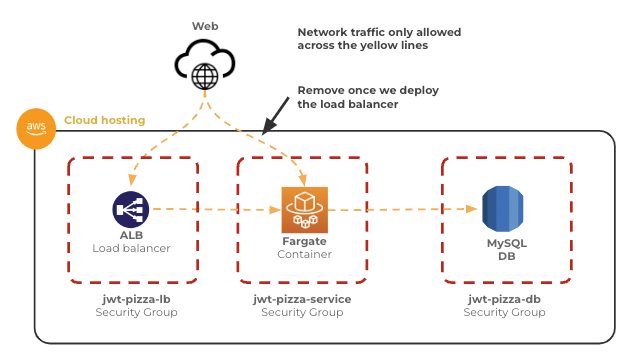
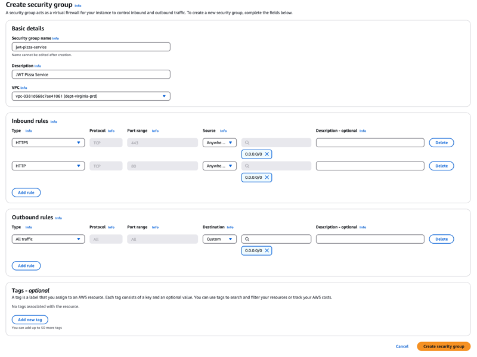
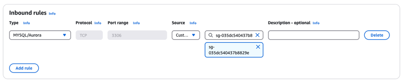
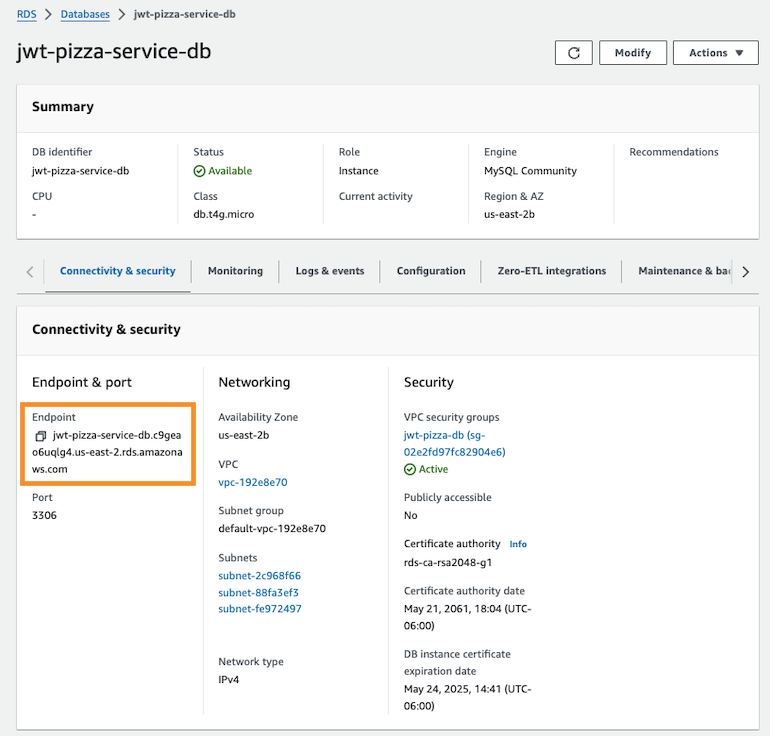

# AWS RDS MySQL

🔑 **Key points**

- AWS RDS provides excellent managed database support
- Security groups protect access to the database
- Store your credentials securely
- Deploy an RDS MySQL database for use the JWT Pizza Service

---

With a cloud deployment you can take advantage of scalable database services that can dynamically increase in storage and computing capacity as the size and demands of your customer audience increase. For the JWT Pizza service you are going to use the AWS Relational Database Service (RDS) MySQL implementation.

AWS RDS manages configuration, backup, monitoring, and restoration for you. Additionally, it only takes a couple mouse clicks to increase or decrease the size of your database server. This helps you reduce cost when you don't need a large instance, and increase the instance when your customers become more demanding.

> [!IMPORTANT]
>
> Make sure you are using the `us-east-1` AWS region for all your work in this course.

## Creating the VPC security groups

Before you create your database instance, you need to define the security groups that will allow network access to your database. You will first define the **jwt-pizza-service** security group that anyone can talk to, and then the database security group that only allows the **jwt-pizza-service** to talk to it.

Eventually you will change the **jwt-pizza-service** security group so that only the load balancer can talk to it, but you can't do that until you actually deploy a load balancer.

### Create the Pizza Service security group

1. Open the AWS browser console and navigate to the VPC service.
1. Select `Security groups` from the left panel navigation.
1. Press `Create security group`.
1. Name the group `jwt-pizza-service`.
1. Give a simple description like `JWT Pizza Service`.
1. Press the `Add rule` for **inbound rules**.

   1. Select the `type` of **HTTPS**. This should populate the `Port range` with 443. Set the `Source` to **Anywhere-IPv4**.
   1. Add a second rule. Select the `type` of **HTTP**. This should populate the `Port range` with 80. Set the `Source` to **Anywhere-IPv4**.

   

1. **Do not delete the Outbound rules**.
1. Press the `Create security group` button.

### Create the database security group

1. Navigate to `Security groups` in the VPC service.
1. Press `Create security group`.
1. Name the security group `jwt-pizza-db`.
1. Give a simple description like `JWT Pizza Service Database`.
1. Press the `Add rule` for **inbound rules**.

   1. Select the `type` of `MYSQL/Aurora`. This should populate the `Port range` with 3306. Set the `Source` to be the **jwt-pizza-service** security group that you just created. Start typing the jwt-pizza-service in the source box and it should auto-fill the actual security group ID.

   

## Creating a MySQL instance

With the network security deployed, you can now create the MySQL server instance.

1. Open the AWS browser console and navigate to the RDS service.
1. Press the `Create database` button.
1. Select `MySQL`.
1. Under **Templates** choose `Free tier`.
1. Under **Settings**

   1. Name your DB instance: `jwt-pizza-service-db`
   1. Leave the username as: `admin`
   1. Specify your password.

      ⚠️ Make sure you don't use anything complicated in your password. The password is communicated as a URL connection string and so many punctuation mark characters will cause the connection to fail. It is best to stick to alphanumeric passwords.

1. Under **Instance configuration**

   1. Select `db.t4g.micro` as the DB instance class

      

1. Under **Connectivity**
   1. Select **No** for `Public access`.
   1. Select **Choose existing** for the `VPC security group`.
      1. Select the `jwt-pizza-db` security group you created earlier.
      1. Unselect the `default` security group.
   1. Select one of the available availability zones for the `Availability zone`.
1. Under **Database authentication** select `Password and IAM database authentication`.
1. Press `Create database`.

After a few minutes your database will display that it has been created. Copy the **database endpoint**, you will store that value as the DB hostname in your GitHub Actions secrets.

## Securing your database

With the database deployed, it would be great if you could immediately use it. However, you have two problems. You need to safely provide the credentials to the JWT Pizza Service, and you have to access the database over a private network.

Security is often a trade-off between ease of use and strong protections. Note that DevOps automation can often help alleviate the burden of the security overhead by removing the manual hoops that you otherwise have to jump through.

### Private network access

You can solve the network problem by deploying the JWT Pizza service to AWS and opening a hole in the network firewall so that only the service can access the database. You already configured the network hole when you created the security group for the database and specified that only devices in the `jwt-pizza-service` security group could access it.

Keeping the database on a private network is a good security practice since the database is a high value target that contains user information and credentials.

### DB credentials

To solve the database credential problem, you will store the information necessary to access the database in your `jwt-pizza-service` GitHub Actions secrets. The CI workflow will inject the credentials into the service's configuration when it is deployed.

Go ahead and update the GitHub Actions secrets with the values you just used to configure the database. This includes the hostname, username (admin), and password.

| Secret      | Description                                         | Example                                               |
| ----------- | --------------------------------------------------- | ----------------------------------------------------- |
| DB_HOSTNAME | The production hostname for the database            | jwt-pizza-service-db.xxxx.us-east-1.rds.amazonaws.com |
| DB_USERNAME | The production username for the database            | admin                                                 |
| DB_PASSWORD | The production password used to access the database | 90fnkl32sd9clza                                       |

## ☑ Exercise

Deploy a MySQL server in your AWS account using the instructions given above. This includes the following steps:

1. Create the security groups.
1. Create the MySQL RDS instance.
1. Add the DB connection information to your `jwt-pizza-service` GitHub Action secrets.
