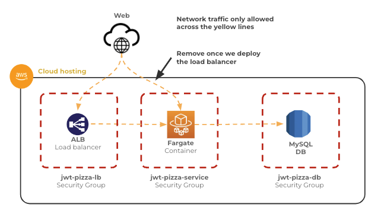
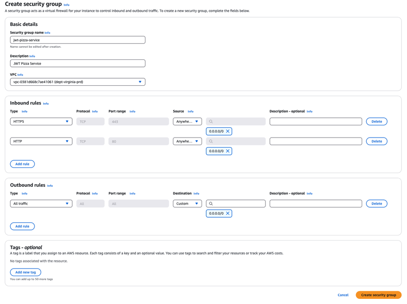
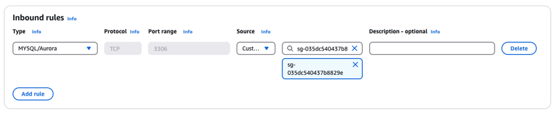
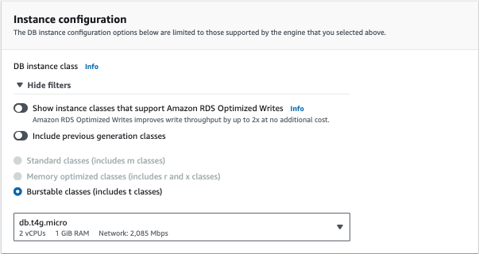
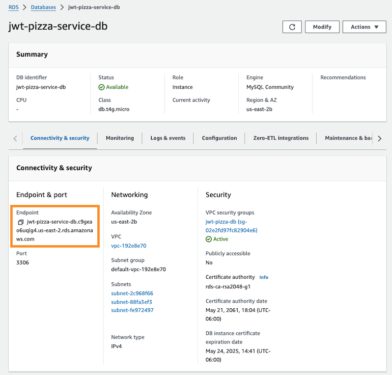

# AWS RDS MySQL

🔑 **Key points**

- AWS RDS provides managed database support, handling maintenance and backups.
- Security groups act as virtual firewalls to protect database access.
- Credentials must be stored securely using environment variables or secrets.
- Deploying an RDS MySQL instance is a core step for the JWT Pizza Service infrastructure.

---

Cloud deployment allows you to leverage scalable database services that can dynamically increase storage and computing capacity as your user base grows. For the JWT Pizza service, you will use the AWS Relational Database Service (RDS) MySQL implementation.

AWS RDS manages configuration, backups, monitoring, and restoration for you. Additionally, you can adjust the size of your database server with just a few clicks. This allows you to reduce costs during low-demand periods and scale up as your customer traffic increases.

> [!IMPORTANT]
>
> Ensure you are using the `us-east-1` (N. Virginia) AWS region for all work in this course.

## Creating VPC security groups

Before creating your database instance, you must define the security groups that control network traffic. You will define two groups:

1. **jwt-pizza-service**: A group for the application service.
2. **jwt-pizza-db**: A group for the database that only allows traffic from the application service.

Initially, the `jwt-pizza-service` group will allow public traffic. Once a load balancer is deployed later in the course, you will restrict this group further.



### Create the Pizza Service security group

1. Open the AWS Management Console and navigate to the **VPC** service.
1. Select **Security groups** from the left navigation panel.
1. Click **Create security group**.
1. **Security group name**: `jwt-pizza-service`.
1. **Description**: `JWT Pizza Service`.
1. Under **Inbound rules**, click **Add rule**:
   1. **Type**: `HTTPS`. This auto-populates port 443. Set **Source** to `Anywhere-IPv4` (`0.0.0.0/0`).
   1. **Type**: `HTTP`. This auto-populates port 80. Set **Source** to `Anywhere-IPv4` (`0.0.0.0/0`).

   

1. **Do not delete the default Outbound rules**.
1. Click **Create security group**.

### Create the database security group

1. Return to the **Security groups** page in the VPC service.
1. Click **Create security group**.
1. **Security group name**: `jwt-pizza-db`.
1. **Description**: `JWT Pizza Service Database`.
1. Under **Inbound rules**, click **Add rule**:
   1. **Type**: `MySQL/Aurora`. This auto-populates port 3306.
   1. **Source**: Select the `jwt-pizza-service` security group you just created. As you type `jwt-pizza-service` in the source box, the console should suggest the corresponding Security Group ID.

   

1. **Do not delete the default Outbound rules**.
1. Click **Create security group**.

## Creating a MySQL instance

With the network security configured, you can now provision the MySQL server instance.

1. Open the AWS Management Console and navigate to the **RDS** service.
1. Click **Create database**.
1. Choose **Standard create**.
1. **Engine options**: Select `MySQL`.
1. **Templates**: Choose `Free tier`. (If Free tier is unavailable, select `Dev/Test`).
1. **Settings**:
   1. **DB instance identifier**: `jwt-pizza-service-db`.
   1. **Master username**: `admin`.
   1. **Credentials management**: Select `Self managed`.
   1. **Master password**: Specify a strong password.

      ⚠️ **Warning:** Avoid using special characters (like `@`, `:`, or `/`) in your password. Since this password is often passed within a URL connection string, certain punctuation marks can cause the connection to fail. It is safest to use alphanumeric characters.

1. **Instance configuration**:
   1. Ensure **Burstable classes** is selected.
   1. Select `db.t4g.micro` (or the current free-tier eligible equivalent).

      

1. **Connectivity**:
   1. **Public access**: Select **No**.
   1. **VPC security group**: Select **Choose existing**.
      1. Select the `jwt-pizza-db` security group.
      1. Remove the `default` security group.
   1. **Availability Zone**: Select any available zone (e.g., `us-east-1a`).
1. Click **Create database**.

The database may take several minutes to provision. Once the status is **Available**, click on the instance name and copy the **Endpoint**. You will use this as your DB hostname.



## Securing your database

While the database is now deployed, you must address two requirements before the JWT Pizza Service can use it: establishing network connectivity and managing credentials.

Security is often a trade-off between convenience and protection. DevOps automation helps bridge this gap by handling security requirements without manual overhead.

### Private network access

By keeping the database on a private network (Public access: No), you protect high-value user data from direct internet exposure. The JWT Pizza Service will be able to reach the database because you configured the `jwt-pizza-db` security group to explicitly allow traffic from the `jwt-pizza-service` security group.

### DB credentials

To provide credentials to the application securely, you will store them as **GitHub Actions secrets**. During the CI/CD workflow, these secrets will be injected into the service's environment variables.

Update your GitHub repository secrets with the following values:

| Secret      | Description                                         | Example                                               |
| ----------- | --------------------------------------------------- | ----------------------------------------------------- |
| DB_HOSTNAME | The production endpoint for the database            | jwt-pizza-service-db.xxxx.us-east-1.rds.amazonaws.com |
| DB_USERNAME | The production username for the database            | admin                                                 |
| DB_PASSWORD | The production password used to access the database | your-alphanumeric-password                            |

## ☑ Exercise

Deploy a MySQL server in your AWS account following the steps outlined above:

1. Create the application and database security groups.
2. Provision the MySQL RDS instance within the `jwt-pizza-db` security group.
3. Add the database endpoint, username, and password to your `jwt-pizza-service` GitHub Actions secrets.

```masteryls
{"id":"b365b915-dbff-4687-aa7b-ce69a074d77a", "title":"MySQL RDS", "type":"file-submission", "gradingCriteria":"AWS RDS running MySql"  }
Submit a screenshot of your MySQL database running on AWS RDS.
```
