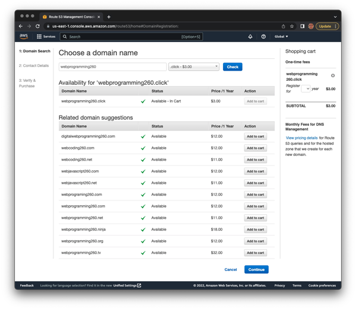
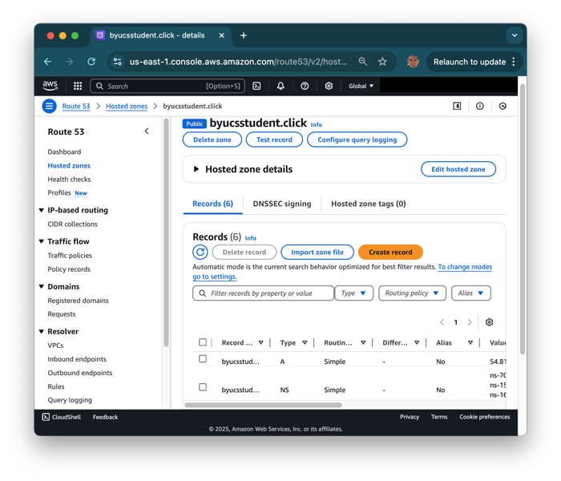
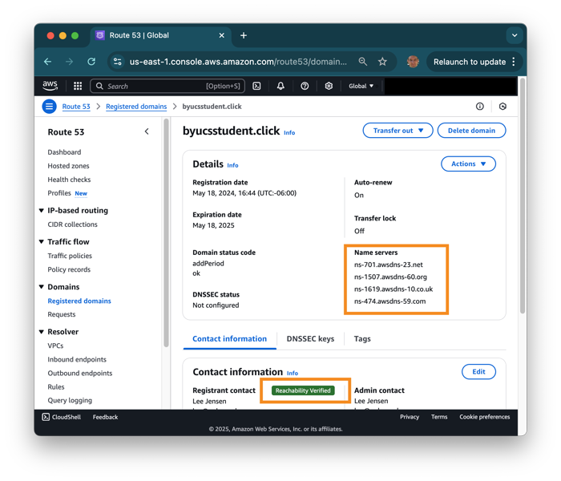
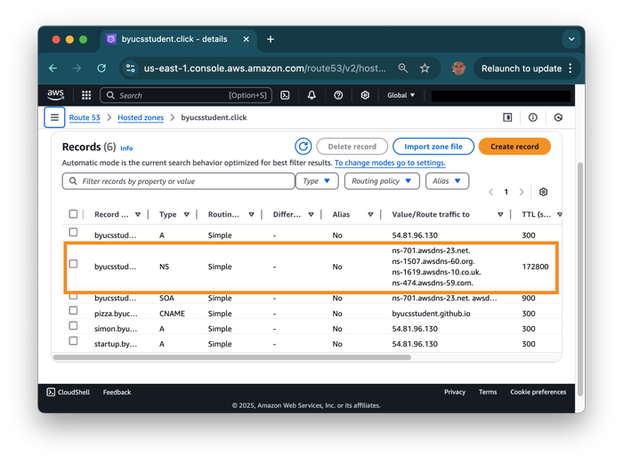
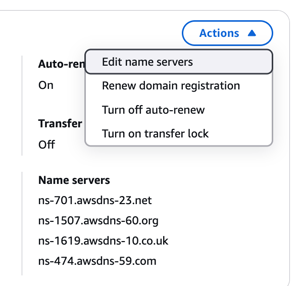

# AWS Route 53

In order to deploy JWT Pizza you will need to lease a DNS domain name. You will use your domain name when you deploy JWT Pizza frontend to GitHub Pages and AWS CloudFront, and also when you deploy the backend using an AWS EC2 loadbalancer. If you already own a domain name, and can configure the DNS records associated with your domain name then you can skip this instruction. `Route 53` is the AWS service that handles everything DNS-related. With Route 53 you can buy a domain name and create DNS records.

> [!IMPORTANT]
>
> You will need an account with AWS in order to use Route 53. If you haven't done that work, go create your account and server following the previous instruction.

## Purchasing a domain name

AWS provides extensive documentation for all their services. You can find the documentation for [registering a new domain](https://docs.aws.amazon.com/Route53/latest/DeveloperGuide/domain-register.html) on their website. You may find the simplified directions below easier to follow, but if you run into trouble, or have additional questions, refer to the official documentation. Remember that you are leasing a domain name for a year, and so make sure it is a name that you would like. Also note that AWS credits do not apply to purchase of domain names.

> [!IMPORTANT]
>
> If you are using new contact information that a registrar has never seen before, it will require you to verify the email address. Usually this means you will receive an email that you must respond to within 15 days. If you fail to do this your domain name will be removed from the registry without warning. Check your spam folder if you do not receive this email.

1. Open the AWS console in your browser and log in.
1. Navigate to the `Route 53` service.
1. Select the `Domains > Registered domains` option from the menu on the left.
1. Push the `Register Domains` option.
1. Select the TLD that you want. AWS currently offers the `.click` TLD for $3 and `.link` for $5.
1. Put your desired root domain into the search box and press the `Check` button to see if it is available. Common one or two word phrases are almost always taken. For example, `260.click` is taken, but `webprogramming260.click` is not. Keep searching until you find one you like.
1. Press `Add to cart`.

   

1. Fill out the contact details. This information is sent to the authorized DNS registrar and is what shows up to the world for your domain name. Once registration is complete you can see this information using the console program `whois`. Make sure you fill in this information correctly. Providing false information may cause the registrar to revoke your registration.
1. Press `Continue`.
1. Review everything and press `Complete Order`

## Hosted zone

> [!NOTE]
>
> If you have already leased a domain name, but for some reason do not have a hosted zone in Route 53, you will need to create one. See the instruction below for the details.

It may take a while before your purchase is completed, but when it is, the Route 53 service dashboard will show that you have a `hosted zone` for your domain name. You will use the `hosted zone` to modify your DNS records in order to expose your JWT Pizza to the world.



You don't need to worry about creating DNS records right now, but you will do that when you host your front and backend code later in the instruction.

## What to do if your domain name doesn't work

There are lots of possible reasons why your domain name is not working. The following are the most common reasons. Make sure you don't have multiple hosted zones. You pay $0.50 a month for each one.

### You didn't verify

If you didn't get an email asking you to verify your information then you need to go and look in your spam folder. Your domain name on the registrar's DNS servers may block your records until you have verified. You can check your status by looking at your domain name in Route 53. If it displays `Reachability verified`, as shown below, then you are good to go.



### You don't have a hosted zone

If for some reason you don't have a hosted zone then you need to created one. Go to the hosted zone functionality on the Route 53 dashboard and create one for your domain name.

### Your name servers don't match

You need to make sure that the name servers defined in your hosted zone `NS` record match the name servers defined for your registered domain. In the example below, you can see the NS record values for the name servers. These should match the ones found in your registered domain as shown in the above image.



If the values do not match, then copy the values from the hosted zone into your registered domain by clicking on the Actions button and selecting `Edit name servers`.



It will take a while for the new values to propagate, but when they are done y[AWS Route 53](awsRoute53/awsRoute53.md)ou can verify the values associated with your DNS records using `nslookup` to see what the Host zone has, and `whois` to see what the DNS registrar has.

```sh
> nslookup -type=ns byucsstudent.click

byucsstudent.click nameserver = ns-701.awsdns-23.net.
byucsstudent.click nameserver = ns-1507.awsdns-60.org.
byucsstudent.click nameserver = ns-474.awsdns-59.com.
byucsstudent.click nameserver = ns-1619.awsdns-10.co.uk.
```

```sh
> whois byucsstudent.click

Name Server: NS-701.AWSDNS-23.NET
Name Server: NS-1507.AWSDNS-60.ORG
Name Server: NS-1619.AWSDNS-10.CO.UK
Name Server: NS-474.AWSDNS-59.COM
```
