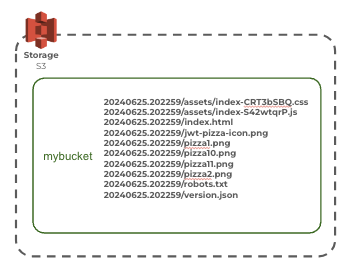
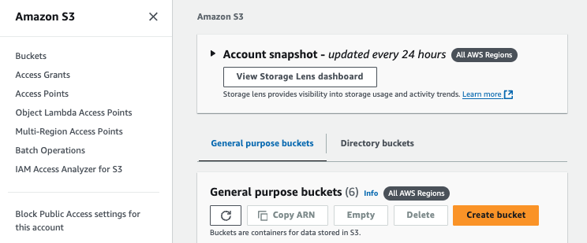
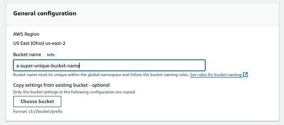
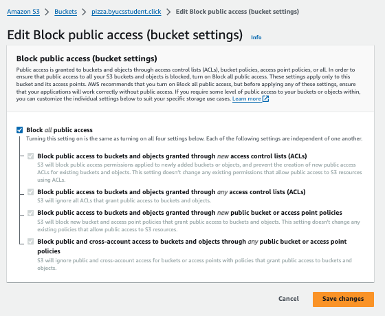
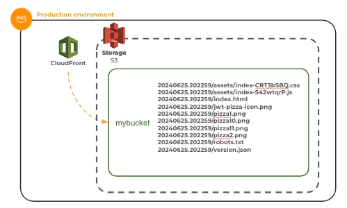
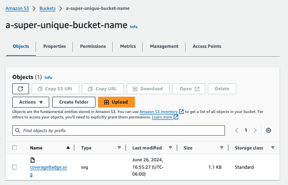

# AWS S3

🔑 **Key points**

- AWS S3 is a high performance, scalable, object store.
- S3 is structured with a bucket that contains objects.
- There is a powerful permission model that controls access to a bucket.
- You can use the AWS CLI or browser interface to manipulate a bucket.

---

One of the earliest services provided by Amazon Web Services was an object storage service named S3 (Simple Storage Service). S3 is a scalable, high-speed, web-based cloud storage service designed for online backup and archiving of data. S3 provides access through a web service interface, allowing users to store and retrieve any amount of data from anywhere on the web.

S3 provides high durability and availability, security features such as encryption and access controls, scalability to handle large volumes of data, cost-effectiveness, and integration with a wide range of AWS services and third-party tools. All of these reasons make it a good choice for your production deployment of the JWT Pizza static frontend.



At a basic level S3 is just a global list of bucket names that each contain a potentially very large number of named objects. There is no directory structure like you might expect in a file system. However, S3 honors a naming convention that mimics much of the structure you would expect. For example, if you name an object:

```txt
20240623.002941/assets/index-BwtN1-bI.css
```

It doesn't actually have a directory structure or path, but objects with the same prefix will appear to be associated. Additionally, the `/` character is treated as special by many tools. This allows them to display and navigate them as directories, when in reality it is just another character in the name.

## Getting started with S3

The easiest way to get started using AWS S3 is to use the AWS browser console for the S3 service. Once you have opened the AWS browser console, use it to navigate to the [S3 service](https://console.aws.amazon.com/s3/buckets) by entering `S3` into the search bar. You then create a bucket by pressing the **Create bucket** button.



Buckets are identified by a globally unique name that you provide. That means you have to pick a name for your bucket that no one else has ever used. Commonly your companies name or website hostname is used a prefix for your bucket names.



By default, all S3 buckets are private and the objects they contain can only be accessed by entities that you give permission. Generally you want to keep this default restriction so that you don't accidentally allow public access to files that you meant to keep private. You can always give access to specific files, or allow other AWS services to access your bucket files later. You will do this when you publicly expose your frontend application files later in the course.



## S3 and JWT Pizza

You are going to use S3 to statically host the JWT Pizza static frontend code that you are currently hosting with GitHub Pages. You can actually host a static website directly from S3 and even associate your DNS hostname with a bucket that serves the files over HTTPS. However, we want to take advantage of the AWS CloudFront service's ability to act as a content delivery network (CDN) for JWT Pizza, and so you will keep the bucket private and just give CloudFront rights to access the bucket.



## ☑ Exercise

Create an S3 bucket and copy a file into the bucket.

1. Open the AWS browser console and navigate to the [S3 service](https://console.aws.amazon.com/s3/buckets).
1. Click on the `Create bucket` button.
1. Select the `General configuration` option and name it something unique. Remember that the bucket namespace is global, and so you cannot use a name that already is in use.
1. Leave all the other settings with their default, including _Block all public access_. Press the `Create bucket` button.
1. Click on the newly created bucket to open it up.
1. Drag a file from your development environment and drop it on the `Upload` target.
1. Press the `Upload` button and then press the `Close` button to return to the bucket view.

Your bucket should look something like the following.



Once you are done you can go ahead and delete all the files in the bucket and then delete the bucket itself.
