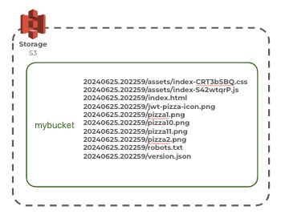
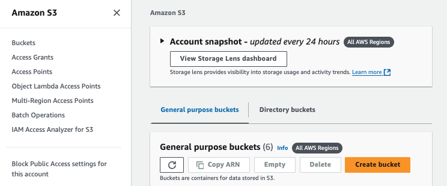
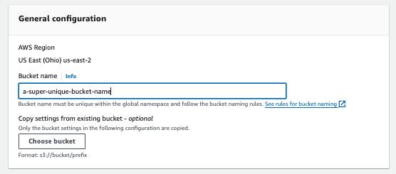
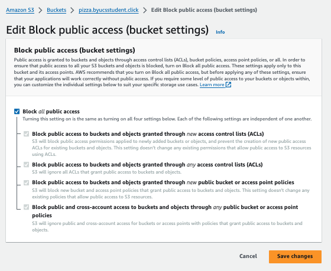
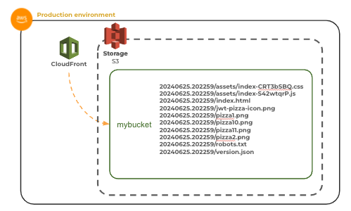
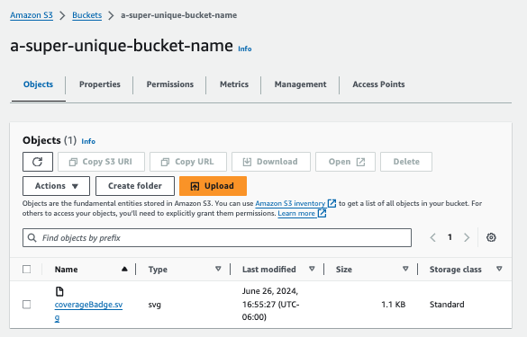

# AWS S3

🔑 **Key points**

- AWS S3 is a high-performance, scalable object storage service.
- S3 is organized into **buckets** that contain **objects**.
- A granular permission model controls access to buckets and their contents.
- You can manage S3 using the AWS Management Console, AWS CLI, or AWS SDKs.

---

Launched in 2006, Amazon Simple Storage Service (S3) was the first publicly available service from Amazon Web Services. S3 is a scalable, high-speed, cloud-based object storage service designed for data storage, backup, and archiving. S3 provides a web service interface that allows users to store and retrieve any amount of data from anywhere on the web.

S3 provides high durability and availability, robust security features (such as encryption and access controls), and seamless integration with other AWS services. These features make it an ideal choice for the production deployment of the JWT Pizza static frontend.



At its core, S3 is a global namespace of bucket names. Unlike a traditional file system, S3 does not use a hierarchical directory structure; it is a flat storage system where each object is identified by a unique "key." However, S3 supports naming conventions that mimic a folder structure. For example, if you name an object:

```txt
20240623.002941/assets/index-BwtN1-bI.css
```

While the object doesn't actually reside in a directory, the `/` character acts as a delimiter. This allows tools and the AWS Console to display and navigate objects as if they were in folders, even though the "path" is simply part of the object's name.

## Getting started with S3

The easiest way to begin using AWS S3 is through the AWS Management Console. Once logged in, navigate to the [S3 service](https://console.aws.amazon.com/s3/buckets) by searching for "S3" in the search bar. You can then create a bucket by clicking the **Create bucket** button.



Buckets are identified by a globally unique name. Because the namespace is shared by all AWS users, you must choose a name that no one else has used. It is common practice to use your company name or website hostname as a prefix for your bucket names to ensure uniqueness.



By default, all S3 buckets are private. Only the owner or entities explicitly granted permission can access the objects within. It is a security best practice to keep the "Block all public access" setting enabled to prevent accidental exposure of sensitive data. You can grant specific access to other AWS services or users later.



## S3 and JWT Pizza

You will use S3 to host the JWT Pizza static frontend code, which is currently hosted on GitHub Pages. While S3 can host a static website directly, we will use AWS CloudFront to act as a Content Delivery Network (CDN). In this architecture, the S3 bucket remains private, and CloudFront is granted exclusive rights to access the bucket and serve the files to users over HTTPS.



## ☑ Exercise

Create an S3 bucket and upload a file.

1. Open the AWS Management Console and navigate to the [S3 service](https://console.aws.amazon.com/s3/buckets).
1. Click the **Create bucket** button.
1. Under **General configuration**, enter a unique bucket name. Remember that the bucket namespace is global; if a name is taken, you must choose another.
1. Leave all other settings at their defaults, including **Block all public access**. Click **Create bucket**.
1. Click on the name of your newly created bucket to open it.
1. Drag a file from your computer and drop it into the **Upload** interface.
1. Click the **Upload** button, then click **Close** to return to the bucket object list.

Your bucket should now display the uploaded file.



Once you have confirmed the upload, you may delete the file and the bucket to avoid unnecessary storage.


```masteryls
{"id":"b990215b-883b-4473-9f25-71ff502c971a", "title":"S3 Bucket", "type":"multiple-choice" }
I was able to use S3 to:

- [x] Create a bucket and upload a file
- [ ] Access the S3 service dashboard, but not create a bucket or upload a file
- [ ] Unable to work on this exercise
```
