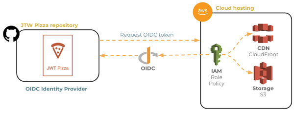
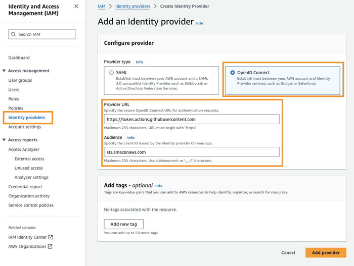
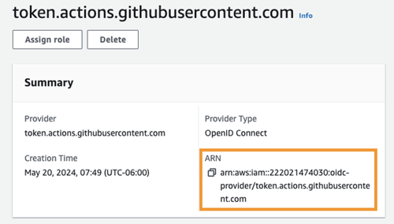
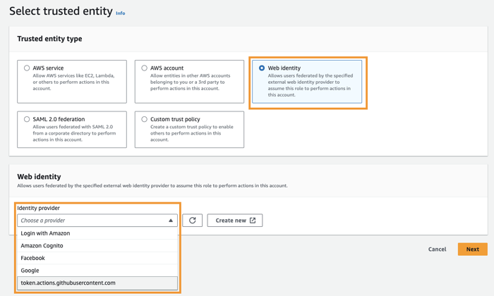
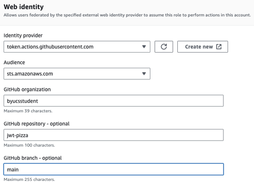
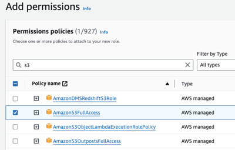
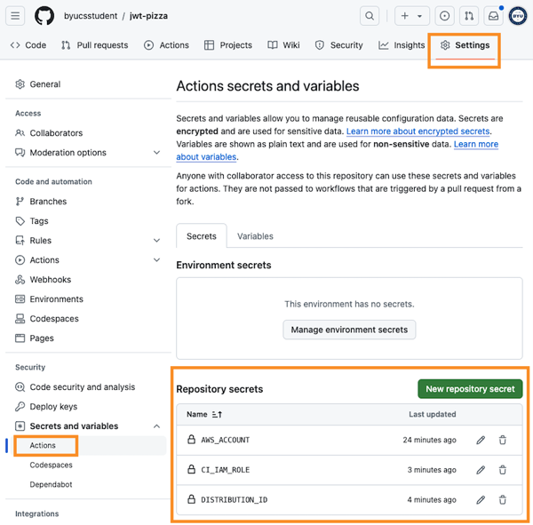
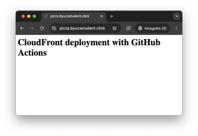

# AWS S3 Deployment

🔑 **Key points**

- You must authorize GitHub to access your AWS account.
- You can use a GitHub Actions workflow to execute AWS CLI commands.
- You will create a workflow that builds your project and uploads files to your S3 bucket.

---

To use Continuous Integration (CI) to deploy static frontend content to S3, you must create a trust relationship between GitHub and AWS. This is done using the OpenID Connect (OIDC) protocol to dynamically obtain an authentication token whenever you call S3 endpoints. Using OIDC to authenticate with AWS eliminates the need to store long-lived AWS credentials (like Access Keys) in your CI pipeline.



> [!IMPORTANT]
>
> Ensure you are using the `us-east-1` AWS region for all your work in this course.

### Setting up OpenID Connect (OIDC)

You establish a trust relationship between GitHub and AWS by configuring AWS to use GitHub as an OIDC identity provider, associating that identity with an AWS IAM role that allows S3 access, and configuring a GitHub Actions workflow to use that role.

### Create an OIDC identity provider for GitHub

First, you need to set up AWS to recognize GitHub as a trusted OIDC provider.

1. Open the **AWS IAM** service console.
1. Choose **Identity providers** from the left sidebar.
1. Click **Add provider**.
1. Select the provider type **OpenID Connect**.

   

1. Enter the following details:
   1. **Provider URL**: `https://token.actions.githubusercontent.com`
   1. **Audience**: `sts.amazonaws.com`
1. Click **Get thumbprint** to verify the provider URL.
1. Click **Add provider**.
1. Click on the newly created identity provider in the list to display its properties.

   

1. Note the **Provider ARN**; you will reference this when you create the IAM role.

### Create the IAM policy

To follow the principle of least privilege, you must create an IAM policy that only provides the permissions necessary to update your S3 bucket and invalidate CloudFront cache files.

1. In the IAM console, choose **Policies**.
1. Click **Create policy**.
1. Select the **JSON** tab to define the policy.
1. Paste the following JSON, replacing the placeholders with your specific resource IDs:

```json
{
  "Version": "2012-10-17",
  "Statement": [
    {
      "Sid": "ListObjectsInBucket",
      "Effect": "Allow",
      "Action": ["s3:ListBucket"],
      "Resource": ["arn:aws:s3:::BUCKET_NAME_HERE"]
    },
    {
      "Sid": "UpdateS3Bucket",
      "Effect": "Allow",
      "Action": ["s3:*Object"],
      "Resource": ["arn:aws:s3:::BUCKET_NAME_HERE/*"]
    },
    {
      "Sid": "InvalidateCloudFront",
      "Effect": "Allow",
      "Action": ["cloudfront:CreateInvalidation"],
      "Resource": ["arn:aws:cloudfront::AWS_ACCOUNT_HERE:distribution/DISTRIBUTION_HERE"]
    }
  ]
}
```

1. Replace `BUCKET_NAME_HERE` with your S3 bucket name (e.g., `pizza.yourhostname`).
1. Replace `AWS_ACCOUNT_HERE` with your 12-digit AWS account ID.
1. Replace `DISTRIBUTION_HERE` with your CloudFront distribution ID (e.g., `F3A3ZL6IF7XCE1`).
1. Click **Next**.
1. Name the policy `jwt-pizza-ci-deployment`.
1. Click **Create policy**.

### Create the IAM role

Now, create the IAM role that GitHub Actions will assume.

1. In the IAM console, choose **Roles**.
1. Click **Create role**.
1. Select **Web identity**.
1. Select the identity provider you created for GitHub.

   

1. Select `sts.amazonaws.com` from the **Audience** dropdown.
1. Enter your **GitHub organization** (your GitHub username).
1. Enter the **GitHub repository** name for your fork of the `jwt-pizza` repository.
1. Enter `main` for the **GitHub branch**.

   

1. Click **Next**.
1. Under **Permissions policies**, search for and select the policy you just created (`jwt-pizza-ci-deployment`).

   

1. Click **Next**.
1. Name the role `github-ci`.
1. Click **Create role**.

### Configure GitHub Actions

The final step is to create a GitHub Actions workflow that deploys to S3 using the OIDC credentials.

#### Storing secrets

Since your repository is public, you must hide sensitive information like your AWS Account ID and resource names. Use [GitHub Repository Secrets](https://docs.github.com/en/actions/security-guides/using-secrets-in-github-actions) to store these values.



Create the following secrets in your GitHub repository settings (**Settings > Secrets and variables > Actions**):

| Secret          | Description                                                 | Example              |
| --------------- | ----------------------------------------------------------- | -------------------- |
| AWS_ACCOUNT     | Your 12-digit AWS account ID                                | 123456789012         |
| CI_IAM_ROLE     | The name of the IAM role you created                        | github-ci            |
| APP_BUCKET      | The S3 bucket name hosting your frontend                    | pizza.yourname.click |
| DISTRIBUTION_ID | The CloudFront Distribution ID                              | F3GRFXFEBQ8EEU       |

#### Create the workflow

1. In your local repository, create a directory named `.github/workflows` if it doesn't already exist.
1. Create a new file named `testS3Deploy.yml` in that directory.
1. Paste the following configuration into the file:

   ```yml
   name: Test S3 Deploy

   on:
     push:
       branches:
         - main
     workflow_dispatch:

   permissions:
     id-token: write # Required for requesting the JWT
     contents: read  # Required for actions/checkout

   jobs:
     deploy-s3:
       runs-on: ubuntu-latest
       steps:
         - name: Checkout repository
           uses: actions/checkout@v4

         - name: Create OIDC token to AWS
           uses: aws-actions/configure-aws-credentials@v4
           with:
             audience: sts.amazonaws.com
             aws-region: us-east-1
             role-to-assume: arn:aws:iam::${{ secrets.AWS_ACCOUNT }}:role/${{ secrets.CI_IAM_ROLE }}

         - name: Push to AWS S3
           run: |
             mkdir dist
             printf "<h1>CloudFront deployment with GitHub Actions</h1>" > dist/index.html
             aws s3 cp dist s3://${{ secrets.APP_BUCKET }} --recursive
             aws cloudfront create-invalidation --distribution-id ${{ secrets.DISTRIBUTION_ID }} --paths "/*"
   ```

1. Save the file, commit it, and push it to GitHub.

### How it works

The workflow uses the `aws-actions/configure-aws-credentials` action to request a temporary token from AWS using OIDC:

```yml
- name: Create OIDC token to AWS
  uses: aws-actions/configure-aws-credentials@v4
  with:
    audience: sts.amazonaws.com
    aws-region: us-east-1
    role-to-assume: arn:aws:iam::${{ secrets.AWS_ACCOUNT }}:role/${{ secrets.CI_IAM_ROLE }}
```

Once authorized, the workflow can execute AWS CLI commands permitted by the IAM role. It copies the `dist` directory contents to S3 and triggers a CloudFront invalidation. Invalidation is necessary because CloudFront caches your files; without it, updates would not appear until the cache expires (typically 24 hours).

```yml
aws s3 cp dist s3://${{ secrets.APP_BUCKET }} --recursive
aws cloudfront create-invalidation --distribution-id ${{ secrets.DISTRIBUTION_ID }} --paths "/*"
```

## Result

After the workflow runs successfully, visit your website URL. You should see the updated `index.html` page.



Once you have confirmed the deployment works, you can disable or delete this test workflow. You will implement a similar deployment process for the actual JWT Pizza frontend code in a later assignment.