# Burp Suite

🔑 **Key points**

- Burp Suite automates penetration testing.
- Execute a brute force password attack against JWT Pizza.

---


Burp Suite is a software security application, created by Port Swigger, that accelerates and automates penetration testing.

Burp Suite comes in a free community version and a paid enterprise edition. The main difference between the two is that the community version throttles the execution of some penetration tools, and the enterprise edition comes with a large library of pre-configured attacks.

Burp Suite is an incredibly powerful tool and is a foundational piece for most penetration testing efforts. Fully covering all the features of Burp Suite is beyond the scope of this course, but we will cover the basics of its functionality.

> [!NOTE]
>
> Any of the tools that you use for penetration testing must **not** be executed against an application without the explicit permission of the owner of the application.

## Functionality

Much of what you need to conduct penetration testing can be accomplished using programs such as your browser's dev tools, Curl, Postman, or some custom code. However, Burp Suite brings all the functionality of these tools into a single place and is optimized for automation.

The following is a list of the penetration tools provided with Burp Suite.

- **Proxy**: Intercepts, records, and inspects web traffic between the browser and the server.
- **Scanner**: Automatically scans web applications for vulnerabilities.
- **Intruder**: Performs automated attacks to identify vulnerabilities like SQL injection, cross-site scripting (XSS), and brute force attacks.
- **Repeater**: Allows manual testing by replaying individual HTTP requests.
- **Sequencer**: Analyzes the randomness of session tokens.
- **Decoder**: Decodes and encodes data in various formats.
- **Comparer**: Compares HTTP responses.
- **Extender**: Allows the integration of third-party extensions to enhance functionality.

## Getting started

To get started, you need to [install](https://portswigger.net/burp/communitydownload) Burp Suite from the Port Swigger website. When you first open the application you will see the project selection dialog. You are given the option to create a project on disk that you will work on over time, or you can create a temporary project in memory so that you can play around and then discard your work. In order to just get familiar with Burp Suite you should just create a temporary project and start Burp with the default configuration.

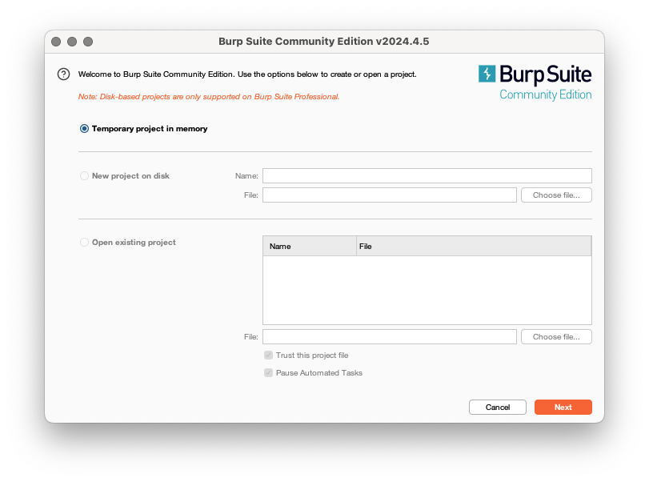

Next you will see the default workspace with all the tools listed across the top of the application. We will walk through some tools beginning with the **Proxy** tool.

## Proxy and Target

The Proxy tool allows you to intercept and record requests made from the browser. The Target tool organizes the structure and information into navigable structure.

Click on the **Proxy** tool from the top menu you will see the option to `Open browser` and begin intercepting requests. Press the `Open browser` button.

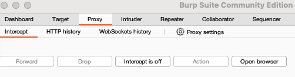

This will open a Chromium browser window. Type in the URL of your JWT Pizza website. This will create a secure connection to your website that is proxied through Burp Suite so that it can capture all the network traffic.

Toggle back to Burp Suite and click on the `HTTP history` tab under the `Proxy` tab of the main menu. This will show the requests that were made to render JWT Pizza. If you click on one of the requests you will see the HTTP request and response object.

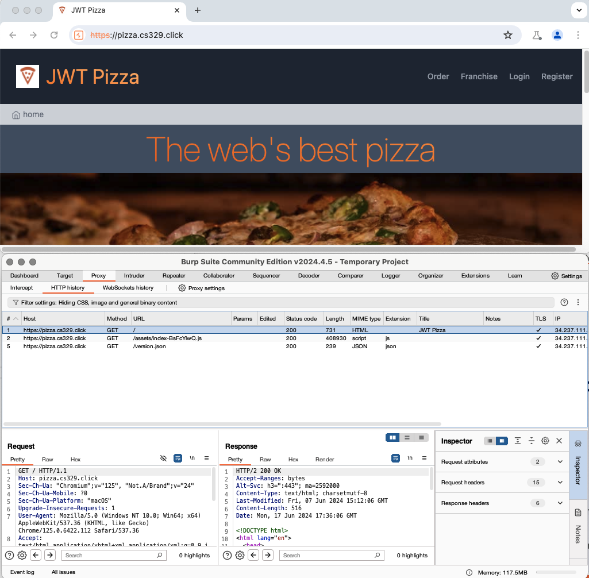

Now go and login, order a pizza, and verify the pizza using the proxied browser. This should generate a whole sequence of interesting requests. If you click on the `Target` tab it will display a `Site map` of all the requests that were made nicely displayed in a tree based on hostname and path.

Take some time and play around with all the data that is collected there.

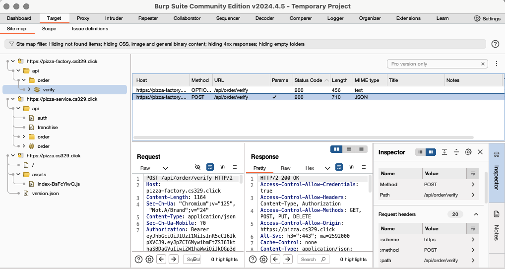

## Intruder

The Intruder tool makes it easy to automate variations of a request in order to explore responses and execute brute force attacks. For example, we can use the Intruder tool to brute force a password discovery attack.

You can populate an intruder request by selecting one of the requests from the Target or Proxy views. For example, from the Target view right-click on the login (_PUT /api/auth_) request and select the option to `Send to Intruder`.

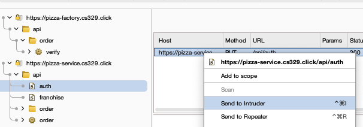

This will create an entry on the `Intruder` tab that you can parameterize in order to generate modified versions of the request.

In order to automate to brute force attack of the authentication request with a bunch of different passwords, we select the password displayed in the `Payload positions` input and press the `Add §` button. This will put the `§` characters around the portion of the request and make it an automation parameter.

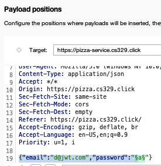

Now we can press on the `Payloads` tab and specify the values that will replace the password. Add a bunch of candidate passwords by using the `Add` input.

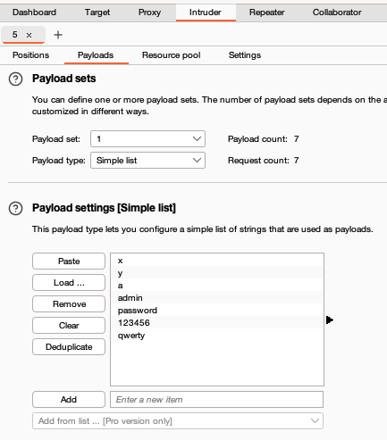

Press the `Attack` button. You will need to dismiss the warning about the Community Edition being throttled, but then it will display the results in a new window.

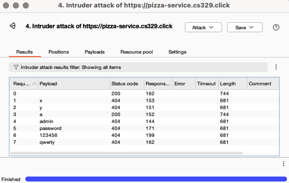

Notice that two of the requests returned a 200 status code. The first empty request, which defaults to the original request value and the injection of the `a` password.

The intruder tool provides for complex combinations of injections including multiple parameter permutations, concurrent executions, delays, and throttling based on response codes.

## Sequencer

The Sequencer tool executes the same request multiple times and automatically analyzes the randomness of the results. For example, we can determine the randomness of the authorization token to see if there is a pattern that we can exploit to generate our own authentication tokens.

You can populate a sequencer request by right-clicking on any request in the Target or Proxy view and selecting the `Send to Sequencer` option. If we select a login (_PUT /api/auth_) into the Sequencer, we can then press the `Custom location` configure button and select the portion of the request that we want the sequencer to analyze. This will generate an expression that uses regular expressions to select the desired token.

Next, we press the `Start live capture` button. This will begin the process of executing thousands of requests.

> [!NOTE]
>
> This will execute thousands or even tens of thousands of login requests. Depending on your backend service configuration this might cause scaling or additional payment charges. So be careful what you do here.

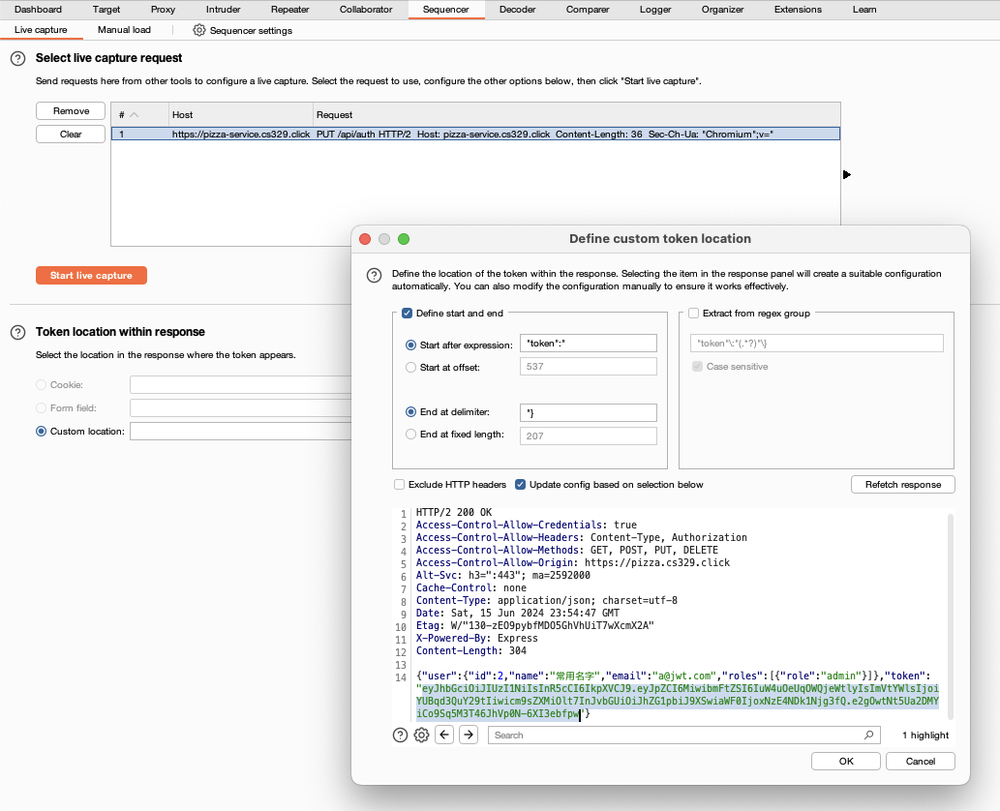

You can see partial results as the process continues by pressing the `Auto analyze` button. After a period of time the Sequencer will display the effective entropy of the analyzed token. In the case of the JWT Pizza token, which is a JWT, there is not much non-randomness there. It computes that 199 out of the 224 bits are completely random with a significance level of 1%.

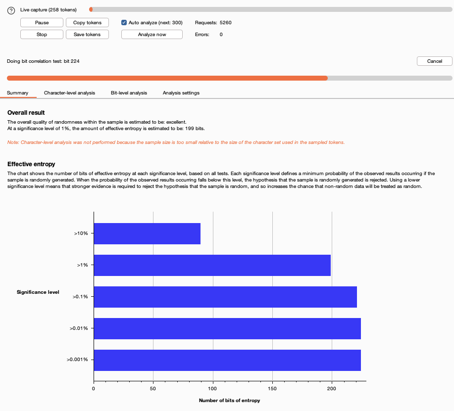

The following CloudWatch metrics show the JWT Pizza Service container CPU jumping to almost 80% due to this test.

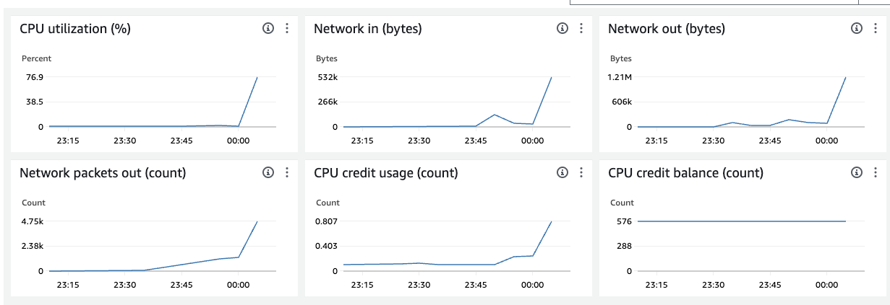

## Decoder

The decoder tool allows you to interactively decode and encode text from different formats.

It supports many formats including URL, HTML, Base64, Hex, and Gzip. You can also apply most of the major hash code operations.

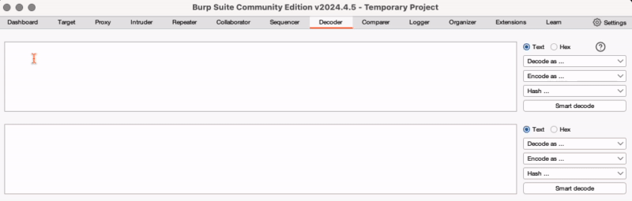

## Comparer

The Comparer tool allows you to add a number of requests or responses and then quickly compare them to see the differences. Here is the difference between an unsuccessful and successful login request.

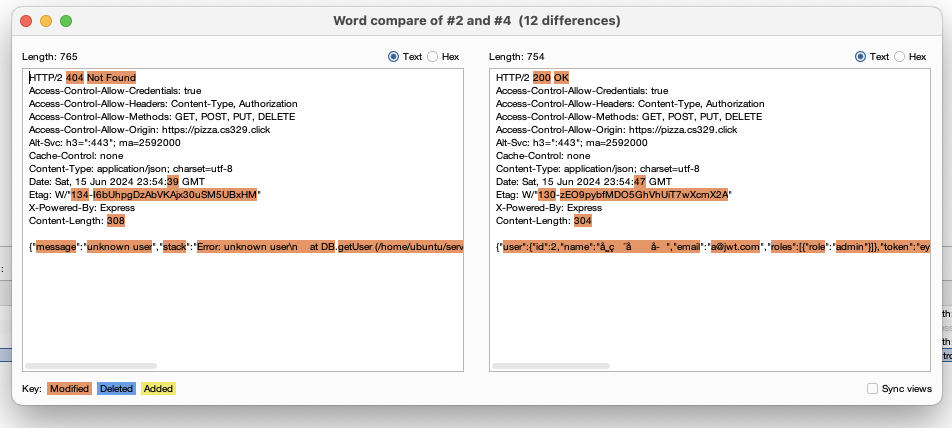

To use the comparer you can right-click on any request and select the `Save to Comparer` option. Then in the comparer tool, you click on the two items you want to compare, and the difference is displayed.

## Extensions

In addition to all the functionality that is built into Burp Suite there is a marketplace of third party extensions that you can install. To install an extension, select the `Extensions` top level navigation and then select the `BApp Store` tab.

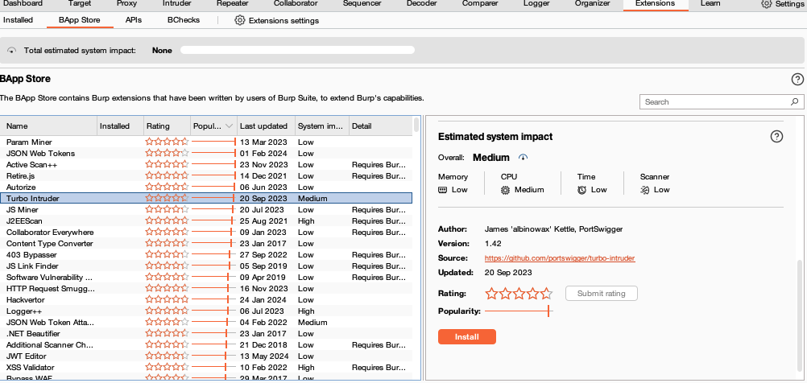

If you sort by **Popularity** you should get a good feel for what people are using.

### Turbo Intruder

One extension that you might experiment with is the `Turbo Intruder`. Since the community edition of Burp Suite throttles its ability to execute intrusions, you can get around this with the Turbo Intruder extension. Go ahead and install the extension from the BApp Store and try it out.

You add a request to the Turbo Intruder by right-clicking on it and selecting the `Extensions > Turbo Intruder > Send to turbo intruder` option.

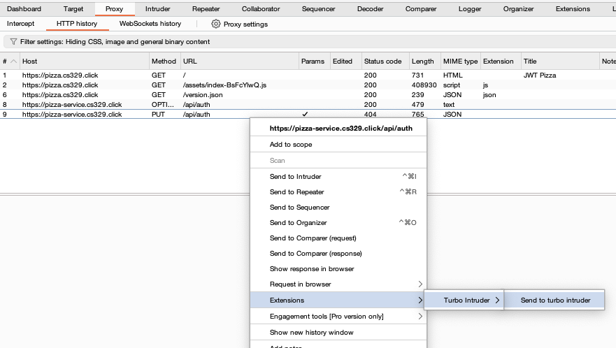

You will need to manually insert your parameter variables in the request to use `%s`. For example:

```
PUT /api/auth HTTP/2
Host: pizza-service.cs329.click
Content-Length: 40
Content-Type: application/json
Accept: */*
Origin: https://pizza.cs329.click

{"email":"admin@jwt.com","password":"%s"}
```

You then use Python to define how many concurrent connections you would like and queue requests.

```py
def queueRequests(target, wordlists):
    engine = RequestEngine(endpoint=target.endpoint,
                           concurrentConnections=5,
                           requestsPerConnection=100,
                           pipeline=False
                           )
    # Check all the words in the UNIX dictionary
    for word in open('/usr/share/dict/words'):
        engine.queue(target.req, word.rstrip())

# Success for any 200 response
def handleResponse(req, interesting):
    if '200 OK' in req.response:
        table.add(req)
```

Once you have the script just the way you would like you can press the `Attack` button at the bottom of the view.

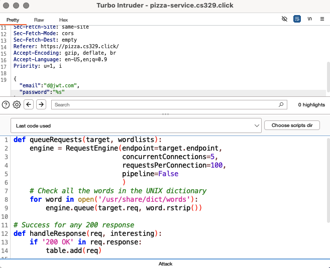

Almost immediately it will display a request that returned a status code of 200. The response is also displayed.

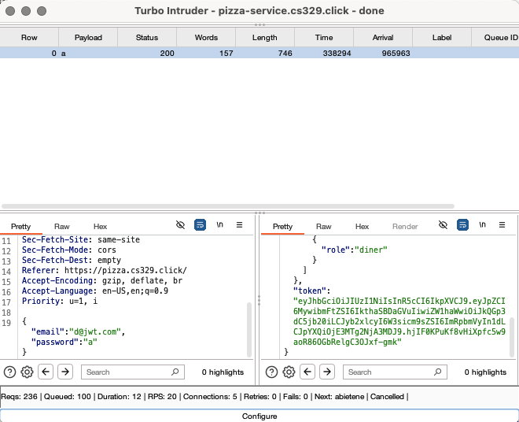

## Dastardly

In addition to Burp Suite, Port Swigger also provides a free security DAST (Dynamic Application Security Testing) tool that you can include in your CI workflow. Unlike static analysis tools, a DAST tool analyzes web applications for security vulnerabilities while they are running. This allows you to simulate the actions of a real-time attacker.

To include Dastardly in your GitHub action workflow, you only need to include a step that references Port Swigger's Dastardly GitHub Action component, and provide the name of the website you wish to examine.

```yml
steps:
  - name: Run Dastardly Action Step
    uses: PortSwigger/dastardly-github-action@main
    with:
      target-url: 'https://pizza.cs329.click'
```

```sh
Installing or running Dastardly affirms your agreement to the Terms of Service https://portswigger.net/burp/dastardly/eula

2024-06-14 22:45:07 INFO  dastardly.StartDastardly - Using Java version 21.0.3
2024-06-14 22:45:19 INFO  bsee.BurpProcess.scan.scan-1 - [Thread: 102] 2024-06-14 10:45:19.945 249172783174, net.portswigger.Zoe INFO - connectedSocket, opened new socket: 2013517612
2024-06-14 22:45:19 INFO  b.s.LoggingScanProgressCollector - 2024-06-14 22:45:15 INFORMATION - Running as super-user, browser sandbox is not supported
2024-06-14 22:45:19 INFO  b.s.LoggingScanProgressCollector - 2024-06-14 22:45:17 INFORMATION - Crawl started.
2024-06-14 22:45:19 INFO  b.s.LoggingScanProgressCollector - 2024-06-14 22:45:18 DEBUG - pizza.cs329.click is using HTTP/2
2024-06-14 22:45:24 INFO  bsee.BurpProcess.scan.scan-1 - 2024-06-14 10:45:24: CRAWLING -> crawlUniqueLocationsVisited:8, crawlRequestsMade:45, auditQueueItemsWaiting:0, auditQueueItemsCompleted:0, auditRequestsMade:0, insertionPointCount:0
2024-06-14 22:45:24 INFO  b.s.LoggingScanProgressCollector - 2024-06-14 22:45:20 DEBUG - pizza-service.cs329.click is using HTTP/2
2024-06-14 22:45:24 INFO  b.s.LoggingScanProgressCollector - 2024-06-14 22:45:24 DEBUG - images.unsplash.com is using HTTP/2
2024-06-14 22:46:50 INFO  bsee.BurpProcess.scan.scan-1 - 2024-06-14 10:46:50: Crawl finished
2024-06-14 22:46:50 INFO  bsee.BurpProcess.scan.scan-1 - 2024-06-14 10:46:50: Audit started
2024-06-14 22:46:54 INFO  bsee.BurpProcess.scan.scan-1 - 2024-06-14 10:46:54: AUDITING -> crawlUniqueLocationsVisited:23, crawlRequestsMade:548, auditQueueItemsWaiting:1, auditQueueItemsCompleted:5, auditRequestsMade:70, insertionPointCount:25
2024-06-14 22:46:54 INFO  b.s.LoggingScanProgressCollector - 2024-06-14 22:46:50 INFORMATION - Crawl finished.
2024-06-14 22:46:54 INFO  b.s.LoggingScanProgressCollector - 2024-06-14 22:46:50 INFORMATION - Audit started.
2024-06-14 22:46:54 INFO  b.s.IssueLoggingScanProgressCollector - Issue identified. Path: /robots.txt, Issue Type: Cross-origin resource sharing: arbitrary origin trusted, Severity: INFO
2024-06-14 22:46:54 INFO  b.s.IssueLoggingScanProgressCollector - Issue identified. Path: /robots.txt, Issue Type: Cross-origin resource sharing, Severity: INFO
2024-06-14 22:46:54 INFO  b.s.IssueLoggingScanProgressCollector - Issue identified. Path: /, Issue Type: Cross-origin resource sharing: arbitrary origin trusted, Severity: INFO
2024-06-14 22:46:54 INFO  b.s.IssueLoggingScanProgressCollector - Issue identified. Path: /, Issue Type: Cross-origin resource sharing, Severity: INFO
2024-06-14 22:46:54 INFO  b.s.IssueLoggingScanProgressCollector - Issue identified. Path: /assets/index-CRT3bSBQ.css, Issue Type: Cross-origin resource sharing: arbitrary origin trusted, Severity: INFO
2024-06-14 22:46:54 INFO  b.s.IssueLoggingScanProgressCollector - Issue identified. Path: /assets/index-CRT3bSBQ.css, Issue Type: Cross-origin resource sharing, Severity: INFO
2024-06-14 22:46:54 INFO  b.s.IssueLoggingScanProgressCollector - Issue identified. Path: /assets/index-BsFcYlwQ.js, Issue Type: Cross-origin resource sharing: arbitrary origin trusted, Severity: INFO
2024-06-14 22:46:54 INFO  b.s.IssueLoggingScanProgressCollector - Issue identified. Path: /assets/index-BsFcYlwQ.js, Issue Type: Cross-origin resource sharing, Severity: INFO
2024-06-14 22:46:54 INFO  b.s.IssueLoggingScanProgressCollector - Issue identified. Path: /jwt-pizza-icon.png, Issue Type: Cross-origin resource sharing: arbitrary origin trusted, Severity: INFO
2024-06-14 22:46:54 INFO  b.s.IssueLoggingScanProgressCollector - Issue identified. Path: /jwt-pizza-icon.png, Issue Type: Cross-origin resource sharing, Severity: INFO
2024-06-14 22:46:55 INFO  bsee.BurpProcess.scan.scan-1 - 2024-06-14 10:46:55: Audit finished
2024-06-14 22:46:59 INFO  bsee.BurpProcess.scan.scan-1 - 2024-06-14 10:46:59: SUCCEEDED -> crawlUniqueLocationsVisited:23, crawlRequestsMade:548, auditQueueItemsWaiting:0, auditQueueItemsCompleted:6, auditRequestsMade:70, insertionPointCount:25
2024-06-14 22:46:59 INFO  b.s.LoggingScanProgressCollector - Event log updated:
2024-06-14 22:46:59 INFO  b.s.LoggingScanProgressCollector - 2024-06-14 22:46:55 INFORMATION - Audit finished.
2024-06-14 22:46:59 INFO  b.s.IssueLoggingScanProgressCollector - Issue identified. Path: /version.json, Issue Type: Cross-origin resource sharing: arbitrary origin trusted, Severity: INFO
2024-06-14 22:46:59 INFO  b.s.IssueLoggingScanProgressCollector - Issue identified. Path: /version.json, Issue Type: Cross-origin resource sharing, Severity: INFO
2024-06-14 22:46:59 INFO  bsee.BurpProcess.scan.scan-1 - Received metric SUCCEEDED 70 23
2024-06-14 22:46:59 INFO  b.s.LoggingScanProgressCollector - Scan has completed successfully
```

This report looks pretty clean. There are a few warnings about CORS being too general for some resources, but nothing of significant concern.

## ☑ Exercise

Install Burp Suite and execute a brute force attack against your JWT Pizza website. See what you can discover about the website. Capture a screenshot of your Intruder execution result.

When you are done, it should look something like the following.


