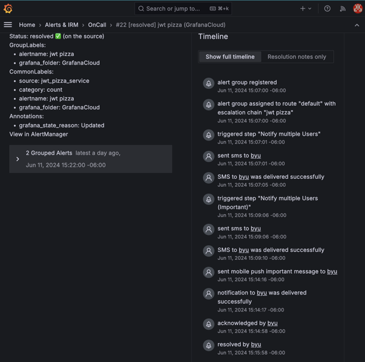

# Chaos testing

📖 **Deeper dive reading**: [Netflix's original post on Chaos testing](https://netflixtechblog.com/the-netflix-simian-army-16e57fbab116)

The idea of intentionally injecting failure into an environment, including the production environment, was popularized by Netflix. The logic is that you never want to have a single point of failure, and you can never be sure that your system won't fail unless you test it to failure. The motivation for Netflix to explore paradigms of testing came in 2010 when they moved their monolithic application out of their data center to a micro-service architecture hosted in AWS. AWS was an attractive prospect because they pioneered the idea of significant layers of redundancy for all critical resources, all within an on demand, or elastic, cloud environment. This included some of the following:

1. **Data center**: Multiple availability zones in every region, with multiple regions on every continent.
1. **Network**: Route 53 geo-location routing, different availability zone subnets, regional network failover, and load balancers.
1. **Compute**: Scale groups to automatically respond to changes in load. Efficient vertical (size of device) and horizontal (number of devices) scaling.
1. **Database**: Automatic backups, efficient restores, and scalability.
1. **Storage**: Massive scale and redundancy with efficient failover for writers and readers.

As Netflix moved their application to AWS they took advantage of all this redundancy and pushed all the boundaries in order to create a system that was unlikely to have a failure that would impact the customer. A key element of their testing was to introduce a controlled failure, monitor the automated response, and then improve the automation. This spawned a whole new field of testing called **Chaos testing**, which follows this pattern:

1. **Stabilize the application**: Make sure that the system is considered stable. Usually this means that you are not deploying new features during a chaos test and that there are no critical incidents currently being investigated.
1. **Hypothesize points of failure**: Theoretically probe the current state of the system. Look explicitly for single points of failure. Ask the questions:
   1. If component `X` fails, what will happen?
   1. Does it cause a cascade into other components?
   1. Does it have any redundancy?
   1. Does it have a fallback replacement?
   1. How quickly can it be repaired?
   1. Does it require a human or an automated response?
1. **Deploy metrics and logging**: Once you have a candidate for chaos testing, you need to document your assumptions for how the system will respond and ensure that you have metrics and logs that will immediately visualize and validate your assumptions. If you do not have the necessary observability, then you need to instrument the code before you continue.
1. **Ensure minimal customer impact**: The idea with chaos testing is to test the production system without harming the customer. If during the hypothesis phase there was any question that a customer would be reasonably impacted, then you need to first alter your code so that there is an automated mitigation for the impact.
1. **Inject chaos**: With the metrics and plan in place, you unleash the chaos. Initial tests should be done when the team is on duty and ready to response. Later tests can be done without preparation to validate any assumptions concerning manual interaction.
1. **Monitor the response**: Validate that the chaos was immediately observed and the automated response was completed as expected.
1. **Take evasive action or celebrate**: If things are not handled as expected then you must move quickly to correct the problem and reduce significant customer impact. Then you need to return to the drawing board, check where your assumptions went wrong, deploy new failure handling automation, and increase your observability. Otherwise, if the chaos was handled as expected then you can celebrate and repeat the cycle with the next prioritized point of failure on your list.

## Chaos Monkey

The system that Netflix build to inject chaos into the application is called the `Chaos Monkey`. There are different forms of monkeys that each focus on a type of possible failure. These include:

- **Chaos Monkey**: Randomly disables production resources.
- **Latency Monkey**: Artificially delay network or database responses.
- **Conformity Monkey**: Removes instances that don’t conform to required practices.
- **Doctor Monkey**: Checks metrics for signs of unhealthy components and removes them.
- **Janitor Monkey**: Cleans up and removes unused resources.
- **Security Monkey**: Scans for security violations and vulnerabilities and terminates offending instances.
- **10-18n Monkey**: Scans and reports usability violations.
- **Chaos Gorilla**: Simulates an entire Amazon availability zone outage.

## What about you?

Even if you never inject chaos into your production systems, the exercise of considering where the single points of failure are, and what the impact of those failures will be, is an important one. One of my favorite sayings is:

> A system that has never been tested to failure is a system that is going to fail.
>
> _Lee S Jensen, 2012_

It is always better to know what your system will do, rather than hope that it will turn out for the best when a failure happens.

At a minimum you should be conducting chaos testing in your staging and other non-customer facing environments. Once you are confident that those systems are handling chaos correctly, you might have the confidence to apply the chaos test to your production system.

## ☑ Assignment

Do the following:

1. Create an endpoint on your fork of the `jwt-pizza-service` code that can enable and disable chaos by causing one of your endpoints to always fail. Only allow an admin to execute the chaos endpoint.
1. Make sure you have metrics that will display the chaos.
1. Create an OnCall alert that will trigger based on chaos.
1. Deploy your JWT Pizza Service to production.
1. Simulate traffic to the service. (See the _Curl commands_ found [Logging deliverable](../deliverable8Logging/deliverable8Logging.md) for examples of how to do this.)
1. Trigger the chaos.
1. Wait for, acknowledge, and resolve the alert.

Go to the associated Canvas assignment and submit a screenshot of the OnCall alert history. This should look something like this:

