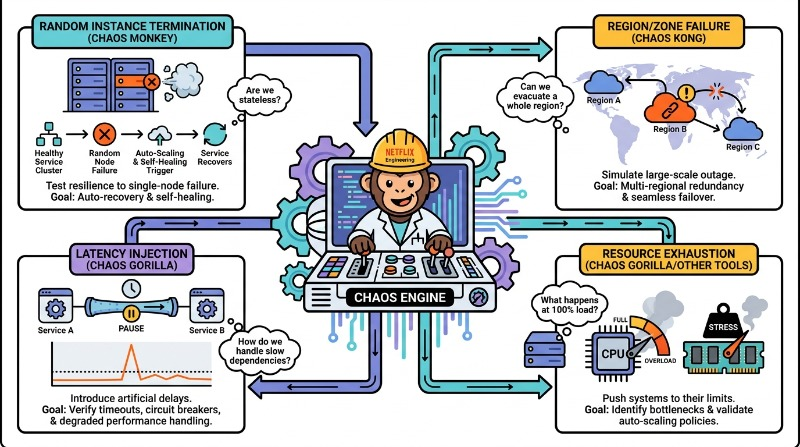
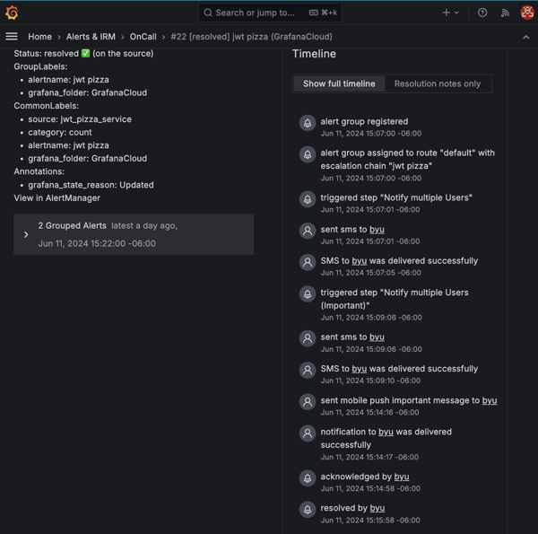

# Chaos testing

🔑 **Key points**

- You cannot truly know how a system will fail until you test it to failure.
- Inject chaos into the JWT Pizza service to validate your observability and alerting.

---

📖 **Deeper dive reading**: [Netflix's original post on Chaos testing](https://netflixtechblog.com/the-netflix-simian-army-16e57fbab116)

The practice of intentionally injecting failure into an environment—including production—was popularized by Netflix. Their philosophy is that you should never have a single point of failure, and you can never be certain your system is resilient unless you proactively test its breaking points. 



Netflix began exploring these testing paradigms in 2010 during their transition from a monolithic data center architecture to a microservices architecture hosted on AWS. AWS offered significant layers of redundancy for critical resources within an on-demand, elastic cloud environment. This included:

1. **Data center**: Multiple Availability Zones (AZs) in every region, with multiple regions across every continent.
1. **Network**: Route 53 geolocation routing, AZ-specific subnets, regional network failover, and load balancers.
1. **Compute**: Auto-scaling groups that respond to load changes, supporting both vertical scaling (increasing instance size) and horizontal scaling (increasing the number of instances).
1. **Database**: Automatic backups, efficient restores, and high availability.
1. **Storage**: Massive scale and redundancy with automated failover for readers and writers.

As Netflix migrated to AWS, they leveraged this redundancy to build a system highly resistant to customer-impacting failures. A core element of their strategy was introducing controlled failures, monitoring the automated response, and iteratively improving that automation. This evolved into the field of **Chaos testing**, which generally follows this pattern:

1. **Stabilize the application**: Ensure the system is currently stable. Do not perform chaos tests during new feature deployments or while investigating existing critical incidents.
2. **Hypothesize points of failure**: Theoretically probe the system for weaknesses. Look specifically for single points of failure by asking:
   - If component `X` fails, what happens?
   - Does the failure cascade into other components?
   - Is there existing redundancy?
   - Is there a fallback mechanism?
   - How quickly can the component be repaired?
   - Does recovery require a human, or is it automated?
3. **Deploy metrics and logging**: Before testing, document your assumptions about how the system will respond. Ensure you have the metrics and logs necessary to visualize and validate those assumptions in real time. If you lack observability, instrument the code before proceeding.
4. **Ensure minimal customer impact**: The goal is to test the production system without harming the user experience. If your hypothesis suggests a high likelihood of customer impact, you must first implement automated mitigations or fallbacks.
5. **Inject chaos**: With monitoring in place, unleash the failure. Initial tests should be conducted while the team is on duty and ready to intervene. Later tests can be automated or unannounced to validate manual response times and procedures.
6. **Monitor the response**: Verify that the failure was immediately detected and that the automated recovery protocols functioned as expected.
7. **Take action or celebrate**: If the system fails to recover as expected, move quickly to manually resolve the issue and minimize impact. Return to the design phase to correct your assumptions, improve automation, and increase observability. If the chaos was handled correctly, celebrate the system's resilience and move to the next prioritized failure point.

## Chaos Monkey


The toolset Netflix built to inject chaos is known as the `Simian Army`. Different "monkeys" focus on specific types of failure:

- **Chaos Monkey**: Randomly terminates production instances to ensure the system survives individual node failures.
- **Latency Monkey**: Artificially introduces delays in network or database responses to test service timeouts.
- **Conformity Monkey**: Shuts down instances that do not adhere to best practices or required configurations.
- **Doctor Monkey**: Checks for unhealthy components and removes them if they are not functioning correctly.
- **Janitor Monkey**: Identifies and removes unused or wasted resources to keep the environment clean.
- **Security Monkey**: Scans for security vulnerabilities or misconfigurations and terminates non-compliant instances.
- **10-18 Monkey**: (Named for L-10-N and I-18-N) Detects configuration and usability issues related to localization and internationalization.
- **Chaos Gorilla**: Simulates an entire Amazon Availability Zone outage to test zone failover.
- **Chaos Kong**: Simulates an entire AWS Region to test regional failover.
## What about you?

Even if you don't immediately inject chaos into your production systems, the mental exercise of identifying single points of failure is invaluable. As Lee S. Jensen noted in 2012:

> "A system that has not been tested to failure is a system that is going to fail."

It is always better to know exactly how your system behaves under stress than to hope for the best when an inevitable failure occurs.

At a minimum, you should conduct chaos testing in staging or other non-customer-facing environments. Once you are confident that your automated recovery and observability are robust, you can move toward testing in production.

## ☑ Exercise

Experiment with chaos testing by performing the following steps:

1. Add a chaos injection endpoint to your fork of the `jwt-pizza-service`. This endpoint should cause the pizza order endpoint to fail randomly. Ensure only users with the `Admin` role can toggle this state.

   ```js
   let enableChaos = false;
   orderRouter.put(
     '/chaos/:state',
     authRouter.authenticateToken,
     asyncHandler(async (req, res) => {
       if (req.user.isRole(Role.Admin)) {
         enableChaos = req.params.state === 'true';
       }

       res.json({ chaos: enableChaos });
     })
   );

   orderRouter.post('/', (req, res, next) => {
     if (enableChaos && Math.random() < 0.5) {
       throw new StatusCodeError('Chaos monkey', 500);
     }
     next();
   });
   ```

1. Verify that your chaos endpoint works as expected:

   ```sh
   host=localhost:3000

   # Login as admin to get a token
   response=$(curl -s -X PUT $host/api/auth -d '{"email":"a@jwt.com", "password":"admin"}' -H 'Content-Type: application/json')
   token=$(echo $response | jq -r '.token')

   # Enable chaos
   curl -X PUT $host/api/order/chaos/true -H "Authorization: Bearer $token"

   # Attempt to place an order (repeat to see random 500 errors)
   curl -s -X POST $host/api/order -H 'Content-Type: application/json' -d '{"franchiseId": 1, "storeId":1, "items":[{ "menuId": 1, "description": "Veggie", "price": 0.05 }]}' -H "Authorization: Bearer $token"
   ```

1. Ensure you have a dashboard or metrics view that clearly displays the increase in error rates during chaos.
1. Create an On-Call alert that triggers when the error rate spikes due to the chaos injection.
1. Deploy your updated JWT Pizza Service to production.
1. Simulate baseline traffic to the service. (Refer to the [simulating traffic](simulatingTraffic/simulatingTraffic.md) guide for examples.)
1. Trigger the chaos via the API.
1. Wait for the alert to trigger, then acknowledge and resolve it.




```masteryls
{"id":"fdbffc08-8d93-4d38-bd35-8da5a54cd428", "title":"JWT Pizza Chaos", "type":"file-submission", "gradingCriteria":"A grafana alert dashboard showing that an alert has been resolved"  }
Submit a snapshot of your Grafana alert.
```
