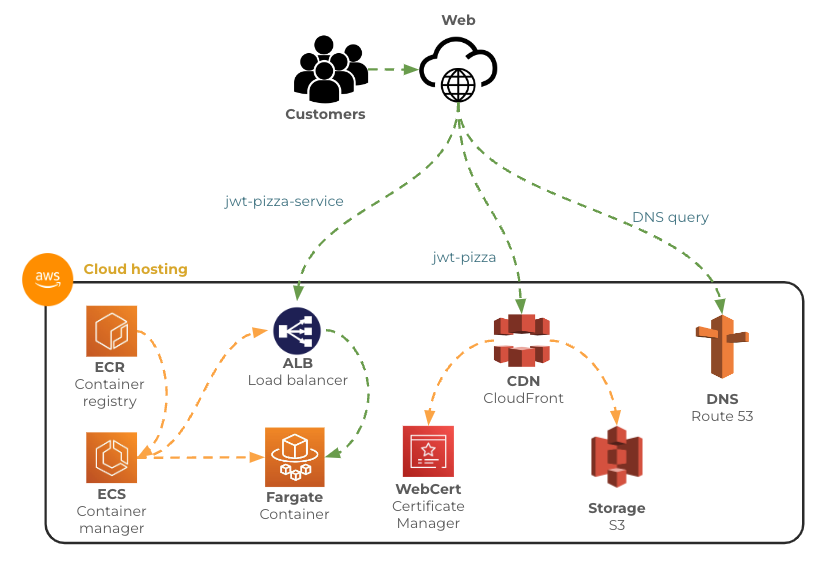

# Cloud deployment

🔑 **Key points**

- AWS provides a rich set of cloud-based services.
- Use these services to deploy the JWT Pizza application.

---

Hosting on GitHub is sufficient for simple static websites that do not require significant scaling. However, if you want to reach a large global audience with an architecture that is resilient and elastic, you need to deploy to a cloud environment that can meet those demands. To take things to the next level, we are going to move to Amazon Web Services (AWS).

## JWT cloud deployment

Specifically, you will deploy the `jwt-pizza` frontend to AWS S3 and the `jwt-pizza-service` backend to AWS Fargate. The following diagram shows all the AWS services involved in supporting this architecture.

## Architecture pieces

We will eventually explore the details of each service in the architecture diagram above, including their specific functions, setup processes, and how to connect them. In the meantime, the following table provides a general overview of each service's role.

| Service             | Description                                                                                                                |
| ------------------- | -------------------------------------------------------------------------------------------------------------------------- |
| Route 53            | A scalable Domain Name System (DNS) service that routes web traffic to your frontend and backend resources.                 |
| CloudFront          | A Content Delivery Network (CDN) that caches and distributes your frontend static files globally for low-latency access.   |
| S3                  | Scalable object storage used to host your frontend's static assets.                                                        |
| Certificate Manager | Manages SSL/TLS certificates to enable secure (HTTPS) network communication.                                               |
| ALB                 | Application Load Balancer that distributes incoming backend requests across multiple containers.                           |
| ECR                 | Elastic Container Registry; a Docker container registry used to store and manage your backend container images.            |
| ECS                 | Elastic Container Service; a container orchestration service that manages deployments and monitors system health.          |
| Fargate             | A serverless compute engine for containers that manages scaling and infrastructure automatically as load increases.        |

## Phased build-out

You will build this architecture by following these steps:

1. **Migrate the frontend hosting to AWS**
   1. Disable GitHub Pages hosting.
   1. Manually set up CloudFront, S3, Certificate Manager, and Route 53.
   1. Perform a manual deployment to S3.
   1. Modify your frontend deployment GitHub Actions workflow to push updates to S3.
1. **Migrate the backend hosting to AWS**
   1. Containerize your backend service using Docker.
   1. Manually set up ECR, ECS, ALB, and Fargate.
   1. Perform a manual deployment to ECR and trigger the deployment with ECS.
   1. Modify your backend deployment GitHub Actions workflow to push to ECR and trigger the ECS deployment.
1. **Automate the infrastructure**
   1. Create CloudFormation scripts to provision and tear down your frontend and backend services from scratch.

Following this process will create a fully automated, cloud-scale architecture capable of supporting any level of growth JWT Pizza achieves.

## A bit of fun

> _source: [XKCD](https://xkcd.com/1737/)_