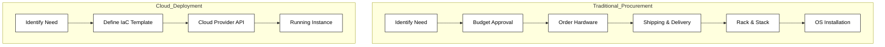

# Cloud deployment

🔑 **Key points**

- AWS provides a rich set of cloud-based services.
- Use these services to deploy the JWT Pizza application.

---

Hosting on GitHub is sufficient for simple static websites that do not require significant scaling. However, if you want to reach a large global audience with an architecture that is resilient and elastic, you need to deploy to a cloud environment that can meet those demands. To take things to the next level, we are going to move to Amazon Web Services (AWS).


## Advantages of a cloud deployment

Cloud deployment refers to the process of deploying an application through one or more hosting models—such as Software as a Service (SaaS), Platform as a Service (PaaS), or Infrastructure as a Service (IaaS)—that leverage a cloud provider's infrastructure. Traditionally, organizations had to purchase, house, and maintain physical servers in their own data centers. Cloud deployment shifts this responsibility to providers like AWS, Azure, or Google Cloud, allowing businesses to focus on code and customer experience rather than hardware maintenance.

The primary purpose of cloud deployment is to provide **agility** and **elasticity**. In a traditional environment, scaling up required weeks of hardware procurement and installation. In the cloud, scaling is a matter of API calls or automated triggers. This allows applications to handle sudden spikes in traffic without manual intervention and, more importantly, to scale back down when the demand subsides, ensuring resources are not wasted.

### Key Value Drivers

The value proposition of cloud deployment is often categorized into several key pillars:

*   **Cost Optimization:** Shifting from Capital Expenditure (CAPEX)—buying expensive hardware upfront—to Operational Expenditure (OPEX), where you pay only for what you use.
*   **Global Reach:** Cloud providers have data centers worldwide. Deploying an application to a new geographic region takes minutes, reducing latency for international users.
*   **Reliability:** Built-in redundancy and failover mechanisms ensure that if one physical server fails, the application automatically migrates to another, maintaining high availability.
*   **Speed to Market:** Developers can provision entire environments (testing, staging, production) instantly using Infrastructure as Code (IaC), significantly shortening the software development lifecycle (SDLC).

### Deployment Workflow Comparison

The following diagram illustrates the streamlined nature of cloud deployment compared to traditional infrastructure procurement:


```mermaid
graph TD
    subgraph Traditional_Procurement
    A[Identify Need] --> B[Budget Approval]
    B --> C[Order Hardware]
    C --> D[Shipping & Delivery]
    D --> E[Rack & Stack]
    E --> F[OS Installation]
    end

    subgraph Cloud_Deployment
    G[Identify Need] --> H[Define IaC Template]
    H --> I[Cloud Provider API]
    I --> J[Running Instance]
    end

    classDef default fill:#ffffff,stroke:#000000,color:#000000,stroke-width:1px;
```

## JWT cloud deployment

Specifically, you will deploy the `jwt-pizza` frontend to AWS S3 and the `jwt-pizza-service` backend to AWS Fargate. The following diagram shows all the AWS services involved in supporting this architecture.


## Architecture pieces

We will eventually explore the details of each service in the architecture diagram above, including their specific functions, setup processes, and how to connect them. In the meantime, the following table provides a general overview of each service's role.

| Service             | Description                                                                                                                |
| ------------------- | -------------------------------------------------------------------------------------------------------------------------- |
| Route 53            | A scalable Domain Name System (DNS) service that routes web traffic to your frontend and backend resources.                 |
| CloudFront          | A Content Delivery Network (CDN) that caches and distributes your frontend static files globally for low-latency access.   |
| S3                  | Scalable object storage used to host your frontend's static assets.                                                        |
| Certificate Manager | Manages SSL/TLS certificates to enable secure (HTTPS) network communication.                                               |
| ALB                 | Application Load Balancer that distributes incoming backend requests across multiple containers.                           |
| ECR                 | Elastic Container Registry; a Docker container registry used to store and manage your backend container images.            |
| ECS                 | Elastic Container Service; a container orchestration service that manages deployments and monitors system health.          |
| Fargate             | A serverless compute engine for containers that manages scaling and infrastructure automatically as load increases.        |

## Phased build-out

You will build this architecture by following these steps:

1. **Migrate the frontend hosting to AWS**
   1. Disable GitHub Pages hosting.
   1. Manually set up CloudFront, S3, Certificate Manager, and Route 53.
   1. Perform a manual deployment to S3.
   1. Modify your frontend deployment GitHub Actions workflow to push updates to S3.
1. **Migrate the backend hosting to AWS**
   1. Containerize your backend service using Docker.
   1. Manually set up ECR, ECS, ALB, and Fargate.
   1. Perform a manual deployment to ECR and trigger the deployment with ECS.
   1. Modify your backend deployment GitHub Actions workflow to push to ECR and trigger the ECS deployment.
1. **Automate the infrastructure**
   1. Create CloudFormation scripts to provision and tear down your frontend and backend services from scratch.

Following this process will create a fully automated, cloud-scale architecture capable of supporting any level of growth JWT Pizza achieves.

## Exercises

```masteryls
{"id":"6d7276ff-ea09-47e4-b91e-acc2a42bd301","title":"The Core Value of Cloud Deployment","type":"multiple-choice"}
What is the primary financial advantage of moving from on-premises deployment to a cloud deployment model?

- [ ] It eliminates the need for any operational spending (OPEX).
- [x] It shifts costs from Capital Expenditure (CAPEX) to Operational Expenditure (OPEX), allowing for a pay-as-you-go model.
- [ ] It guarantees that the total cost of ownership will always be lower, regardless of usage patterns.
- [ ] It allows companies to own the physical hardware located in the provider's data center for tax depreciation.
```


## A bit of fun


> _source: [XKCD](https://xkcd.com/1737/)_