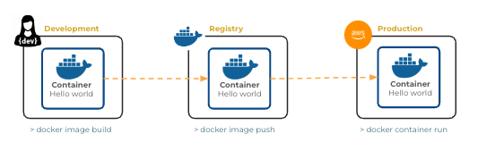
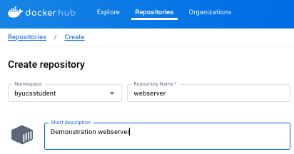
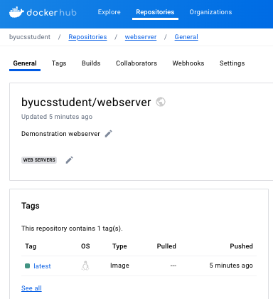
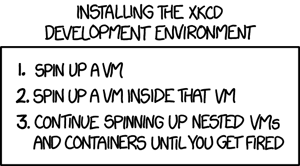

# Containers

🔑 **Key points**

- Run a container.
- Create and run your own container.
- Push and pull a container from Docker Hub.

---

📖 **Deeper dive reading**:

- [Docker CLI docs](https://docs.docker.com/reference/cli/docker/)
- [Debugging containers](https://www.docker.com/blog/how-to-fix-and-debug-docker-containers-like-a-superhero/)

---

Your main tool for working with containers is the Docker CLI. It allows you to run commands to build images, push and pull images to and from a registry, run, stop, and delete containers and images.

The following image depicts the standard container flow. You set up an application in your development environment and build an image. You then push that image to a container registry. The container is then pulled down to some environment and run.



## Run a standard Linux container

In order to give you experience with containers, let's start by pulling down a standard Linux container from Docker Hub and running it. You can do this all with one command.

```sh
docker run -it --rm alpine sh
```

This command will attempt to execute the container named `alpine`. You probably won't have that image in your local registry, so it will attempt to pull it from Docker Hub by default. Once it is pulled into your local registry, it will load the image. The provided parameters indicate the following:

- `-i` tells the Docker daemon to run in interactive mode. This keeps STDIN open so that you can type commands that the container will receive.
- `-t` opens a pseudo terminal so that you can see what the container is outputting.
- `--rm` instructs the Docker daemon to remove the container when the root process terminates.

When you run the command you should see something similar to the following.

```sh
Unable to find image 'alpine:latest' locally
latest: Pulling from library/alpine
a258b2a6b59a: Pull complete
Digest: sha256:b89d9c93e9ed3597455c90a0b88a8bbb5cb7188438f70953fede212a0c4394e0
Status: Downloaded newer image for alpine:latest
/ #
```

You can then execute shell commands that are isolated to the container runtime environment. This is a great way to learn Linux since any mistakes you make will get thrown away once the container completes. Go ahead and try the following commands.

```sh
ls -la
echo hello
top # Type q to quit
ping google.com # Type CTRL-C to stop
whois byu.edu
df -h
rm -rf /bin
```

After that last command you won't be able to do much else since you just deleted all the shell utility programs.

To close the pseudo terminal type `CTRL-C CTRL-D`. That will kill the shell and terminate the container.

## Building a container image

Now let's build an image that runs a simple Node.js web server. Make a directory and change into that directory.

```sh
mkdir containerExample && cd containerExample
```

Now, you can create your web server by creating both the `app.js` and `package.json` files.

**app.js**

```js
const express = require('express');
const app = express();

app.get('*', (req, res) => res.send('Hello Docker'));
app.listen(3000, () => console.log('Server ready'));
```

**package.json**

```json
{
  "name": "container-example",
  "dependencies": {
    "express": "^4.17.1"
  }
}
```

Next, create a file named `Dockerfile` and add the following contents. A Dockerfile provides the commands that describe how to build a container image.

**Dockerfile**

```dockerfile
FROM node:22-alpine
WORKDIR /usr/src/app
COPY package*.json app.js ./
RUN npm install
EXPOSE 3000
CMD ["node", "app.js"]
```

This Dockerfile specifies that you want to build this image on top of an image that has Node.js and the basic Linux OS already installed. The source code is then copied into the image, packages installed, port 3000 exposed by the Docker daemon so that we can access the web server on that port, and finally a command is specified that will execute when the container loads. In this example, Node.js will run the `app.js` code.

Now you can build the container image with the `image build` command. The `-t` parameter specifies the **tag** that uniquely identifies the image.

```sh
docker image build -t webserver .
```

This should execute every command in the `Dockerfile` and result in a brand-new container image. You can verify that the image was created by querying your local registry with the `images` command.

```sh
docker images -a

REPOSITORY   TAG       IMAGE ID       CREATED         SIZE
webserver    latest    4693c9f4530f   6 seconds ago   138MB
```

Start up the container with the `container run` command. The `-d` parameter tells the daemon to start the container detached from your console process. The `--name` parameter gives the container a name that you can use to identify it with future commands. The `-p` parameter maps your network 3000 port to the 3000 port exposed by the container.

```sh
docker container run -d --name server -p 3000:3000 webserver
```

You verify that the container is running with the `ps` command.

```sh
docker ps -a

CONTAINER ID   IMAGE       COMMAND                  CREATED         STATUS         PORTS                    NAMES
800e624fe3b7   webserver   "docker-entrypoint.s…"   4 seconds ago   Up 4 seconds   0.0.0.0:3000->3000/tcp   server
```

More importantly, you can actually access the web server on port 3000 using Curl.

```sh
curl localhost:3000

Hello Docker
```

Here are some useful commands that you can use to manipulate your container and container images.

| Command                                                                     | Description                                                                       |
| --------------------------------------------------------------------------- | --------------------------------------------------------------------------------- |
| docker images -a                                                            | List all the container images in the local registry.                              |
| docker ps -a                                                                | List all the containers, running or otherwise. Use this to get the container IDs. |
| docker stop `<container ID>` -t 0                                           | Stop the container's daemon after waiting 0 seconds.                              |
| docker start `<container ID>`                                               | Starts a container's daemon.                                                      |
| docker container run -d --name `<name>` -p `<port>`:`<port>` `<image name>` | Instantiate a container image and start it running.                               |
| docker rm -vf `<container ID>`                                              | Force a container to stop and then delete it.                                     |
| docker rmi `<image ID>`                                                     | Delete a container image.                                                         |
| docker logs `<container ID>`                                                | Dump the logs generated by the container.                                         |
| docker run -d -it `<container ID>` /bin/sh                                  | Start a container as a background process running a shell.                        |
| docker exec `<container ID>` ls -la                                         | Run a console command in a running  container.                                    |
| docker attach `<container ID>`                                              | Attach to a running container. To detach use `CTRL-P CTRL-Q`.                     |
| docker rm -vf $(docker ps -aq)                                              | Remove all containers.                                                            |
| docker rmi -f $(docker images -aq)                                          | Remove all images.                                                                |

## Working with a registry

The real power of working with containers only comes when you can deploy your containerized application to different devices. In order to do that, you need to push your container to a registry. For JWT Pizza, we will use the AWS Elastic Container Registry (ECR), but it is also good to get experience with Docker Hub.

In order to use Docker Hub you need to create an account. Head on over to [Docker Hub](https://hub.docker.com/) and set up an account. Feel free to use a [mailinator](https://mailinator.com/) account if you don't see yourself using Docker Hub long term.

After you have created your account, use the Docker Hub web interface to create a repository named `webserver`.



Back in your command console, you can log in using the `login` command and providing your username and then your password. (Replace byucsstudent with your account username.)

```sh
docker login -u byucsstudent

Password:
Login Succeeded
```

Next you need to tag your container image so that it matches your target registry. You then push the image with that repository name and tag.

```sh
docker tag webserver:latest byucsstudent/webserver:latest
docker push byucsstudent/webserver:latest
```

Assuming that command was successful, you can toggle back over to Docker Hub and you should see your container image listed in your webserver repository.



Now, go ahead and delete all your running containers, delete all of your local images, then pull down the image that you just copied up, and run the container.

```sh
docker rm -vf $(docker ps -aq)
docker rmi -f $(docker images -aq)
docker pull byucsstudent/webserver:latest
docker container run -d --name server -p 3000:3000 byucsstudent/webserver
```

Now you should be back to a clean environment where your webserver is running.


## Debugging

Sometimes things do start up right in your containers, or it fails later on for some unknown reason. One thing you can do is start the container interactively using the `-it` parameter, allowing you to see the output of the container. You can also request the logs for the container.

```sh
docker logs <container ID>
```

You can also run a command on a running container with the `exec` command. Sometimes this will help you figure out what is happening inside the container's isolated environment.

```sh
docker exec <container ID> ls -la
```

## Container practice

Follow the instruction given above to create a container image and uploaded it to Docker Hub. It should look something like the following.


## A bit of fun



> _source: [XKCD](https://xkcd.com/1764/)_
