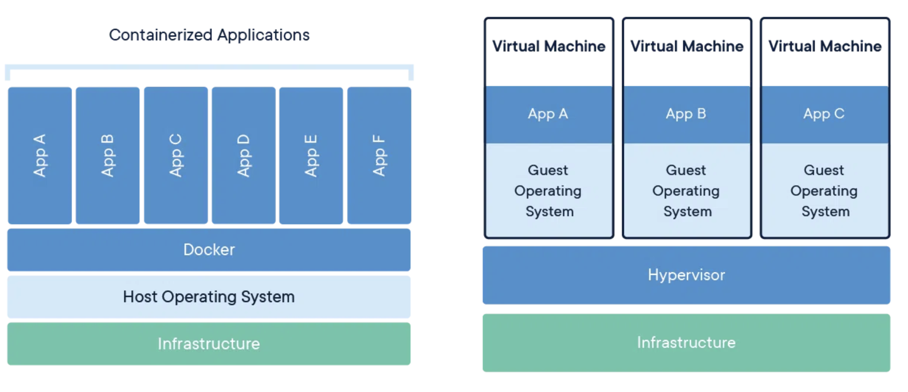

# Containers

🚧 This should detail everything about containers and how they work.


[Docker CLI docs](https://docs.docker.com/reference/)

**OCI** - Open Container Initiative - What the open source name specification for all things docker.

- Image spec
- Runtime spec
- Distribution spec (registries)

https://www.docker.com/resources/what-container/



## Run the standard linux image

`-i` means interactive (keep STDIN open)
`-t` means allocate a pseudo-TTY
`-d` is detached
`-rm` remove the container when it stops

```sh
docker run -it --rm alpine sh
```

Know you can run things like

```sh
ls -la
echo hello
top
ping google.com
whois google.com
df -h
rm -rf /bin # No big deal. It is just a container!
```

`CTRL-C CTRL-D` to escape the shell.

## Building an image

I ran `docker init` in a directory. This set up the Dockerfile and a compose.yaml file.

Then I went and built a simple node.js express app. I then built the image and pushed it to dockerhub using my leesjensen account.

```sh
docker image build -t leesjensen/cs329:v2 .
docker push leesjensen/cs329:v2
```

You can pull the image back down again with

```sh
docker pull leesjensen/cs329:v2
docker image ls --all
```

## Copying images between repositories

I created a tag in my local repository and then pushed it up to docker hub

```sh
docker tag docktest-server:latest leesjensen/cs329:v1
docker push leesjensen/cs329:v1
```

You can build, set the OS version, and push to dockerhub all in one command.

```sh
docker buildx build --platform linux/arm64/v8 --push --tag leesjensen/server:v2 .
```

I can then delete the local image. In order to do this I have to make sure there are no containers running with the image.

```sh
docker container ls --all
docker image ls --all
docker image rm leesjensen/cs329:v2
```

## Containers

I can start a container. If the container is not in my local repository it will pull it down from my remote.

```sh
docker container run -d --name server -p 4000:3000 leesjensen/cs329:v2
```

`-d` means to run it in the background, `--name` is the name to run the container under. `-p` is the port mapping, and then the registry/repo:tag that I want to pull down and run.

I can list the running containers with

```sh
docker container ls --all
```

I can stop and start the container with

```sh
docker container stop 867eff82a98e
docker container start 867eff82a98e
```

Delete the container 867eff82a98e

```sh
docker container rm
```

I can also use the name that I provided, `server`, when I created the container to run these commands.

```sh
docker container run -d --name server -p 4000:3000 leesjensen/cs329:v2
docker container stop server
```

### Running a container interactively

Run the standard `linux` container and start a shell. The last parameter is the process to run. Since we specified sh, the shell starts. We could also run `ls`.

```sh
docker container run -it --name demo alpine sh
```

To stop the container and exit the interactive shell just type `exit`, or to leave it running press `CTRL+P+Q`.

To remove a container use

```sh
docker container rm demo
```

Normally you would have to stop a container before you remove it, but you can use the force `-f` flag to both stop and remove it.


You can think of virtual machines as virtual devices that run on top of the hardware level.
You can think of containers as virtual machines that run on top of the operating system level.

## Building a container

I then ran `docker init`

```ps
docker init

Welcome to the Docker Init CLI!

This utility will walk you through creating the following files with sensible defaults for your project:
  - .dockerignore
  - Dockerfile
  - compose.yaml
  - README.Docker.md

Let's get started!

? What application platform does your project use? Node
? What version of Node do you want to use? 20.10.0
? Which package manager do you want to use? npm
X Sorry, your reply was invalid: Value is required
? What command do you want to use to start the app? npm run start
? What port does your server listen on? 3000

CREATED: .dockerignore
CREATED: Dockerfile
CREATED: compose.yaml
CREATED: README.Docker.md

✔ Your Docker files are ready!
```

Then I went and build a simple node.js express app.

And ran `docker compose up`. `Compose` is a Docker.inc only utility that allows you to start up a `service` that has multiple containers. I was able to then open the browser and see my website.

## Debugging

[Debugging containers](https://www.docker.com/blog/how-to-fix-and-debug-docker-containers-like-a-superhero/)

I created a simple react app that should run under `npm run dev`.

```sh
docker container run -d --name webserver -p 4000:5173 webserver:latest
```

However, it fails to run for some reason. The following tells me that it has stopped

```sh
docker container ls --all
CONTAINER ID   IMAGE              COMMAND                  CREATED         STATUS                       PORTS     NAMES
adc895884a9f   webserver:latest   "docker-entrypoint.s…"   2 seconds ago   Exited (127) 2 seconds ago             webserver
```

You can see the logs for the container with

```sh
docker logs --tail 100 adc895884a9f

> demovite@0.0.0 dev
> vite

sh: vite: not found
```

This suggests that `npm ci` didn't do its job.

## Building multi-architecture docker image

This is a very complete example for Express deployed to ECS

[AWS building for Graviton](https://aws.amazon.com/blogs/containers/how-to-build-your-containers-for-arm-and-save-with-graviton-and-spot-instances-on-amazon-ecs/)

### The app

**Dockerfile**

```dockerfile
FROM node:14-alpine
WORKDIR /usr/src/app
COPY package*.json app.js ./
RUN npm install
EXPOSE 3000
CMD ["node", "app.js"]
```

**app.js**

```js
const express = require('express');
const app = express();

app.get('*', (req, res) => res.send("Let's run a multi-architecture container!"));
app.listen(3000, () => console.log('Server ready'));
```

```json
{
  "name": "multiarch-container",
  "main": "app.js",
  "dependencies": {
    "express": "^4.17.1"
  }
}
```

### Build the container

I tried to do the multi-container support, but my dev environment didn't support it and so I just did arm64 so I can do graviton in ECS.

```sh
docker build -t "1234567890.dkr.ecr.us-east-1.amazonaws.com/webserver:latest" --platform linux/arm64 .
```

You can test it with

```sh
docker run --name webserver -p 3000:3000 1234567890.dkr.ecr.us-east-1.amazonaws.com/webserver:latest
```

### ECR

Login to ECR

```sh
aws ecr get-login-password --region us-east-1 | docker login --username AWS --password-stdin 1234567890.dkr.ecr.us-east-1.amazonaws.com

Login Succeeded
```

Push the container to ECR

```sh
docker push 1234567890.dkr.ecr.us-east-1.amazonaws.com/webserver:latest
```

## Docker CLI Reference

Favorite commands

````sh
docker run -d --name jwt-pizza-service -p 3000:3000 <image id> # detached
docker stop <container id> -t 0 # stop immediately
docker rm -vf $(docker ps -aq) # To delete all containers and volumes. Force
docker rmi -f $(docker images -aq) # To delete all the images. Force
docker exec <container id> ls -la # runs a command on the container

Common commands

```sh
docker ps
docker ps --all
docker images
docker run
docker start <container id>
docker stop <container id>
docker kill <container id> # stops and removes the container
docker rm <container id>
docker rmi <image id>
````

```txt
docker

Usage:  docker [OPTIONS] COMMAND

A self-sufficient runtime for containers

Common Commands:
  run         Create and run a new container from an image
  exec        Execute a command in a running container
  ps          List containers
  build       Build an image from a Dockerfile
  pull        Download an image from a registry
  push        Upload an image to a registry
  images      List images
  login       Log in to a registry
  logout      Log out from a registry
  search      Search Docker Hub for images
  version     Show the Docker version information
  info        Display system-wide information


Commands:
  attach      Attach local standard input, output, and error streams to a running container
  commit      Create a new image from a container's changes
  cp          Copy files/folders between a container and the local filesystem
  create      Create a new container
  diff        Inspect changes to files or directories on a container's filesystem
  events      Get real time events from the server
  export      Export a container's filesystem as a tar archive
  history     Show the history of an image
  import      Import the contents from a tarball to create a filesystem image
  inspect     Return low-level information on Docker objects
  kill        Kill one or more running containers
  load        Load an image from a tar archive or STDIN
  logs        Fetch the logs of a container
  pause       Pause all processes within one or more containers
  port        List port mappings or a specific mapping for the container
  rename      Rename a container
  restart     Restart one or more containers
  rm          Remove one or more containers
  rmi         Remove one or more images
  save        Save one or more images to a tar archive (streamed to STDOUT by default)
  start       Start one or more stopped containers
  stats       Display a live stream of container(s) resource usage statistics
  stop        Stop one or more running containers
  tag         Create a tag TARGET_IMAGE that refers to SOURCE_IMAGE
  top         Display the running processes of a container
  unpause     Unpause all processes within one or more containers
  update      Update configuration of one or more containers
  wait        Block until one or more containers stop, then print their exit codes

Management Commands:
  builder     Manage builds
  buildx*     Docker Buildx (Docker Inc., v0.12.1-desktop.4)
  compose*    Docker Compose (Docker Inc., v2.24.5-desktop.1)
  container   Manage containers
  context     Manage contexts
  debug*      Get a shell into any image or container. (Docker Inc., 0.0.24)
  dev*        Docker Dev Environments (Docker Inc., v0.1.0)
  extension*  Manages Docker extensions (Docker Inc., v0.2.21)
  feedback*   Provide feedback, right in your terminal! (Docker Inc., v1.0.4)
  image       Manage images
  init*       Creates Docker-related starter files for your project (Docker Inc., v1.0.0)
  manifest    Manage Docker image manifests and manifest lists
  network     Manage networks
  plugin      Manage plugins
  sbom*       View the packaged-based Software Bill Of Materials (SBOM) for an image (Anchore Inc., 0.6.0)
  scout*      Docker Scout (Docker Inc., v1.4.1)
  system      Manage Docker
  trust       Manage trust on Docker images
  volume      Manage volumes

```
