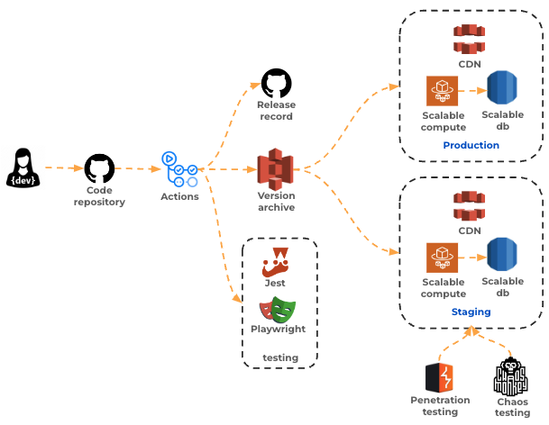

# Continuous integration

🔑 **Key points**

- Continuous integration is the process of successfully automating production deployments.

---

If automation is the mantra of DevOps, then continuous integration (CI) is the powerhouse that makes automation happen. The idea with CI is to turn up the dial on how quickly and efficiently code flows from an application developer's fingertips to the hands of a customer. The flow from developer to customer is often called a CI pipeline.

A CI pipeline generally starts when a code change is committed to the code repository. This will trigger an automated pipeline that includes code reviews, code analysis (coverage, linting), and automated testing. If any of these fail then the commit is rejected and the CI pipe aborts.

If everything looks good with the change then it is bundled and placed in a version archive where it is a candidate for deployment to a production system as part of a continuous deployment process. Usually the version is automatically deployed to a staging environment as part of a continuous delivery process. In the staging environment the CI pipeline may continue its automation with integration, end to end, chaos, and penetration testing.

Notice that there are lots of moving parts in a CI pipeline. If these were all manual steps, it would require an operational manager to babysit the process. That manual process might take weeks to fully validate and test the change. By automating the pipeline, with safety checks at each step, you can confidently take a code change from developer to production in a matter of minutes.
