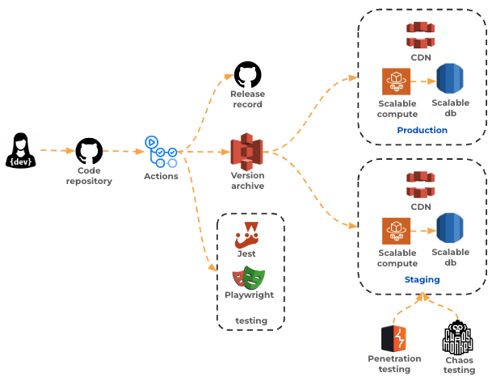

# Continuous integration

🔑 **Key points**

- Continuous integration (CI) is the practice of frequently merging code changes into a central repository to be validated by automated builds and tests.

---

If automation is the mantra of DevOps, then continuous integration (CI) is the engine that drives it. The goal of CI is to increase the speed and efficiency with which code moves from a developer's workstation to a shared codebase. This automated flow is known as a CI pipeline.



A CI pipeline typically begins when a developer commits code to a repository. This commit triggers an automated sequence that includes code analysis (such as linting and coverage) and automated testing. If any of these steps fail, the pipeline aborts, and the commit is rejected until the issues are resolved.

Once a change passes all automated checks, it is bundled into a build artifact and stored in a version archive. At this stage, the code is a candidate for deployment to a production system. In a continuous delivery or deployment process, the version is often automatically deployed to a staging environment. In this environment, the pipeline may continue with more rigorous automation, such as integration, end-to-end, chaos, and penetration testing.

A CI pipeline involves many moving parts. If these were all manual steps, they would require constant oversight and could take weeks to fully validate a single change. By automating the pipeline with safety checks at every step, teams can confidently move code from development to a production-ready state in a matter of minutes.


## Core Concepts

To move beyond a basic definition of Continuous Integration, it is essential to understand the technical pillars that make the process functional.

### 1. Trunk-Based Development
CI relies on developers merging small, frequent updates to a shared mainline (often called `main` or `master`) rather than working on long-lived feature branches. This minimizes the "integration hell" that occurs when massive blocks of code are merged simultaneously.

### 2. The Build Server (CI Runner)
A dedicated environment—such as Jenkins, GitHub Actions, or GitLab Runner—monitors the version control system. When a change is detected, it automatically pulls the code, compiles it, and runs the defined suite of tests.

### 3. Artifact Generation
A successful CI process produces a "build artifact" (e.g., a Docker image, a JAR file, or a compiled binary). This ensures that the exact code that passed testing is what eventually moves toward deployment, maintaining consistency across environments.

### 4. Self-Testing Code
CI is ineffective without a robust automated test suite. This includes:
*   **Unit Tests:** Validating individual functions or classes.
*   **Integration Tests:** Ensuring different modules work together.
*   **Linting:** Automatically checking code style and syntax errors.

## Key Benefits of Continuous Integration

Implementing CI provides measurable improvements to the software development lifecycle (SDLC):

| Benefit | Description |
| :--- | :--- |
| **Immediate Feedback** | Developers learn within minutes if their code broke the build or failed a test, allowing for instant fixes while the context is fresh. |
| **Reduced Risk** | Small, frequent updates make it easier to isolate the specific commit that introduced a bug. |
| **Consistency** | Automated builds eliminate the "it works on my machine" problem by testing code in a clean, standardized environment. |
| **Higher Code Quality** | Mandatory automated testing and linting ensure that only code meeting defined quality standards enters the codebase. |
| **Increased Velocity** | By automating repetitive tasks like compiling and testing, developers spend more time writing features and less time managing releases. |

## Practical Examples

### The CI Workflow Example
1.  **Developer Action:** A developer completes a small bug fix and pushes the code to the repository.
2.  **Trigger:** The CI server detects the push via a webhook.
3.  **Build Phase:** The server clones the repo and installs dependencies (e.g., `npm install` or `pip install`).
4.  **Test Phase:** The server executes the test suite (e.g., `pytest` or `jest`).
5.  **Report:** If tests fail, the developer is notified via Slack or email. If they pass, the build is marked as "Green."

### Example: GitHub Actions Configuration (`.github/workflows/ci.yml`)
This YAML snippet demonstrates a standard CI configuration that runs every time code is pushed:

```yaml
name: Node.js CI

on: [push, pull_request]

jobs:
  build-and-test:
    runs-on: ubuntu-latest

    steps:
    - name: Checkout code
      uses: actions/checkout@v3

    - name: Set up Node.js
      uses: actions/setup-node@v3
      with:
        node-version: '18'

    - name: Install dependencies
      run: npm ci

    - name: Run Linting
    run: npm run lint

    - name: Run Tests
      run: npm test
```

## Summary of CI Best Practices
*   **Maintain a single source repository:** Everything needed for the build should be in version control.
*   **Automate the build:** One command should be able to build the entire system.
*   **Keep the build fast:** If the CI process takes hours, developers will stop merging frequently.
*   **Test in a clone of the production environment:** Use containers (like Docker) to ensure the CI environment matches production as closely as possible.

## Exercises


```masteryls
{"id":"d0d5489e-5640-49d2-8cfe-5f7c76b5be1e","title":"Defining the Integration in CI","type":"multiple-choice"}
In the context of a Continuous Integration (CI) pipeline, what is the primary "integration" occurring?

- [ ] The deployment of fully validated application builds into a live production environment
- [ ] The manual merging of major feature branches only at the conclusion of a development sprint
- [x] The frequent merging of code changes from multiple developers into a shared central repository
- [ ] The synchronization of high-level project requirements with the current state of the source code
```


```masteryls
{"id":"3be2d962-6f38-4e35-a4fc-c99d51cd6c90","title":"CI Integration Frequency","type":"multiple-choice"}
To effectively minimize integration friction and identify bugs early, which practice should a development team follow within a Continuous Integration (CI) workflow?

- [ ] Postpone merging code to the main branch until the entire feature has been manually smoke-tested in a local environment to ensure stability.
- [x] Integrate code changes into the shared repository frequently, ideally at least once a day, to keep the delta between versions small and manageable.
- [ ] Trigger automated builds and test suites only during off-peak hours to prevent slowing down the development environment for other engineers.
- [ ] Allow the build to remain in a "failed" state if the errors are related to non-critical components, as long as the core functionality is still working.
```

