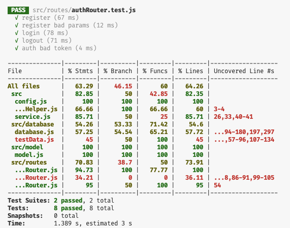
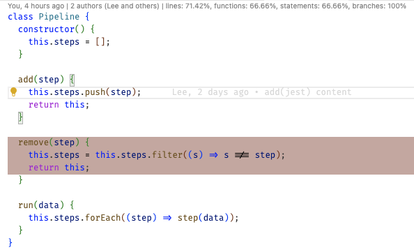

# Coverage

🔑 **Key points**

- Code coverage is a common metric to determine if an application is properly tested.
- Code coverage percentages can hide serious issues in testing.
- Make sure your coverage percentage is meaningful.

---

Code coverage is a metric that helps measure the percentage of a program code that was executed when testing. A high percentage of code coverage suggests that the code has been more thoroughly tested and has a lower chance of containing undetected software bugs.

Here is an example of a code coverage report that represents several coverage metrics for the files in a simple application. The color coding of the percentages help you focus on the areas that are the most problematic.



## Types of Code Coverage

There are several types of code coverage. This includes:

- **Line**: The percentage of lines that have been executed in the program. Usually this only counts lines of code. Comments and whitespace are not counted.
- **Statement**: The percentage of statements that have been executed in the program. In the following example there are three statements that will not be tested if the line is not executed.
  ```js
  let result = a > 0 && x(a) && y(a);
  ```
- **Branch**: The percentage of branches (both 'true' and 'false') that have been executed. In the following example there are multiple predicates that control the branching of the code. All of them would need to be exercised in order to give complete branch coverage.
  ```js
  if (a || (b && c)) {
    return true;
  } else {
    return false;
  }
  ```
- **Function**: The percentage of functions or methods that have been called.
- **Condition**: The boolean sub-expressions in decision instructions that have been evaluated both to true and false. This is similar to a branch metric, but the branching is inherent in the conditionals.
  ```js
  return a || (b && c);
  ```

## How much coverage is enough?

Hopefully you are seeing the immediate value of automated testing and will have a hard time writing code without at the same time writing the tests.

However, there is a point of diminishing returns. Most of the negative effects of taking a testing mindset result from pushing testing too far. One place this is clearly a problem is in the debate about the correct percentage of code coverage.

The following is an example of code that has a coverage of 71% of the lines.

> 

Obviously this is a problem if you want to make sure that the `remove` operation is properly tested. However, what is the cost of having 100% coverage? In this simple case there is little danger of harm.

However, in complex applications there is often significant code for supporting error and edge cases that only exist in very extreme situations. These edge cases are usually the most difficult to test for the following reasons:

- **Complexity**: They require complex setup and teardown of infrastructure
- **Dependencies**: They only happen when dependent systems catastrophically fail
- **Timing**: They required special timing or sequences of events.

This means you have to make extensive investments in testing code and inject special code into your production system to cover these cases.

You many find that for those extreme cases, it is better to actually manually test them instead of doing backflips to automate the testing. You can also take the somewhat questionable strategy of waiting until an actual bug is reported for these edge cases before you make an extreme investment.

You should also realize what 100% coverage actually means. It does not mean 100% verification. There are infinite possibilities for different parameters, paths, timings, and configurations to a complex software package. Hitting every line of code **does not** mean that you have hit every permutation that your code can execute.

The amount of effort you put into verifying the correctness of your code should be in line with the value and potential for harm of the software you are testing. A pet project that will never be used by anyone should not involve millions of hours and a 300:1 testing/production code ratio. However, for a health device where a bug would be lethal, or a financial management package where a bug would result in poverty, that cost might be justified.

For common web application development it is common to have around a 1:1 test/production code ratio, with somewhere above 80% line coverage.

The key here is to focus your efforts on practical benefits and not meaningless metrics. Write tests that provide the required value.
