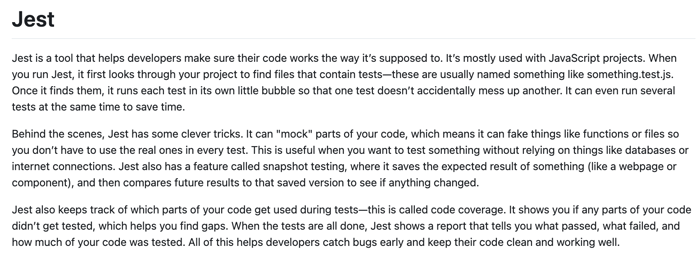

# 💡 Curiosity report

🔑 **Key points**

- Curiosity is a foundational trait for successful software engineers.
- You need to create a curiosity report before the end of the course.

---

Curiosity is a defining characteristic of a successful software engineer. Throughout this course you will be exposed to new technologies and concepts that we don't have time to deep dive into. When you hear about something that you would like to understand better, you should always make a note of that concept and then find time to understand it a little better. Indulging your curiosity will deepen your understanding and take you up a level in your ability to contribute to eternity.

In order to help you develop your ability to be curious, you are required to take a deep dive at least once during the course into something related to QA or DevOps that is either not covered in the course, or is only tangentially covered.

# Examples of good reports

The following are reasonable reports that previous learners created. These provide examples of the level of effort and quality that your report should have in order to be accepted.

- [Progressive Delivery](https://github.com/bvanitem/jwt-pizza/blob/main/curiosityReport.md)
- [AWS Lambda](https://github.com/jjwjohns/jwt-pizza/blob/main/curiosityReport.md)
- [How do Linters work](https://github.com/rileyballard6/jwt-pizza/blob/main/curiosityReport.md)
- [Upptime](https://github.com/EthanSuperior/jwt-pizza/blob/main/curiosityReport.md)
- [GitOps](https://github.com/Korea19800/jwt-pizza/blob/main/curiosityReport.md)
- [Terraform](https://github.com/garett-whimple/jwt-pizza/blob/main/curiosityReport.md)
- [Git Branching Strategy and Forking in Collaboration](https://github.com/alexueda/jwt-pizza/blob/main/blob/main/curiosityReport/curiosityReport.md)
- [Mutation Testing](https://github.com/mailiap/jwt-pizza/blob/main/curiosityReport.md)
- [.NET Aspire](https://github.com/qkarpowi/jwt-pizza/blob/main/CuriosityReport.md)

Some common characteristics of a good report include:

1. Goes beyond the instruction provided in the course
1. Is related to QA and DevOps
1. Involves research and experimentation
1. Clear, meaningful, write up that allows for review/reproduction of the research
1. It was your curiosity, not AI's

# Example of a poor report

The following report doesn't meet the acceptance threshold for the following reasons:

1. It simply repeats what is taught in the course instruction
1. There is no depth in research and application
1. It doesn't demonstrate the exercise of curiosity
1. There are no references to existing authorities on the subject
1. AI or Google query would have produced a better report

> 

A better Jest curiosity report would focus on a specific area that is not directly covered in the course.

For example: **Diving into the internals of how SuperTest enables endpoint calls**.

## ⭐ Assignment

Before the last few weeks of the course you must do the following:

1. Pick a curiosity topic
1. Research the topic
1. Create a markdown file and insert it into your fork of the `jwt-pizza` repository in a file named `curiosityReport.md`.
1. Populate the markdown file with what you learned

Once you are done, go over to Canvas and submit the URL of your markdown file. Your URL should look something like this:

```
https://github.com/byucsstudent/jwt-pizza/blob/main/curiosityReport.md
```
