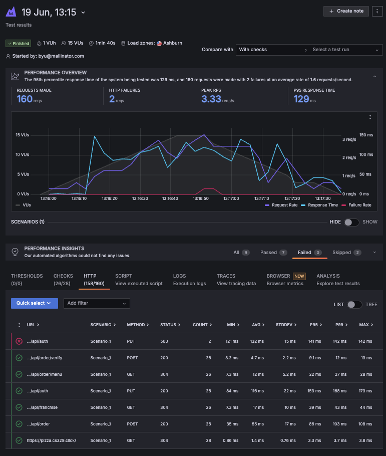

# Deliverable ⓾ Load testing: JWT Pizza Service

🔑 **Key points**

- Create a load test for JWT Pizza Service.

---


## Prerequisites

Before you start work on this deliverable make sure you have read all of the preceding instruction topics and have completed all of the dependent exercises (topics marked with a ☑). This includes:

- ☑ [Synthetic testing](../syntheticTesting/syntheticTesting.md)
- [Load testing](../loadTesting/loadTesting.md)
- [Grafana K6](../grafanaK6/grafanaK6.md)

Failing to do this will likely slow you down as you will not have the required knowledge to complete the deliverable.

## Getting started

In order to demonstrate your mastery of load testing you will now create and execute your own load tests using K6.

## ⭐ Deliverable

Follow the steps described in the [Grafana K6](../grafanaK6/grafanaK6.md) instruction to do the following.

1. Using the K6 Test Builder interface, create a test that:
   1. Logs in a user
   1. Navigates the menu to create a pizza order
   1. Buys the pizza
   1. Validates that the pizza JWT is valid
1. Execute the test and analyze the results.
1. Use the script generated by the Test Builder to create another test using the Script Editor.
1. Alter the script so that it checks to make sure the login and purchase requests succeed with the proper HTTP status code.
1. Alter the test script so that it doesn't have a hard-coded JWT in the pizza verification request, but instead reads it from the purchase response. This should be similar to how the authentication token is handled.
1. Execute the test and analyze the results.
1. Save a copy of your load test script to your fork of the `jwt-pizza` repository under the name `loadTests/loginAndOrder.js`.
1. Create and save an image load test results to  to your fork of the `jwt-pizza` repository under the name `loadTests/testRun.png`. This should look something like this:



```masteryls
{"id":"69839e67-9763-4434-a6d8-4e0713380a08", "title":"⓾ Load testing", "type":"url-submission", "syncGrade":true, "autoGrade":false, "validateUrl":true, "gradingCriteria":"The resulting file contains JavaScript that executes a load test.", "urlPrompt":"Convert the user provided URL to create a URL that is the path to the raw GitHub content for the 'loadTests/loginAndOrder.js' file." }

Once you have completed this deliverable, submit the URL of your JWT Pizza repository. Your repository should have a `loadTests/loginAndOrder.js` file representing your load test code and a `loadTests/testRun.png` image file representing a load test run result.

_Example: https://github.com/youraccountname/jwt-pizza

This will do an initial check of your submission and then pass it on for final grading.
```


### Rubric

| Percent | Item                                                                                                                      |
| ------- | ------------------------------------------------------------------------------------------------------------------------- |
| 30%     | Load test JavaScript file committed to your fork of the `jwt-pizza` repository with the name `loadTests/loginAndOrder.js` |
| 70%     | Image capturing the successful execution of the load test                                                                 |

**Congratulations!** You have completed the process of using K6 for load testing. Time to go celebrate. I'm thinking Pho 🍲.
