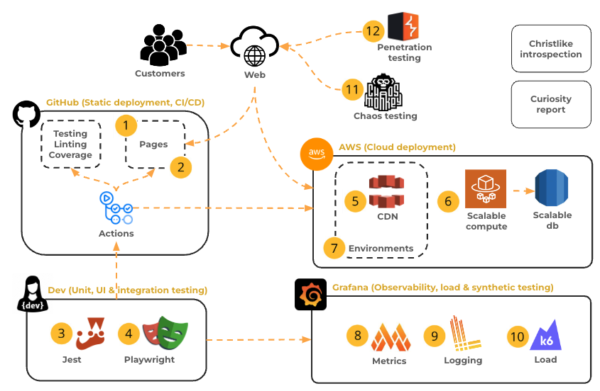
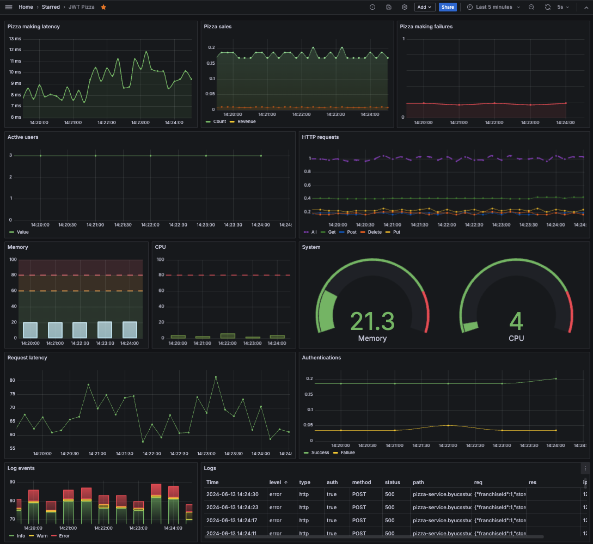
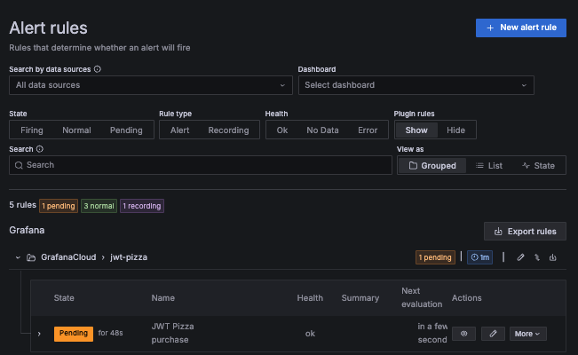

# ⓫ Chaos testing: JWT Pizza

🔑 **Key points**

- Validate your metrics and alerts by responding to a chaos test.

---



## Prerequisites

Before you start work on this deliverable make sure you have read all of the preceding instruction topics and have completed all of the dependent exercises (topics marked with a ☑). This includes:

- [Failure](../failure/failure.md)
- [Backup and Recovery](../recovery/recovery.md)
- [Alerts](../alerting/alerting.md)
- ☑ [Grafana OnCall](../grafanaOnCall/grafanaOnCall.md)
- [Playbooks](../playbooks/playbooks.md)
- [Self healing](../selfHealing/selfHealing.md)
- ☑ [Chaos testing](../chaosTesting/chaosTesting.md)
- [Incident report](../incidentReport/incidentReport.md)

Failing to do this will likely slow you down as you will not have the required knowledge to complete the deliverable.

## Getting started

The JWT Pizza application has the ability built into it to inject chaos into the system. It is an important part of your role as a DevOps engineer to know how to expediently, and efficiently, respond to critical events. This deliverable will give you significant experience with that process.

## Useful logs and metrics

In order to be successful with this deliverable you must have logs and metrics that are not only reporting nominal information, but also surfacing when there is a problem.

This means that you need to know when **resources are maxed out**, **requests are failing**, or **latency is too high**. The following example dashboard shows that there is a problem making pizzas and that the logs are filled with errors.



## Useful alerts

With the proper metrics in place you can then trigger alerts to resolve the incident in a timely manner. Make sure you create as many alerts as necessary so that you can respond at any hour of the day or night.



## Simulate traffic

You will need to simulate traffic in order for most failures to trigger. Consider using the [simulating traffic](../simulatingTraffic/simulatingTraffic.md) Curl commands that were described previously. It is also helpful to use the chaos endpoint you created in the [chaos testing assignment](../chaosTesting/chaosTesting.md#-assignment) to make sure your alerts are working correctly.

You can also generate significant latency and failure from the Pizza Factory by ordering twenty or more pizzas in a single order.

## ⭐ Deliverable

Your job is to do the following:

1. Make sure the application is up and running correctly during the testing period.
1. Have all the [metrics](../grafanaMetrics/grafanaMetrics.md) and [logging](../grafanaLogging/grafanaLogging.md) reporting in place necessary for you to be able to observe and diagnose the failure.
1. Have an appropriate [alerting system](../grafanaOnCall/grafanaOnCall.md) in place so that you are effectively on call during the entire testing period.
1. Make sure you are [simulating traffic](../simulatingTraffic/simulatingTraffic.md) to your application. Otherwise you will not have any interesting metrics to trigger an alarm on when the chaos is injected.
1. Access your [JWT Pizza Factory vendor account](https://pizza-factory.cs329.click) and select `Initiate chaos`.
1. The incident will occur between 8am and 3pm the next day.
1. Respond to the incident in a timely manner.
1. Properly diagnose and remedy the root cause of the failure.
   1. If you debug carefully, it will be obvious what action to take to resolve the chaos.
   1. You will _not_ need to change the JWT Pizza code.
1. Produce an [incident report](../incidentReport/incidentReport.md) using the [incident report template](../incidentReport/templateIncidentReport.md).
   1. If your alerts were not triggered by the chaos, update your alert rules so they can catch future failure.
   1. Include a section in your report documenting any changes you made.
1. Submit that you have completed the deliverable to the [Canvas](https://byu.instructure.com) assignment.

> [!NOTE]
>
> If you are unable to be on call during the defined testing period you have the responsibility to notify the instructor and negotiate an alternative schedule.

When you generate your report you must commit the report to your fork of the `jwt-pizza` repository in a folder named `incidentReports`. The report filename must be named `incident-1.md`. For example:

```txt
incidentReports/
├── incident-1.md
```


```masteryls
{"id":"0fc6c832-d9b7-470f-a3b5-f09b675079f2", "title":"⑪ Chaos testing deliverable", "type":"url-submission", "syncGrade":true, "autoGrade":false, "validateUrl":true, "gradingCriteria":"- The resulting file contains an incident report that full describes both the incident and resolution.", "urlPrompt":"Convert the user provided URL to create a URL that is the path to the raw GitHub content for the 'incidentReports/incident-1.md' file." }

Once you have completed this deliverable, submit the URL of your JWT Pizza repository. Your repository must have a `incidentReports/incident-1.md` file representing your full incident report.

_Example: https://github.com/youraccountname/jwt-pizza

This will do an initial check of your submission and then pass it on for final grading.
```


### Rubric

| Percent | Item                                                                                                                                                     |
| ------- | -------------------------------------------------------------------------------------------------------------------------------------------------------- |
| 80%     | Timely response and correction of chaos incident. After 4 hours have passed since the incident, 10% is deducted for each hour that the failure persists. |
| 20%     | Accurate and informative incident report committed to your fork of the `jwt-pizza` repository.                                                           |
