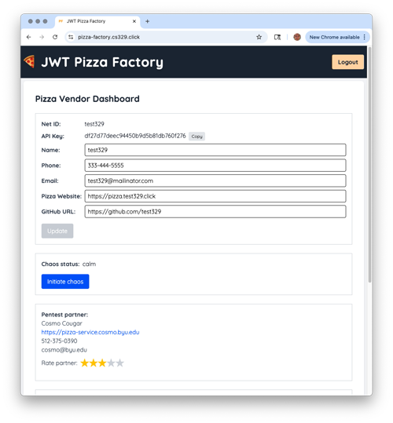

# ⓬ Penetration testing: JWT Pizza

🔑 **Key points**

- Execute a penetration test against a peer.
- Prevent your JWT Pizza from being penetrated.
- Create an incident report.

---


## Prerequisites

Before you start work on this deliverable make sure you have read all of the preceding instruction topics and have completed all of the dependent exercises (topics marked with a ☑). This includes:

- [Security Community](../securityCommunity/securityCommunity.md)
- [Penetration testing](../penetrationTesting/penetrationTesting.md)
- ☑ [Burp Suite](../burpSuite/burpSuite.md)

Failing to do this will likely slow you down as you will not have the required knowledge to complete the deliverable.

## Getting started

In order to demonstrate your mastery of the concepts for this deliverable, you will conduct two penetration tests of JWT Pizza. First you will attack your own JWT Pizza production deployment, and then you will attack the production deployment of an assigned peer. Together with your peer, you will then create a penetration test report.

### Attack record

As different attacks are conducted you will document each attack using the following format:

- Record the date that the attack was executed.
- Target website
- Classify the attack according to the [OWASP Top Ten](../securityCommunity/securityCommunity.md), or provide your own classification if the exploit does not fit those categories.
- Severity on a scale of 0 to 4
  - 0 - **Unsuccessful**: The attack failed to have any meaningful impact.
  - 1 - **Low**: System configuration or not critical customer data was obtained.
  - 2 - **Medium**: Customer credentials were impersonated or stolen. Minor performance impacted or specific feature disabled.
  - 3 - **High**: Authorization was escalated to administrator level. Performance was significantly impacted. Significant data was acquired.
  - 4 - **Critical**: The application is down or unusable.
- Description of result
- Capture images of the attack if successful or useful.
- Corrections that were made if successful.

### Example attack record

| Item           | Result                                                                         |
| -------------- | ------------------------------------------------------------------------------ |
| Date           | June 18, 2053                                                                  |
| Target         | pizza.byucsstudent.click                                                       |
| Classification | Injection                                                                      |
| Severity       | 1                                                                              |
| Description    | SQL injection deleted database. All application data destroyed.                |
| Images         |  <br/> Stores and menu no longer accessible. |
| Corrections    | Sanitize user inputs.                                                          |

## Penetration test process

> [!IMPORTANT]
>
> Do not attempt to participate in this deliverable if you have not completed the previous phase and are committed to collaborating with a peer. Your peer's experience will be negatively impacted if you are unable to fully participate. I you accept the responsibility of being a peer and then do not complete your part of the collaboration you may receive **negative** mastery points for this deliverable.

### Step 1: Collaborate with a peer

1. Log into the [Pizza Factory](https://pizza-factory.cs329.click) and request a `pentest partner`. If there is not currently a partner available then check back later. If you attempted to get a partner, but one was never assigned or your partner did not respond before the partner connection deadline, then immediately contact the TAs and they will figure out a solution for you.
2. Immediately contact your partner and set up a time to conduct your peer attack and create the penetration test report. Class will be cancelled on the day after the partner connection deadline and so you should be able to at least use that time to work together.



### Step 2: Self attack

Take the following steps to execute a penetration test on your JWT Pizza application.

1. Carefully review the JWT Pizza application functionality and code. Make notes about possible vulnerabilities and attack vectors.
1. Attempt to penetrate your deployment of JWT Pizza.
1. Make modifications to your fork and deployment of JWT Pizza in order to resolve any security issues that you discovered.

### Step 3: Peer attack

Take the following steps to execute a penetration test on a peer's JWT Pizza application.

1. Access your [JWT Pizza Factory vendor account](https://pizza-factory.cs329.click) and select `Request partner` from the Penetration Testing interface. If a partner is available then this will provide you with the contact information for your partner. If no partner is currently available you will need to check back later to see if a partner has been assigned.

   Make sure that you have provided correct contact information for accounts that you frequently check so that your partner can contact you.

1. Communicate with your peer and decide on a date when you will conduct your penetration testing.
1. On the decided date, attempt to penetrate your peer's JWT Pizza deployment. Take careful notes about the preparation, actions, and results for the penetration test.

### Step 4: Generate a report

Meet with your peer and create a joint report in Markdown format. The report must contain the following sections.

1. Both peers names
1. Self attack
   1. Peer 1: Create an attack record for each attack.
   1. Peer 2: Create an attack record for each attack.
1. Peer attack
   1. Peer 1 attack on peer 2: Create an attack record for each attack.
   1. Peer 2 attack on peer 1: Create an attack record for each attack.
1. Combined summary of learnings
1. Log into the [Pizza Factory](https://pizza-factory.cs329.click) and give your partner a star rating.
   1. ⭐: Peer did not respond sufficiently to collaborate.
   1. ⭐⭐: Coordination meeting was scheduled and held.
   1. ⭐⭐⭐: Peer's website was available for attack.
   1. ⭐⭐⭐⭐: Peer attacked your website.
   1. ⭐⭐⭐⭐⭐: Peer made a significant effort to both harden their website and attack yours.

When you and your peer have completed the report, commit it to the root of your fork of the `jwt-pizza` repository in a directory named `penetrationTests` and a file name `peerTest.md`.

## ⭐ Deliverable

Complete the penetration tests defined above and produce the penetration report with your peer.

Copy the URL of the report in your GitHub repository and submit it to the [Canvas assignment](https://byu.instructure.com). You submission should look something like this:

```txt
https://github.com/byucsstudent/jwt-pizza/blob/main/penetrationTests/peerTest.md
```

### Rubric

> [!NOTE]
>
> If you did not collaborate with a peer as required by following prerequisites then do not submit for this deliverable.

| Percent | Item                                                                                      |
| ------- | ----------------------------------------------------------------------------------------- |
| Prereq  | Connect with a peer before the connection deadline provided on the course schedule        |
| Prereq  | Meet with you peer on or before the day after the connection deadline and work out a plan |
| 25%     | Self attack                                                                               |
| 50%     | Peer attack                                                                               |
| 25%     | Combined summary of learnings and star rating applied for peer                            |

**Congratulations!** You have enhanced the security of your application. Time to go celebrate. I'm thinking hamburgers 🍔.
