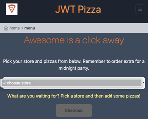

# ⓬ Penetration testing: JWT Pizza

🔑 **Key points**

- Execute a penetration test against a peer.
- Prevent your JWT Pizza from being penetrated.
- Create an incident report.

---


## Prerequisites

Before you start work on this deliverable make sure you have read all of the preceding instruction topics and have completed all of the dependent exercises (topics marked with a ☑). This includes:

- [Security Community](../securityCommunity/securityCommunity.md)
- [Penetration testing](../penetrationTesting/penetrationTesting.md)
- ☑ [Burp Suite](../burpSuite/burpSuite.md)

Failing to do this will likely slow you down as you will not have the required knowledge to complete the deliverable.

## Getting started

In order to demonstrate your mastery of the concepts for this deliverable, you will conduct two penetration tests of JWT Pizza. First you will attack your own JWT Pizza production deployment, and then you will attack the production deployment of an assigned peer. Together with your peer, you will then create a penetration test report.

### Attack record

As different attacks are conducted you will document each attack using the following format:

- Record the date that the attack was executed.
- Target website
- Classify the attack according to the [OWASP Top Ten](../securityCommunity/securityCommunity.md), or provide your own classification if the exploit does not fit those categories.
- Severity on a scale of 1 to 4
  1. **Critical**: The application is down or unusable.
  1. **High**: Authorization was escalated to administrator level. Performance was significantly impacted. Significant data was acquired.
  1. **Medium**: Customer credentials were impersonated or stolen. Minor performance impacted or specific feature disabled.
  1. **Low**: System configuration or not critical customer data was obtained.
- Description of result
- Capture images of the attack
- Corrections that were made

### Example attack record

| Item           | Result                                                                         |
| -------------- | ------------------------------------------------------------------------------ |
| Date           | June 18, 2053                                                                  |
| Target         | pizza.byucsstudent.click                                                       |
| Classification | Injection                                                                      |
| Severity       | 1                                                                              |
| Description    | SQL injection deleted database. All application data destroyed.                |
| Images         |  <br/> Stores and menu no longer accessible. |
| Corrections    | Sanitize user inputs.                                                          |

## Penetration test process

### Step 1: Self attack

Take the following steps to execute a penetration test on your JWT Pizza application.

1. Carefully review the JWT Pizza application functionality and code. Make notes about possible vulnerabilities and attack vectors.
1. Attempt to penetrate your deployment of JWT Pizza.
1. Make modifications to your fork and deployment of JWT Pizza in order to resolve any security issues that you discovered.

### Step 2: Peer attack

Take the following steps to execute a penetration test on a peer's JWT Pizza application.

1. Go to the AutoGrader and click on this deliverable to obtain the contact information for your assigned peer. This includes both their email address and JWT Pizza URL.
1. Communicate with your peer and decide on a date when you will conduct your penetration testing.
1. On the decided date, attempt to penetrate your peer's JWT Pizza deployment. Take careful notes about the preparation, actions, and results for the penetration test.

### Step 3: Generate a report

Meet with your peer and create a joint report in Markdown format. The report must contain the following sections.

1. Both peers names
1. Self attack
   1. Peer 1: Create an attack record for each attack.
   1. Peer 2: Create an attack record for each attack.
1. Peer attack
   1. Peer 1 attack on peer 2: Create an attack record for each attack.
   1. Peer 2 attack on peer 1: Create an attack record for each attack.
1. Combined summary of learnings

When you and your peer have completed the report, commit it to the root of your fork of the `jwt-pizza` repository in a directory named `penetrationTests` and a file name `peerTest.md`.

## ⭐ Deliverable

Complete the penetration tests defined above and produce the penetration report with your peer.

Copy the URL of the report in your GitHub repository and submit it to the Canvas assignment. This should look something like this:

```txt
https://github.com/byucsstudent/jwt-pizza/blob/main/penetrationTests/peerTest.md
```

### Rubric

| Percent | Item                          |
| ------- | ----------------------------- |
| 25%     | Self attack                   |
| 50%     | Peer attack                   |
| 25%     | Combined summary of learnings |

**Congratulations!** You have enhanced the security of your application. Time to go celebrate. I'm thinking hamburgers 🍔.
