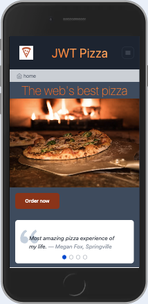

# Deliverable ⓵ Development deployment: JWT Pizza

🔑 **Key points**

- Fork JWT Pizza
- Run and explore JWT Pizza locally

---

## Prerequisites

Before you start work on this deliverable make sure you have read all of the preceding instruction topics and have completed all of the dependent exercises (topics marked with a ☑). This includes:

- ☑ [JWT Pizza Service](../jwtPizzaService/jwtPizzaService.md)
- ☑ [JWT Pizza data](../jwtPizzaData/jwtPizzaData.md)
- ☑ [JWT Pizza Client](../jwtPizzaClient/jwtPizzaClient.md)

Failing to do this, will likely slow you down as you will not have the required knowledge to complete the deliverable.

## Getting started

You now have everything you need to complete the first deliverable of the course. In this deliverable you will demonstrate that you have correctly forked and cloned the JWT Pizza application front and backend code, and that you have debugged through the code and understand how it works.

After you have followed all the steps in the associated exercises you should be able to interact with the JWT Pizza application deployed in your development environment by opening your browser, pointing it at `http://localhost:5173`.

## Code review

Your fork of the `jwt-pizza` repository contains a file named `notes.md`. That file contains a table that lists most of the activities that you can do in the application. This table is reproduced below.

| User activity                                       | Frontend component | Backend endpoints | Database SQL |
| --------------------------------------------------- | ------------------ | ----------------- | ------------ |
| View home page                                      |                    |                   |              |
| Register new user (t@jwt.com, pw: test)         |                    |                   |              |
| Login new user (t@jwt.com, pw: test)            |                    |                   |              |
| Order pizza                                         |                    |                   |              |
| Verify pizza                                        |                    |                   |              |
| View profile page                                   |                    |                   |              |
| View franchise (as diner)                       |                    |                   |              |
| Logout                                              |                    |                   |              |
| View About page                                     |                    |                   |              |
| View History page                                   |                    |                   |              |
| Login as franchisee (f@jwt.com, pw: franchisee) |                    |                   |              |
| View franchise (as franchisee)                  |                    |                   |              |
| Create a store                                      |                    |                   |              |
| Close a store                                       |                    |                   |              |
| Login as admin (a@jwt.com, pw: admin)           |                    |                   |              |
| View Admin page                                     |                    |                   |              |
| Create a franchise for t@jwt.com                    |                    |                   |              |
| Close the franchise for t@jwt.com                   |                    |                   |              |

Put breakpoints in both the front and backend code and start doing each of the user activities defined above. During your review, fill out the **Frontend component**, **Backend endpoints**, and **Database SQL** that were used in the activity. This will help you understand and document how the application works.

To get you started, we give you an example of what you need to supply for the first couple activities:

| User activity                               | Frontend component | Backend endpoints | Database SQL                                                                                                                 |
| ------------------------------------------- | ------------------ | ----------------- | ---------------------------------------------------------------------------------------------------------------------------- |
| View home page                              | home.jsx           | _none_            | _none_                                                                                                                       |
| Register new user (t@jwt.com, pw: test) | register.jsx          | [POST] /api/auth   | INSERT INTO user (name, email, password) VALUES (?, ?, ?) INSERT INTO userRole (userId, role, objectId) VALUES (?, ?, ?) |

Do not leave table cells blank. If there is nothing to write for a cell, put _none_ as shown in the example.

## ⭐ Deliverable

Once you have completed the review of the code and completely filled out the **User activity** table found in `notes.md`, commit and push your `notes.md` file to your jwt-pizza repo and submit that you have completed the work to the [AutoGrader](https://cs329.cs.byu.edu).

### Rubric

| Percent | Item                                                                                                                                                                                                                         |
| ------- | ---------------------------------------------------------------------------------------------------------------------------------------------------------------------------------------------------------------------------- |
| 30%     | Successfully forked the JWT Pizza repositories and added the TA as a collaborator.                                                                                                                                           |
| 70%     | Manually deployed JWT Pizza to your development environment. Used the debuggers to step through both the front and backend while completing the **User Activity** table found in the `notes.md` file of your jwt-pizza repo. |
