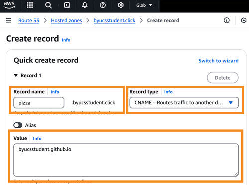
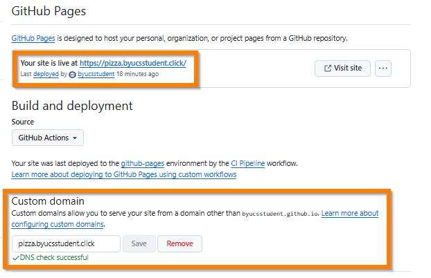
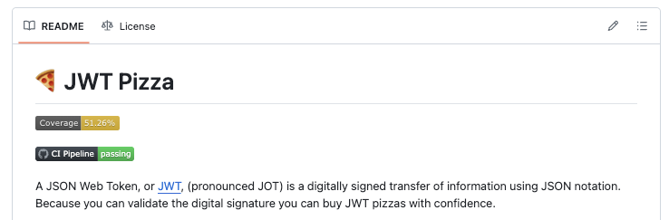

# Deliverable ⓶ Automated deployment: JWT Pizza

🔑 **Key points**

- Deploy the JWT Pizza frontend using a continuous integration pipeline and GitHub Pages

---


## Prerequisites

Before you start work on this deliverable make sure you have read all of the preceding instruction topics and have completed all of the dependent exercises (topics marked with a ☑). This includes:

- [Automation](../automation/automation.md)
- [Continuous integration (CI)](../continuousIntegration/continuousIntegration.md)
- ☑ [GitHub Actions](../gitHubActions/gitHubActions.md)
- [Static deployment](../staticDeployment/staticDeployment.md)
- ☑ [GitHub Pages](../gitHubPages/gitHubPages.md)

Failing to do this will likely slow you down as you will not have the required knowledge to complete the deliverable.

## Getting started

In your last deliverable you manually built and deployed the JWT Pizza frontend in your development environment. While this manual process works, it has several problems.

1. **Non-transferable**: The process only works in your development environment and cannot be reused to deploy your production system.
1. **Slow**: It requires a human to execute a series of steps. That slows down your ability to move quickly.
1. **Error-prone**: If a step is skipped or a parameter is misplaced it could cause the deployment to fail, or worse, take down the website entirely.
1. **Non-reproducible**: You have no recorded history of which steps were followed, or who executed them.

Basically, manual processes violate the prime directive of DevOps, that everything should be automated.

So now it is time to take the next step. You are going to use `GitHub Actions` and `GitHub Pages` to automate the static deployment of the frontend each time a commit is pushed to your fork of the jwt-pizza repository.

To do a static deployment of the JWT Pizza frontend you just need to do the following two steps:

1. Assign your domain name to point to GitHub Pages.
1. Modify the `ci.yml` that you used in the previous instruction so that instead of deploying a simple _Hello GitHub Pages_ frontend, it bundles the JWT Pizza React application and puts the result in the build artifact that is deployed to GitHub Pages.

## Assigning a custom domain

The JWT Pizza frontend doesn't work correctly unless it is hosted on the root path of the domain. By default, GitHub Pages hosts the static deployment on a path called `jwt-pizza`. To get around this you must associate a custom domain with your GitHub Pages deployment.

> [!NOTE]
>
> If you do not already own a DNS hostname, you will need to go lease one now. You will use your hostname for all of your DevOps deployment tasks. You can lease a domain from AWS using Route 53 or use a different provider if you are familiar with an alternative.

Using your domain name take the following steps in order to associate it to your GitHub Pages.

1. Add a `CNAME` record to your domain name DNS records that points to the GitHub Pages hostname. For example, if your GitHub account name was `byucsstudent`, you owned a domain named `byucsstudent.click`, and you wanted to associate the static deployment of JWT Pizza with the subdomain of `pizza.byucsstudent.click` you would create the following DNS record.

   ```txt
   record name: pizza.byucsstudent.click
   record type: CNAME
   record value: byucsstudent.github.io
   ```

   If you are using Route 53 then you would open the Hosted zone for your domain name and add a `CNAME` record by pressing on the **Create record** button. Then provide `pizza` as the subdomain, change the **Record type** to `CNAME`, and put your GitHub URL as the record value. For the example values given above, this would look like the following:

   

1. Wait for the newly created record to propagate. You can use `nslookup` or `dig` to verify that it is available.

   ```sh
   nslookup pizza.byucsstudent.click

   Name:    byucsstudent.github.io
   Addresses: 185.199.111.153
   Aliases:  pizza.byucsstudent.click
   ```

1. Open the GitHub Pages settings for the fork of your jwt-pizza repository.
1. Put your subdomain name in the `Custom domain` edit box and press `Save`.

   

1. Check the box to `Enforce HTTPS`.

   💡 It is interesting to consider how GitHub is able to generate a certificate for your domain. Perhaps this would make a great curiosity report.

1. After the check completes you can navigate your browser to your subdomain and verify that "Hello GitHub Pages" is still being displayed.

   ```sh
   curl https://pizza.youdomainhere

   Hello GitHub Pages
   ```

   The previous `youraccountnamehere.github.io/jwt-pages` URL should now redirect you with an HTTP `301` response to your new domain.

## Enhance your CI pipeline

Now you need to enhance your CI pipeline so that it deploys the JWT Pizza frontend instead of the simple Hello GitHub Pages frontend. This is done by modifying the `.github/workflows/ci.yml` you created in the previous exercise with the following workflow.

```yml
name: CI Pipeline

on:
  push:
    branches:
      - main
  workflow_dispatch:
jobs:
  build:
    name: Build
    runs-on: ubuntu-latest
    outputs:
      version: ${{ steps.set_version.outputs.version }}
    steps:
      - name: Checkout repo
        uses: actions/checkout@v4

      - name: Setup Node
        uses: actions/setup-node@v4
        with:
          node-version: '22.x'

      - name: set version
        id: set_version
        run: |
          version=$(date +'%Y%m%d.%H%M%S')
          echo "version=$version" >> "$GITHUB_OUTPUT"
          printf '{"version": "%s" }' "$version" > public/version.json

      - name: Build
        run: |
          npm ci && npm run build
          cp dist/index.html dist/404.html

      - name: Update pages artifact
        uses: actions/upload-pages-artifact@v3
        with:
          path: dist/
  deploy:
    needs: build
    permissions:
      pages: write
      id-token: write
    environment:
      name: github-pages
      url: ${{ steps.deployment.outputs.page_url }}
    runs-on: ubuntu-latest
    steps:
      - name: Deploy to GitHub Pages
        id: deployment
        uses: actions/deploy-pages@v4
```

Once you have made the change, commit and push. This should trigger Vite to bundle the source code and then deploy the `dist` directory to the repository's GitHub Pages URL.


🎉 Wow! Automation is awesome.

### Review of the workflow steps

Let's look at each of the steps in the GitHub Actions workflow.

First off we tell GitHub actions that we want to trigger this workflow whenever a commit is pushed into the main branch. We also add a trigger for when a **workflow dispatch** event is created, which will allow the AutoGrader to trigger your workflow manually or via an API call.

```yml
on:
  push:
    branches:
      - main
  workflow_dispatch:
jobs:
```

Next we define the jobs we want to run.

#### Build job

Our first job is named **build**. We specify that it will use the Linux operating system and that the job build is expected to output the version of the build.

```yml
build:
  name: Build
  runs-on: ubuntu-latest
  outputs:
    version: ${{ steps.set_version.outputs.version }}
```

The first step in the **build** job does a checkout of the repository.

```yml
steps:
  - name: Checkout repo
    uses: actions/checkout@v4
```

Then it installs Node.js version 20.

```yml
- name: Setup Node
  uses: actions/setup-node@v4
  with:
    node-version: '22.x'
```

We then create our version number, set it in a GitHub Action output variable that will make it available to other jobs, and persistently store it in a file named `version.json`.

```yml
- name: set version
  id: set_version
  run: |
    version=$(date +'%Y%m%d.%H%M%S')
    echo "version=$version" >> "$GITHUB_OUTPUT"
    printf '{"version": "%s" }' "$version" > public/version.json
```

Next it builds the distribution bundle by installing all the dependencies, running Vite to do the bundling, and then copying over our 404 handler file fix that we introduced in the last deliverable.

```yml
- name: Build
  run: |
    npm ci && npm run build
    cp dist/index.html dist/404.html
```

Finally, it packages up the `dist` directory and stores it as an artifact for the next job to deploy to GitHub Pages.

```yml
- name: Update pages artifact
  uses: actions/upload-pages-artifact@v3
  with:
    path: dist/
```

#### Deploy job

The `deploy` job specifies that it needs `build` to complete before it runs. It also provides the permission to act on your behalf in order to modify GitHub Pages for this repository.

```yml
needs: build
permissions:
  pages: write
  id-token: write
```

It then references the `github-pages` environment that was automatically created when you chose to use GitHub Actions to control the source of your GitHub Pages static deployment. This environment isolates what GitHub Pages needs from any other type of deployment environment that you might use.

```yml
environment:
  name: github-pages
  url: ${{ steps.deployment.outputs.page_url }}
```

The final step deploys the contents of the artifact that was created in the previous job. This looks like magic because it used a bunch of default parameters that are tightly coupled with the `upload-pages-artifact`. This includes the name of the artifact and where to deploy the files to.

```yml
- name: Deploy to GitHub Pages
  id: deployment
  uses: actions/deploy-pages@v4
```

## Adding a status badge

GitHub Actions will automatically create an image that shows the state of an Action workflow. You can reference the badge in the `README.md` file found in the root of your fork of `jwt-pizza`.

All you need to do copy the following Markdown, paste it in the README file, replace the account name with your GitHub account name, and commit.

```md
[](https://github.com/YOURACCOUNTNAMEHERE/jwt-pizza/actions/workflows/ci.yml)
```

Now whenever you pipeline runs you will be able to see the status in your repos home page on GitHub. Don't worry about the coverage reporting 0%. You will correct that in a future assignment.



## Wrap up

With less effort than it takes to do a manual deployment to your development environment, you are able to do an automated deployment to a production environment that is triggered by a git push.

We only showed a simple basic example of what you can do with GitHub Actions, but even that is pretty impressive. You should experiment with what the workflow is doing. It is all checked into git and so it is easy to revert whatever you mess up.

## ⭐ Deliverable

Complete the steps outlined above by creating a GitHub Actions workflow to deploy the JWT Pizza frontend whenever a change is pushed to the main branch.

Once JWT Pizza is live on your domain, go to the [AutoGrader](https://cs329.cs.byu.edu) and submit your work for the deliverable.

### Rubric

| Percent | Item                                                                                        |
| ------- | ------------------------------------------------------------------------------------------- |
| 50%     | Successful execution of GitHub Actions to deploy JWT Pizza to GitHub Pages on push          |
| 10%     | Version updated with each build and visible in app footer.                                  |
| 35%     | Completely functional JWT Pizza deployed with GitHub Pages accessible on custom domain name |
| 5%      | Pipeline status badge display on your JWT Pizza **README.md** home page                     |
