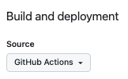

# Deliverable 2: Automated deployment


In your last deliverable we manually builded the JWT Pizza frontend, copied it into a branch, and pushed it to GitHub pages. While this process works, it has several problems.

1. **Slow**: It requires a human to execute a series of steps. That slows down your ability to move quickly.
1. **Error prone**: If a step is skipped or a parameter is misplaced it could cause the deployment to fail, or worse take down the website entirely.
1. **Non-reproducible**: You have no way of knowing what steps were followed, or who even executed them.

Basically, manual processes violates the prime directive of DevOps, that everything should be automated.

So now it is time to take the next step. You are going to use `GitHub Actions` to deploy your static deployment each time a commit is pushed to your fork of the jwt-pizza repository.

## Create the GitHubAction workflow

Here are the steps to make all the automation magic happen.

1. Open your fork of `jwt-pizza`.
1. Change the GitHub Pages option for the _Build and deployment/Source_ to `GitHub Actions`. This causes GitHub to add an environment called `github-pages`

   > 

   This turns off the monitoring of the `gh-pages` branch so that it will no longer trigger a deployment.

1. Create a file named `.github/workflows/deploy-github-pages.yml`. This file is the automation script that GitHub actions will execute whenever you make a commit to the `main` branch.
1. Insert the following into the newly created file

   ```yml
   name: Build and deploy to GitHub Pages

   on:
     push:
       branches:
         - main

   jobs:
     build:
       name: Build frontend
       runs-on: ubuntu-latest
       steps:
         - name: Checkout repo
           uses: actions/checkout@v4

         - name: Setup Node
           uses: actions/setup-node@v4
           with:
             node-version: '20.x'

         - name: Build
           run: |
             npm ci && npm run build
             cp dist/index.html dist/404.html

         - name: Update pages artifact
           uses: actions/upload-pages-artifact@v3
           with:
             path: dist/
     deploy:
       needs: build
       permissions:
         pages: write
         id-token: write
       environment:
         name: github-pages
         url: ${\{ steps.deployment.outputs.page_url }}
       runs-on: ubuntu-latest
       steps:
         - name: Deploy to GitHub Pages
           id: deployment
           uses: actions/deploy-pages@v4
   ```

1. Commit and push. This should trigger Vite to bundle the source code and then deploy the `dist` directory to the repository's GitHub Pages URL. 🎉 Wow! Automation is awesome.

## Review of the workflow steps

Let's look at each of the steps in the GitHub Actions workflow.

First off we tell GitHub actions that we want to trigger this workflow whenever a commit is pushed into the main branch.

```yml
on:
  push:
    branches:
      - main
```

Next we define the jobs we want to run.

### Build job

The `build` job first does a checkout of the repository.

```yml
- name: Checkout repo
  uses: actions/checkout@v4
```

Then it installs Node.js version 20.

```yml
- name: Setup Node
  uses: actions/setup-node@v4
  with:
    node-version: '20.x'
```

Next it builds the distribution bundle by installing all the dependencies, running Vite to do the bundling, and then copying over our 404 handler file fix that we introduced in the last deliverable.

```yml
- name: Build
  run: |
    npm ci && npm run build
    cp dist/index.html dist/404.html
```

Finally it packages up the `dist` directory and stores it as an artifact for the next job to deploy to GitHub Pages.

```yml
- name: Update pages artifact
  uses: actions/upload-pages-artifact@v3
  with:
    path: dist/
```

### Deploy job

The `deploy` job specifies that it needs `build` to complete before it runs. It also provides the permission to act on your behalf in order to modify GitHub Pages for this repository.

```yml
needs: build
permissions:
  pages: write
  id-token: write
```

It then references the `github-pages` environment that was automatically created when you chose to use GitHub Actions to control the source of your GitHub Pages static deployment. This environment isolates what GitHub Pages needs from any other type of deployment environment that you might use.

```yml
environment:
  name: github-pages
  url: ${\{ steps.deployment.outputs.page_url }}
```

The final step deploys the contents of the artifact that was created in the previous job. This looks like magic because it used a bunch of default parameters that are tightly coupled with the `upload-pages-artifact`. This includes the name of the artifact and where to deploy the files to.

```yml
- name: Deploy to GitHub Pages
  id: deployment
  uses: actions/deploy-pages@v4
```

## Wrap up

In about the same amount of code that we used to do our manual deployment we are able to do an automated deployment that is triggered by a git push.

We only showed a simple basic example of what you can do with GitHub Actions, but even that is pretty impressive. You should experiment with what the workflow is doing. It is all checked to git and so it is easy to revert whatever you mess up.

## ☑ Assignment

Complete the steps outlined above by creating a GitHub Actions workflow to deploy the JWT Pizza frontend whenever a change is pushed to the main branch.

Once JWT Pizza is live on your domain, go over to Canvas and submit the URL. This should look something like this:

```txt
https://pizza.yourdomainname.click
```
