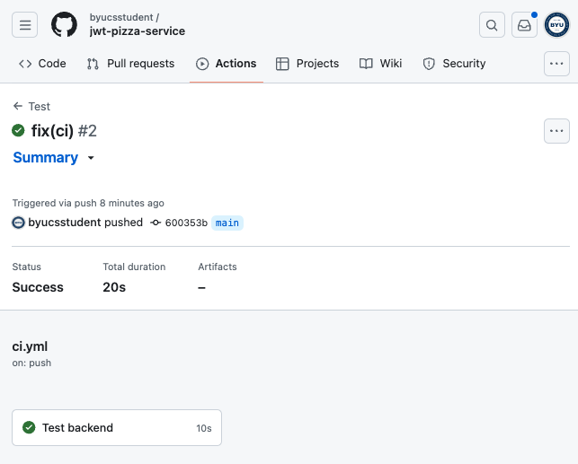
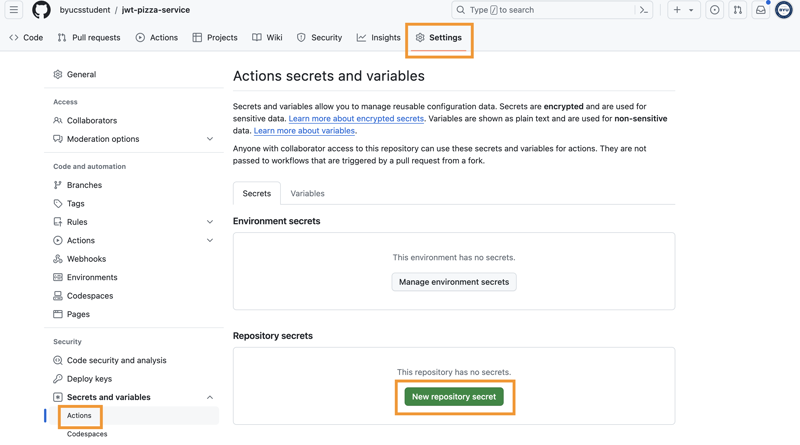
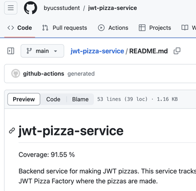

# Deliverable ⓷: Unit testing - CI

Now that you have added linting and created unit tests for the **jwt-pizza-service**, you are ready to implement the continuous integration (CI) process that will validate the code and calculate coverage on every commit.

## Create the GitHub Action workflow

In your fork of the **jwt-pizza-service** create the file `.github/workflows/ci.yml` and add the following.

```yml
name: Test

on:
  push:
    branches:
      - main

jobs:
  validate:
    name: Test and analyze backend
    runs-on: ubuntu-latest
    steps:
      - name: Checkout repo
        uses: actions/checkout@v4

      - name: Setup Node
        uses: actions/setup-node@v4
        with:
          node-version: '20.x'

      - name: Install dependencies
        run: npm ci

      - name: Lint
        run: npm run lint
```

This workflow is fairly simple. It checks out the code, installs the NPM dependencies, and runs the linter.

When you commit and push this change, you can view the workflow executing on the GitHub Actions view of your repository. Assuming that you have cleaned up all of the linting error, you should see something similar to the following.

> 

If you go and introduce a linting error to your code by doing something like declaring an unused variable, you should see an error when you commit.

> 

## Executing tests in the workflow

Running the linter is fine, but what we really want to do is run our tests. This is complicated by the fact that we didn't mock out the database calls, and therefore your tests need a database to run against. You could go back and mock out the database calls. Doing so would make your tests faster, but would also remove a crucial integration test that represents a significant piece of what the service is doing. Additionally, creating a mock of the database could hide many possible errors, while creating a lot of testing code to maintain.

So instead let's have GitHub Actions run with an instance of MySQL already running on it.

### Using MySQL in GitHub Actions

To set up MySQL you need to add the following to your workflow.

```yml
services:
  mysql:
    image: mysql:8.0.29
    env:
      MYSQL_ROOT_PASSWORD: temppwd
      MYSQL_DATABASE: pizza
    ports:
      - '3306:3306'
    options: >-
      --health-cmd "mysqladmin ping -ptemppwd"
      --health-interval 10s
      --health-start-period 10s
      --health-timeout 5s
      --health-retries 10
```

This tells GitHub that you require the MySQL service to be installed. We also provide the credentials that we want to use for the database. There isn't really a security problem with doing this since it is only a temporary database that will get thrown away once the tests are done. We just need to make sure we don't use any real credentials here. The `options` portion of the workflow specifies to wait until the `health-cmd` returns successfully. In this case we will wait ten seconds and then keep trying every ten seconds. When this completes our MySQL database is ready to use.

### Providing configuration and secrets

Next, we create the configuration file that tells the service how to connect with the database. To do this we add the following step that will write out our config to a file named `src/config.js`.

```yml
- name: Write config file
  run: |
    echo "module.exports = {
      jwtSecret: '908f908dsvjdfnjoidfabv0j9few09gfdesjibdfsnkml',
      db: {
        connection: {
          host: '127.0.0.1',
          user: 'root',
          password: 'temppwd',
          database: 'pizza',
          connectTimeout: 60000,
        },
        listPerPage: 10,
      },
      factory: {
        url: 'https://jwt-pizza-factory.cs329.click',
        apiKey: '${{ secrets.FACTORY_API_KEY }}',
      },
    };" > src/config.js
```

Notice that we use the same temporary password that we supplied above. We can also provide some random `jwtSecret` since it will only be useful while testing. The tricky one is the factory `apiKey`. This needs to be the actual API Key given to you from JWT Headquarters so that your service can create pizza JWTs. However, you can't check it into GitHub because it will be visible to the world. So you need to create a [repository secret](https://docs.github.com/en/actions/security-guides/using-secrets-in-github-actions) and then reference the secret in your workflow.

Using the GitHub Repository dashboard for your fork of `jwt-pizza-service`, select the repository's settings and then `Secrets and variables | Actions`. Chose to create a `New repository secret`.



Enter the name `FACTORY-API-KEY` and then enter the value your received for making calls to the factory. Press `Save key` and then it is ready to be used in your workflow with the template placeholder of `${{ secrets.FACTORY_API_KEY }}`.


### Running the tests

With MySQL running and our configuration all set up, you just need to add the step to actually run the tests and coverage reporting.

```yml
- name: Tests
  run: npm test
```

That's it! Your tests are ready to run every time you commit to the repository.

## Reporting coverage and adding a version number

Before you run your new workflow let's add one more thing. We want to be able to report our coverage publicly. One easy way to do that is to update the `coverageBadge.svg` file that is displayed in the README.md file with the latest coverage percentage. We do this with the help of an image generator found at `img.shields.io`.

We also generate a version file that contains the latest version ID based upon the time that the code was committed.

Here is the step to add these to pieces.

```yml
- name: Update coverage and version
  run: |
    printf '{"version": "%s" }' $(date +'%Y%m%d.%H%M%S') > version.json
    coverage_pct=$(grep -o '"pct":[0-9.]*' coverage/coverage-summary.json | head -n 1 | cut -d ':' -f 2)
    color=$(echo "$coverage_pct < 80" | bc -l | awk '{if ($1) print "yellow"; else print "green"}')
    sed -i "s/^Coverage: .*/Coverage: $coverage_pct %/" README.md
    curl https://img.shields.io/badge/Coverage-$coverage_pct%25-$color -o coverageBadge.svg
    git config user.name github-actions
    git config user.email github-actions@github.com
    git add .
    git commit -m "generated"
    git push
```

Now when you commit and push these changes to GitHub it should automatically do the following:

1. Analyze for lint
1. Run all of your tests
1. Calculate and report coverage
1. Create a version number

The output from successfully running the workflow should look something like this.


The README.md file should also display the current coverage and there should be a file named `version.json` in the root of the repository.



## The final workflow

Here is the final workflow. Make sure you completely understand everything in this file. Having a solid understanding of this file will help you as we add more complexity to our CI pipelines in later deliverables.

```yml
name: Test

on:
  push:
    branches:
      - main

jobs:
  validate:
    name: Test and analyze
    runs-on: ubuntu-latest
    services:
      mysql:
        image: mysql:8.0.29
        env:
          MYSQL_ROOT_PASSWORD: temppwd
          MYSQL_DATABASE: pizza
        ports:
          - '3306:3306'
        options: >-
          --health-cmd "mysqladmin ping -ptemppwd"
          --health-interval 10s
          --health-start-period 10s
          --health-timeout 5s
          --health-retries 10
    steps:
      - name: Checkout repo
        uses: actions/checkout@v4

      - name: Setup Node
        uses: actions/setup-node@v4
        with:
          node-version: '20.x'

      - name: Install dependencies
        run: npm ci

      - name: Lint
        run: npm run lint

      - name: Write config file
        run: |
          echo "module.exports = {
            jwtSecret: '908f908dsvjdfnjoidfabv0j9few09gfdesjibdfsnkml',
            db: {
              connection: {
                host: '127.0.0.1',
                user: 'root',
                password: 'temppwd',
                database: 'pizza',
                connectTimeout: 60000,
              },
              listPerPage: 10,
            },
            factory: {
              url: 'https://jwt-pizza-factory.cs329.click',
              apiKey: '${{ secrets.FACTORY_API_KEY }}',
            },
          };" > src/config.js

      - name: Tests
        run: npm test

      - name: Update coverage and version
        run: |
          printf '{"version": "%s" }' $(date +'%Y%m%d.%H%M%S') > version.json
          coverage_pct=$(grep -o '"pct":[0-9.]*' coverage/coverage-summary.json | head -n 1 | cut -d ':' -f 2)
          color=$(echo "$coverage_pct < 80" | bc -l | awk '{if ($1) print "yellow"; else print "green"}')
          sed -i "s/^Coverage: .*/Coverage: $coverage_pct %/" README.md
          curl https://img.shields.io/badge/Coverage-$coverage_pct%25-$color -o coverageBadge.svg
          git config user.name github-actions
          git config user.email github-actions@github.com
          git add .
          git commit -m "generated"
          git push
```

## ☑ Assignment

In order to demonstrate your mastery of the concepts for this phase, complete the following.

1. Create Jest tests for the `jwt-pizza-service` that provide at least 80% coverage.
1. Add linting.
1. Create a GitHub Actions workflow that executes the tests and linting.
1. Add the configuration necessary so that the workflow fails if there is not 80% coverage or the linting fails.
1. Add the reporting of the coverage to the workflow.
1. Add the creation of a version file named `version.json`.

Once this is all working submit the URL of your fork of the `jwt-pizza-service` repository to the Canvas assignment. This should look something like this:

```txt
https://github.com/youraccountnamehere/jwt-pizza-service
```
