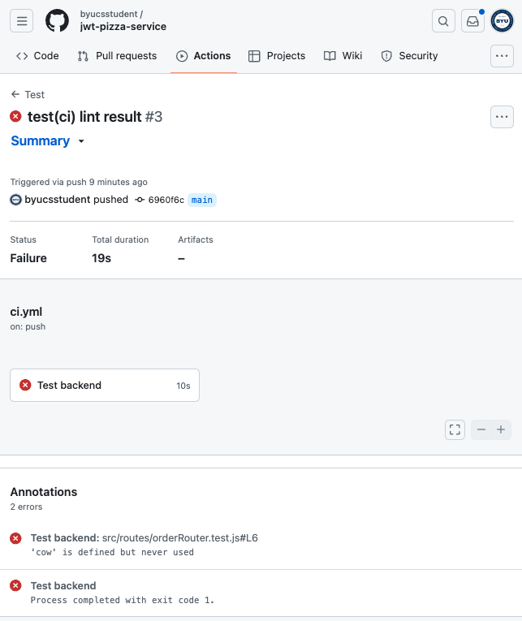
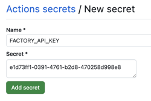
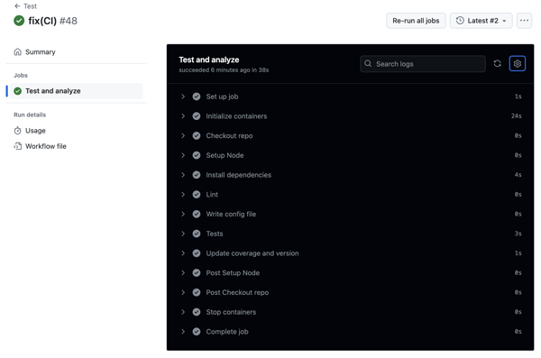

# Deliverable ⓷ Unit testing CI: JWT Pizza Service

🔑 **Key points**

- Deploy your tests, coverage and linting analysis using a CI pipeline.
- Protect the confidentiality of your secrets
- Create a version ID

[🎥 Video overview](https://youtu.be/PKiRH2ZKZeM)

---


## Prerequisites

Before you start work on this deliverable make sure you have read all of the preceding instruction topics and have completed all of the dependent exercises (topics marked with a ☑). This includes:

- [Testing](../testing/testing.md)
- [Testing variations](../testingCategories/testingCategories.md)
- [Coverage](../coverage/coverage.md)
- [Jest Basics](../jestBasics/jestBasics.md)
- ☑ [Jest Advanced](../jestAdvanced/jestAdvanced.md)
- ☑ [Test driven development (TDD)](../tdd/tdd.md)
- ☑ [Service testing](../serviceTesting/serviceTesting.md)
- ☑ [Lint](../lint/lint.md)
- [Dependency injection](../dependencyInjection/dependencyInjection.md)
- [Integration testing](../integrationTesting/integrationTesting.md)
- ☑ [JWT Pizza Service](../jwtPizzaService/jwtPizzaService.md)
- [JWT Pizza data](../jwtPizzaData/jwtPizzaData.md)
- [Unit testing: JWT Pizza Service](../unitTestingJwtPizzaService/unitTestingJwtPizzaService.md)

Failing to do this will likely slow you down as you will not have the required knowledge to complete the deliverable.

## Getting started

Now that you have added linting and created unit tests for the **jwt-pizza-service**, you are ready to implement the continuous integration (CI) process that will validate the code with tests and calculate coverage on every commit. This will complete your work on this deliverable.

## Create the GitHub Action workflow

In your fork of the **jwt-pizza-service** create the file `.github/workflows/ci.yml` and add the following.

```yml
name: CI Pipeline

on:
  push:
    branches:
      - main
  workflow_dispatch:
jobs:
  build:
    name: Build
    runs-on: ubuntu-latest
    outputs:
      version: ${{ steps.set_version.outputs.version }}
    steps:
      - name: Checkout repo
        uses: actions/checkout@v4

      - name: Setup Node
        uses: actions/setup-node@v4
        with:
          node-version: '22.x'

      - name: Install dependencies
        run: npm ci

      - name: Lint
        run: npm run lint
```

This workflow is fairly simple. It specifies it will output a version number, checks out the code, installs the NPM dependencies, and runs the linter.

When you commit and push this change, you can view the workflow executing on the GitHub Actions view of your repository. Assuming that you have cleaned up all the linting errors, you should see something similar to the following.


If you go and introduce a linting error to your code by doing something like declaring an unused variable, you should see an error when you commit.



## Executing tests in the workflow

Running the linter is fine, but what we really want to do is run our tests. This is complicated by the fact that we didn't mock out the database calls, and therefore your tests need a database to run against. You could go back and mock out the database calls. Doing so would make your tests faster, but would also remove a crucial integration test that represents a significant piece of what the service is doing. Additionally, mocking the database would create a lot of testing code to maintain.

So instead let's have GitHub Actions run with an instance of MySQL already running on it.

### Storing secrets

The first step is security. Your repository is public and so you want to make sure that you keep secret anything that would give an advantage to a nefarious party. This includes your JWT Factory API key, JWT authorization token secret, and database password. You can hide these secrets by creating [repository secrets](https://docs.github.com/en/actions/security-guides/using-secrets-in-github-actions) and then referencing the secrets in your workflow.

Using the GitHub Repository dashboard for your fork of `jwt-pizza-service`, select the repository's settings and then `Secrets and variables | Actions`. Chose to create a `New repository secret`.


Enter the name `FACTORY_API_KEY` and then enter the value you received for making calls to the factory. Press `Save key`, and then it is ready to be used in your workflow with the template placeholder of `${{ secrets.FACTORY_API_KEY }}`.



Go ahead and create the following secrets.

| Secret          | Description                                                            | Example                         |
| --------------- | ---------------------------------------------------------------------- | ------------------------------- |
| JWT_SECRET      | A random value that you create for signing your authentication tokens. | 343ab90294hijkfd2fdsaf4dsa3f424 |
| FACTORY_API_KEY | The API Key for making calls to the Headquarters factory               | 83025y7098dsf9310dc90           |

### Using MySQL in GitHub Actions

To set up MySQL you need to add the following to your workflow.

```yml
services:
  mysql:
    image: mysql:8.0.29
    env:
      MYSQL_ROOT_PASSWORD: tempdbpassword
      MYSQL_DATABASE: pizza
    ports:
      - '3306:3306'
    options: >-
      --health-cmd "mysqladmin ping -ptempdbpassword" --health-interval 10s --health-start-period 10s --health-timeout 5s --health-retries 10
```

This tells GitHub that you require the MySQL service to be installed. We also provide the credentials that we want to use for the database. There isn't really a security problem with doing this since it is only a temporary database that will get thrown away once the tests are done. We just need to make sure we don't use any real credentials here. The `options` portion of the workflow specifies to wait until the `health-cmd` returns successfully. In this case we will wait ten seconds and then keep trying every ten seconds. When this completes our MySQL database is ready to use.

### Providing configuration and secrets

Next, we create the configuration file that tells the service how to connect with the database. To do this we add the following step that will write out our config to a file named `src/config.js`.

```yml
- name: Write config file
  run: |
    echo "module.exports = {
      jwtSecret: '${{ secrets.JWT_SECRET }}',
      db: {
        connection: {
          host: '127.0.0.1',
          user: 'root',
          password: 'tempdbpassword',
          database: 'pizza',
          connectTimeout: 60000,
        },
        listPerPage: 10,
      },
      factory: {
        url: 'https://pizza-factory.cs329.click',
        apiKey: '${{ secrets.FACTORY_API_KEY }}',
      },
    };" > src/config.js
```

### Running the tests

With MySQL running and our configuration all set up, you just need to add the step to actually run the tests and coverage reporting.

```yml
- name: Tests
  run: npm test
```

That's it! Your tests are ready to run every time you commit to the repository.

## Adding a version number

Before you run your new workflow you need to add a version number and report on the code coverage. The version is stored in a file named `version.json` and is represented with the current date and time.

```yml
- name: set version
  id: set_version
  run: |
    version=$(date +'%Y%m%d.%H%M%S')
    echo "version=$version" >> "$GITHUB_OUTPUT"
    printf '{"version": "%s" }' "$version" > src/version.json
```

## Adding coverage reporting


You can report your coverage publicly by updating the `coverageBadge.svg` file that is displayed in the README.md file with the latest coverage percentage. We do this with the help of an image generator found at `img.shields.io`.

In order to publicly display your coverage you will create a badge that displays your coverage percentage. We use the **Badge Me** service to create, store, and retrieve badges that you then display in your **README.md** file. The Badge Me service requires you to provide an authorization token that you define. You will supply your JWT Pizza API token to authorize the creation of a badge.

```yml
- name: Update coverage
  run: |
    coverage=$(jq '.total.lines.pct' coverage/coverage-summary.json)
    color=$(echo "$coverage < 80" | bc | awk '{if ($1) print "red"; else print "green"}')
    curl -s -X POST "https://badge.cs329.click/badge/${{ github.repository_owner }}/jwtpizzaservicecoverage?label=Coverage&value=$coverage%25&color=$color" -H "authorization: bearer ${{ secrets.FACTORY_API_KEY }}"
```

To make your coverage badge appear in your README.md file, you will need to add the following markdown image reference to the **Badge Me** service URL representing the coverage badge that your CI pipeline created. Make sure you replace the placeholder with your GitHub account name.

```md

```

> [!NOTE]
>
> If your README.md already contains a reference for the coverage badge then replace it with the new definition provided above.

## The final workflow

Now when you commit and push these changes to GitHub it should automatically do the following:

1. Analyze for lint
1. Run all of your tests
1. Create a version number
1. Calculate and report coverage

The output from successfully running the workflow should look something like this.



The README.md file should also display the current coverage and there should be a file named `version.json` in the src directory of the repository.


Here is the final workflow. Make sure you completely understand everything in this file. Having a solid understanding of this file will help you as we add more complexity to our CI pipelines in later deliverables.

```yml
name: CI Pipeline

on:
  push:
    branches:
      - main
  workflow_dispatch:
jobs:
  build:
    name: Build
    runs-on: ubuntu-latest
    outputs:
      version: ${{ steps.set_version.outputs.version }}
    services:
      mysql:
        image: mysql:8.0.29
        env:
          MYSQL_ROOT_PASSWORD: tempdbpassword
          MYSQL_DATABASE: pizza
        ports:
          - '3306:3306'
        options: >-
          --health-cmd "mysqladmin ping -ptempdbpassword" --health-interval 10s --health-start-period 10s --health-timeout 5s --health-retries 10


    steps:
      - name: Checkout repo
        uses: actions/checkout@v4

      - name: Setup Node
        uses: actions/setup-node@v4
        with:
          node-version: '22.x'

      - name: Install dependencies
        run: npm ci

      - name: Lint
        run: npm run lint

      - name: Write config file
        run: |
          echo "module.exports = {
            jwtSecret: '${{ secrets.JWT_SECRET }}',
            db: {
              connection: {
                host: '127.0.0.1',
                user: 'root',
                password: 'tempdbpassword',
                database: 'pizza',
                connectTimeout: 60000,
              },
              listPerPage: 10,
            },
            factory: {
              url: 'https://pizza-factory.cs329.click',
              apiKey: '${{ secrets.FACTORY_API_KEY }}',
            },
          };" > src/config.js

      - name: Tests
        run: npm test

      - name: set version
        id: set_version
        run: |
          version=$(date +'%Y%m%d.%H%M%S')
          echo "version=$version" >> "$GITHUB_OUTPUT"
          printf '{"version": "%s" }' "$version" > src/version.json

      - name: Update coverage
        run: |
          coverage=$(jq '.total.lines.pct' coverage/coverage-summary.json)
          color=$(echo "$coverage < 80" | bc | awk '{if ($1) print "red"; else print "green"}')
          curl -s -X POST "https://badge.cs329.click/badge/${{ github.repository_owner }}/jwtpizzaservicecoverage?label=Coverage&value=$coverage%25&color=$color" -H "authorization: bearer ${{ secrets.FACTORY_API_KEY }}"
```

## ⭐ Deliverable

In order to demonstrate your mastery of the concepts for this deliverable, complete the following.

1. Create Jest tests for `jwt-pizza-service` that provide at least 80% coverage.
1. Add linting.
1. Create a GitHub Actions workflow that executes the tests and linting.
1. Add the configuration necessary so that the workflow fails if there is not 80% coverage or the linting fails.
1. Add the reporting of the coverage to the workflow by creating a coverage badge in the README.md file.
1. Add the creation of a version file named `src/version.json`.

Once this is all working, go to the [AutoGrader](https://cs329.cs.byu.edu) and submit your work for the deliverable.

### Rubric

| Percent | Item                                                                               |
| ------- | ---------------------------------------------------------------------------------- |
| 10%     | Successful execution of GitHub Actions to run lint on commit                       |
| 20%     | Successful execution of GitHub Actions to run tests on commit                      |
| 70%     | At least 80% line coverage as documented by workflow execution and README.md badge |

Time to go and celebrate. How about cake 🍰?
