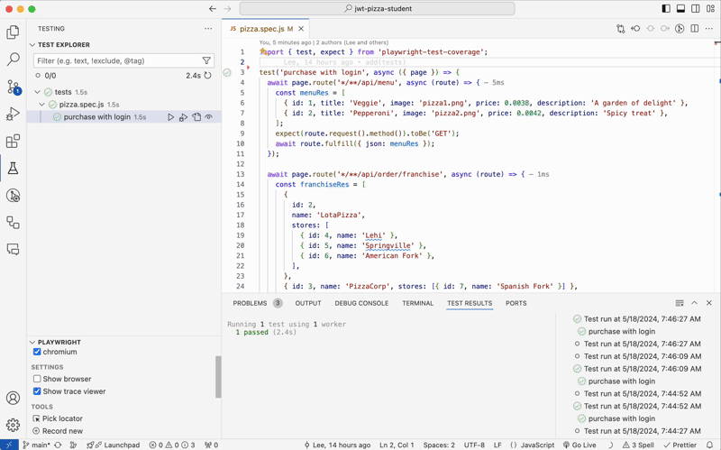
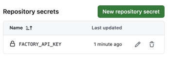
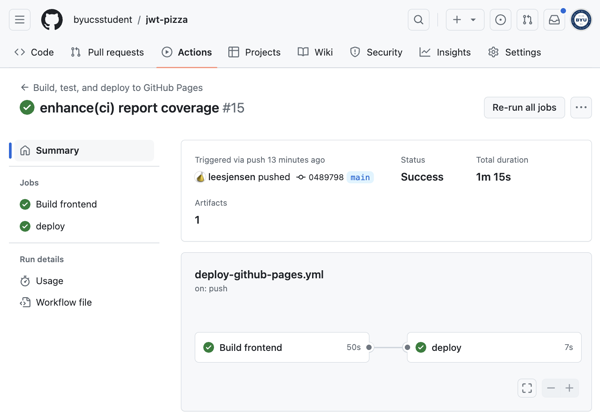

# Deliverable ⓸ User Interface testing: JWT Pizza

🔑 **Key points**

- Use Playwright for JWT Pizza testing
- Learn to create tests by recording browser interactions
- Compute coverage
- Mock out the JWT Pizza Service
- Update the CI pipeline to run the tests

[🎥 Video overview](https://youtu.be/qvf1kaT_wr0)

---


## Prerequisites

Before you start work on this deliverable make sure you have read all of the preceding instruction topics and have completed all of the dependent exercises (topics marked with a ☑). This includes:

- [UI testing](../uiTesting/uiTesting.md)
- ☑ [Playwright](../playwright/playwright.md)

Failing to do this will likely slow you down as you will not have the required knowledge to complete the deliverable.

## Getting started

With the UI testing skills you have learned you are now ready to test the JWT Pizza frontend. As part of these tests you will mock out the backend service so that you don't have to worry about the problems that come with integration testing.

### Configuring Playwright

You previously created a fork of `jwt-pizza`. Now you need to add Playwright and the coverage functionality. The first step is to install the required packages and set up the project using what you learned in the [Playwright instruction](../playwright/playwright.md). Don't worry about writing any tests while you are configuring Playwright. At this point you are just making it so that you can run the example Playwright tests and verify that you have configured everything correctly.

One difference that you want to make when configuring the JWT Pizza frontend for testing is to only require the line coverage to be 80%. You can do this by modifying the `.nycrc.json` file.

```js
{
  "check-coverage": true,
  "branches": 0,
  "lines": 80,
  "functions": 0,
  "statements": 0
}
```

### Running the first test

After all that setup you should be able to run the default Playwright tests and see the results with coverage turned on.

```sh
➜ npm run test:coverage

Running 2 tests using 2 workers
  2 passed (2.8s)

----------|---------|----------|---------|---------|-------------------
File      | % Stmts | % Branch | % Funcs | % Lines | Uncovered Line #s
----------|---------|----------|---------|---------|-------------------
All files |       0 |        0 |       0 |       0 |
----------|---------|----------|---------|---------|-------------------
```

This isn't very exciting since the default test doesn't actually execute any of the Pizza code. Let's write a simple test to get the ball rolling. Delete `example.spec.js` and create a new test file called `pizza.spec.js`.

```js
import { test, expect } from 'playwright-test-coverage';

test('home page', async ({ page }) => {
  await page.goto('/');

  expect(await page.title()).toBe('JWT Pizza');
});
```

Now when we run the test we get **19.93%** line coverage. Just for loading the home page!

```sh
➜  npm run test:coverage
-------------------------|---------|----------|---------|---------|-------------------
File                     | % Stmts | % Branch | % Funcs | % Lines | Uncovered Line #s
-------------------------|---------|----------|---------|---------|-------------------
All files                |   20.49 |    23.45 |   23.07 |   19.93 |
```

## Using a development JWT Pizza Service

In order to test your frontend JWT Pizza in your development environment, you need to have a running JWT Pizza server. Because of the work you did to set up JWT Pizza server in your development environment you should already be ready to go. However, you will want to make sure this is all working before you start writing serious tests.

### Configuring the frontend

You can determine the location of your server by examining the JWT Pizza `.env.development` file that contains the URLs for the frontend dependencies. Open that file and make sure that the `VITE_PIZZA_SERVICE_URL` is set to use your local development environment. This should look like the following:

```sh
VITE_PIZZA_SERVICE_URL=http://localhost:3000
VITE_PIZZA_FACTORY_URL=https://pizza-factory.cs329.click
```

### Configuring the pizza data

Next, you need make sure you have some JWT Pizza data stored in your development environment. If you don't currently have any data then go and follow the [instruction](../jwtPizzaData/jwtPizzaData.md) for inserting it.

### Configuring the backend

You then need to start up your JWT Pizza server so that the server is listening on `localhost:3000` and can respond to your frontend code as your UI tests are ran.

```sh
cd jwt-pizza-service
npm run start
```

## Recording a test

Creating a test from scratch can be time consuming. Instead, we can use the VS Code Playwright extension `Record at cursor` functionality to give us a jump start on writing our tests. Open your `pizza.spec.js` file and add a new empty test.

```js
test('buy pizza with login', async ({ page }) => {});
```

Put your cursor in the body of the test function, open the `Test Explorer` tab and press the `Record at cursor` action. This wil start up the recording. Then go through the steps of ordering a pizza and logging in as prompted.


After all that is done you should end up with a test that looks something like the following.

```js
test('buy pizza with login', async ({ page }) => {
  await page.goto('/');
  await page.getByRole('button', { name: 'Order now' }).click();
  await expect(page.locator('h2')).toContainText('Awesome is a click away');
  await page.getByRole('combobox').selectOption('1');
  await page.getByRole('link', { name: 'Image Description Veggie A' }).click();
  await page.getByRole('link', { name: 'Image Description Pepperoni' }).click();
  await expect(page.locator('form')).toContainText('Selected pizzas: 2');
  await page.getByRole('button', { name: 'Checkout' }).click();
  await page.getByPlaceholder('Email address').click();
  await page.getByPlaceholder('Email address').fill('d@jwt.com');
  await page.getByPlaceholder('Email address').press('Tab');
  await page.getByPlaceholder('Password').fill('diner');
  await page.getByRole('button', { name: 'Login' }).click();
  await expect(page.getByRole('main')).toContainText('Send me those 2 pizzas right now!');
  await expect(page.locator('tbody')).toContainText('Veggie');
  await page.getByRole('button', { name: 'Pay now' }).click();
  await expect(page.getByRole('main')).toContainText('0.008 ₿');
});
```

Go ahead and run the test in VS Code to make sure it works and then run the test again with coverage from the command console. This will result in something similar to the following:

```sh
➜  npm run test:coverage
ERROR: Coverage for lines (35.12%) does not meet global threshold (80%)
-------------------------|---------|----------|---------|---------|-----------------------------
File                     | % Stmts | % Branch | % Funcs | % Lines | Uncovered Line #s
-------------------------|---------|----------|---------|---------|-----------------------------
All files                |   49.37 |    61.72 |   46.15 |   48.41 |
-------------------------|---------|----------|---------|---------|-----------------------------
```

That takes us to somewhere around **48ish%** line coverage. This seems really promising, and if we keep going down this path it feels like will have 80% coverage in no time. However, there is a demon waiting in the wings. Currently, the `.env.development` configuration file has you using your local JWT Pizza Service, and the JWT Headquarter's Pizza Factory service. That is nice from the integration testing standpoint, but the data hosted on that service is going to change constantly and that will introduce a lot of flake into our tests. Additionally, we eventually want to run our tests with GitHub Actions, and we don't want that to be dependent on any external environment that can change.

## Mocking JWT Pizza Service

A different option is to mock out the JWT service. That way, we are only testing the frontend. This will make the tests more stable and even make them run faster, but it has the disadvantage of insulating us from bugs that might get introduced when the protocol between the front and backend changes. Still, this seems like the right option. So let's look at converting the test we just created over to using a mocked out service.

First we need to figure out which endpoints the test uses. To accomplish this, we can use the Playwright Trace Viewer. This will show us all the network requests that were made at each step of the test. We can then use the Playwright `route` method to create mocks for each network request.

### Recording endpoint requests

Follow these steps to use Trace Viewer to get the network requests.

1. Open up the Test Explorer in VS Code.
1. Select `Show trace viewer` from the Playwright pane located under the list of tests.
1. Run the test that we recorded earlier.
1. Trace Viewer should open at this point and execute all the test steps.
1. In the **tools** pane at the bottom of the browser, select the `Network` tab.
1. Sort by 'Content Type'. This should move all the fetch requests to the top of the list.
1. Examine the requests to see what URL, HTTP method, request and response bodies were used for each request.



This shows us that we made four requests. After we simplify them, we have the following.

| method | endpoint        | request body                                                                                                                                       | response body                                                                                                                                                                                                                                                                                                                                                                                            |
| ------ | --------------- | -------------------------------------------------------------------------------------------------------------------------------------------------- | -------------------------------------------------------------------------------------------------------------------------------------------------------------------------------------------------------------------------------------------------------------------------------------------------------------------------------------------------------------------------------------------------------- |
| GET    | /api/order/menu |                                                                                                                                                    | [{"id":1,"title":"Veggie","image":"pizza1.png","price":0.0038,"description":"A garden of delight"},{"id":2,"title":"Pepperoni","image":"pizza2.png","price":0.0042,"description":"Spicy treat"},{"id":3,"title":"Margarita","image":"pizza3.png","price":0.0014,"description":"Essential classic"},{"id":4,"title":"Crusty","image":"pizza4.png","price":0.0024,"description":"A dry mouthed favorite"}] |
| GET    | /api/franchise  |                                                                                                                                                    | [{"id":2,"name":"LotaPizza","stores":[{"id":4,"name":"Lehi"},{"id":5,"name":"Springville"},{"id":6,"name":"American Fork"}]},{"id":3,"name":"PizzaCorp","stores":[{"id":7,"name":"Spanish Fork"}]},{"id":4,"name":"topSpot","stores":[]}]                                                                                                                                                                |
| PUT    | /api/auth       | {"email":"d@jwt.com","password":"a"}                                                                                                               | {"id":3,"name":"Kai Chen","email":"d@jwt.com","roles":[{"role":"diner"}]}                                                                                                                                                                                                                                                                                                                                |
| POST   | /api/order      | {"items":[{"menuId":1,"description":"Veggie","price":0.0038},{"menuId":2,"description":"Pepperoni","price":0.0042}],"storeId":"1","franchiseId":1} | {"order":{"items":[{"menuId":1,"description":"Veggie","price":0.0038},{"menuId":2,"description":"Pepperoni","price":0.0042}],"storeId":"1","franchiseId":1,"id":23},"jwt":"eyJpYXQ"}                                                                                                                                                                                                                     |

> [!NOTE]
>
> To access endpoints that an require admin user, you will need to change your `.env.development` file so that it references your local JWT Pizza Service, instead of the headquarters' service. Then you can log in with the default admin credentials.

### Create the mocks

Now that we have the endpoints that the test uses we can use the Playwright `route` function to mock each one out. Let's start with the `Login` endpoint.

We specify the URL path to match with the glob sequence `*/**/api/auth`. This will match any fetch request that ends in `api/auth`. Next we define what the expected request body will be, and what we will return as the response.

Then we assert that the HTTP method was `PUT` and that we got the expected request body. Finally, we fulfill the route request by returning the mocked response body.

```js
await page.route('*/**/api/auth', async (route) => {
  const loginReq = { email: 'd@jwt.com', password: 'a' };
  const loginRes = { user: { id: 3, name: 'Kai Chen', email: 'd@jwt.com', roles: [{ role: 'diner' }] }, token: 'abcdef' };
  expect(route.request().method()).toBe('PUT');
  expect(route.request().postDataJSON()).toMatchObject(loginReq);
  await route.fulfill({ json: loginRes });
});
```

We repeat this process by looking at each of the expected endpoint calls and creating a a route to verify and respond to them.

The final version of the test, with all the mocks, looks like this. Note that there are a few things that were altered from the original recording to clean things up a bit.

```js
test('purchase with login', async ({ page }) => {
  await page.route('*/**/api/order/menu', async (route) => {
    const menuRes = [
      { id: 1, title: 'Veggie', image: 'pizza1.png', price: 0.0038, description: 'A garden of delight' },
      { id: 2, title: 'Pepperoni', image: 'pizza2.png', price: 0.0042, description: 'Spicy treat' },
    ];
    expect(route.request().method()).toBe('GET');
    await route.fulfill({ json: menuRes });
  });

  await page.route('*/**/api/franchise', async (route) => {
    const franchiseRes = [
      {
        id: 2,
        name: 'LotaPizza',
        stores: [
          { id: 4, name: 'Lehi' },
          { id: 5, name: 'Springville' },
          { id: 6, name: 'American Fork' },
        ],
      },
      { id: 3, name: 'PizzaCorp', stores: [{ id: 7, name: 'Spanish Fork' }] },
      { id: 4, name: 'topSpot', stores: [] },
    ];
    expect(route.request().method()).toBe('GET');
    await route.fulfill({ json: franchiseRes });
  });

  await page.route('*/**/api/auth', async (route) => {
    const loginReq = { email: 'd@jwt.com', password: 'a' };
    const loginRes = { user: { id: 3, name: 'Kai Chen', email: 'd@jwt.com', roles: [{ role: 'diner' }] }, token: 'abcdef' };
    expect(route.request().method()).toBe('PUT');
    expect(route.request().postDataJSON()).toMatchObject(loginReq);
    await route.fulfill({ json: loginRes });
  });

  await page.route('*/**/api/order', async (route) => {
    const orderReq = {
      items: [
        { menuId: 1, description: 'Veggie', price: 0.0038 },
        { menuId: 2, description: 'Pepperoni', price: 0.0042 },
      ],
      storeId: '4',
      franchiseId: 2,
    };
    const orderRes = {
      order: {
        items: [
          { menuId: 1, description: 'Veggie', price: 0.0038 },
          { menuId: 2, description: 'Pepperoni', price: 0.0042 },
        ],
        storeId: '4',
        franchiseId: 2,
        id: 23,
      },
      jwt: 'eyJpYXQ',
    };
    expect(route.request().method()).toBe('POST');
    expect(route.request().postDataJSON()).toMatchObject(orderReq);
    await route.fulfill({ json: orderRes });
  });

  await page.goto('/');

  // Go to order page
  await page.getByRole('button', { name: 'Order now' }).click();

  // Create order
  await expect(page.locator('h2')).toContainText('Awesome is a click away');
  await page.getByRole('combobox').selectOption('4');
  await page.getByRole('link', { name: 'Image Description Veggie A' }).click();
  await page.getByRole('link', { name: 'Image Description Pepperoni' }).click();
  await expect(page.locator('form')).toContainText('Selected pizzas: 2');
  await page.getByRole('button', { name: 'Checkout' }).click();

  // Login
  await page.getByPlaceholder('Email address').click();
  await page.getByPlaceholder('Email address').fill('d@jwt.com');
  await page.getByPlaceholder('Email address').press('Tab');
  await page.getByPlaceholder('Password').fill('a');
  await page.getByRole('button', { name: 'Login' }).click();

  // Pay
  await expect(page.getByRole('main')).toContainText('Send me those 2 pizzas right now!');
  await expect(page.locator('tbody')).toContainText('Veggie');
  await expect(page.locator('tbody')).toContainText('Pepperoni');
  await expect(page.locator('tfoot')).toContainText('0.008 ₿');
  await page.getByRole('button', { name: 'Pay now' }).click();

  // Check balance
  await expect(page.getByText('0.008')).toBeVisible();
});
```

This should be enough to get you started. Your goal is to get at least 80% line coverage by creating meaningful tests that assure the quality of the frontend code.

## Testing CI

With your automated tests in place, you can now update the GitHub Actions script that you created previously to include the execution of the tests and to publicly report your coverage.

Running the test requires that you first install the desired Playwright browser driver, and then execute the test command.

```yml
- name: Run tests
  run: |
    npx playwright install --with-deps chromium
    npm run test:coverage
```

### Reporting coverage

You can then parse the coverage output to build a new coverage badge just like you did for the JWT Pizza Service.

```yml
- name: Update coverage
  run: |
    coverage=$(jq '.total.lines.pct' coverage/coverage-summary.json)
    color=$(echo "$coverage < 80" | bc -l | awk '{if ($1) print "red"; else print "green"}')
    curl -s -X POST "https://badge.cs329.click/badge/${{ github.repository_owner }}/jwtpizzacoverage?label=Coverage&value=$coverage%25&color=$color" -H "authorization: bearer ${{ secrets.FACTORY_API_KEY }}" -o /dev/null
```

> [!NOTE]
>
> You need to add the `FACTORY_API_KEY` to the Action secrets so that you can reference it as your authorization token when you build your coverage badge. If you need a refresher on how to do this, refer back to the [unit testing deliverable](../deliverable3UnitTesting/deliverable3UnitTesting.md#storing-secrets).
>
> 

Make sure you modify the `README.md` file for the project to contain a reference to the generated coverage badge.

```md

```

## Running your pipeline

Carefully study the CI pipeline steps until you understand what each line does. Then add them to your GitHub Actions workflow file and push it to GitHub.

This should trigger the workflow to execute, and if everything works properly you should see something similar to the following on the Actions page of the GitHub console for your repository.



## ⭐ Deliverable

In order to demonstrate your mastery of the concepts for this deliverable, complete the following.

1. Create Playwright tests for `jwt-pizza` that provide at least 80% coverage.
1. Create a GitHub Actions workflow that executes the tests.
1. Add the configuration necessary so that the workflow fails if there is not 80% coverage.
1. Add the reporting of the coverage to the workflow by creating a coverage badge in the README.md file.

Once this is all working, go to the [AutoGrader](https://cs329.cs.byu.edu) and submit your work for the deliverable.

### Rubric

| Percent | Item                                                                               |
| ------- | ---------------------------------------------------------------------------------- |
| 30%     | Successful execution of GitHub Actions to run test on commit                       |
| 70%     | At least 80% line coverage as documented by workflow execution and README.md badge |
