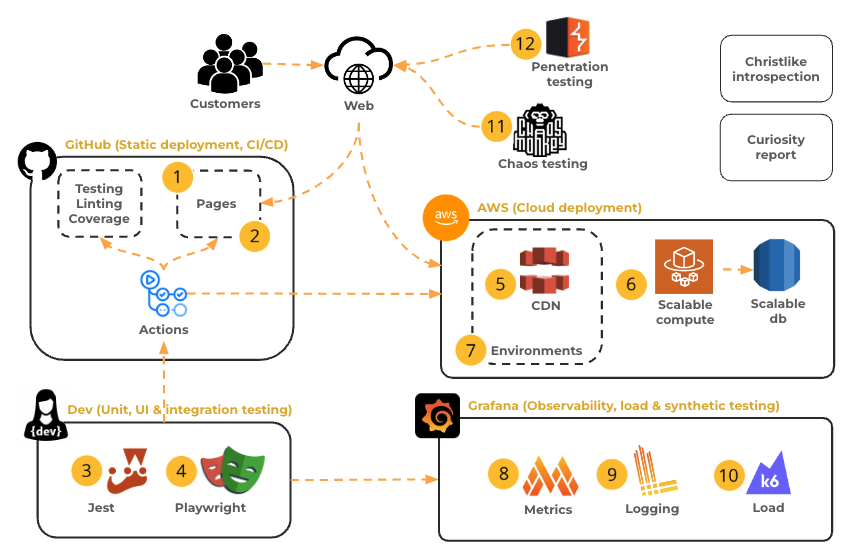
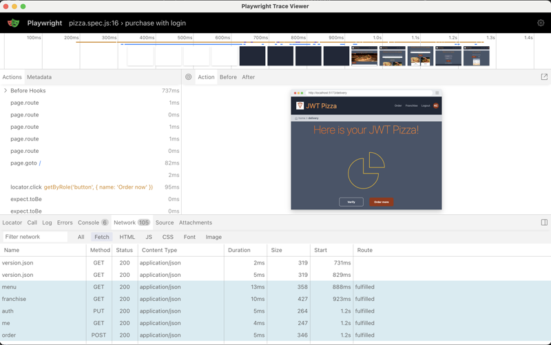
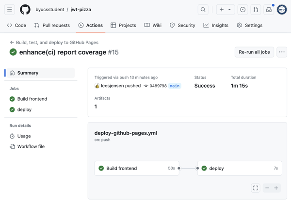

# Deliverable ⓸ User Interface Testing: JWT Pizza

🔑 **Key points**

- Use Playwright for JWT Pizza testing
- Learn to create tests by recording browser interactions
- Compute code coverage
- Mock the JWT Pizza Service
- Update the CI pipeline to run the tests

[🎥 Video overview](https://youtu.be/qvf1kaT_wr0)

---



## Prerequisites

Before you start work on this deliverable, make sure you have read all of the preceding instruction topics and have completed all of the dependent exercises (topics marked with a ☑). This includes:

- [UI testing](../uiTesting/uiTesting.md)
- ☑ [Playwright](../playwright/playwright.md)

Failing to do this will likely slow you down, as you will not have the required knowledge to complete the deliverable.

## Getting started

With the UI testing skills you have learned, you are now ready to test the JWT Pizza frontend. As part of these tests, you will mock the backend service so that you don't have to worry about the complexities that come with integration testing.

### Configuring Playwright

You previously created a fork of `jwt-pizza`. Now you need to add Playwright and coverage functionality. The first step is to install the required packages and set up the project using what you learned in the [Playwright instruction](../playwright/playwright.md). Don't worry about writing any tests while you are configuring Playwright; at this point, you are just ensuring you can run the example Playwright tests and verify that everything is configured correctly.

One change you should make when configuring the JWT Pizza frontend for testing is to set the required line coverage to 80%. You can do this by modifying the `.nycrc.json` file.

```json
{
  "check-coverage": true,
  "branches": 0,
  "lines": 80,
  "functions": 0,
  "statements": 0
}
```

### Running the first test

After setup, you should be able to run the default Playwright tests and see the results with coverage enabled.

```sh
➜ npm run test:coverage

Running 2 tests using 2 workers
  2 passed (2.8s)

----------|---------|----------|---------|---------|-------------------
File      | % Stmts | % Branch | % Funcs | % Lines | Uncovered Line #s
----------|---------|----------|---------|---------|-------------------
All files |       0 |        0 |       0 |       0 |
----------|---------|----------|---------|---------|-------------------
```

This isn't very exciting since the default test doesn't actually execute any of the Pizza code. Let's write a simple test to get started. Delete `example.spec.js` and create a new test file called `pizza.spec.ts`.

```ts
import { test, expect } from 'playwright-test-coverage';

test('home page', async ({ page }) => {
  await page.goto('/');

  expect(await page.title()).toBe('JWT Pizza');
});
```

Now when you run the test, you should get roughly **19.93%** line coverage just for loading the home page!

```sh
➜  npm run test:coverage
-------------------------|---------|----------|---------|---------|-------------------
File                     | % Stmts | % Branch | % Funcs | % Lines | Uncovered Line #s
-------------------------|---------|----------|---------|---------|-------------------
All files                |   20.49 |    23.45 |   23.07 |   19.93 |
```

## Using a development JWT Pizza Service

To test your frontend JWT Pizza in your development environment, you need a running JWT Pizza server. Because of the work you did to set up the JWT Pizza server in your development environment, you should already be ready to go. However, you will want to make sure this is all working before you start writing serious tests.

### Configuring the frontend

You can determine the location of your server by examining the JWT Pizza `.env.development` file, which contains the URLs for the frontend dependencies. Open that file and make sure that `VITE_PIZZA_SERVICE_URL` is set to use your local development environment. It should look like this:

```sh
VITE_PIZZA_SERVICE_URL=http://localhost:3000
VITE_PIZZA_FACTORY_URL=https://pizza-factory.cs329.click
```

### Configuring the pizza data

Next, make sure you have JWT Pizza data stored in your development environment. If you don't currently have any data, follow the [instruction](../jwtPizzaData/jwtPizzaData.md) for inserting it.

### Configuring the backend

Start your JWT Pizza server so that it is listening on `localhost:3000` and can respond to your frontend code while your UI tests are run.

```sh
cd jwt-pizza-service
npm run start
```

## Recording a test

Creating a test from scratch can be time-consuming. Instead, use the VS Code Playwright extension's `Record at cursor` functionality to jump-start your tests. Open your `pizza.spec.ts` file and add a new empty test.

```ts
test('purchase with login', async ({ page }) => {});
```

Put your cursor in the body of the test function, open the `Test Explorer` tab, and press the `Record at cursor` action. This will start the recording. Then, go through the steps of ordering a pizza and logging in as prompted.

<video controls width="800px">
  <source src="playwrightTestRecord.mp4" type="video/mp4">
  Your browser does not support the video tag.
</video>

After you finish, you should have a test that looks something like this:

```ts
test('purchase with login', async ({ page }) => {
  await page.goto('/');
  await page.getByRole('button', { name: 'Order now' }).click();
  await expect(page.locator('h2')).toContainText('Awesome is a click away');
  await page.getByRole('combobox').selectOption('1');
  await page.getByRole('link', { name: 'Image Description Veggie A' }).click();
  await page.getByRole('link', { name: 'Image Description Pepperoni' }).click();
  await expect(page.locator('form')).toContainText('Selected pizzas: 2');
  await page.getByRole('button', { name: 'Checkout' }).click();
  await page.getByPlaceholder('Email address').click();
  await page.getByPlaceholder('Email address').fill('d@jwt.com');
  await page.getByPlaceholder('Email address').press('Tab');
  await page.getByPlaceholder('Password').fill('diner');
  await page.getByRole('button', { name: 'Login' }).click();
  await expect(page.getByRole('main')).toContainText('Send me those 2 pizzas right now!');
  await expect(page.locator('tbody')).toContainText('Veggie');
  await page.getByRole('button', { name: 'Pay now' }).click();
  await expect(page.getByRole('main')).toContainText('0.008 ₿');
});
```

Run the test in VS Code to make sure it works, then run it again with coverage from the terminal. This will result in something similar to the following:

```sh
➜  npm run test:coverage
ERROR: Coverage for lines (35.12%) does not meet global threshold (80%)
-------------------------|---------|----------|---------|---------|-----------------------------
File                     | % Stmts | % Branch | % Funcs | % Lines | Uncovered Line #s
-------------------------|---------|----------|---------|---------|-----------------------------
All files                |   49.37 |    61.72 |   46.15 |   48.41 |
-------------------------|---------|----------|---------|---------|-----------------------------
```

That takes us to approximately **48%** line coverage. This is promising, and it feels like we will have 80% coverage in no time. However, there is a catch. Currently, the `.env.development` file has you using your local JWT Pizza Service and the production JWT Headquarter's Pizza Factory service. This is useful for integration testing, but the data on those services can change, introducing "flaky" tests. Additionally, when we run tests in GitHub Actions, we don't want them to depend on external environments.

## Mocking the JWT Pizza Service

A better option is to mock the JWT service. This way, you are only testing the frontend. This makes tests more stable and faster, though it does isolate you from bugs introduced if the protocol between the frontend and backend changes. For UI testing, this is generally the right choice. Let's convert the test we just created to use a mocked service.

First, identify which endpoints the test uses. You can use the Playwright Trace Viewer to see all network requests made during the test. You can then use the Playwright `route` method to create mocks for each request.

### Recording endpoint requests

Follow these steps to use Trace Viewer to identify network requests:

1. Open the **Test Explorer** in VS Code.
1. Select **Show trace viewer** from the Playwright pane.
1. Run the test recorded earlier.
1. Trace Viewer will open and execute the test steps.
1. In the **tools** pane at the bottom, select the **Network** tab.
1. Sort by 'Content Type' to move fetch requests to the top.
1. Examine the requests to see the URL, HTTP method, request bodies, and response bodies.

<video controls width="800px">
  <source src="traceViewer.mp4" type="video/mp4">
  Your browser does not support the video tag.
</video>

This shows that four requests were made. Simplified, they are:

| Method | Endpoint        | Request Body                                                                                                                                       | Response Body                                                                                                                                                                                                                                                                                                                                                                                            |
| ------ | --------------- | -------------------------------------------------------------------------------------------------------------------------------------------------- | -------------------------------------------------------------------------------------------------------------------------------------------------------------------------------------------------------------------------------------------------------------------------------------------------------------------------------------------------------------------------------------------------------- |
| GET    | /api/order/menu |                                                                                                                                                    | [{"id":1,"title":"Veggie","image":"pizza1.png","price":0.0038,"description":"A garden of delight"},{"id":2,"title":"Pepperoni","image":"pizza2.png","price":0.0042,"description":"Spicy treat"},{"id":3,"title":"Margarita","image":"pizza3.png","price":0.0014,"description":"Essential classic"},{"id":4,"title":"Crusty","image":"pizza4.png","price":0.0024,"description":"A dry mouthed favorite"}] |
| GET    | /api/franchise  |                                                                                                                                                    | [{"id":2,"name":"LotaPizza","stores":[{"id":4,"name":"Lehi"},{"id":5,"name":"Springville"},{"id":6,"name":"American Fork"}]},{"id":3,"name":"PizzaCorp","stores":[{"id":7,"name":"Spanish Fork"}]},{"id":4,"name":"topSpot","stores":[]}]                                                                                                                                                                |
| PUT    | /api/auth       | {"email":"d@jwt.com","password":"a"}                                                                                                               | {"id":3,"name":"Kai Chen","email":"d@jwt.com","roles":[{"role":"diner"}]}                                                                                                                                                                                                                                                                                                                                |
| POST   | /api/order      | {"items":[{"menuId":1,"description":"Veggie","price":0.0038},{"menuId":2,"description":"Pepperoni","price":0.0042}],"storeId":"1","franchiseId":1} | {"order":{"items":[{"menuId":1,"description":"Veggie","price":0.0038},{"menuId":2,"description":"Pepperoni","price":0.0042}],"storeId":"1","franchiseId":1,"id":23},"jwt":"eyJpYXQ"}                                                                                                                                                                                                                     |

> [!NOTE]
> To access endpoints that require an admin user, run your local JWT Pizza Service and log in with the default admin credentials. Your `.env.development` file already points to it.

### Create the mocks

Now that you have the endpoints, use the Playwright `route` function to mock each one. Let's start with the `Login` endpoint.

We specify the URL path to match with the glob pattern `*/**/api/auth`. This matches any fetch request ending in `api/auth`. Next, we define the expected request body and the mocked response.

We assert that the HTTP method was `PUT` and that we received the expected request body. Finally, we fulfill the request by returning the mocked response.

```ts
await page.route('*/**/api/auth', async (route) => {
  const loginReq = { email: 'd@jwt.com', password: 'a' };
  const loginRes = {
    user: {
      id: 3,
      name: 'Kai Chen',
      email: 'd@jwt.com',
      roles: [{ role: 'diner' }],
    },
    token: 'abcdef',
  };
  expect(route.request().method()).toBe('PUT');
  expect(route.request().postDataJSON()).toMatchObject(loginReq);
  await route.fulfill({ json: loginRes });
});
```

Repeat this process for each expected endpoint call.

### Debugging the mocks

As you add mocks, they may not work exactly as expected. The best tools for debugging mocked API calls are Playwright's **Trace Viewer** and **UI Mode**. You can access UI Mode by running:
`npx playwright test --ui`

In the Trace Viewer or UI Mode window, you can view your test's API calls:

1. In the **tools** pane, select the **Network** tab.
2. Select the **Fetch** sub-tab to filter for API calls.

   

If a row is blue, the call is successfully mocked. If it is white or red, the call is not mocked (hitting the actual backend) or it returned an error. You can click on a row to compare the mocked response to the actual data structure.

### Refactoring

As you write more tests, decompose them to avoid repeating common code, especially for mocks. A common pattern is to create a utility method that handles setup like login requests.

```ts
async function basicInit(page: Page) {
  let loggedInUser: User | undefined;
  const validUsers: Record<string, User> = { 'd@jwt.com': { id: '3', name: 'Kai Chen', email: 'd@jwt.com', password: 'a', roles: [{ role: Role.Diner }] } };

  // Authorize login for the given user
  await page.route('*/**/api/auth', async (route) => {
    const loginReq = route.request().postDataJSON();
    const user = validUsers[loginReq.email];
    if (!user || user.password !== loginReq.password) {
      await route.fulfill({ status: 401, json: { error: 'Unauthorized' } });
      return;
    }
    loggedInUser = validUsers[loginReq.email];
    const loginRes = {
      user: loggedInUser,
      token: 'abcdef',
    };
    expect(route.request().method()).toBe('PUT');
    await route.fulfill({ json: loginRes });
  });
// ...
```

You can then use these mocks to easily implement a login test.

```ts
test('login', async ({ page }) => {
  await basicInit(page);
  await page.getByRole('link', { name: 'Login' }).click();
  await page.getByRole('textbox', { name: 'Email address' }).fill('d@jwt.com');
  await page.getByRole('textbox', { name: 'Password' }).fill('a');
  await page.getByRole('button', { name: 'Login' }).click();

  await expect(page.getByRole('link', { name: 'KC' })).toBeVisible();
});
```

### The final test

Here is a refined version of the basic login tests with mocks placed in a utility function.

```ts
import { Page } from '@playwright/test';
import { test, expect } from 'playwright-test-coverage';
import { Role, User } from '../src/service/pizzaService';

async function basicInit(page: Page) {
  let loggedInUser: User | undefined;
  const validUsers: Record<string, User> = { 'd@jwt.com': { id: '3', name: 'Kai Chen', email: 'd@jwt.com', password: 'a', roles: [{ role: Role.Diner }] } };

  await page.route('*/**/api/auth', async (route) => {
    const loginReq = route.request().postDataJSON();
    const user = validUsers[loginReq.email];
    if (!user || user.password !== loginReq.password) {
      await route.fulfill({ status: 401, json: { error: 'Unauthorized' } });
      return;
    }
    loggedInUser = validUsers[loginReq.email];
    const loginRes = {
      user: loggedInUser,
      token: 'abcdef',
    };
    expect(route.request().method()).toBe('PUT');
    await route.fulfill({ json: loginRes });
  });

  await page.route('*/**/api/user/me', async (route) => {
    expect(route.request().method()).toBe('GET');
    await route.fulfill({ json: loggedInUser });
  });

  await page.route('*/**/api/order/menu', async (route) => {
    const menuRes = [
      { id: 1, title: 'Veggie', image: 'pizza1.png', price: 0.0038, description: 'A garden of delight' },
      { id: 2, title: 'Pepperoni', image: 'pizza2.png', price: 0.0042, description: 'Spicy treat' },
    ];
    expect(route.request().method()).toBe('GET');
    await route.fulfill({ json: menuRes });
  });

  await page.route(/\/api\/franchise(\?.*)?$/, async (route) => {
    const franchiseRes = {
      franchises: [
        {
          id: 2,
          name: 'LotaPizza',
          stores: [
            { id: 4, name: 'Lehi' },
            { id: 5, name: 'Springville' },
            { id: 6, name: 'American Fork' },
          ],
        },
        { id: 3, name: 'PizzaCorp', stores: [{ id: 7, name: 'Spanish Fork' }] },
        { id: 4, name: 'topSpot', stores: [] },
      ],
    };
    expect(route.request().method()).toBe('GET');
    await route.fulfill({ json: franchiseRes });
  });

  await page.route('*/**/api/order', async (route) => {
    const orderReq = route.request().postDataJSON();
    const orderRes = {
      order: { ...orderReq, id: 23 },
      jwt: 'eyJpYXQ',
    };
    expect(route.request().method()).toBe('POST');
    await route.fulfill({ json: orderRes });
  });

  await page.goto('/');
}

test('login', async ({ page }) => {
  await basicInit(page);
  await page.getByRole('link', { name: 'Login' }).click();
  await page.getByRole('textbox', { name: 'Email address' }).fill('d@jwt.com');
  await page.getByRole('textbox', { name: 'Password' }).fill('a');
  await page.getByRole('button', { name: 'Login' }).click();

  await expect(page.getByRole('link', { name: 'KC' })).toBeVisible();
});

test('purchase with login', async ({ page }) => {
  await basicInit(page);

  await page.getByRole('button', { name: 'Order now' }).click();

  await expect(page.locator('h2')).toContainText('Awesome is a click away');
  await page.getByRole('combobox').selectOption('4');
  await page.getByRole('link', { name: 'Image Description Veggie A' }).click();
  await page.getByRole('link', { name: 'Image Description Pepperoni' }).click();
  await expect(page.locator('form')).toContainText('Selected pizzas: 2');
  await page.getByRole('button', { name: 'Checkout' }).click();

  await page.getByPlaceholder('Email address').fill('d@jwt.com');
  await page.getByPlaceholder('Password').fill('a');
  await page.getByRole('button', { name: 'Login' }).click();

  await expect(page.getByRole('main')).toContainText('Send me those 2 pizzas right now!');
  await expect(page.locator('tbody')).toContainText('Veggie');
  await expect(page.locator('tbody')).toContainText('Pepperoni');
  await expect(page.locator('tfoot')).toContainText('0.008 ₿');
  await page.getByRole('button', { name: 'Pay now' }).click();

  await expect(page.getByText('0.008')).toBeVisible();
});
```

Your goal is to reach at least 80% line coverage by creating meaningful tests that ensure the quality of the frontend code.

## Reporting service calls

If you want to ensure all service calls are mocked, you can add code that reports un-mocked requests. Create a utility named **testSetup.ts**:

```ts
import { test as base, expect } from 'playwright-test-coverage';

interface Violation {
  method: string;
  url: string;
  body: string | null;
}

const test = base.extend({
  page: async ({ page }, use) => {
    const violations: Violation[] = [];

    await page.route('**/*', async (route) => {
      const request = route.request();
      const url = request.url();

      if (url.startsWith('http://localhost:3000')) {
        const violation = { method: request.method(), url, body: request.postData() };
        violations.push(violation);
        console.log(`Blocked request to http://localhost:3000 -> ${violation.method} ${violation.url} ${violation.body}`);
        await route.abort();
        return;
      }

      await route.continue();
    });

    await use(page);

    expect(violations, 'Unexpected request(s) made to http://localhost:3000').toEqual([]);
  },
});

export { test, expect };
```

Replace your Playwright import with this wrapper in your test files:

```ts
import { test, expect } from './testSetup';
```

With this in place, your tests will fail if an un-mocked service call is made.

## Testing CI

Update your GitHub Actions script to execute the tests and report coverage publicly.

Running the tests requires installing the Playwright browser driver and executing the test command:

```yml
- name: Run tests
  run: |
    npx playwright install --with-deps chromium
    npm run test:coverage
```

### Reporting coverage

Parse the coverage output to build a coverage badge. First, add the `NET_ID` and `FACTORY_API_KEY` Actions secrets to your `jwt-pizza` fork.

```yml
- name: Update coverage
  run: |
    coverage=$(jq '.total.lines.pct' coverage/coverage-summary.json)
    color=$(echo "$coverage < 80" | bc | awk '{if ($1) print "red"; else print "green"}')
    curl -s -X POST "https://pizza-factory.cs329.click/api/badge/${{ secrets.NET_ID }}/jwtpizzacoverage?label=Coverage&value=$coverage%25&color=$color" -H "authorization: bearer ${{ secrets.FACTORY_API_KEY }}"
```

Modify the `README.md` file to reference the generated coverage badge:

```md

```

## Running your pipeline

Study the CI pipeline steps until you understand each line. Add them to your GitHub Actions workflow file and push to GitHub. This should trigger the workflow, and you should see the results on the Actions page of your repository.



## ⭐ Deliverable

To demonstrate mastery of these concepts, complete the following:

1. Create Playwright tests for `jwt-pizza` that provide at least 80% line coverage. Your tests should include locators, navigation, and assertions that generate high confidence in the code.
1. Create a GitHub Actions workflow that executes the tests.
1. Configure the workflow to fail if coverage is below 80%.
1. Report the coverage by creating a coverage badge in the `README.md` file.

```masteryls
{"id":"20b2c9ef-5f27-4aa9-bc34-bfc8cdd04199", "title":"⓸ User interface testing submission", "type":"url-submission", "syncGrade":true, "autoGrade":false, "validateUrl":true, "gradingCriteria":"The page contains a image link with the alt text of `Coverage badge` and a level one heading with the exact text of `🍕 JWT Pizza`", "urlPrompt":"Convert the user provided URL to create a URL that is the path to the raw GitHub content for the README.md file." }
```

Once you have completed this deliverable, submit the URL of your JWT Pizza repository.

_Example: https://github.com/youraccount/jwt-pizza_

This will perform an initial check and then pass your submission on for final grading.

### Rubric

| Percent | Item                                                                      |
| ------- | ------------------------------------------------------------------------- |
| 30%     | Successful execution of GitHub Actions to run tests on commit             |
| 65%     | At least 80% line coverage as documented by workflow execution            |
| 5%      | Coverage status badge displayed on your JWT Pizza **README.md** home page |
