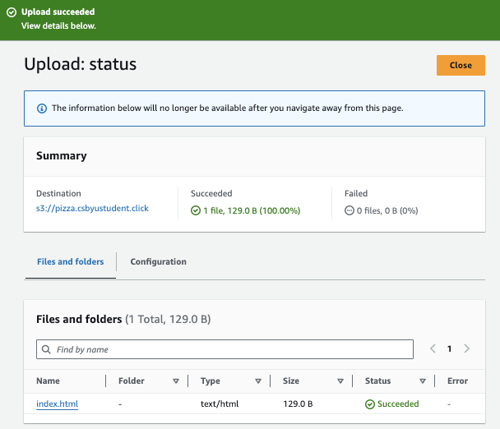
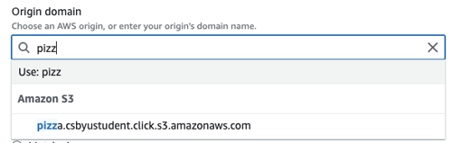
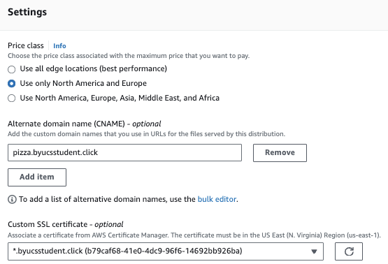
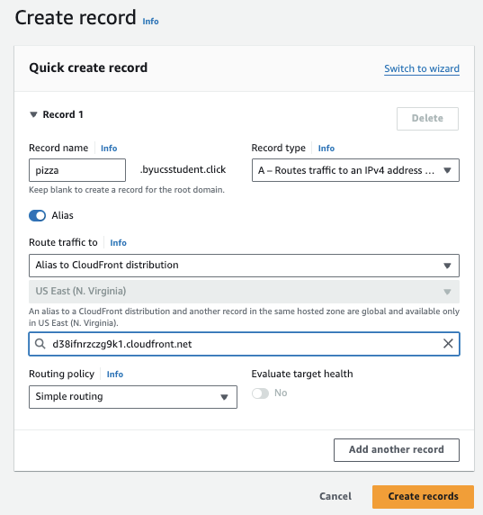

# Deliverable ⓹ Content Delivery Network Deployment: JWT Pizza


Previously we deploy the JWT Pizza frontend using GitHub Pages, and while GitHub pages does host your content on servers around the world (technically making it a CDN), it has some significant limitations that disqualify it for large scale production usage. First off it is limited in the amount bandwidth that GitHub will provide. They also throttle the amount of data and the number of times you can update the data. GitHub pages also lack many of the features that a world class CDN provides such as DDos protection and edge computing.

For these reasons we are going to move to AWS and use their S3, IAM, and CloudFront services to create a globally hosted CDN for JWT Pizza.

⚠️ If you have not yet created your AWS account, you must do so now. We will be making extensive use of AWS for the rest of the course.

🚧 This needs some diagrams or people are going to get lost.

## S3 static content bucket

The first step we need to take is to create an S3 bucket to host the static files associated with the JWT Pizza frontend. Follow these steps to setup your S3 bucket.

1. Open the AWS browser console and navigate to the S3 service.
1. Click on the `Create bucket` button.
1. Select the `General purpose` option and name it the name of your JWT Pizza website. For the purposes of this instruction we will use the hostname `pizza.csbyustudent.click`.
1. Leave all the other settings with their default. Including _Block all public access_. Press the button to create the bucket.
1. Create a file named `index.html` in VS Code and insert a basic _Hello World_ page.
1. Click on the newly created Open the bucket.
1. Drag the `index.html` file into the bucket and press the `Upload` button.
   > 

For now, the _Hello World_ page will serve as a placeholder until we can demonstrate that our static content is being host properly over the CDN. Later we will replace it with the JWT Pizza content deployed from the GitHub Action CI pipeline.

## Create a custom SSL certificate

You want your static content to be securely hosted. AWS offers a free service for managing SSL certificates when they are used for AWS services such as CloudFront.

1. Open the AWS browser console and navigate to the AWS Certificate Manager service.
1. Click on `Request certificate`.
1. Select `Request a public certificate` and press `Next`.
1. Enter your fully qualified domain name and use `DNS validation`. This will either automatically verify your domain name if you are using Route53, or give you instructions for what you need to add to your DNS records in order for the validation to be successful.

   > 

   Press `Request` and give a bit of time to generate.

1. When it displays with the status of `Pending validation` press on the `Create records in Route 53` to automatically add the required DNS validation record if this domain is hosted in Route 53, or choose the option to export the `CSV` file to obtain the entries that you need to add your DNS registry for the domain.

Make sure the certificate is validated before you try and set up CloudFront.

## CloudFront CDN hosting

With the bucket in place you can now create your CloudFront distribution that will serve as the CDN for your S3 bucket content. Take the following steps.

1. Open the AWS browser console and navigate to the CloudFront service.
1. Press the `Create distribution` button.
1. For the `Origin domain` start typing the name of the bucket you create. The S3 bucket should appear.
   > 
1. In the name edit box, change the name so that it is just your DNS name for simplicity.
1. Under `Origin access` change from `public`, because our bucket is not public, to `Origin access control settings`. Create a new OAC if you don't already have one, and press `Create`.
   1. Copy the newly created policy by pressing the `Copy policy` button.
   1. Click the link to `Go to S3 bucket permissions`.
   1. Click on the bucket and then `permissions`.
   1. For the `Bucket policy` box press `edit` and then paste the policy. This allows CloudFront to access the bucket.
   1. Save the changes and return to the CloudFront distribution creation flow.
1. Skip down to `Default cache behavior`
   1. Under `Viewer protocol policy` specify `Redirect HTTP to HTTPS`
   1. Under `Allowed HTTP methods` specify `GET, HEAD, OPTIONS`.
   1. Under `Cache key and origin requests` choose the `CachingOptimized` cache policy.
   1. Under the `Web Application Firewall (WAF)` choose the option to not support the security protections unless you want to pay for them.
1. Skip down to `Settings`
   1. Under `Price class` specify `Use only North America and Europe. Unless of course you want your JWT Pizza to be optimized for access in Asia. (Realize that there may be additional charges for choosing this option.)
   1. Under `Alternate domain name` press `add item` and type your DNS name.
   1. Chose the certificate that you created in the previous section.
      > 
   1. Set `index.html` as the `Default root object` so that it will be used when the root domain is specified.
   1. Provide a description for the distribution such as `JWT Pizza`.
1. Press `Create distribution`.

This should create the CloudFront distribution. It will take a little while for it to deploy around the globe, but when the `deploying` state goes away, you should be able to access the placeholder index.html file using the `Distribution domain name` name found on the `General` tab of the distribution.


## Route 53

All that is left is to create a DNS record so that you can access the CDN using your domain name rather than the generated one for the distribution. In this process you are going to replace the DNS record that you used to point to GitHub Pages with the one pointing to CloudFront.

1. Open the AWS browser console and navigate to the Route 53 service.
1. Select the hosted zone for your hostname.
1. Delete the existing CNAME record for your JWT Pizza domain that is currently pointing to GitHub.io.
1. Create a new record.
1. Set the record type to an `A` record.
1. Move the slider to mark it as an `Alias`. This tells Route 53 that it can do some internal routing between its services rather than doing normal DNS routing.
1. Route traffic to `Alias to CloudFront Distribution`.
1. Select the destination dropdown. If you set the `Alternate domain name` to be this domain name when you set up CloudFront, the CloudFront distribution name should appear. If not then go back and check that setting for your distribution.
1. Press the `Create records` button.



After a short while the DNS record should propagate and you should be able to see the record pointing to CloudFront instead of GitHub with a console command like `dig` or `nslookup`. At that point your browser should also show the `Hello World` page.

🚧 !!!!!!!!!!!!!!!!!!!!
Start here. Setup actions to push to S3 and delete the old Pages hosting
!!!!!!!!!!!!!!!!!!!!

## Clean up GitHub Pages

When you pointed your pizza URL to CloudFront you broke the link to your GitHub Pages static file hosting. Since we are no longer going to use GitHub Pages you can go and remove it from your fork of the jwt-pizza repository.

## IAM

1. Create a role for the GitHub Action.
   1. Choose Web Identity
   1. Create a new Identity Provider - OpenID Connect
   1. You register the GitHub IP with AWS IAM and specify the AWS rights you are granting for an authenticated user.
      1. provider URL: https://token.actions.githubusercontent.com. Press Get Thumbprint. I don't believe this is used anymore, but it makes me press it.
      1. Audience: sts.amazonaws.com
      1. Configure the IAM role
      1. Permissions policy S3
      ```json
      {
        "Version": "2012-10-17",
        "Statement": [
          {
            "Effect": "Allow",
            "Action": "sts:AssumeRoleWithWebIdentity",
            "Principal": {
              "Federated": "arn:aws:iam::464152414144:oidc-provider/token.actions.githubusercontent.com"
            },
            "Condition": {
              "StringEquals": {
                "token.actions.githubusercontent.com:aud": ["sts.amazonaws.com"]
              },
              "StringLike": {
                "token.actions.githubusercontent.com:sub": ["repo:devops329/*"]
              }
            }
          }
        ]
      }
      ```

## Update the deployment workflow

Modify the script to deploy to S3

With this in place you can now enhance the GitHub Action Workflow.

First you need to add the permission to use OIDC tokens in the script.

```yaml
permissions:
  id-token: write
  contents: read
```

Next add AWS CLI command with the acquired OIDC token

```yaml
- name: Create OIDC token to AWS
  uses: aws-actions/configure-aws-credentials@v4
  with:
    audience: sts.amazonaws.com
    aws-region: us-east-1
    role-to-assume: arn:aws:iam::464152414144:role/GitHubAction-CD
- name: Push to AWS S3
  run: |
    ls -la
    aws s3 ls s3://test.leesjensen.com
    aws s3 cp dist s3://test.leesjensen.com --recursive
```

## CI with Staging distributions

🚧 Maybe we can use this when we talk about versioning.
