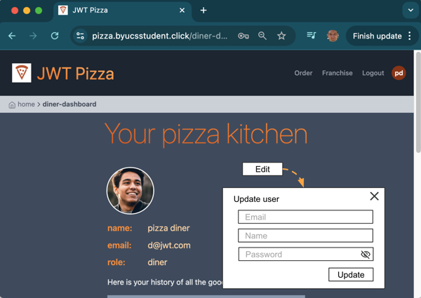
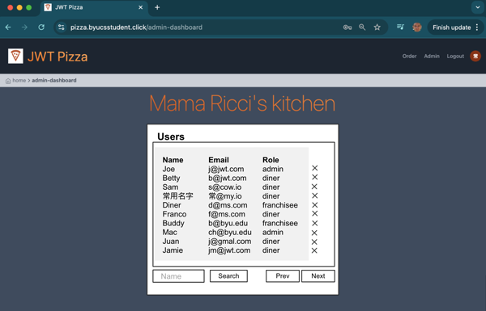
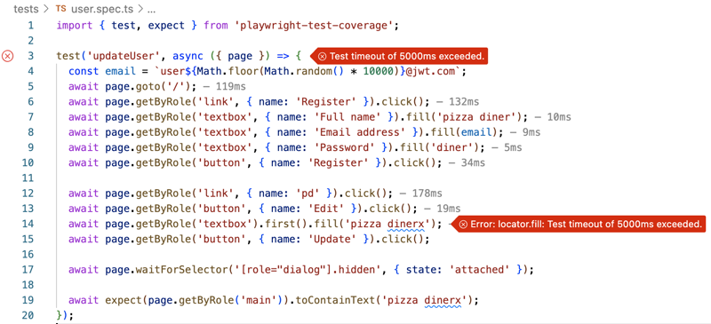
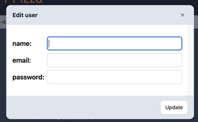
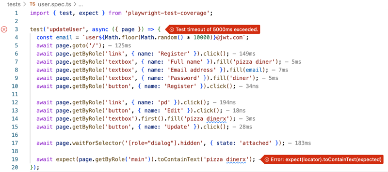
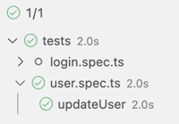

# Deliverable ⓹ Test driven development

🔑 **Key points**

- Use TDD to drive development, increase confidence, and support regression testing.

---


## Prerequisites

Before you start work on this deliverable make sure you have read all of the preceding instruction topics and have completed all of the dependent exercises (topics marked with a ☑). This includes:

- ☑ [Test driven development (TDD)](../tdd/tdd.md)

Failing to do this will likely slow you down as you will not have the required knowledge to complete the deliverable.

## Getting started

The JWT Pizza CEO wants to add a few new features to the application before we go live. This includes:

| Feature         | Description                                                                                                                                                  |
| --------------- | ------------------------------------------------------------------------------------------------------------------------------------------------------------ |
| **Update user** | As a **user** I can change my name, email, and password.                                                                                                     |
| **List users**  | As an **admin** I can see a list of all users. Each user's name, email, and role is displayed. The list is paginated. The list can be filtered by user name. |
| **Delete user** | As an **admin** I can delete any user.                                                                                                                       |

## Design

### Wireframes

First we need to define what the interface is going to look like from the user's perspective. By working from the user down, we stand a better chance of actually implementing the functionality correctly on the first pass. When you start at the bottom of the technology stack and work up, you often end up with something that only a software developer understands.

The **Update user** feature is added to the diner dashboard view.



The **List/Delete user** features are added to the admin dashboard view.



### Endpoint definitions

Next we think about things from the frontend developer's perspective by defining the interface that the frontend will use in order to implement the features. This includes the ability to update, delete, and list users. The update user endpoint already exists, but we will need to add the other two endpoints as part of this work.

| method | endpoint                          | request body                                                                        | response body                                                                                                                                                                            |
| ------ | --------------------------------- | ----------------------------------------------------------------------------------- | ---------------------------------------------------------------------------------------------------------------------------------------------------------------------------------------- |
| PUT    | /api/user/:userId                 | {"name":"bob","email":"a@jwt.com", "password":"admin", "roles":[{"role": "diner"}]} | {"email":"a@jwt.com", "roles":[{"role": "diner"}]}                                                                                                                                       |
| DELETE | /api/user/:userId                 |                                                                                     |                                                                                                                                                                                          |
| GET    | /api/user?page=1&limit=10&name=\* |                                                                                     | {"users":[<br/>{"id":3,"name":"Kai Chen","email":"d@jwt.com","roles":[{"role":"diner"}]},<br/>{"id":5,"name":"Buddy","email":"b@jwt.com","roles":[{"role":"admin"}]}<br/>], "more":true} |

## Using TDD for frontend development

To get you started we will walk through the TDD process of adding the **Update User** feature. Since the endpoint to update a user already exists on the backend, only need to modify the frontend application to support the new feature.

### First test

We start out by writing a test to make sure we can get to the place where we want to add our functionality. We add this test to a file named **user.spec.ts**. This basic test registers a new diner user and navigates to the diner dashboard.

```js
import { test, expect } from 'playwright-test-coverage';

test('updateUser', async ({ page }) => {
  const email = `user${Math.floor(Math.random() * 10000)}@jwt.com`;
  await page.goto('/');
  await page.getByRole('link', { name: 'Register' }).click();
  await page.getByRole('textbox', { name: 'Full name' }).fill('pizza diner');
  await page.getByRole('textbox', { name: 'Email address' }).fill(email);
  await page.getByRole('textbox', { name: 'Password' }).fill('diner');
  await page.getByRole('button', { name: 'Register' }).click();

  await page.getByRole('link', { name: 'pd' }).click();

  await expect(page.getByRole('main')).toContainText('pizza diner');
});
```

When we run this test it should work just fine since this is pre-existing functionality.

### Display a simple dialog

We then enhance **dinerDashboard.tsx** with a simple dialog for updating the user fields. To start off, we need to import the dialog controls.

```js
import { CloseIcon } from '../icons';
import { HSOverlay } from 'preline';
import Button from '../components/button';
```

We then add an `updateUser` function that is called when the **Edit** button is pressed. You can place this block anywhere in the DinerDashboard component.

The **setTimeout** delay is used so that the preline can update the dialog React state correctly before we tell it to close. Otherwise, when running under automation we may tell preline to close before React has told preline that the dialog is actually displayed.

```ts
async function updateUser() {
  setTimeout(() => {
    HSOverlay.close(document.getElementById('hs-jwt-modal')!);
  }, 100);
}
```

Add the **Edit** button to the display of the user. Put this right after the user's image.

```tsx
<Button title="Edit" className="w-16 p-0" onPress={() => HSOverlay.open(document.getElementById('hs-jwt-modal')!)} />
```

Finally, we create the edit user dialog. Place this as the last child of the **View** element. For now, we just display a placeholder for the user fields and provide an **Update** button.

```tsx
<div role="dialog" aria-modal="true" aria-labelledby="dialog-title" id="hs-jwt-modal" className="hs-overlay hidden size-full fixed top-10 start-0 z-[80] overflow-x-hidden overflow-y-auto pointer-events-none">
  <div className="hs-overlay-open:mt-7 hs-overlay-open:opacity-100 hs-overlay-open:duration-500 mt-0 opacity-0 ease-out transition-all sm:max-w-lg sm:w-full m-3 sm:mx-auto min-h-[calc(100%-3.5rem)]">
    <div className="w-full flex flex-col bg-white border shadow-sm rounded-xl pointer-events-auto   ">
      <div className="flex justify-between items-center py-3 px-4 border-b bg-slate-200 rounded-t-xl ">
        <h3 className="font-bold text-gray-800">Edit user</h3>
        <button type="button" className="flex justify-center items-center size-7 text-sm font-semibold rounded-full border border-transparent text-gray-800 hover:bg-gray-100 disabled:opacity-50 disabled:pointer-events-none" data-hs-overlay="#hs-jwt-modal">
          <CloseIcon className="" />
        </button>
      </div>
      <div className="p-4 overflow-y-scroll max-h-52">
        <div className="my-4 text-lg text-start grid grid-cols-5 gap-2 items-center">update fields here</div>
      </div>
      <div className="flex justify-end items-center gap-x-2 py-3 px-4 border-t  bg-slate-200 rounded-b-xl">
        <button type="button" className="py-2 px-3 inline-flex items-center gap-x-2 text-sm font-medium rounded-lg border border-gray-200 bg-white text-gray-800 shadow-sm hover:bg-gray-50 disabled:opacity-50 disabled:pointer-events-none" onClick={updateUser}>
          Update
        </button>
      </div>
    </div>
  </div>
</div>
```

### Test that the dialog displays

With the dialog stubbed in, we can enhance the test to make sure the dialog displays and dismisses properly. Adding the following code we make sure that we can press the **Edit** button, view the dialog, and then dismiss it. Place the code at the bottom of the **updateUser** test so that it runs after you have navigated to the user view.

**user.spec.ts**

```js
await page.getByRole('button', { name: 'Edit' }).click();
await expect(page.locator('h3')).toContainText('Edit user');
await page.getByRole('button', { name: 'Update' }).click();

await page.waitForSelector('[role="dialog"].hidden', { state: 'attached' });

await expect(page.getByRole('main')).toContainText('pizza diner');
```

If we got all the application and testing code written correctly, the test should pass fine since it simply opens and closes the edit dialog.

### Enhance the test with dialog user fields

To this point we have driven the development by first writing the code and then the test. Let's flip that and write the test first, let it fail, and then write the code until the test passes.

Further modify the **updateUser** test so that it interacts with a non-existent dialog textbox representing the user's name. Then assert that modifying the name updates the user's information once the dialog is dismissed.

**user.spec.ts**

```js
  await page.getByRole('button', { name: 'Edit' }).click();
  await expect(page.locator('h3')).toContainText('Edit user');
  await page.getByRole('textbox').first().fill('pizza dinerx');
  await page.getByRole('button', { name: 'Update' }).click();

  await page.waitForSelector('[role="dialog"].hidden', { state: 'attached' });

  await expect(page.getByRole('main')).toContainText('pizza dinerx');

});
```

When you run the test it should fail. Note that the code the image is similar to what the above instructions provided, but slightly different. Feel free to also customize the test to your liking.



### Add dialog fields

To make the test pass we need to enhance the dialog code to represent all of the user fields and then update the user on submission.

**dinerDashboard.tsx**

Add React ref hooks to the top of the component that tracks the altered user fields. Initially these will be empty, but as the dialog fields are changed to represent the user data the refs will contain the proper values.

```ts
const nameRef = React.useRef<HTMLInputElement>(null);
const emailRef = React.useRef<HTMLInputElement>(null);
const passwordRef = React.useRef<HTMLInputElement>(null);
```

Then we want to modify the dialog to represent all of the user fields. Replace

```tsx
<div className="my-4 text-lg text-start grid grid-cols-5 gap-2 items-center">update fields here</div>
```

with

```tsx
<div className="my-4 text-lg text-start grid grid-cols-5 gap-2 items-center">
  <div className="font-semibold">name:</div>
  <input type="text" className="col-span-4 border border-gray-300 rounded-md p-1" defaultValue={user.name} ref={nameRef} />
  <div className="font-semibold">email:</div>
  <input type="email" className="col-span-4 border border-gray-300 rounded-md p-1" defaultValue={user.email} ref={emailRef} />
  <div className="font-semibold">password:</div>
  <input id="password" type="text" className="col-span-4 border border-gray-300 rounded-md p-1" defaultValue="" ref={passwordRef} />
</div>
```

This should result in a dialog that looks like this:



Now when you run the test it will fail when it checks to see if the user's name was updated instead of when we tried to enter the new username.



### Update the user fields

The next step is to update the **user** property with the correct values so that React will rerender everything properly.

We need the ability to set the user for the React state variable maintained by the **App** component. You do this by just adding another property to the **DinerDashboard** that represents the `setUser` function.

**app.tsx**

```js
    { title: 'Diner', to: '/diner-dashboard', component: <DinerDashboard user={user} setUser={setUser} />, display: [] },
```

And then we modify the **DinerDashboard** component to receive the property and update it in the `updateUser` function.

**dinerDashboard.tsx**

```ts
interface Props {
  user: User | null;
  setUser: (user: User) => void;
}
```

```ts
async function updateUser() {
  let updatedUser: User = {
    id: user.id,
    name: nameRef.current?.value,
    email: emailRef.current?.value,
    password: passwordRef.current?.value || undefined,
    roles: user.roles,
  };

  props.setUser(updatedUser);
  setTimeout(() => {
    HSOverlay.close(document.getElementById('hs-jwt-modal')!);
  }, 100);
}
```

Now the test will pass without any errors.

### Are we done yet?

With the test passing and the functionality working we could be tempted to think we are done and move on to the next feature. However, this is a good time to stop and consider other tests that we might be missing.

For example, what if we navigate away from the **DinerDashboard**, refresh the page, or log out. Will our user modification still be there? Can we change the other user fields such as the password or email? What happens if we do change the credentials? Will we be able to log back in?

This is the power of TDD. It forces you to write your code from the user's perspective, and write the tests necessary to have confidence that the application is working correctly.

So let's go ahead and enhance our test by logging out and then back in so that we can make sure the edits are persistent.

```js
await page.getByRole('link', { name: 'Logout' }).click();
await page.getByRole('link', { name: 'Login' }).click();

await page.getByRole('textbox', { name: 'Email address' }).fill(email);
await page.getByRole('textbox', { name: 'Password' }).fill('diner');
await page.getByRole('button', { name: 'Login' }).click();

await page.getByRole('link', { name: 'pd' }).click();

await expect(page.getByRole('main')).toContainText('pizza dinerx');
```

Now the test will fail. Take a minute an try and figure out why. What did we miss?

### Debugging the test

You can figure out what went wrong by either:

1. Guessing at what the code does
1. Running the application as a user
1. Debugging the test.

My preference is usually debugging the test because I can set breakpoints, let the test repeatedly drive the action, and easily observe where my assumptions failed.


As the above debugging session shows, the test failed because the user information passed to the **DinerDashboard** component is still the old data. That is because we never actually persisted the data on the backend. We only modified the React user property managed by the **App** component. The next time we load the information from the backend, it will still be the old data.

### Calling the service

To fix this we need to modify the front end `pizzaService.ts` facade code so that we can call the service endpoint to update a user. This is done by first updating the service interface with an `updateUser` endpoint and then adding an implementation that will send the updated user to the service.

**pizzaService.ts**

```js
updateUser(user: User): Promise<User>;
```

**httpPizzaService.ts**

```js
async updateUser(updatedUser: User): Promise<User> {
  const { user, token } = await this.callEndpoint(`/api/user/${updatedUser.id}`, 'PUT', updatedUser);
  localStorage.setItem('token', token);
  return Promise.resolve(user);
}
```

We then call the 'updateUser' method on the service whenever the user gets updated.

**dinerDashboard.tsx**

```tsx
async function updateUser() {
  let updatedUser: User = {
    id: user.id,
    name: nameRef.current?.value,
    email: emailRef.current?.value,
    password: passwordRef.current?.value || undefined,
    roles: user.roles,
  };

  await pizzaService.updateUser(updatedUser);

  props.setUser(updatedUser);
  setTimeout(() => {
    HSOverlay.close(document.getElementById('hs-jwt-modal')!);
  }, 100);
}
```

Now when we rerun our test, everything is green. This is a great time to commit your changes.



> [!NOTE]
>
> The above test does not mock out the backend. When you are using TDD for full stack development it is helpful to drive your development across the whole stack. However, when you push the frontend test to your CI pipeline it will fail because there is no backend available when running under GitHub Actions. You can either solve this by either mocking out the backend or by actually starting up a backend when your frontend tests run.

There are still other tests that we need to write in order for us to be fully comfortable with the new **update user** functionality. This includes changing the password and email address, and changing user information using different roles. Go ahead and write those tests now and commit those changes also.

## Using TDD for backend development

Before you go off and use TDD to implement all of the new functionality, let's do a little TDD on the backend. To start, we want to use TDD to rough in the **Get Users** endpoint. We can actually do a little Documentation Driven Development (DDD) by first adding the endpoint to the docs found in the **userRouter.js** code. This will help us understand what we are trying to implement.

```js
userRouter.docs = [
  {
    method: 'GET',
    path: '/api/user?page=1&limit=10&name=*',
    requiresAuth: true,
    description: 'Gets a list of users',
    example: `curl -X GET localhost:3000/api/user -H 'Authorization: Bearer tttttt'`,
    response: {
      users: [
        {
          id: 1,
          name: '常用名字',
          email: 'a@jwt.com',
          roles: [{ role: 'admin' }],
        },
      ],
    },
  },
  // ...
];
```

Based on the documentation, we can then write a simple test. Your code should already have tests for user functionality from the Jest testing deliverable. Go ahead and add a basic test for the **list users** endpoint to the existing test suite.

```js
test('list users', async () => {
  const listUsersRes = await request(app).get('/api/user');
  expect(listUsersRes.status).toBe(200);
});
```

This should fail and return a 404 error because the endpoint is not defined. So let's go add it to `userRouter.js`.

```js
// listUsers
userRouter.get(
  '/',
  asyncHandler(async (req, res) => {
    res.json({});
  })
);
```

Now the test will pass, but it isn't very interesting. Let's add the required authorization to the endpoint.

### Enforcing authorization

Enforcing authorization in the service is easy to add since we have all the infrastructure from the other endpoints. We just need to add the `authenticateToken` middleware.

```js
// listUsers
userRouter.get(
  '/',
  authRouter.authenticateToken,
  asyncHandler(async (req, res) => {
    res.json({});
  })
);
```

Now the test will fail because the request is not authorized. Let's turn this test into an _unauthorized_ test and write a new test that provide the required authorization token.

```js
test('list users unauthorized', async () => {
  const listUsersRes = await request(app).get('/api/user');
  expect(listUsersRes.status).toBe(401);
});

test('list users', async () => {
  const [user, userToken] = await registerUser(request(app));
  const listUsersRes = await request(app)
    .get('/api/user')
    .set('Authorization', 'Bearer ' + userToken);
  expect(listUsersRes.status).toBe(200);
});

async function registerUser(service) {
  const testUser = {
    name: 'pizza diner',
    email: `${randomName()}@test.com`,
    password: 'a',
  };
  const registerRes = await service.post('/api/auth').send(testUser);
  registerRes.body.user.password = testUser.password;

  return [registerRes.body.user, registerRes.body.token];
}

function randomName() {
  return Math.random().toString(36).substring(2, 12);
}
```

### Completing the functionality

That should get you started with the **list users** endpoint. However, there is still a lot of functionality to add.

- Return a list of users
- Handle the pagination of the list
- Handle the name filter

Make sure you use TDD to implement the functionality. Implement a little bit of code, implement a little bit of the tests, and then back and forth until everything is done and all the tests are green. Have fun with the process. If you do it right, it will feel like a video game as you power up and solve all the puzzles.

## ⭐ Deliverable

In order to demonstrate your mastery of the concepts for this deliverable, complete the following.

1. Follow the steps given above to implement the **Update user** functionality to the diner dashboard. Maintain your 80% code coverage.
1. Use TDD to implement the **List/Delete users** functionality to the admin dashboard. Maintain you 80% code coverage.

Once this is all working, go to the [Canvas assignment](https://byu.instructure.com) and submit your work for the deliverable.

> [!NOTE]
>
> Because you do not deploy your own backend service yet, your frontend code will not work with your production release. We will correct this with the [backend deployment deliverable](../deliverable7BackendDeployment/deliverable7BackendDeployment.md).

### Rubric

| Percent | Item                                                                        |
| ------- | --------------------------------------------------------------------------- |
| 20%     | Update user implemented on diner dashboard using TDD with 80% code coverage |
| 40%     | List users implemented on admin dashboard using TDD with 80% code coverage  |
| 40%     | Delete user implemented on admin dashboard using TDD with 80% code coverage |
