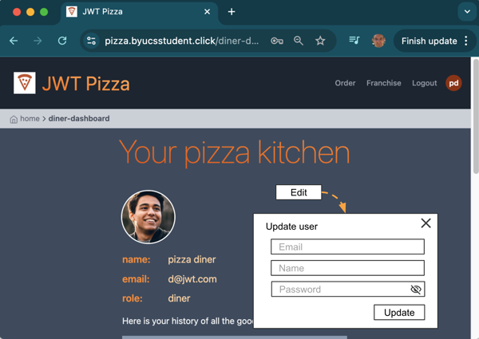
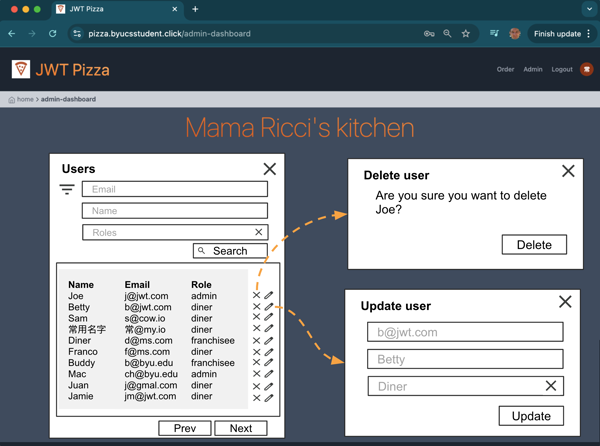
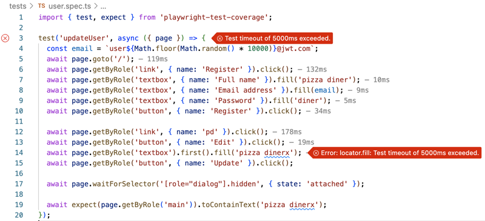
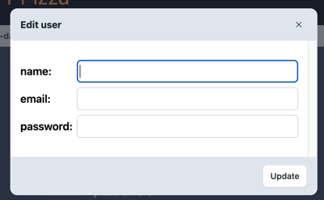
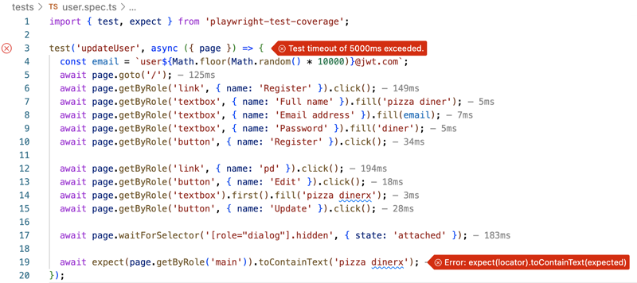

# Deliverable ⓹ Test driven development: JWT Pizza

🔑 **Key points**

- Use TDD to create documentation
- Use TDD to improve code abstractions
- Use TDD to support refactoring

---


## Prerequisites

Before you start work on this deliverable make sure you have read all of the preceding instruction topics and have completed all of the dependent exercises (topics marked with a ☑). This includes:

- ☑ [Test driven development (TDD)](tdd/tdd.md)

Failing to do this will likely slow you down as you will not have the required knowledge to complete the deliverable.

## Getting started

The JWT Pizza CEO wants to add a few new features to the application before we go live. This includes:

| Feature            | Description                                                                                                                                                                                     |
| ------------------ | ----------------------------------------------------------------------------------------------------------------------------------------------------------------------------------------------- |
| Change credentials | As a user I can change my email and password.                                                                                                                                                   |
| View users         | As an admin I can see a list of all users. Each user's name, email, and role is displayed. The list is paginated with a length of 10. The list can be filtered by email address, role, or name. |
| Modify user        | As an admin I can change any user's name, email, and roles.                                                                                                                                     |
| Delete user        | As an admin I can delete any user.                                                                                                                                                              |

## Design

### Wireframes

Change my email, name, or password from the user view.



List, filter, modify, and delete users from the admin view.



### Endpoint definitions

| method | endpoint                            | request body                                                                        | response body                                                                                                                                                               |
| ------ | ----------------------------------- | ----------------------------------------------------------------------------------- | --------------------------------------------------------------------------------------------------------------------------------------------------------------------------- |
| PUT    | /api/user/:userId                   | {"name":"bob","email":"a@jwt.com", "password":"admin", "roles":[{"role": "diner"}]} | {"email":"a@jwt.com", "roles":[{"role": "diner"}]}                                                                                                                          |
| DELETE | /api/user/:userId                   |                                                                                     |                                                                                                                                                                             |
| GET    | /api/users?email=\*&name=\*&role=\* |                                                                                     | {"users":[<br/>{"id":3,"name":"Kai Chen","email":"d@jwt.com","roles":[{"role":"diner"}]},<br/>{"id":5,"name":"Buddy","email":"b@jwt.com","roles":[{"role":"admin"}]}<br/>]} |

## Getting started

To get you started we will walk through the TDD process of adding the ability for a user to change their credentials.

### Starting test

We start out by making sure we can get to the place where we want to add our functionality by using a new test that we create in a file named **user.spec.ts**. The test registers a new diner user and navigates to the diner dashboard.

```js
import { test, expect } from 'playwright-test-coverage';

test('updateUser', async ({ page }) => {
  const email = `user${Math.floor(Math.random() * 10000)}@jwt.com`;
  await page.goto('/');
  await page.getByRole('link', { name: 'Register' }).click();
  await page.getByRole('textbox', { name: 'Full name' }).fill('pizza diner');
  await page.getByRole('textbox', { name: 'Email address' }).fill(email);
  await page.getByRole('textbox', { name: 'Password' }).fill('diner');
  await page.getByRole('button', { name: 'Register' }).click();

  await page.getByRole('link', { name: 'pd' }).click();

  await expect(page.getByRole('main')).toContainText('pizza diner');
});
```

When we run this test it should work just fine since this is preexisting functionality.

### Display a simple dialog

We then enhance **dinerDashboard.tsx** with a simple dialog for updating the user fields. To start off we need to import the dialog controls.

```js
import { CloseIcon } from '../icons';
import { HSOverlay } from 'preline';
import Button from '../components/button';
```

Then add an `updateUser` function that is called when the **Edit** button is pressed.

```ts
async function updateUser() {
  setTimeout(() => {
    HSOverlay.close(document.getElementById('hs-jwt-modal')!);
  }, 100);
}
```

Add the **Edit** button to the display of the user. Put this right after the user's image.

```tsx
<Button title="Edit" className="w-16 p-0" onPress={() => HSOverlay.open(document.getElementById('hs-jwt-modal')!)} />
```

Finally we create the edit user dialog. For now we just display a placeholder for the user fields and provide an **Update** button.

```tsx
<div role="dialog" aria-modal="true" aria-labelledby="dialog-title" id="hs-jwt-modal" className="hs-overlay hidden size-full fixed top-10 start-0 z-[80] overflow-x-hidden overflow-y-auto pointer-events-none">
  <div className="hs-overlay-open:mt-7 hs-overlay-open:opacity-100 hs-overlay-open:duration-500 mt-0 opacity-0 ease-out transition-all sm:max-w-lg sm:w-full m-3 sm:mx-auto min-h-[calc(100%-3.5rem)]">
    <div className="w-full flex flex-col bg-white border shadow-sm rounded-xl pointer-events-auto   ">
      <div className="flex justify-between items-center py-3 px-4 border-b bg-slate-200 rounded-t-xl ">
        <h3 className="font-bold text-gray-800">Edit user</h3>
        <button type="button" className="flex justify-center items-center size-7 text-sm font-semibold rounded-full border border-transparent text-gray-800 hover:bg-gray-100 disabled:opacity-50 disabled:pointer-events-none" data-hs-overlay="#hs-jwt-modal">
          <CloseIcon className="" />
        </button>
      </div>
      <div className="p-4 overflow-y-scroll max-h-52">
        <div className="my-4 text-lg text-start grid grid-cols-5 gap-2 items-center">update fields here</div>
      </div>
      <div className="flex justify-end items-center gap-x-2 py-3 px-4 border-t  bg-slate-200 rounded-b-xl">
        <button type="button" className="py-2 px-3 inline-flex items-center gap-x-2 text-sm font-medium rounded-lg border border-gray-200 bg-white text-gray-800 shadow-sm hover:bg-gray-50 disabled:opacity-50 disabled:pointer-events-none" onClick={updateUser}>
          Update
        </button>
      </div>
    </div>
  </div>
</div>
```

### Test that the dialog displays

With the dialog stubbed in, we can enhance the test to make sure the dialog displays and dismisses properly. Adding the following code we make sure that we can press the **Edit** button, view the dialog, and then dismiss it.

**user.spec.ts**

```js
  await page.getByRole('button', { name: 'Edit' }).click();
  await expect(page.locator('h3')).toContainText('Edit user');
  await page.getByRole('button', { name: 'Update' }).click();

  await page.waitForSelector('[role="dialog"].hidden', { state: 'attached' });

  await expect(page.getByRole('main')).toContainText('pizza diner');
});
```

If we got all the application and testing code written correctly, the test should pass fine.

### Enhance the test with dialog user fields

To this point we have driven the development by first writing the code and then the test. Let's flip that an write the test first, let it fail, and then white the code until the test passes.

Add a test that updates a non-existent dialog textbox for the user's name. Then assert that the name updates the user's information once the dialog is dismissed.

**user.spec.ts**

```js
  await page.getByRole('button', { name: 'Edit' }).click();
  await expect(page.locator('h3')).toContainText('Edit user');
  await page.getByRole('textbox').first().fill('pizza dinerx');
  await page.getByRole('button', { name: 'Update' }).click();

  await page.waitForSelector('[role="dialog"].hidden', { state: 'attached' });

  await expect(page.getByRole('main')).toContainText('pizza dinerx');

});
```

When you run the test it should fail.



### Add dialog fields

To make the test pass we need to enhance the dialog code to represent all of the user fields and then update the user on submission.

**dinerDashboard.tsx**

Add React ref hooks to the top of the component that tracks the altered user fields. Initially these will be empty, but as the dialog fields are changed to represent the user data the refs will contain the proper values.

```ts
const nameRef = React.useRef<HTMLInputElement>(null);
const emailRef = React.useRef<HTMLInputElement>(null);
const passwordRef = React.useRef<HTMLInputElement>(null);
```

Then we want to modify the dialog to represent all of the user fields. Replace

```tsx
<div className="my-4 text-lg text-start grid grid-cols-5 gap-2 items-center">update fields here</div>
```

with

```tsx
<div className="my-4 text-lg text-start grid grid-cols-5 gap-2 items-center">
  <div className="font-semibold">name:</div>
  <input type="text" className="col-span-4 border border-gray-300 rounded-md p-1" defaultValue={user.name} ref={nameRef} />
  <div className="font-semibold">email:</div>
  <input type="email" className="col-span-4 border border-gray-300 rounded-md p-1" defaultValue={user.email} ref={emailRef} />
  <div className="font-semibold">password:</div>
  <input id="password" type="text" className="col-span-4 border border-gray-300 rounded-md p-1" defaultValue="" ref={passwordRef} />
</div>
```

This should result in a dialog that looks like this:



Now when you run the test it will fail when it checks to see if the user's name was updated instead of when we tried to enter the new user name.



### Update the user fields

The next step is to update the **user** property with the correct values so that React will rerender everything properly.

We need the ability to set the user for the React state variable maintained by the **App** component. You do this by just adding another property to the **DinerDashboard** that represents the `setUser` function.

**app.tsx**

```js
    { title: 'Diner', to: '/diner-dashboard', component: <DinerDashboard user={user} setUser={setUser} />, display: [] },
```

And then we modify the **DinerDashboard** component to receive the property and update it in the `updateUser` function.

**dinerDashboard.tsx**

```ts
interface Props {
  user: User | null;
  setUser: (user: User) => void;
}
```

```ts
async function updateUser() {
  let updatedUser: User = {
    id: user.id,
    name: nameRef.current?.value,
    email: emailRef.current?.value,
    password: passwordRef.current?.value || undefined,
    roles: user.roles,
  };

  props.setUser(updatedUser);
  setTimeout(() => {
    HSOverlay.close(document.getElementById('hs-jwt-modal')!);
  }, 100);
}
```

Now the test will pass without any errors.

### Are we done yet?

With the test passing and the functionality working we could be tempted to think we are done and move on to the next feature. However, this is a good time to stop and consider other tests that we might be missing.

For example, what if we navigate away from the **DinerDashboard**, refresh the page, or log out. Will our user modification still be there? Can we change the other user fields such as the password or email? What happens if we do change the credentials? Will we be able to log back in?

This is the power of TDD. It forces you to write your code from the user's perspective, and write the tests necessary to have confidence that the application is working correctly.

So let's go ahead and enhance our test by logging out and then back in so that we can make sure the edits are persistent.

```js
await page.getByRole('link', { name: 'Logout' }).click();
await page.getByRole('link', { name: 'Login' }).click();

await page.getByRole('textbox', { name: 'Email address' }).fill(email);
await page.getByRole('textbox', { name: 'Password' }).fill('diner');
await page.getByRole('button', { name: 'Login' }).click();

await page.getByRole('link', { name: 'pd' }).click();

await expect(page.getByRole('main')).toContainText('pizza dinerx');
```

This test will fail. Take a minute an try and figure out why. What did we miss? You can do this by debugging the application either as a user, or by debugging the test. My preference is usually debugging the test because I can set breakpoints, let the test repeatedly drive the action, and see where my assumptions failed.


By debugging the test we can see that it failed because the user information passed to the **DinerDashboard** component is still the old data because we never actually saved the data to the server. We only modified the React property managed by the **App** component.

### Calling the service

To fix this we need to modify the `pizzaService` so that we can call the service endpoint to update a user.

**pizzaService.ts**

```js
  updateUser(user: User): Promise<User>;
```

**httpPizzaService.ts**

```js
  async updateUser(updatedUser: User): Promise<User> {
    const { user, token } = await this.callEndpoint(`/api/user/${updatedUser.id}`, 'PUT', updatedUser);
    localStorage.setItem('token', token);
    return Promise.resolve(user);
  }
```

We then call the service whenever the user gets updated.

**dinerDashboard.tsx**

```tsx
async function updateUser() {
  let updatedUser: User = {
    id: user.id,
    name: nameRef.current?.value,
    email: emailRef.current?.value,
    password: passwordRef.current?.value || undefined,
    roles: user.roles,
  };

  await pizzaService.updateUser(updatedUser);

  props.setUser(updatedUser);
  setTimeout(() => {
    HSOverlay.close(document.getElementById('hs-jwt-modal')!);
  }, 100);
}
```

And now our test is all green.

# Old stuff

Enhance the updateUser function to read and update the user fields.

```ts
async function updateUser() {
  let updatedUser = {
    id: user.id,
    name: nameRef.current?.value,
    email: emailRef.current?.value,
    password: passwordRef.current?.value || undefined,
  };

  props.setUser(updatedUser);
  setTimeout(() => {
    HSOverlay.close(document.getElementById('hs-jwt-modal')!);
  }, 100);
}
```

### Allow for the updating of the user

Modify the app so that the diner dashboard can update the user state.

**app.tsx**

```js
    { title: 'Diner', to: '/diner-dashboard', component: <DinerDashboard user={user} setUser={setUser} />, display: [] },
```

### Create the UI dialog

Import the necessary dependencies to create the dialog

**dinerDashboard.tsx**

```js
import { CloseIcon } from '../icons';
import { HSOverlay } from 'preline';
import Button from '../components/button';
```

Modify the component properties to accept the setUser function.

```ts
interface Props {
  user: User | null;
  setUser: (user: User) => void;
}
```

Add refs to track the altered user properties.

```ts
const nameRef = React.useRef<HTMLInputElement>(null);
const emailRef = React.useRef<HTMLInputElement>(null);
const passwordRef = React.useRef<HTMLInputElement>(null);
```

Add updateUser function.

```ts
async function updateUser() {
  const updatedUser = await pizzaService.updateUser({
    id: user.id,
    name: nameRef.current?.value,
    email: emailRef.current?.value,
    password: passwordRef.current?.value || undefined,
  });

  props.setUser(updatedUser);
  setTimeout(() => {
    HSOverlay.close(document.getElementById('hs-jwt-modal')!);
  }, 100);
}
```

Add an edit button to the display of the user. Add this right after the user's image.

```tsx
<Button title="Edit" className="w-16 p-0" onPress={() => HSOverlay.open(document.getElementById('hs-jwt-modal')!)} />
```

Create the dialog

```tsx
<div role="dialog" aria-modal="true" aria-labelledby="dialog-title" id="hs-jwt-modal" className="hs-overlay hidden size-full fixed top-10 start-0 z-[80] overflow-x-hidden overflow-y-auto pointer-events-none">
  <div className="hs-overlay-open:mt-7 hs-overlay-open:opacity-100 hs-overlay-open:duration-500 mt-0 opacity-0 ease-out transition-all sm:max-w-lg sm:w-full m-3 sm:mx-auto min-h-[calc(100%-3.5rem)]">
    <div className="w-full flex flex-col bg-white border shadow-sm rounded-xl pointer-events-auto   ">
      <div className="flex justify-between items-center py-3 px-4 border-b bg-slate-200 rounded-t-xl ">
        <h3 className="font-bold text-gray-800">Edit user</h3>
        <button type="button" className="flex justify-center items-center size-7 text-sm font-semibold rounded-full border border-transparent text-gray-800 hover:bg-gray-100 disabled:opacity-50 disabled:pointer-events-none" data-hs-overlay="#hs-jwt-modal">
          <CloseIcon className="" />
        </button>
      </div>
      <div className="p-4 overflow-y-scroll max-h-52">
        <div className="my-4 text-lg text-start grid grid-cols-5 gap-2 items-center">
          <div className="font-semibold">name:</div>
          <input type="text" className="col-span-4 border border-gray-300 rounded-md p-1" defaultValue={user.name} ref={nameRef} />
          <div className="font-semibold">email:</div>
          <input type="email" className="col-span-4 border border-gray-300 rounded-md p-1" defaultValue={user.email} ref={emailRef} />
          <div className="font-semibold">password:</div>
          <input id="password" type="text" className="col-span-4 border border-gray-300 rounded-md p-1" defaultValue="" ref={passwordRef} />
        </div>
      </div>
      <div className="flex justify-end items-center gap-x-2 py-3 px-4 border-t  bg-slate-200 rounded-b-xl">
        <button type="button" className="py-2 px-3 inline-flex items-center gap-x-2 text-sm font-medium rounded-lg border border-gray-200 bg-white text-gray-800 shadow-sm hover:bg-gray-50 disabled:opacity-50 disabled:pointer-events-none" onClick={updateUser}>
          Update
        </button>
      </div>
    </div>
  </div>
</div>
```

### Expose the service endpoint

**pizzaService**

```js
  updateUser(user: User): Promise<User>;
```

**httpPizzaService**

```js
  async updateUser(updatedUser: User): Promise<User> {
    const { user, token } = await this.callEndpoint(`/api/user/${updatedUser.id}`, 'PUT', updatedUser);
    localStorage.setItem('token', token);
    return Promise.resolve(user);
  }
```

### Final test

**user.spec.ts**

```js
import { test, expect } from 'playwright-test-coverage';

test('updateUser', async ({ page }) => {
  await page.route('*/**/api/user/*', async (route) => {
    if (route.request().method() === 'PUT') {
      const body = route.request().postDataJSON();
      expect(body).toMatchObject({ name: 'pizza dinerx', email: 'd@jwt.com' });
      expect(body.password).toBeUndefined();
      await route.fulfill({ json: { user: body, token: 'abcdef' } });
    } else {
      if (route.request().method() === 'GET') {
        await route.fulfill({ json: { id: 2, name: 'pizza diner', email: 'd@jwt.com', roles: [{ role: 'diner' }] } });
      }
    }
  });

  await page.route('*/**/api/order', async (route) => {
    await route.fulfill({ json: { id: 1, dinerId: 1, orders: [{ id: 1, franchiseId: 1, storeId: 1, date: '2024-06-05T05:14:40.000Z', items: [{ id: 1, menuId: 1, description: 'Veggie', price: 0.05 }] }] } });
  });

  await page.route('*/**/api/auth', async (route) => {
    if (route.request().method() === 'PUT') {
      await route.fulfill({ json: { user: { id: 2, name: 'pizza diner', email: 'd@jwt.com', roles: [{ role: 'diner' }] }, token: 'abcdef' } });
    }
  });

  await page.goto('/');
  await page.getByRole('link', { name: 'Login' }).click();
  await page.getByRole('textbox', { name: 'Email address' }).fill('d@jwt.com');
  await page.getByRole('textbox', { name: 'Password' }).fill('diner');
  await page.getByRole('button', { name: 'Login' }).click();

  await page.getByRole('link', { name: 'pd' }).click();
  await page.getByRole('button', { name: 'Edit' }).click();
  await page.getByRole('textbox').first().fill('pizza dinerx');
  await page.getByRole('button', { name: 'Update' }).click();

  await page.waitForSelector('[role="dialog"].hidden', { state: 'attached' });

  await expect(page.getByRole('main')).toContainText('pizza dinerx');
});
```

## ⭐ Deliverable

In order to demonstrate your mastery of the concepts for this deliverable, complete the following.

1. Create Playwright tests for `jwt-pizza` that provide at least 80% coverage.
1. Create a GitHub Actions workflow that executes the tests.
1. Add the configuration necessary so that the workflow fails if there is not 80% coverage.
1. Add the reporting of the coverage to the workflow by creating a coverage badge in the README.md file.

Once this is all working, go to the [AutoGrader](https://cs329.cs.byu.edu) and submit your work for the deliverable.

### Rubric

| Percent | Item                                                                               |
| ------- | ---------------------------------------------------------------------------------- |
| 30%     | Successful execution of GitHub Actions to run test on commit                       |
| 70%     | At least 80% line coverage as documented by workflow execution and README.md badge |
