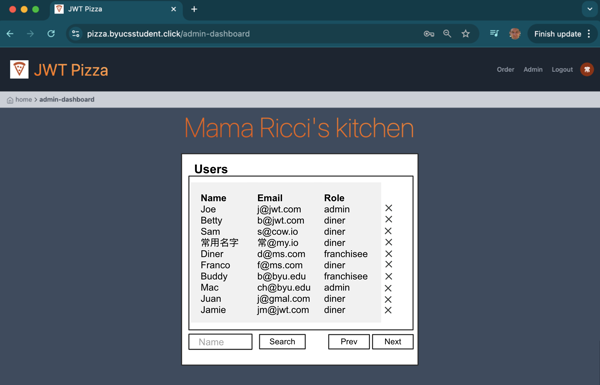

# Deliverable ⓹ Test driven development: JWT Pizza

🔑 **Key points**

- Use TDD to create documentation
- Use TDD to improve code abstractions
- Use TDD to support refactoring

---


## Prerequisites

Before you start work on this deliverable make sure you have read all of the preceding instruction topics and have completed all of the dependent exercises (topics marked with a ☑). This includes:

- ☑ [Test driven development (TDD)](tdd/tdd.md)

Failing to do this will likely slow you down as you will not have the required knowledge to complete the deliverable.

## Getting started

The JWT Pizza CEO wants to add a few new features to the application before we go live. This includes:

| Feature            | Description                                                                                                                                                                                     |
| ------------------ | ----------------------------------------------------------------------------------------------------------------------------------------------------------------------------------------------- |
| Change credentials | As a user I can change my email and password.                                                                                                                                                   |
| View users         | As an admin I can see a list of all users. Each user's name, email, and role is displayed. The list is paginated with a length of 10. The list can be filtered by email address, role, or name. |
| Modify user        | As an admin I can change any user's name, email, and roles.                                                                                                                                     |
| Delete user        | As an admin I can delete any user.                                                                                                                                                              |

## Design

### Wireframes

Change my email, name, or password from the user view.


List, filter, modify, and delete users from the admin view.



### Endpoint definitions

| method | endpoint                            | request body                                                                        | response body                                                                                                                                                               |
| ------ | ----------------------------------- | ----------------------------------------------------------------------------------- | --------------------------------------------------------------------------------------------------------------------------------------------------------------------------- |
| PUT    | /api/user/:userId                   | {"name":"bob","email":"a@jwt.com", "password":"admin", "roles":[{"role": "diner"}]} | {"email":"a@jwt.com", "roles":[{"role": "diner"}]}                                                                                                                          |
| DELETE | /api/user/:userId                   |                                                                                     |                                                                                                                                                                             |
| GET    | /api/users?email=\*&name=\*&role=\* |                                                                                     | {"users":[<br/>{"id":3,"name":"Kai Chen","email":"d@jwt.com","roles":[{"role":"diner"}]},<br/>{"id":5,"name":"Buddy","email":"b@jwt.com","roles":[{"role":"admin"}]}<br/>]} |

## Getting started

To get you started we will walk through the TDD process of adding the ability for a user to change their credentials.

**user.spec.ts**

Basic login and navigate to diner dashboard test

```js
import { test, expect } from 'playwright-test-coverage';

test('updateUser', async ({ page }) => {
  await page.goto('/');
  await page.getByRole('link', { name: 'Login' }).click();
  await page.getByRole('textbox', { name: 'Email address' }).fill('d@jwt.com');
  await page.getByRole('textbox', { name: 'Email address' }).press('Tab');
  await page.getByRole('textbox', { name: 'Password' }).fill('diner');
  await page.getByRole('button', { name: 'Login' }).click();

  await page.getByRole('link', { name: 'pd' }).click();

  await expect(page.getByRole('main')).toContainText('pizza diner');
});
```

### Allow for the updating of the user

Modify the app so that the diner dashboard can update the user state.

**app.jsx**

```js
    { title: 'Diner', to: '/diner-dashboard', component: <DinerDashboard user={user} setUser={setUser} />, display: [] },
```

### Create the UI dialog

Import the necessary dependencies to create the dialog

**dinerDashboard.tsx**

```js
import { CloseIcon } from '../icons';
import { HSOverlay } from 'preline';
import Button from '../components/button';
```

Modify the component properties to accept the setUser function.

```ts
interface Props {
  user: User | null;
  setUser: (user: User) => void;
}
```

Add refs to track the altered user properties.

```ts
const nameRef = React.useRef<HTMLInputElement>(null);
const emailRef = React.useRef<HTMLInputElement>(null);
const passwordRef = React.useRef<HTMLInputElement>(null);
```

Add updateUser function.

```ts
async function updateUser() {
  const updatedUser = await pizzaService.updateUser({
    id: user.id,
    name: nameRef.current?.value,
    email: emailRef.current?.value,
    password: passwordRef.current?.value || undefined,
  });

  props.setUser(updatedUser);
  setTimeout(() => {
    HSOverlay.close(document.getElementById('hs-jwt-modal')!);
  }, 100);
}
```

Add an edit button to the display of the user. Add this right after the user's image.

```jsx
          <Button title="Edit" className="w-16 p-0" onPress={() => HSOverlay.open(document.getElementById('hs-jwt-modal')!)} />
```

Create the dialog

```jsx
<div role="dialog" aria-modal="true" aria-labelledby="dialog-title" id="hs-jwt-modal" className="hs-overlay hidden size-full fixed top-10 start-0 z-[80] overflow-x-hidden overflow-y-auto pointer-events-none">
  <div className="hs-overlay-open:mt-7 hs-overlay-open:opacity-100 hs-overlay-open:duration-500 mt-0 opacity-0 ease-out transition-all sm:max-w-lg sm:w-full m-3 sm:mx-auto min-h-[calc(100%-3.5rem)]">
    <div className="w-full flex flex-col bg-white border shadow-sm rounded-xl pointer-events-auto   ">
      <div className="flex justify-between items-center py-3 px-4 border-b bg-slate-200 rounded-t-xl ">
        <h3 className="font-bold text-gray-800">Edit user</h3>
        <button type="button" className="flex justify-center items-center size-7 text-sm font-semibold rounded-full border border-transparent text-gray-800 hover:bg-gray-100 disabled:opacity-50 disabled:pointer-events-none" data-hs-overlay="#hs-jwt-modal">
          <CloseIcon className="" />
        </button>
      </div>
      <div className="p-4 overflow-y-scroll max-h-52">
        <div className="my-4 text-lg text-start grid grid-cols-5 gap-2 items-center">
          <div className="font-semibold">name:</div>
          <input type="text" className="col-span-4 border border-gray-300 rounded-md p-1" defaultValue={user.name} ref={nameRef} />
          <div className="font-semibold">email:</div>
          <input type="email" className="col-span-4 border border-gray-300 rounded-md p-1" defaultValue={user.email} ref={emailRef} />
          <div className="font-semibold">password:</div>
          <input id="password" type="text" className="col-span-4 border border-gray-300 rounded-md p-1" defaultValue="" ref={passwordRef} />
        </div>
      </div>
      <div className="flex justify-end items-center gap-x-2 py-3 px-4 border-t  bg-slate-200 rounded-b-xl">
        <button type="button" className="py-2 px-3 inline-flex items-center gap-x-2 text-sm font-medium rounded-lg border border-gray-200 bg-white text-gray-800 shadow-sm hover:bg-gray-50 disabled:opacity-50 disabled:pointer-events-none" onClick={updateUser}>
          Update
        </button>
      </div>
    </div>
  </div>
</div>
```

### Expose the service endpoint

**pizzaService**

```js
  updateUser(user: User): Promise<User>;
```

**httpPizzaService**

```js
  async updateUser(updatedUser: User): Promise<User> {
    const { user, token } = await this.callEndpoint(`/api/user/${updatedUser.id}`, 'PUT', updatedUser);
    localStorage.setItem('token', token);
    return Promise.resolve(user);
  }
```

### Final test

**user.spec.ts**

```js
import { test, expect } from 'playwright-test-coverage';

test('updateUser', async ({ page }) => {
  await page.route('*/**/api/user/*', async (route) => {
    if (route.request().method() === 'PUT') {
      const body = route.request().postDataJSON();
      expect(body).toMatchObject({ name: 'pizza dinerx', email: 'd@jwt.com' });
      expect(body.password).toBeUndefined();
      await route.fulfill({ json: { user: body, token: 'abcdef' } });
    } else {
      if (route.request().method() === 'GET') {
        await route.fulfill({ json: { id: 2, name: 'pizza diner', email: 'd@jwt.com', roles: [{ role: 'diner' }] } });
      }
    }
  });

  await page.route('*/**/api/order', async (route) => {
    await route.fulfill({ json: { id: 1, dinerId: 1, orders: [{ id: 1, franchiseId: 1, storeId: 1, date: '2024-06-05T05:14:40.000Z', items: [{ id: 1, menuId: 1, description: 'Veggie', price: 0.05 }] }] } });
  });

  await page.route('*/**/api/auth', async (route) => {
    if (route.request().method() === 'PUT') {
      await route.fulfill({ json: { user: { id: 2, name: 'pizza diner', email: 'd@jwt.com', roles: [{ role: 'diner' }] }, token: 'abcdef' } });
    }
  });

  await page.goto('/');
  await page.getByRole('link', { name: 'Login' }).click();
  await page.getByRole('textbox', { name: 'Email address' }).fill('d@jwt.com');
  await page.getByRole('textbox', { name: 'Email address' }).press('Tab');
  await page.getByRole('textbox', { name: 'Password' }).fill('diner');
  await page.getByRole('button', { name: 'Login' }).click();

  await page.getByRole('link', { name: 'pd' }).click();
  await page.getByRole('button', { name: 'Edit' }).click();
  await page.getByRole('textbox').first().fill('pizza dinerx');
  await page.getByRole('button', { name: 'Update' }).click();

  await page.waitForSelector('[role="dialog"].hidden', { state: 'attached' });

  await expect(page.getByRole('main')).toContainText('pizza dinerx');
});
```

## ⭐ Deliverable

In order to demonstrate your mastery of the concepts for this deliverable, complete the following.

1. Create Playwright tests for `jwt-pizza` that provide at least 80% coverage.
1. Create a GitHub Actions workflow that executes the tests.
1. Add the configuration necessary so that the workflow fails if there is not 80% coverage.
1. Add the reporting of the coverage to the workflow by creating a coverage badge in the README.md file.

Once this is all working, go to the [AutoGrader](https://cs329.cs.byu.edu) and submit your work for the deliverable.

### Rubric

| Percent | Item                                                                               |
| ------- | ---------------------------------------------------------------------------------- |
| 30%     | Successful execution of GitHub Actions to run test on commit                       |
| 70%     | At least 80% line coverage as documented by workflow execution and README.md badge |
