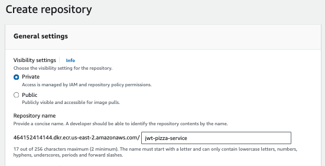
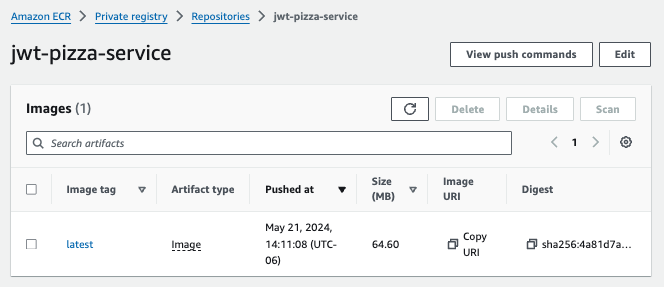

# Deliverable ⓺ Scalable deployment: JWT Pizza Service


Now that you have some experience with creating, registering, and deploying simple containers it is time to deploy JWT Pizza Service to the Cloud.

## Setting up ECR

1. Open the AWS browser console and navigate to the ECR service.
1. Press `Create repository`.
1. Leave the repository as `private`.
1. Give the repository the name `jwt-pizza-service`
1. Press `Create repository`.
   

## Creating a JWT Pizza Service container

1. Open your command console and navigate to the directory containing your fork of `jwt-pizza-service`.
1. Create a file named `Dockerfile` in the project directory with the following content.

   ```dockerFile
   ARG NODE_VERSION=20.12.2

   FROM node:${NODE_VERSION}-alpine
   WORKDIR /usr/src/app
   COPY . .
   RUN npm install
   EXPOSE 3000
   CMD node index.js
   ```

1. Copy the source code files to `dist` that we want to distribute.
   ```sh
   mkdir dist
   cp Dockerfile dist
   cp -r src/* dist
   cp *.json dist
   ```
1. Modify/Create the `config.json` file. Set the database host field so that it looks outside of the container for the MySQL server by specifying the value of `host.docker.internal`. Set the parameters, such as the jwtSecret and factory.apiKey, according to your environment.
   ```sh
   module.exports = {
    jwtSecret: 'yourRandomJWTGenerationSecretForAuth',
    db: {
      connection: {
        host: 'host.docker.internal',
        user: 'root',
        password: 'yourDatabasePassword',
        database: 'pizza',
        connectTimeout: 60000,
      },
      listPerPage: 10,
    },
    factory: {
      url: 'https://jwt-pizza-factory.cs329.click',
      apiKey: 'yourHeadquartersProvidedApiKey',
    },
   };
   ```
1. Build the image.
   ```sh
   docker build -t jwt-pizza-service .
   ```
1. Verify that the container exists
   ```sh
   ➜  docker image ls
   REPOSITORY         TAG      IMAGE ID       CREATED         SIZE
   jwt-pizza-service  latest   9689e2852c3a   2 seconds ago   132MB
   ```
1. Run the container and make sure it works. Substitute the image ID with the correct value for your newly created Docker image.

   ```sh
   docker run -d --name jwt-pizza-service -p 3000:3000 9689e2852c3a

   curl localhost:3000/api/docs
   ```

   This should return the service documentation if successful.

1. Stop and delete the container
   ```sh
   docker rm -fv 0af
   ```

## Push to registry

⚠️ **Note**: You must have the AWS CLI installed before you execute the next steps.

1. Open the AWS browser console and navigate to the ECR service.
1. Open the repository you created in the earlier step.
1. Click on `View push command`. This should display a series of steps need push a Docker image from your local registry to ECR. Use these commands in the next steps. If you use the examples below, make sure you replace the example AWS account ID with your account ID.
   1. **Obtaining an Auth Token**: This uses the AWS CLI to generate a temporary authorization token and then logs you into Docker using the token for the given registry.
      ```sh
      aws ecr get-login-password --region us-east-2 | docker login --username AWS --password-stdin 1234567890.dkr.ecr.us-east-2.amazonaws.com
      ```
      This should return `Login Succeeded` if the AWS CLI has rights to interact with ECR and generate temporary tokens.
   2. **Build the Docker image**: This is the command to build your image. You have already done this and so you can skip this step.
   3. **Create ECR repository image**: This creates a new repository of the local version of your image to the name expected for uploading to ECR.
      ```sh
      docker tag jwt-pizza-service:latest 1234567890.dkr.ecr.us-east-2.amazonaws.com/jwt-pizza-service:latest
      ```
   4. **Copy to ECR**: This does the actual copy up to ECR
      ```sh
      docker push 1234567890.dkr.ecr.us-east-2.amazonaws.com/jwt-pizza-service:latest
      ```
      This should display a list of push commands as the image is uploaded to ECR.
1. View your repository from the ECR service with the AWS browser console.
   

## Launch the container with Fargate

## Create GitHub action deployment workflow
