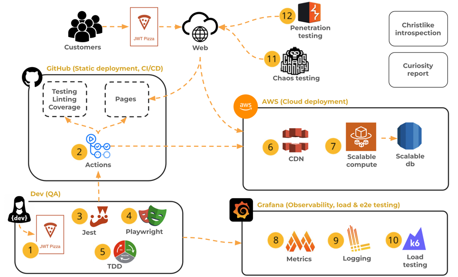

# Deliverable ⓺ Scalable deployment: JWT Pizza Service

🔑 **Key points**

- Deploy JWT Pizza Service to scalable services using CI.

---



Now that you have experience with creating, registering, and deploying the JWT Pizza Service manually, it is time to modify your CI workflow to do this automatically when you push a change to the repository. This deliverable represents the **Scalable compute** portion of our product overview diagram. It provides the hosting of the `jwt-pizza-service` in a way that can support an ever-growing customer base, all driven by an automated CI process.

Your work on this deliverable consists of four parts:

1. **ECR configuration**: Set up ECR to store your `jwt-pizza-service` Docker container images.
1. **Image registration CI**: Modify the CI pipeline to automatically build and deploy a new container image to ECR.
1. **ECS configuration**: Setup ECS to deploy a container to Fargate and expose it publicly using the application load balancer.
1. **Image deployment CI**: Modify the CI pipeline to automatically deploy a new container image to ECS.


## Step 1: ECR configuration

You should have already followed the [AWS ECR instruction](../awsEcr/awsEcr.md) in order to get your AWS account set up to store the JWT Pizza Service container images in a Docker compliant registry. If you have not done that yet, do so now.

## Step 2: Image registration CI

With the ECR fully configured, you are ready to automate the building and uploading a Docker container image for the JWT Pizza service whenever a change is made to the `jwt-pizza-service` code base. This work requires that you increase the rights that the CI workflow has, and modify the workflow script to build and push the Docker image.

### Modify the IAM trust policy

In order for the `jwt-pizza-service` CI workflow to make requests over the OIDC authorized connection, you must alter the previously configured `github-ci` IAM role so that the `jwt-pizza-service` GitHub repository is also part of the trust relationship.

1. Open the AWS IAM service console.
1. Choose `Roles`.
1. Select the `github-ci` role that you created when you set up `jwt-pizza` to deploy to S3.
1. Select the `Trust relationships` tab.
1. Press `Edit trust policy`.
1. Replace the `token.actions.githubusercontent.com:sub` value with the following. This allows both of your source repositories to make an OIDC connection.
   ```json
   "token.actions.githubusercontent.com:sub": [
   "repo:YOURGITHUBACCOUNTHERE/jwt-pizza:ref:refs/heads/main",
   "repo:YOURGITHUBACCOUNTHERE/jwt-pizza-service:ref:refs/heads/main"
   ],
   ```
1. Press the `Update policy` button.

### Enhance the IAM rights

Next you need to enhance the `github-ci` user rights so that they can push to ECR and initiate the deployment to ECS.

1. Open the AWS IAM service console.
1. Choose `Roles`.
1. Select the `github-ci` role that you created when you set up `jwt-pizza` to deploy to S3.
1. Select the `Permissions` tab.
1. Click on the `jwt-pizza-ci-deployment` policy.
1. Select `JSON` and press `Edit`.
1. Add the following statements in order to allow the use of ECR and ECS. Make sure you replace `YOURACCOUNTIDHERE` with your actual AWS account ID.

   ```json
   {
      "Sid": "PushToECR",
      "Effect": "Allow",
      "Action": [
            "ecr:*"
      ],
      "Resource": [
            "*"
      ]
   },
   {
      "Sid": "RegisterTaskDefinition",
      "Effect": "Allow",
      "Action": [
            "ecs:DescribeTaskDefinition",
            "ecs:RegisterTaskDefinition"
      ],
      "Resource": "*"
   },
   {
      "Sid": "PassRolesInTaskDefinition",
      "Effect": "Allow",
      "Action": [
            "iam:PassRole"
      ],
      "Resource": [
            "arn:aws:iam::YOURACCOUNTIDHERE:role/jwt-pizza-ecs"
      ]
   },
   {
      "Sid": "DeployService",
      "Effect": "Allow",
      "Action": [
            "ecs:UpdateService",
            "ecs:DescribeServices"
      ],
      "Resource": [
            "arn:aws:ecs:us-east-1:YOURACCOUNTIDHERE:service/jwt-pizza-service/jwt-pizza-service"
      ]
   }
   ```

1. Press `Next`.
1. Press `Save`.

### Modify the CI workflow script for image upload

Before you can modify the CI workflow for the JWT Pizza Service you need to add the following secrets to your fork of the `jwt-pizza-service` repository.

| Secret      | Description                                         | Example   |
| ----------- | --------------------------------------------------- | --------- |
| AWS_ACCOUNT | Your AWS account number                             | 343243424 |
| CI_IAM_ROLE | The IAM user with rights to deploy your application | github-ci |

Previously the workflow stopped after the tests were done and the coverage badge was updated. Now you want to modify the **build** job of the workflow so that it creates the distributions files you will use to create and deploy a JWT Pizza Service Docker container.

1. Create a distribution folder that will become our Docker container. This copies all the source code files and the newly created Dockerfile. We also replace the temporary database credentials that were used during testing with the ones needed by the production environment.
   ```yml
   - name: Create dist
     run: |
       mkdir dist
       cp Dockerfile dist
       cp -r src/* dist
       cp *.json dist
       sed -i "s/root/${{ secrets.DB_USERNAME }}/g" dist/config.js
       sed -i "s/tempdbpassword/${{ secrets.DB_PASSWORD }}/g" dist/config.js
       sed -i "s/127.0.0.1/${{ secrets.DB_HOSTNAME }}/g" dist/config.js
   ```
1. Create a CI pipeline artifact from the resulting distribution build.

   ```yml
   - name: Update distribution artifact
     uses: actions/upload-artifact@v4
     with:
       name: package
       path: dist/
   ```

Next, add a **deploy** job that creates the container and pushes it to ECR.

1. Create a new GitHub Actions Job underneath the `build` job and name it `deploy`. Give it permissions to access the CI pipeline token so that it can authenticate with OIDC. Add the version ID created in the build step to the job environment.

   ```yml
   deploy:
     runs-on: ubuntu-latest
     permissions:
       id-token: write
     needs: build
     env:
       version: ${{needs.build.outputs.version}}
   ```

1. As the first step, download the distribution artifact created by the last job.

   ```yml
   steps:
     - name: Download distribution artifact
       uses: actions/download-artifact@v4
       with:
         name: package
   ```

1. Authenticate to AWS using OIDC. This is the same authentication step that we took with the frontend deployment. Using OIDC makes it so we don't have to store any credentials to our AWS account.

   ⚠️ Make sure the AWS region matches the region you are using.

   ```yml
   - name: Create OIDC token to AWS
     uses: aws-actions/configure-aws-credentials@v4
     with:
       audience: sts.amazonaws.com
       aws-region: us-east-1
       role-to-assume: arn:aws:iam::${{ secrets.AWS_ACCOUNT }}:role/${{ secrets.CI_IAM_ROLE }}
   ```

1. Login to AWS ECR. We need to provide credentials to Docker so that it can push container images into the register. This [action](https://github.com/aws-actions/amazon-ecr-login) gets a temporary password from ECR using the OIDC credential we previously obtained.

   ```yml
   - name: Login to Amazon ECR
      id: login-ecr
      uses: aws-actions/amazon-ecr-login@v2
   ```

1. Set up the Docker build and emulation. We need to build an ARM64 platform package. In order to do that in Linux we need to emulate an ARM based environment.

   ```yml
   - name: Set up machine emulation
      uses: docker/setup-qemu-action@v3

   - name: Set up Docker build
      uses: docker/setup-buildx-action@v3
   ```

1. Build and push the docker container. We use the `--push` parameter to automatically push the container image to ECR once it finishes building. We also define an output variable that will contain the name of the image that was pushed, so we can reference it later.
   ```yml
   - name: Build and push container image
     id: build-image
     env:
       ECR_REGISTRY: ${{ steps.login-ecr.outputs.registry }}
       ECR_REPOSITORY: 'jwt-pizza-service'
     run: |
       docker build --platform=linux/arm64 -t $ECR_REGISTRY/$ECR_REPOSITORY --push .
       echo "image=$ECR_REGISTRY/$ECR_REPOSITORY:latest" >>  $GITHUB_OUTPUT
   ```

### Test the image push

You should now be able to commit and push the workflow script to GitHub. This will trigger a container image to build and push to ECR. Once it is done you should see your image show up on the ECR images dashboard.


## Step 3: ECS configuration

You should have already followed the [AWS ECS instruction](../awsEcs/awsEcs.md) in order to get your AWS account setup to host the JWT Pizza Service container using Fargate and an application load balancer. Additionally, you should have already set up your [RDS MySQL database](../awsRdsMysql/awsRdsMysql.md). If you have not done this yet, then do so now.

## Step 4: Image deployment CI

With ECR configured, the CI workflow for building and pushing a container image to ECR, and ECS configured to deploy a container, you are now ready to enhance the CI workflow to automatically push the container to ECS and update the application load balancer.

You deploy the new container to ECS by adding three new steps to the **deploy** job of the workflow.

1. First, add the step that makes a copy of the existing ECS `jwt-pizza-service` task definition and save it to a file named `task-definition.json`. Here is an [example task-definition.json](task-definition.json) if you are interested in what they look like.
   ```yml
   - name: Download task definition
     run: |
       aws ecs describe-task-definition --region us-east-1 --task-definition jwt-pizza-service --query taskDefinition > task-definition.json
       echo $(cat task-definition.json | jq 'del(.taskDefinitionArn, .requiresAttributes, .compatibilities, .revision, .status, .registeredAt, .registeredBy)') > task-definition.json
   ```
1. Modify the task definition so that it contains the name of the new container image that you just created.
   ```yml
   - name: Create new task definition
     id: task-def
     uses: aws-actions/amazon-ecs-render-task-definition@v1
     with:
       task-definition: task-definition.json
       container-name: jwt-pizza-service
       image: ${{ steps.build-image.outputs.image }}
   ```
1. Deploy the new task definition and update the ECS service. This will trigger ECS to create a rolling deployment of the new container and update the application load balancer to expose the new container.
   ```yml
   - name: Deploy new task definition
     uses: aws-actions/amazon-ecs-deploy-task-definition@v1
     with:
       task-definition: ${{ steps.task-def.outputs.task-definition }}
       service: jwt-pizza-service
       cluster: jwt-pizza-service
       wait-for-service-stability: false
   ```

### Test the container deployment

You should now be able to commit and push the workflow script to GitHub. This will trigger the container to be pushed to ECS where it will become visible through your EC2 load balancer.

After the container has been deploy you can test the backend by making curl requests. _(Replace the assignment of the host variable with your own hostname.)_

```sh
# Set the hostname - replace with your hostname
host=https://pizza-service.byucsstudent.click

# Note that the version number will be different
curl $host
{"message":"welcome to JWT Pizza","version":"20240613.144627"}

# Note that the menu will be empty until you add some tasty pizzas
curl $host/api/order/menu
[]
```

### Initial pizza data

Just like when you initialized the JWT Pizza Service for your development environment data, you will need to repeat those steps now so that you have some interesting data in your production environment. Follow the steps provided in the [JWT Pizza Data](../jwtPizzaData/jwtPizzaData.md) instruction with your production Pizza Service hostname.

## Deploy the full cloud stack

Now that have both your frontend and your backend running on AWS you need to change the configuration of your `jwt-pizza` code so that it calls your deployment instead of the JWT Pizza Headquarters implementation.

From your fork of the `jwt-pizza` repository open the `.env.production` and modify it so that the `VITE_PIZZA_SERVICE_URL` is pointing to your URL for your newly deployed backend.

```sh
VITE_PIZZA_SERVICE_URL=https://pizza-service.YOURHOSTNAMEHERE
VITE_PIZZA_FACTORY_URL=https://pizza-factory.cs329.click
```

Repeat the same change with the `.env.development` file so that you use your backend when you are experimenting your frontend in your development environment.

Then push your changes to GitHub. Your CI pipeline should deploy the frontend changes and complete your work on creating a full cloud stack. With this change you can open up the dev tools while visiting your front end and see the requests going to your backend.


## ☑ Assignment

In order to demonstrate your mastery of the concepts for this deliverable, complete the following.

1. Alter the IAM policies, roles, and identity provider definitions necessary to secure access for backend deployment.
1. Set up ECR to host your backend Docker container.
1. Set up ECS to deploy your backend Docker container using Fargate.
1. Alter your GitHub Actions workflow to update ECR and ECS in order to deploy the backend service.
1. Alter your DNS record in Route 53 to point to the application load balancer distribution.
1. Modify and deploy your frontend so that it calls your backend service.

Once this is all working, go to the [AutoGrader](https://cs329.cs.byu.edu) and submit your work for the deliverable.

### Rubric

| Percent | Item                                                    |
| ------- | ------------------------------------------------------- |
| 20%     | Secure Fargate deployment based on ECR and ECS          |
| 20%     | AWS Load balancer used to access Fargate                |
| 20%     | MySQL database deployed for backend data persistence    |
| 30%     | Updated GitHub Action workflow deploying to ECR and ECS |
| 10%     | Your backend called for all frontend requests           |

**Congratulations!** You have completed the process of using RDS, IAM, ECR, ECS, and Route 53 to deploy your backend service. Time to go celebrate. I'm thinking ice cream 🍦.
