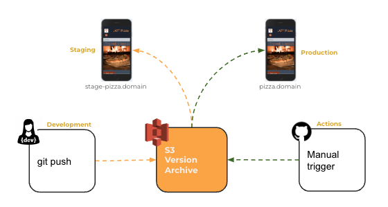
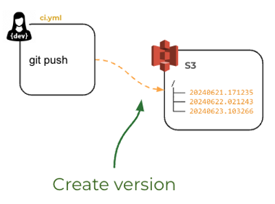
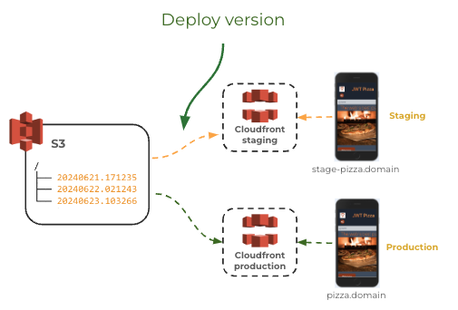
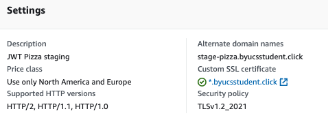
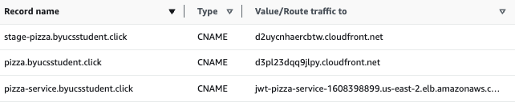
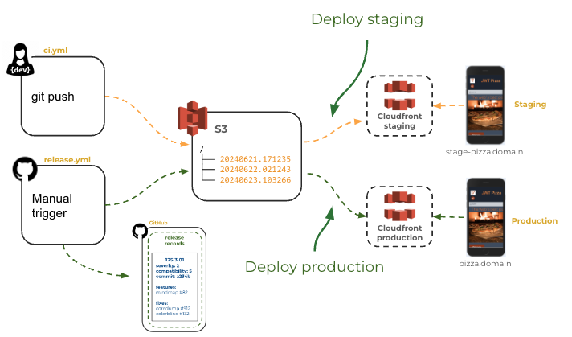
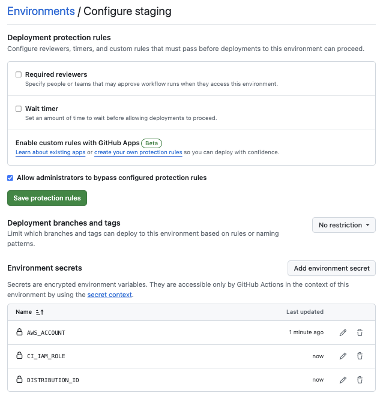
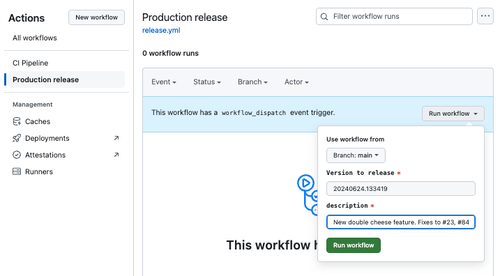
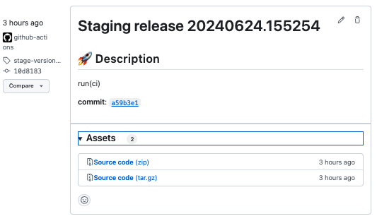

# Deliverable ⓻ Environments: JWT Pizza

🔑 **Key points**

- Implement versions and environments for JWT Pizza in your CI pipeline.

---


## Prerequisites

Before you start work on this deliverable make sure you have read all of the preceding instruction topics and have completed all of the dependent exercises (topics marked with a ☑). This includes:

- [Versioning](../versioning/versioning.md)
- [Deployment strategies](../deploymentStrategies/deploymentStrategies.md)
- ☑ [GitHub releases](../gitHubReleases/gitHubReleases.md)
- [Deployment environments](../deploymentEnvironments/deploymentEnvironments.md)
- ☑ [GitHub environments](../gitHubEnvironments/gitHubEnvironments.md)

Failing to do this will likely slow you down as you will not have the required knowledge to complete the deliverable.

## Getting started

Now that you know all about versions, releases, environments, and different deployment strategies, it is time for you to enhance your JWT Pizza frontend deployment process. What you want to end up with is a CI process that automatically creates a new version in S3 and deploys it to your **staging** environment every time a new commit is pushed to the `jwt-pizza` repository.

A manual trigger of a GitHub Actions workflow then deploys any desired version to your **production** environment.



This gives you continuous deployment to your staging environment for internal validation of the latest code, while still protecting your customers so that they are only exposed to fully vetted versions.

Here are the steps you need to take.

1. **Store each release candidate on S3**. This makes it so that you can easily host different versions in different environments and roll back to a previous version in case of a failure.
1. **Create a `production` environment**: Officially make your existing CloudFront distribution into your CloudFront production environment.
1. **Create a `staging` environment**: Copy the work done to create the production environment in order to create a staging environment.
1. **Automatically deploy to staging**: Always deploy a new version directly to the staging environment so that we can see the latest changes.
1. **Manually deploy to production**: We could implement a continuous deployment strategy by always deploying to production, but we want to play it safe for now and create a manual deployment process.

## Storing release candidates on S3

Currently, your CI workflow for JWT Pizza writes a new version over the top of the files found in the root of the S3 bucket that the CloudFront distribution hosts. Since we want to have multiple environments, we need more control over what version is deployed in each environment. To accomplish this you need to modify your JWT Pizza `.github/workflows/ci.yml` GitHub Action workflow file to target a **version** subdirectory of your S3 deployment bucket instead of the root.



So instead of the root of your bucket containing the latest build.

```sh
/
├── assets
│   ├── index-BsFcYlwQ.js
│   └── index-CRT3bSBQ.css
├── index.html
├── jwt-pizza-icon.png
├── jwt-pizza-logo.png
├── mamaRicci.png
├── pizza-hero.jpg
├── pizza1.png
├── pizza2.png
├── pizza3.png
├── robots.txt
└── version.json
```

It will contain a subdirectory for each version you build

```sh
/
├── 20240621.171235
├── 20240622.021243
└── 20240623.103266
```

Go ahead and open up the `ci.yml` file for your fork of `jwt-pizza`. The first change you need to use the version ID when you copy the package to S3. To do this you just need to provide the version ID as part of the bucket path in the **deploy** job. You can also delete the line that does the CloudFront cache invalidation since you will need to do a version specific invalidation after the distribution for the release has been distributed.

```yml
- name: Push to AWS S3
  # Append the version to the path
  run: |
    echo Deploying $version
    aws s3 cp dist s3://${{ secrets.APP_BUCKET }}/$version --recursive
    # Remove this line -> aws cloudfront create-invalidation --distribution-id ${{ secrets.DISTRIBUTION_ID }} --paths "/*"
```

When you commit and push this change, it should copy the version files to the version directory. Examine your S3 bucket to make sure this is happening.

## Create a production environment

You already have a production environment both in GitHub and CloudFront. You just need to officially mark your CloudFront distribution as production. To do this you need to make two changes to your CloudFront distribution.



1. Rename the distribution to be `production`. To rename the distribution, take these steps:

   1. Open up the CloudFront service in the AWS browser console.
   1. Click on your distribution and then press the Settings `Edit` button.
   1. Change the `description`, found at the bottom of the settings, to be **JWT Pizza Production**.
   1. Save the changes.

      

1. Set the production distribution origin path to point to the s3 version subdirectory that you created in the previous step. To change the origin path take these steps:

   1. Open up the CloudFront service in the AWS browser console.
   1. Click on your distribution and then select the `Origins` tab.
   1. Select the origin that was created when you setup CloudFront and press the `Edit` button.
   1. Set `Origin path` to be the version number that you created in the previous step. This should look something like the following. Make sure you include the forward slash prefix.

      

1. Press the `Save changes` button.
1. Wait for the distribution to deploy.
1. Create a cache invalidation for the distribution so that it will immediately show the new version when viewing JWT Pizza in the browser. You can do this on the `Invalidations` tab of the distribution view.
   1. Press the `Create invalidation` button.
   1. Enter `/*` for the object paths and press `Create invalidation`.

At this point you should be able to open up your browser, or use Curl to observe that it is the correct version.

```sh
➜  curl https://pizza.byucsstudent.click/version.json
{"version": "20240621.221254" }
```

Way to go! You just did a manual deployment to your production environment using a specific version archived on S3.

## Create a staging environment

To create a staging environment you need to repeat the process you went through to create your original CloudFront distribution, but modify a few things to specifically represent a staging environment.

1. Create a new CloudFront distribution using the [same instructions](../awsCloudFront/awsCloudFront.md#cloudfront-cdn-hosting) that you used to originally set up CloudFront, but with the following differences.

   1. Change the description to be **JWT Pizza Staging**.
   1. Set the `Alternate domain name` to be **stage-pizza.YOURDOMAINNAME**. It is important your follow this format so the AutoGrader can access your staging site.
   1. Set the origin path to be the same version that you used for the production environment.
   1. Save the changes.

      

1. Update the s3 bucket policy to include the staging distribution.

   ```json
   "AWS:SourceArn": [
     "arn:aws:cloudfront::AWS_ACCOUNT_HERE:distribution/PRODUCTION_DISTRIBUTION_ID_HERE",
     "arn:aws:cloudfront::AWS_ACCOUNT_HERE:distribution/STAGING_DISTRIBUTION_ID_HERE"
   ]
   ```

1. [Assign a DNS record](../awsCloudFront/awsCloudFront.md#route-53) to point to staging.

   1. Create Route 53 CNAME record that points stage-pizza.YOURDOMAINNAME to your staging CloudFront distribution.

      

Verify that you can see the staging environment using the staging URL from your browser or Curl.

```sh
➜  curl https://stage-pizza.byucsstudent.click/version.json
{"version": "20240621.221254" }
```

Now that both your staging and production environments are using a version subdirectory in your S3 bucket, you can delete the application files out of the S3 bucket root directory.

## Automatically deploying to staging

You could always manually deploy any version you would like to either your production or staging environment by simply changing the distribution's origin path to the desired S3 path, wait for the distribution to deploy, and invalidate the cache.

That actually works pretty well, as it will switch to any version within just a few moments. However, what you really want is for the staging environment to always get updated whenever new code is committed to your fork of `jwt-pizza`.



### Make staging your CI workflow target environment

Currently, your CI workflow is using the GitHub production environment. Instead, you want to create and use a staging environment. Go ahead and create a GitHub staging environment just [like you did for your production environment](../gitHubEnvironments/gitHubEnvironments.md) with the following differences:

1. Name the GitHub environment **staging**.
1. Do not include any protection rules because we want staging changes to always be available internally as soon as a change is made.
1. Set the secret for the `DISTRIBUTION_ID` to be the CloudFront staging distribution ID that you just created.



Now change your `.github/workflows/ci.yml` file to use the staging environment instead of the production environment.

```yml
environment:
  name: staging
  url: https://stage-pizza.byucsstudent.click
```

### Modify the CloudFront origin path

Before you created the version subdirectories in your S3 bucket, the CloudFront distribution always represented the latest files because that was what was in the root of the bucket. Now, because you create a new subdirectory you need to modify the CloudFront distribution to point to a new **origin path** every time you build.

You can automate the changing of CloudFront origin path by adding a new step to the CI workflow (`.github/workflows/ci.yml`), and adding the permissions to your AWS IAM CI Role that will allow it to automatically update the distributions

#### Modify IAM rights

To add the IAM permissions to your IAM `github-ci` role, open the AWS browser console and navigate to the IAM service. Select the `github-ci` role and modify the `jwt-pizza-ci-deployment` permissions policy to include all the following CloudFront rights and also act on any distribution resource.

```json
		{
			"Sid": "InvalidateCloudFront",
			"Effect": "Allow",
			"Action": [
				"cloudfront:CreateInvalidation",
				"cloudfront:UpdateDistribution",
				"cloudfront:GetDistribution",
				"cloudfront:GetDistributionConfig"
			],
			"Resource": [
				"arn:aws:cloudfront::YOURAWSACCOUNTID:distribution/*"
			]
		},
```

Also modify the `Trust relationships` so that it allows access for the **staging** environment on your `jwt-pizza` repository.

```json
{
  "Version": "2012-10-17",
  "Statement": [
    {
      "Effect": "Allow",
      "Principal": {
        "Federated": "arn:aws:iam::YOURAWSACCOUNTID:oidc-provider/token.actions.githubusercontent.com"
      },
      "Action": "sts:AssumeRoleWithWebIdentity",
      "Condition": {
        "StringEquals": {
          "token.actions.githubusercontent.com:aud": "sts.amazonaws.com",
          "token.actions.githubusercontent.com:sub": [
            "repo:YOURGITHUBACCOUNTNAME/jwt-pizza:environment:production",
            "repo:YOURGITHUBACCOUNTNAME/jwt-pizza:environment:staging",
            "repo:YOURGITHUBACCOUNTNAME/jwt-pizza:ref:refs/heads/main",
            "repo:YOURGITHUBACCOUNTNAME/jwt-pizza-service:ref:refs/heads/main"
          ]
        }
      }
    }
  ]
}
```

#### Modify CI workflow

Now you can modify the CI workflow to automatically set the origin path whenever a new build is created. In your `.github/workflows/ci.yml` file add the following step to the end of the `deploy` job.

```yml
- name: Update staging version
  run: |
    # Get the current distribution and update it to use the new version
    aws cloudfront get-distribution-config --id ${{ secrets.DISTRIBUTION_ID }} > original.json
    etag=$(jq -r '.ETag' original.json)
    jq '.DistributionConfig' original.json > request.json
    jq --arg version "/$version" '.Origins.Items[0].OriginPath = $version' request.json > finalRequest.json
    aws cloudfront update-distribution --id ${{ secrets.DISTRIBUTION_ID }} --if-match $etag --distribution-config file://finalRequest.json

    # Wait for the distribution to deploy and then invalidate the cache
    while [ "$(aws cloudfront get-distribution --id ${{ secrets.DISTRIBUTION_ID }} --query 'Distribution.Status' --output text)" != "Deployed" ]; do echo "Distribution is still updating..."; sleep 5; done
    aws cloudfront create-invalidation --distribution-id ${{ secrets.DISTRIBUTION_ID }} --paths "/*"
```

This runs some complex commands that you need to take the time to understand. Let's look at each one individually.

1. Uses the AWS CLI to get the current CloudFront distribution configuration to a file named `original.json`.
   ```sh
       aws cloudfront get-distribution-config --id ${{ secrets.DISTRIBUTION_ID }} > original.json
   ```
1. Pull the caching identifier, `etag`, out of the response so that you can reference it when you update the configuration.

   ```sh
       etag=$(jq -r '.ETag' original.json)
   ```

1. Remove the extra response fields included in the get configuration requests so that it only includes the actual configuration information. Write the result to a file named `request.json`.

   ```sh
       jq '.DistributionConfig' original.json > request.json
   ```

1. Here is the important part. Modify the origin path to be the version ID for the build that just completed and write the result to a file named `finalRequest.json`.

   ```sh
       jq --arg version "/$version" '.Origins.Items[0].OriginPath = $version' request.json > finalRequest.json
   ```

1. Make the request to update the CloudFront distribution using the AWS CLI.

   ```sh
       aws cloudfront update-distribution --id ${{ secrets.DISTRIBUTION_ID }} --if-match $etag --distribution-config file://finalRequest.json
   ```

1. Wait until the change to the distribution fully deploys by repeatedly checking the status of the CloudFront distribution.

   ```sh
       while [ "$(aws cloudfront get-distribution --id ${{ secrets.DISTRIBUTION_ID }} --query 'Distribution.Status' --output text)" != "Deployed" ]; do echo "Distribution is still updating..."; sleep 5; done
   ```

1. Invalidate the distribution cache so that all the customers see the new version instead of the old cached version.
   ```sh
       aws cloudfront create-invalidation --distribution-id ${{ secrets.DISTRIBUTION_ID }} --paths "/*"
   ```

💡These commands are great examples of the amazing things you can do with the command shell. If you don't feel comfortable with the command shell then perhaps that would be a great curiosity project for you.

### Final CI workflow

When you are done with all of these changes, your JWT Pizza CI workflow should look similar to the [file found here](ci.yml). At this point you should be very familiar with each step in this workflow. If you don't feel confident with anything then take some time to dig into them deeper and ask for some help if there are things that still seem confusing.

## Manually triggering a production deployment

Since you moved your CI pipeline to deploy to your staging environment, you now need a way to deploy to your production environment.

You can do this by creating a second GitHub Action workflow (release.yml) that is triggered by manually pressing a button instead of a code push. We can also parametrize the workflow so that you can specify the version you want to deploy.



Take the following steps in order to create your production release workflow.

1. Create a new file in your `.github/workflows` directory named `release.yml`.
1. Name the workflow **Production release**.
1. Set the workflow to trigger based on a `workflow_dispatch` event and specify input parameters for `version` and `description`. This should look like the following:

   ```yml
   name: Production release
   on:
     workflow_dispatch:
       inputs:
         version:
           description: 'Version to release'
           required: true
         description:
           required: true
   ```

   That will give you the UI displayed in the above image where you will provide the specified input parameters when you run the workflow.

1. Give the workflow the permissions it needs to execute commands on AWS and modify the repository content.

   ```yml
   permissions:
     id-token: write
     contents: write
   ```

1. Add the runtime container and the reading of the workflow version parameter into an environment variable.

   ```yml
   jobs:
     release:
       runs-on: ubuntu-latest
       env:
         version: ${{ github.event.inputs.version }}
   ```

1. Set that this job runs under the **production** GitHub environment definition. This makes it so the environment secrets are used, and therefore it will deploy to your production CloudFront distribution instead of your staging one.

   ```yml
   environment:
     name: production
     url: https://pizza.YOUDOMAINNAME
   ```

1. Now you are ready to specify your steps. These are very similar to the deployment steps found in the `ci.yml` workflow. The first step sets up access to AWS. The next step updates the CloudFront origin path to point to the desired release, and the final step creates a GitHub release entry to document that you pushed a new deployment to production. If you need to review what each of these steps are doing, then refer back to the [GitHub Releases](../gitHubReleases/) instruction and the instruction given above on modifying the CloudFront distribution origin path.

   ```yml
   steps:
     - name: Create OIDC token to AWS
       uses: aws-actions/configure-aws-credentials@v4
       with:
         audience: sts.amazonaws.com
         aws-region: us-east-1
         role-to-assume: arn:aws:iam::${{ secrets.AWS_ACCOUNT }}:role/${{ secrets.CI_IAM_ROLE }}

     - name: Update the cloudfront distribution
       run: |
         # Get the current distribution and update it to use the new version
         aws cloudfront get-distribution-config --id ${{ secrets.DISTRIBUTION_ID }} > original.json
         etag=$(jq -r '.ETag' original.json)
         jq '.DistributionConfig' original.json > request.json
         jq --arg version "/$version" '.Origins.Items[0].OriginPath = $version' request.json > finalRequest.json
         aws cloudfront update-distribution --id ${{ secrets.DISTRIBUTION_ID }} --if-match $etag --distribution-config file://finalRequest.json

         # Wait for the distribution to deploy and then invalidate the cache
         while [ "$(aws cloudfront get-distribution --id ${{ secrets.DISTRIBUTION_ID }} --query 'Distribution.Status' --output text)" != "Deployed" ]; do echo "Distribution is still updating..."; sleep 5; done
         aws cloudfront create-invalidation --distribution-id ${{ secrets.DISTRIBUTION_ID }} --paths "/*"

     - name: Create production release
       uses: ncipollo/release-action@2c591bcc8ecdcd2db72b97d6147f871fcd833ba5
       with:
         tag: production-version-${{ env.version }}
         name: Production ${{ env.version }}
         allowUpdates: true
         generateReleaseNotes: true
         makeLatest: true
         body: |
           ## 🚀 Description

           ${{ github.event.inputs.description }}
   ```

You can view the entire [release.yml file here](release.yml).

### Modify the GitHub production environment

Because we are manually triggering the deployment there is no strong reason to have an environment protection rule that requires reviewers. So go ahead and remove that from the GitHub production environment configuration.

If you want to have someone review the code before it is available as a release you might consider adding the protection rules to your staging environment.

### Test your production release

If you save, commit, and push the changes the above changes to your CI pipelines it should automatically do the following:

1. Build a release version and put it in a subdirectory of your S3 bucket.
1. Update your staging environment to point to the new release.
1. Create a GitHub release entry for the staging release.
   
1. Wait until the workflow has completed and view the result by visiting the URL for your JWT Pizza staging environment.

You can then grab the version ID from the release record and use it to manually do a production release.

1. Navigate to the GitHub dashboard for your fork of the `jwt-pizza` repository.
1. Click on `Actions` and then select the `Production release` workflow.
1. Press the `Run workflow` button and add both the version ID and a description of the release as inputs.

   

1. Press the `Run workflow` button.
1. Wait until the workflow has completed and view the result by visiting the URL for your JWT Pizza production environment.

If you want to roll back to a different version then you can simply repeat the process with a different version ID.

That is it! You have created a full continuous deployment pipeline for your staging environment, and a continuous delivery pipeline, with a manual trigger, for your production environment.

Go ahead and makes some changes to your `jwt-pizza` source code and watch the automation magic.

## Thoughts on automation programming

This type of automation is at the heart of what a DevOps engineer does. Sometimes we think of coding only in regard to writing some algorithmic computation. However, the code found in your CI pipeline is just as valuable as any other lines of your application code. Furthermore, the application code that automates the calculation of Fibonacci would be pointless without the DevOps automation code that makes Fibonacci available to a customer.

It is also pretty cool to write a couple dozen lines of automation code and see it build, test, archive, and deploy an application to multiple data centers around the world all with elastic, resilient hardware and services. After that, writing web application pizza code feels kinda boring.

## ⭐☑ Deliverable

In order to demonstrate your mastery of the concepts for this deliverable, complete the following.

1. Archive each version build in your JWT Pizza S3 bucket.
1. **Production**
   1. Convert your CloudFront distribution to be a production distribution.
   1. Create a GitHub Action workflow (`release.yml`) that deploys to your **production** CloudFront
   1. Create a GitHub version record for each build.
1. **Staging**
   1. Create a CloudFront staging distribution.
   1. Create a GitHub staging environment.
   1. Create a staging DNS record.
   1. Modify your GitHub Action workflow (`ci.yml`) to automatically update your **staging** CloudFront distribution.

Go to the [AutoGrader](https://cs329.cs.byu.edu) and submit your work for the **Environments** deliverable.

### Rubric

| Percent | Item                                                           |
| ------- | -------------------------------------------------------------- |
| 20%     | Versions archived in S3                                        |
| 20%     | GitHub version records created for both staging and production |
| 30%     | Continuous deployment to your staging environment              |
| 30%     | Triggered continuous delivery to your production environment   |

**Congratulations!** You have applied continuous delivery patterns to, and created different deployment environments for, your JWT Pizza application. Time to go celebrate. I'm thinking waffles 🧇.
