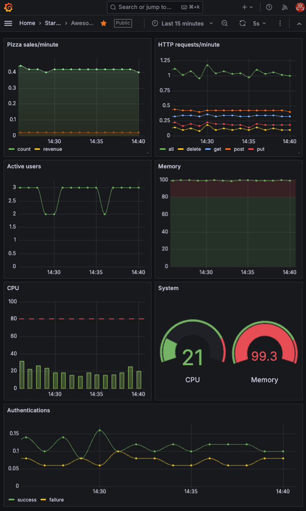

# ⓻ Metrics: JWT Pizza Service

It is time to add observability to the jwt-pizza-service code. In your fork of the code use what you learned about Grafana metrics to create visualizations that demonstrate the following:

1. HTTP requests by method/minute
1. Active users
1. Authentication attempts/minute
   1. Successful
   1. Failed
1. CPU usage percentage
1. Memory usage percentage
1. Pizzas
   1. sold/minute
   1. Revenue/minute

## Modifying the application code

You are going to have to modify the `jwt-pizza-service` code in order to add observability. You want to be careful to not modify the development team's work as much as possible. If you change things too much then you are probably going to have merge problems when they update the application and you have to merge your fork.

Try to use design patterns and principles such as middleware and modularity to isolate your changes as much as possible.

## Getting started

This assignment should feel similar to the exercises you have already completed. However, there are a lot of different metrics that are required and it will take some time to figure out how to gather the metrics, instrument the code, and finally create the visualizations. Here are some suggestions about how to get started.

### Add Grafana credentials to config.js

Modify your config.js file to contain the Grafana credentials. You can then reference these configuration settings just like the application uses the database settings.

```js
  metrics: {
    source: 'jwt_pizza_service',
    userId: 1,
    url: '',
    apiKey: '',
  }
```

### Create metrics.js

Create a file named `metrics.js`. Use this file to for all the code necessary to interact with Grafana. This may be somewhat similar to what you created in the [Grafana Metrics instruction](../grafanaMetrics/grafanaMetrics.md). However, it will need to be more complex than what was presented in the instruction because it will have to supply metrics for more than just http requests.

### Add request metrics code

Modify your Express application routers to report on the request related metrics. If you expose an Express middleware function from your metrics class, this can get a good start on providing metrics by installing the metrics middleware.

```js
app.use(metrics.requestTracker);
```

### Add system metrics code

Modify `metrics.js` to periodically report on the system metrics. You can get metrics from the operating system in node.js with the `os` module as demonstrated in the following code.

```js
const os = require('os');

function getCpuUsagePercentage() {
  const cpuUsage = os.loadavg()[0] / os.cpus().length;
  return cpuUsage.toFixed(2) * 100;
}

function getMemoryUsagePercentage() {
  const totalMemory = os.totalmem();
  const freeMemory = os.freemem();
  const usedMemory = totalMemory - freeMemory;
  const memoryUsage = (usedMemory / totalMemory) * 100;
  return memoryUsage.toFixed(2);
}
```

### Simulating traffic

You will need some traffic to your website in order to demonstrate that the visualizations are working. You can open your browser and start manually buying pizzas or you can write some code to automate a simulation of the traffic. One way to do this is to use Curl commands wrapped in some scripting code. The following are some examples that you can use. Note that you must use a POSIX compliant command console to use these scripts.

#### Hit the home page every three seconds

```sh
while true
 do curl -s localhost:3000/;
  sleep 3;
 done;
```

#### Invalid login every 25 seconds

```sh
while true
 do
  curl -s -X PUT localhost:3000/api/auth -d '{"email":"unknown@jwt.com", "password":"bad"}' -H 'Content-Type: application/json';
  sleep 25;
 done;
```

#### Login and logout two minutes later

```sh
while true
 do
  response=$(curl -s -X PUT localhost:3000/api/auth -d '{"email":"f@jwt.com", "password":"franchisee"}' -H 'Content-Type: application/json');
  token=$(echo $response | jq -r '.token');
  sleep 110;
  curl -X DELETE localhost:3000/api/auth -H "Authorization: Bearer $token";
  sleep 10;
 done;
```

#### Login, buy a pizza, login, wait 10 seconds

```sh
while true
 do
   response=$(curl -s -X PUT localhost:3000/api/auth -d '{"email":"a@jwt.com", "password":"admin"}' -H 'Content-Type: application/json');
   token=$(echo $response | jq -r '.token');
   curl -s -X POST localhost:3000/api/order -H 'Content-Type: application/json' -d '{"franchiseId": 1, "storeId":1, "items":[{ "menuId": 1, "description": "Veggie", "price": 0.05 }]}'  -H "Authorization: Bearer $token"; curl -X DELETE localhost:3000/api/auth -H "Authorization: Bearer $token";
   sleep 10;
 done;
```

## ☑ Assignment

In order to demonstrate your mastery of the concepts for this deliverable, complete the following.

1. Modify your fork of the `jwt-pizza-service` to generate the required metrics and store them in your Grafana Cloud account.
1. Create visualizations on your Grafana Cloud `Awesome Dashboard` to display all of the required metrics.
1. Export a copy of your dashboard and save it to the root of your fork of the `jwt-pizza-service` repository.
   1. On the Grafana Cloud console, navigate to your dashboard.
   1. Press the `Save` button.
   1. Press the `Export` tab and `Save to file`.
   1. Name the file `deliverable7dashboard.json`
1. Commit and push your changes so that they are running in your production environment.

Once this is all working you should have something like this:



Get the public URL for your dashboard and submit it to the Canvas assignment. This should look something like this:

```txt
https://youraccounthere.grafana.net/public-dashboards/29305se9fsacc66a21fa91899b75734
```

### Rubric

| Percent | Item                                                                                      |
| ------- | ----------------------------------------------------------------------------------------- |
| 10%     | Strong GitHub commit history that documents your work in your fork of `jwt-pizza-service` |
| 30%     | Storing all required metrics in Grafana Cloud Prometheus data store                       |
| 60%     | Visualizing all required metrics in Grafana Cloud dashboard                               |

Congratulations! You have provided significant observability for your JWT Pizza Service. Time to go celebrate. I'm thinking tacos 🌮.
