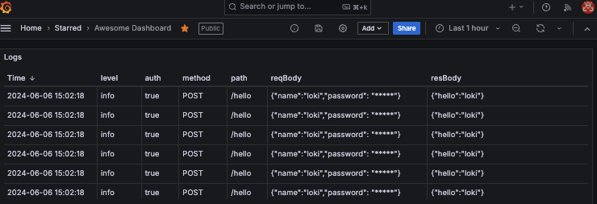

# ⓼ Logging: JWT Pizza Service

It is time to add logging observability to the jwt-pizza-service code. In your fork of the code, use what you learned about [Grafana logging](../grafanaLogging/grafanaLogging.md) to create a log of all the following:

1. HTTP requests
   1. HTTP method, path, status code
   1. If the request has an authorization header
   1. Request body
   1. Response body
1. Database requests
   1. SQL queries
1. Factory service requests
1. Any unhandled exceptions
1. Sanitize all log entries so that they do not contain any confidential information

## Modifying the application code

You are going to have to modify the `jwt-pizza-service` code in order to add logging. You want to be careful to not modify the development team's work as much as possible. If you change things too much then you are probably going to have merge problems when they update the application and you have to merge your fork.

Try to use design patterns and principles such as middleware and modularity to isolate your changes as much as possible.

## Getting started

This assignment should feel similar to the exercises you have already completed. However, there are a lot of different log events that are required and it will take some time to figure out how to instrument the code and provide the log events necessary to provide a useful logging search experience.

### Add Grafana credentials to config.js

Modify your config.js file to contain the Grafana logging credentials. You can then reference these configuration settings just like the application uses the database settings.

```js
  logging: {
    source: 'jwt-pizza-service',
    userId: 1,
    url: '',
    apiKey: '',
  }
```

### Modify CI pipeline

Because you are added new configuration to the JWT Service, you will need to also enhance your GitHub Actions workflow to have the new logging configuration fields. You must also add secrets for the metrics LOGGING_USER_ID, LOGGING_URL, and LOGGING_API_KEY.

Without this your CI pipeline will fail because of missing references from your new logging code when your tests run.

```yml
- name: Write config file
  run: |
    echo "module.exports = {
      jwtSecret: '${{ secrets.JWT_SECRET }}',
      db: {
        connection: {
          host: '127.0.0.1',
          user: 'root',
          password: 'tempdbpassword',
          database: 'pizza',
          connectTimeout: 60000,
        },
        listPerPage: 10,
      },
      factory: {
        url: 'https://pizza-factory.cs329.click',
        apiKey: '${{ secrets.FACTORY_API_KEY }}',
      },
      metrics: {
        source: 'jwt_pizza_service',
        userId: ${{ secrets.METRICS_USER_ID }},
        url: '${{ secrets.METRICS_URL }}',
        apiKey: '${{ secrets.METRICS_API_KEY }}',
      },
      logging:    {
        source: "jwt-pizza-service",
        userId: ${{ secrets.LOGGING_USER_ID }},
        url: '${{ secrets.LOGGING_URL }}',
        apiKey: '${{ secrets.LOGGING_API_KEY }}',
      },
    };" > src/config.js
```

### Create logger.js

Create a file named `logger.js`. Use this file to for all the code necessary to interact with Grafana. This may be somewhat similar to what you created in the [Grafana Logging instruction](../grafanaLogging/grafanaLogging.md). However, it may need to be more complex than what was presented in the instruction so that you can supply all the required logs.

### Add HTTP logging code

Modify your Express application routers to report on the HTTP request log events. If you expose an Express middleware function from your Logger class this can get a good start on providing logs by installing that the logger middleware.

```js
app.use(logger.httpLogger);
```

### Add DB logging

If you are using the code provided in the previous example, you should be able to call the `logger.log` method from a central place in the `database.js` file. Try to centralize the logging as much as possible so that you don't have logging code scattered all over the place.

Consider modifying the `DB.query` function to handle all of the database logging.

### Simulating traffic

You will need some traffic to your website in order to demonstrate that the logging is working. You can open your browser and start manually buying pizzas or you can write some code to automate a simulation of the traffic. One way to do this is to use Curl commands wrapped in some scripting code. The following are some examples that you can use. Note that you must use a POSIX compliant command console to use these scripts.

First you need to assign the host that you are wanting to drive traffic against. If you are running in your development environment then it will look like this:

```sh
host=http://localhost:3000
```

#### Hit the home page every three seconds

```sh
while true
 do curl -s $host/;
  sleep 3;
 done;
```

#### Invalid login every 25 seconds

```sh
while true
 do
  curl -s -X PUT $host/api/auth -d '{"email":"unknown@jwt.com", "password":"bad"}' -H 'Content-Type: application/json';
  sleep 25;
 done;
```

#### Login and logout two minutes later

```sh
while true
 do
  response=$(curl -s -X PUT $host/api/auth -d '{"email":"f@jwt.com", "password":"franchisee"}' -H 'Content-Type: application/json');
  token=$(echo $response | jq -r '.token');
  sleep 110;
  curl -X DELETE $host/api/auth -H "Authorization: Bearer $token";
  sleep 10;
 done;
```

#### Login, buy a pizza, login, wait 10 seconds

```sh
while true
 do
   response=$(curl -s -X PUT $host/api/auth -d '{"email":"a@jwt.com", "password":"admin"}' -H 'Content-Type: application/json');
   token=$(echo $response | jq -r '.token');
   curl -s -X POST $host/api/order -H 'Content-Type: application/json' -d '{"franchiseId": 1, "storeId":1, "items":[{ "menuId": 1, "description": "Veggie", "price": 0.05 }]}'  -H "Authorization: Bearer $token"; curl -X DELETE $host/api/auth -H "Authorization: Bearer $token";
   sleep 10;
 done;
```

## ☑ Assignment

In order to demonstrate your mastery of the concepts for this deliverable, complete the following.

1. Modify your fork of the `jwt-pizza-service` to generate the required logs and store them in your Grafana Cloud account.
1. Create a log visualization on your Grafana Cloud `Awesome Dashboard` to display all of the required log fields.
1. Export a copy of your dashboard and save it to your fork of the `jwt-pizza-service` repository in a directory named `grafana`.
   1. On the Grafana Cloud console, navigate to your dashboard.
   1. Press the `Share` button.
   1. Press the `Export` tab and `Save to file`.
   1. Name the file `deliverable8dashboard.json`
1. Commit and push your changes so that they are running in your production environment.

Once this is all working you should have something like this:



Get the public URL for your dashboard and submit it to the Canvas assignment. This should look something like this:

```txt
https://youraccounthere.grafana.net/public-dashboards/29305se9fsacc66a21fa91899b75734
```

### Rubric

| Percent | Item                                                                                      |
| ------- | ----------------------------------------------------------------------------------------- |
| 10%     | Strong GitHub commit history that documents your work in your fork of `jwt-pizza-service` |
| 60%     | Storing all required log events in Grafana Cloud Loki data store                          |
| 30%     | Visualizing all required log fields in Grafana Cloud dashboard                            |

**Congratulations!** You have provided significant observability for your JWT Pizza Service. Time to go celebrate. I'm thinking bananas sound nice 🍌.
