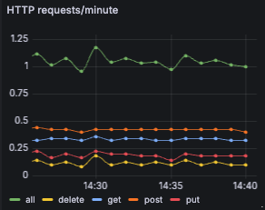
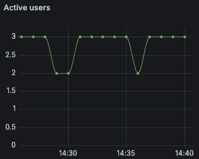
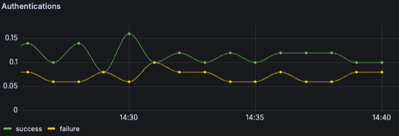
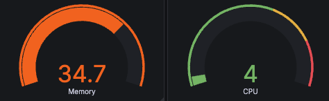
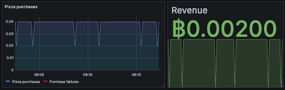
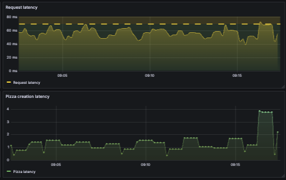
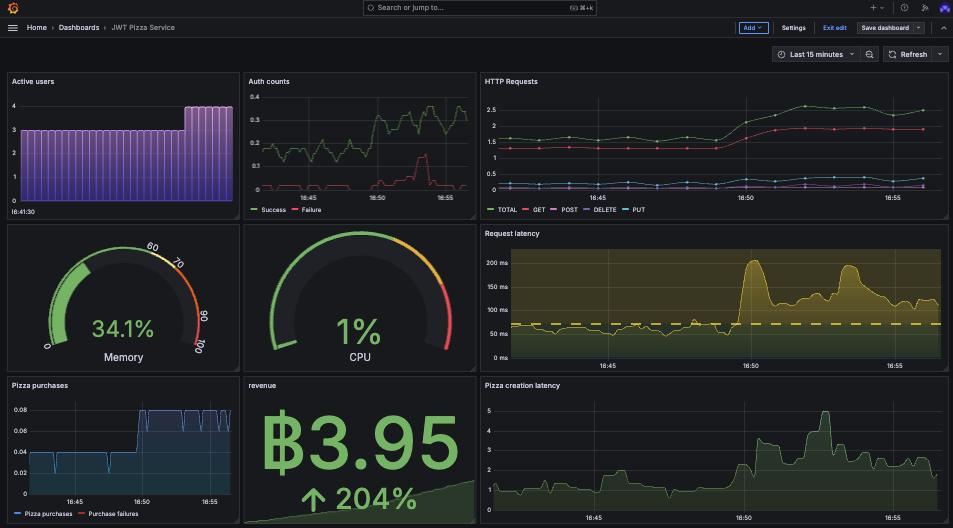

# ⓼ Metrics: JWT Pizza Service

🔑 **Key points**

- Modify your CI pipeline to provide access to Grafana from the JWT Pizza Service.
- Record specific metrics from the service.
- Create a dashboard to visualize the metrics.
- Use Curl to simulate real traffic.

---


## Prerequisites

Before you start work on this deliverable make sure you have read all of the preceding instruction topics and have completed all of the dependent exercises (topics marked with a ☑). This includes:

- [Metrics](../metrics/metrics.md)
- ☑ [Grafana](../grafana/grafana.md)
- ☑ [Grafana metrics](../grafanaMetrics/grafanaMetrics.md)
- [Visualizing metrics](../visualizingMetrics/visualizingMetrics.md)
- [Simulating traffic](../simulatingTraffic/simulatingTraffic.md)

Failing to do this will likely slow you down as you will not have the required knowledge to complete the deliverable.

## Getting started

It is time to add metrics observability to the `jwt-pizza-service` code. In your fork of the Pizza Service code use what you learned about [Grafana metrics](../grafanaMetrics/grafanaMetrics.md) to create visualizations that demonstrate all of the following required metrics.

## Required metrics

While this list specifies all of the required metrics, the images are just examples. You should explore the full function of Granfana visualizations and come up with something that exemplifies your personality. You should also feel free to add any other metrics that will increase your confidence in the system.

1. HTTP requests by method/minute

   

   1. Total requests
   1. GET, PUT, POST, and DELETE requests

1. Active users

   

1. Authentication attempts/minute

   

   1. Successful
   1. Failed

1. CPU and memory usage percentage

   

1. Pizzas

   

   1. Sold/minute
   1. Creation failures
   1. Revenue/minute

1. Latency

   

   1. Service endpoint
   1. Pizza creation

## Modifying the application code

You are going to have to modify the `jwt-pizza-service` code in order to add observability. You want to keep modifications to the development team's work to a minimum. If you change things too much, you are probably going to have merge problems when they update the application and you have to merge your fork.

Try to use design patterns and principles such as middleware and modularity to isolate your changes as much as possible.

## Getting started

This assignment should feel similar to the exercises you have already completed. However, there are a lot of different metrics that are required, and it will take some time to figure out how to gather the metrics, instrument the code, and finally create the visualizations. Here are some suggestions about how to get started.

### Add Grafana credentials to config.js

Modify your service's config.js file to contain the Grafana credentials. Note that the API_KEY provided by Grafana actually contains both the User ID and the API key. Split those values up when you convert them into your configuration file. This should look something like what is given below. You can then reference these configuration settings from your code just like you did for the database settings.

```js
  metrics: {
     source: 'jwt-pizza-service-dev',
     url: 'https://influx-prod-13-prod-us-east-0.grafana.net/api/v1/push/influx/write',
     apiKey: '2222222:glc_111111111111111111111111111111111111111111='
   }
```

> [!NOTE]
>
> You want your development environment to use a different `source` so that you don't mix metrics from different environments. In the example shown above the `source` is set to **jwt-pizza-service-dev**.

### Modify CI pipeline

Because you added new configuration to the JWT Service, you will need to also enhance your GitHub Actions workflow to have the new metrics configuration fields. You must also add secrets for the METRICS_URL and METRICS_API_KEY. Note that because this configuration is being deployed to your production environment you want to set the source to something different than your development environment. In this case **jwt-pizza-service** without the **-dev** suffix.

Without this, your CI pipeline will fail due to missing references from your new metrics code when your tests run.

```yml
- name: Write config file
  run: |
    echo "module.exports = {
      jwtSecret: '${{ secrets.JWT_SECRET }}',
      db: {
        connection: {
          host: '127.0.0.1',
          user: 'root',
          password: 'tempdbpassword',
          database: 'pizza',
          connectTimeout: 60000,
        },
        listPerPage: 10,
      },
      factory: {
        url: 'https://pizza-factory.cs329.click',
        apiKey: '${{ secrets.FACTORY_API_KEY }}',
      },
      metrics: {
        source: 'jwt-pizza-service',
        url: '${{ secrets.METRICS_URL }}',
        apiKey: '${{ secrets.METRICS_API_KEY }}',
      },            
    };" > src/config.js
```

### Create metrics.js

Create a file named `metrics.js` in the `src` directory. Use this file to for all the code necessary to interact with Grafana. This may be somewhat similar to what you created in the [Grafana Metrics instruction](../grafanaMetrics/grafanaMetrics.md). However, it will need to be more complex than what was presented in the instruction because it will have to supply metrics for more than just HTTP requests.

### Add request metrics code

Modify your Express application routers to report on the request related metrics. If you expose an Express middleware function from your metrics class, this will give you a good start on providing metrics generated by any incoming HTTP requests.

```js
app.use(metrics.requestTracker);
```

### Add system metrics code

Modify `metrics.js` to periodically report on the system metrics. You can get metrics from the operating system in node.js with the `os` module as demonstrated in the following code.

```js
const os = require('os');

function getCpuUsagePercentage() {
  const cpuUsage = os.loadavg()[0] / os.cpus().length;
  return cpuUsage.toFixed(2) * 100;
}

function getMemoryUsagePercentage() {
  const totalMemory = os.totalmem();
  const freeMemory = os.freemem();
  const usedMemory = totalMemory - freeMemory;
  const memoryUsage = (usedMemory / totalMemory) * 100;
  return memoryUsage.toFixed(2);
}
```

### Add purchase metrics code

The metrics that track your purchases will require that you calculate information whenever a purchase is made. This includes how long it took for the Pizza Factory to respond to the request to make a pizza, how many were made, how much it cost, and if it was successful.

> [!NOTE]
>
> You can make a pizza purchase fail *and* take a long time by ordering more than 20 pizzas in a single order.

### Periodic reporting

You can use the JavaScript `setInterval` function to collect and report the request, auth, user, system, and purchase metrics to Grafana. This could look something like the following, but do whatever fits the design of your code.

```js
function sendMetricsPeriodically(period) {
  const timer = setInterval(() => {
    try {
      const buf = new MetricBuilder();
      httpMetrics(buf);
      systemMetrics(buf);
      userMetrics(buf);
      purchaseMetrics(buf);
      authMetrics(buf);

      const metrics = buf.toString('\n');
      this.sendMetricToGrafana(metrics);
    } catch (error) {
      console.log('Error sending metrics', error);
    }
  }, period);
}
```

### Simulating traffic

You will need some traffic to your website in order to demonstrate that the visualizations are working. The easiest way to do this, is to follow the [Simulating traffic](../simulatingTraffic/simulatingTraffic.md) instruction.

## ⭐ Deliverable

In order to demonstrate your mastery of the concepts for this deliverable, complete the following.

1. Modify your fork of the `jwt-pizza-service` to generate the [required metrics](#required-metrics) and store them in your Grafana Cloud account.
1. Create visualizations on your Grafana Cloud `Pizza Dashboard` to display all the required metrics.
1. Export a copy of your dashboard and save it to your fork of the `jwt-pizza-service` repository in a directory named `grafana`.
   1. On the Grafana Cloud console, navigate to your dashboard.
   1. Press the `Share` button.
   1. Press the `Export` tab and `Save to file`.
   1. Name the file `grafana/deliverable8dashboard.json`
1. Commit and push your changes so that they are running in your production environment.

Once this is all working you should have something like this:



Get the [public URL](../visualizingMetrics/visualizingMetrics.md#make-your-dashboard-public) for your dashboard and submit it to the Canvas assignment. This should look something like this:

```txt
https://youraccounthere.grafana.net/public-dashboards/29305se9fsacc66a21fa91899b75734
```

### Rubric

| Percent | Item                                                                |
| ------- | ------------------------------------------------------------------- |
| 30%     | Storing all required metrics in Grafana Cloud Prometheus data store |
| 70%     | Visualizing all required metrics in Grafana Cloud dashboard         |

**Congratulations!** You have provided significant observability for your JWT Pizza Service. Time to go celebrate. I'm thinking tacos 🌮.
