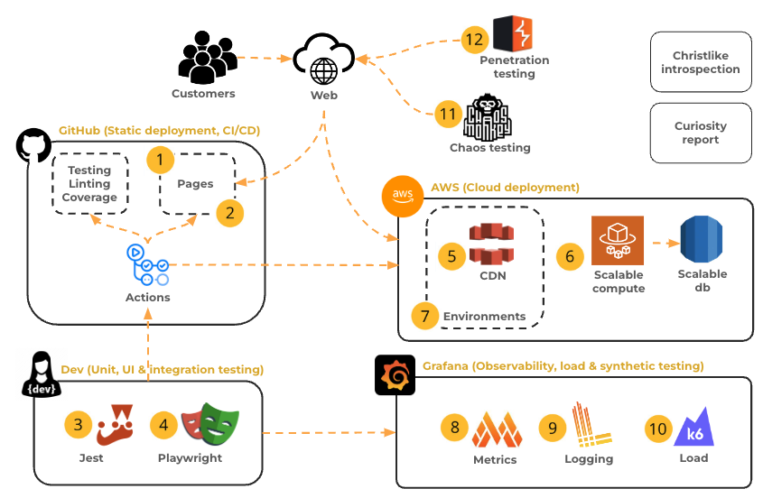
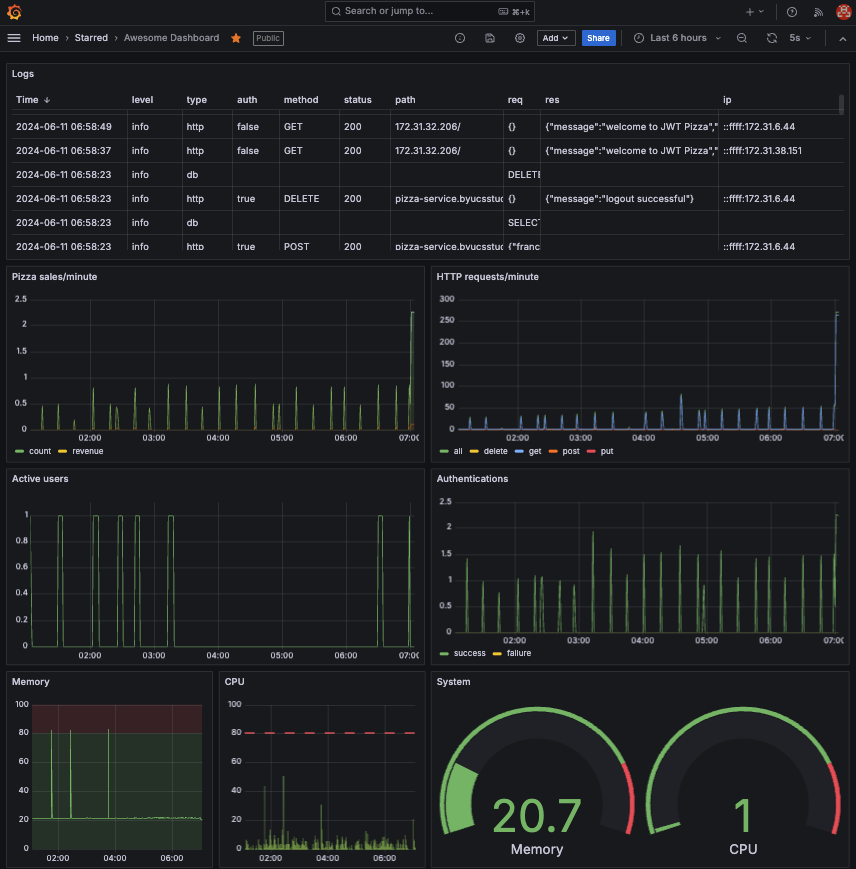

# ⓽ Logging: JWT Pizza Service

🔑 **Key points**

- Add logging to JWT Pizza Service.
- Modify the CI pipeline to provide Grafana credentials that authorize logging.
- Create a Grafana visualization that displays the logs.
- Simulate traffic in order to validate that the logs are working.

---



## Prerequisites

Before you start work on this deliverable make sure you have read all of the preceding instruction topics and have completed all of the dependent exercises (topics marked with a ☑). This includes:

- [Logging](../logging/logging.md)
- ☑ [Grafana logging](../grafanaLogging/grafanaLogging.md)

Failing to do this will likely slow you down as you will not have the required knowledge to complete the deliverable.

## Getting started

This assignment should feel similar to the exercises you have already completed. However, there are a lot of different log events that are required, and it will take some time to figure out how to instrument the code and provide the log events necessary to provide a useful logging search experience.

### Required log events

It is time to add logging observability to the `jwt-pizza-service `code. In your fork of the code, use what you learned about [Grafana logging](../grafanaLogging/grafanaLogging.md) to create a log of all the following:

1. HTTP requests
   1. HTTP method, path, status code
   1. If the request has an authorization header
   1. Request body
   1. Response body
1. Database requests
   1. SQL queries
1. Factory service requests
1. Any unhandled exceptions
1. Sanitize all log entries so that they do not contain any confidential information

### Modifying the application code

You are going to have to modify the `jwt-pizza-service` code in order to add logging. You want to be careful to not modify the development team's work as much as possible. If you change things too much then you are probably going to have merge problems when they update the application and you have to merge your fork.

Try to use design patterns and principles such as middleware and modularity to isolate your changes as much as possible.

### Add Grafana credentials to config.js

Modify your service's config.js file to contain the Grafana logging credentials. Note that the API_KEY provided by Grafana actually contains both the User ID and the API key. Split those values up when you convert them into your configuration file. This should look something like what is given below. You can then reference these configuration settings from your code just like you did for the database settings.

```js
  logging: {
     source: 'jwt-pizza-service-dev',
     userId: 2222222,
     url: 'https://logs-prod-006.grafana.net/loki/api/v1/push',
     apiKey: 'glc_111111111111111111111111111111111111111111='
   }
```

> [!NOTE]
>
> You want your development environment you should use a different `source` so that you don't mix logs from different environments. In the example shown above the `source` is set to **jwt-pizza-service-dev**.

### Modify CI pipeline

Because you are added new configuration to the JWT Service, you will need to also enhance your GitHub Actions workflow to have the new logging configuration fields. You must also add secrets for the metrics LOGGING_USER_ID, LOGGING_URL, and LOGGING_API_KEY.

Without this your CI pipeline will fail because of missing references from your new logging code when your tests run.

```yml
- name: Write config file
  run: |
    echo "module.exports = {
      jwtSecret: '${{ secrets.JWT_SECRET }}',
      db: {
        connection: {
          host: '127.0.0.1',
          user: 'root',
          password: 'tempdbpassword',
          database: 'pizza',
          connectTimeout: 60000,
        },
        listPerPage: 10,
      },
      factory: {
        url: 'https://pizza-factory.cs329.click',
        apiKey: '${{ secrets.FACTORY_API_KEY }}',
      },
      metrics: {
        source: 'jwt-pizza-service',
        url: '${{ secrets.METRICS_URL }}',
        apiKey: '${{ secrets.METRICS_API_KEY }}',
      },  
      logging:    {
        source: 'jwt-pizza-service',
        userId: ${{ secrets.LOGGING_USER_ID }},
        url: '${{ secrets.LOGGING_URL }}',
        apiKey: '${{ secrets.LOGGING_API_KEY }}',
      },
    };" > src/config.js
```

### Create logger.js

Create a file named `logger.js` in the `src` directory. Use this file for all the code necessary to interact with Grafana. This may be somewhat similar to what you created in the [Grafana Logging instruction](../grafanaLogging/grafanaLogging.md). For example, you will need to make HTTP fetch requests to provide logging information as demonstrated by the following:

```js
sendLogToGrafana(event) {
  const body = JSON.stringify(event);
  fetch(`${config.url}`, {
    method: 'post',
    body: body,
    headers: {
      'Content-Type': 'application/json',
      Authorization: `Bearer ${config.userId}:${config.apiKey}`,
    },
  }).then((res) => {
    if (!res.ok) console.log('Failed to send log to Grafana');
  });
}
```

However, your logging code for JWT Pizza will need to be more complex than what is demonstrated in the [Grafana Logging instruction](../grafanaLogging/grafanaLogging.md).

> [!TIP]
>
> There is a third party NPM package, named [Pizza Logger](https://www.npmjs.com/package/pizza-logger), that you can use to supply your logs to Grafana. If you wish to use this package, you can view the documentation on NPM for more information.

### Add HTTP logging code

Modify your Express application routers to report on the HTTP request log events. If you expose an Express middleware function from your Logger class, this can get a good start on providing logs by installing the logger middleware.

```js
app.use(logger.httpLogger);
```

### Add DB logging

If you are using the code provided in the previous example, you should be able to call the `logger.log` method from a central place in the `database.js` file. Try to centralize the logging as much as possible so that you don't have logging code scattered all over the place. For example, consider modifying the `DB.query` function to handle all the database logging.

### Simulating traffic

You will need some traffic to your website in order to demonstrate that the logging is working. The easiest way to do this, is to follow the [Simulating traffic](../simulatingTraffic/simulatingTraffic.md) instruction.

## ⭐ Deliverable

In order to demonstrate your mastery of the concepts for this deliverable, complete the following.

1. Modify your fork of the `jwt-pizza-service` to generate the required logs and store them in your Grafana Cloud account.
1. Create a log visualization on your Grafana Cloud `Pizza Dashboard` to display all the [required log events](#required-log-events).
1. Export a copy of your dashboard and save it to your fork of the `jwt-pizza-service` repository in a directory named `grafana`.
   1. On the Grafana Cloud console, navigate to your dashboard.
   1. Press the `Share` button.
   1. Press the `Export` tab and `Save to file`.
   1. Name the file `grafana/deliverable9dashboard.json`
1. Commit and push your changes so that they are running in your production environment.

Once this is all working you should have something like this:



Get the [public URL](../visualizingMetrics/visualizingMetrics.md#make-your-dashboard-public) for your dashboard and submit it to the Canvas assignment. This should look something like this:

```txt
https://youraccounthere.grafana.net/public-dashboards/29305se9fsacc66a21fa91899b75734
```

### Rubric

| Percent | Item                                                             |
| ------- | ---------------------------------------------------------------- |
| 70%     | Storing all required log events in Grafana Cloud Loki data store |
| 30%     | Visualizing all required log events in Grafana Cloud dashboard   |

**Congratulations!** You have provided significant observability for your JWT Pizza Service. Time to go celebrate. I'm thinking bananas sound nice 🍌.
